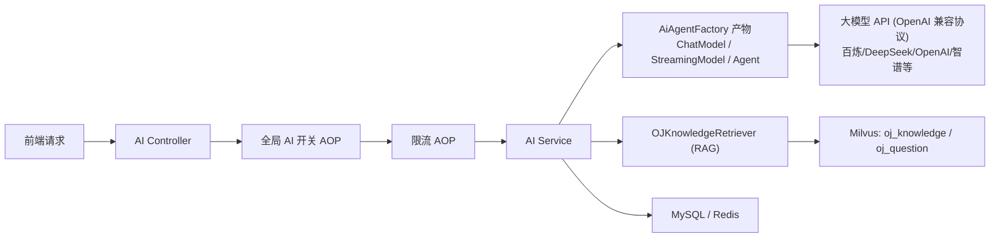

# XI OJ AIGC 功能拓展新手介绍报告

更新时间：2026-04-29  
适用对象：第一次接触本项目 AIGC 模块的同学

## 1. 文档目标

这份文档用最容易理解的方式讲清楚三件事：

1. AIGC 模块在本项目里到底做了什么。
2. 每个模块的设计思路和实现流程是什么。
3. 新手应该按什么顺序看代码、联调、继续开发。

---

## 2. 先理解几个基础概念

1. `LLM（大语言模型）`：负责生成文字回答，比如代码分析、题目解析、错题建议。
2. `Embedding（向量化）`：把文本转成数字向量，便于做“语义相似检索”。
3. `RAG`：先从知识库检索相关内容，再把检索结果喂给模型，减少“胡说”。
4. `Agent`：带有能力编排的 AI 对象，可以绑定模型、工具、RAG、记忆。
5. `Tool`：给 Agent 调用的后端函数，比如查题、查提交、触发判题。
6. `metadata`：向量的附加标签，不是向量本身。比如 `question_id`、`difficulty`、`content_type`。
7. `SSE`：服务端流式推送，前端可以边生成边展示。
8. `限流`：控制接口调用频率，保护系统和成本。
9. `AOP`：在不改业务代码的前提下统一做拦截，比如全局 AI 开关、限流检查。

---

## 3. 整体设计思路（为什么这样拆）

### 3.1 核心目标

1. 能力可扩展：先把“模型、检索、工具、业务接口”解耦，再扩展新 AI 功能。
2. 成本可控：全局开关 + 多层限流 + 配置化参数，避免模型成本失控。
3. 结果更稳：RAG + metadata 过滤 + 持久化历史，减少漂移和脏数据影响。

### 3.2 架构总览

---

## 4. 模块拆分说明（按你提到的重点）

## 4.1 AI 模型设定与工厂类

### 设计定位

由一个工厂类集中管理所有 AI 相关 Bean，避免在业务代码里重复创建模型和 Agent。支持多供应商热切换，无需重启后端。

### 关键实现

1. 模型持有者：`src/main/java/com/XI/xi_oj/ai/agent/AiModelHolder.java`
   - 统一使用 `OpenAiChatModel`（LangChain4j），通过 OpenAI 兼容协议对接所有供应商
   - 支持供应商：阿里百炼、DeepSeek、OpenAI、智谱、MiniMax、硅基流动、月之暗面
   - 配置变更时自动重建模型实例（事件驱动），volatile 保证线程可见性
2. 工厂类：`src/main/java/com/XI/xi_oj/ai/agent/AiAgentFactory.java`
3. 产物：
`ChatLanguageModel`、`StreamingChatLanguageModel`、`EmbeddingModel`、`OJChatAgent`、`OJQuestionParseAgent`、`OJStreamingService`。
4. 配置来源：
`AiConfigService`（数据库 `ai_config` 表）+ 环境变量（AES 加密密钥）。

### 供应商热切换流程

1. 管理员在前端选择供应商、输入 API Key、选择模型。
2. 前端保存配置到 `ai_config` 表（API Key 经 AES 加密存储）。
3. 配置变更触发 `AiConfigChangedEvent`。
4. `AiModelHolder.onConfigChanged()` 解密 API Key，用新的 baseUrl + modelName 重建模型。
5. 所有 Agent 自动使用新模型，无需重启。

### 为什么重要

1. 统一模型配置，便于后续换模型或调参数。
2. 避免业务层直接依赖底层 SDK，减少耦合。
3. 多供应商支持降低单一供应商依赖风险。

---

## 4.2 RAG 模块

### 设计定位

把“检索”从业务中抽成公共能力，统一处理缓存、相似度阈值和 metadata 过滤。

### 关键实现

1. 检索类：`src/main/java/com/XI/xi_oj/ai/rag/OJKnowledgeRetriever.java`
2. 向量库拆分：
`oj_knowledge`（知识片段）和 `oj_question`（题目向量）分开，避免相互污染。
3. 关键能力：
`retrieve`、`retrieveByType`、`retrieveSimilarQuestions`、RAG 缓存清理。

### metadata 的实际作用

1. `content_type`：控制检索内容类型，如“代码模板”“错题分析”“题目”。
2. `difficulty`：题目相似推荐时可按难度过滤，推荐更贴近用户水平。
3. `question_id`：从向量结果映射回业务题目。

### 同步链路（题目向量）

1. 服务：`src/main/java/com/XI/xi_oj/ai/rag/QuestionVectorSyncService.java`
2. 流程：
读取题目 -> 生成 embedding -> 写入 `oj_question` -> 写入 metadata（含 difficulty）-> 清理 RAG 缓存。

---

## 4.3 AI 错题集模块

### 设计定位

把“判题失败数据”自动沉淀为可复习资产，再通过 AI 输出修正建议和复习计划。

### 关键实现

1. 自动收集器：`src/main/java/com/XI/xi_oj/service/impl/WrongQuestionCollector.java`
2. AI 分析服务：`src/main/java/com/XI/xi_oj/service/impl/AiWrongQuestionServiceImpl.java`
3. 对外接口：`src/main/java/com/XI/xi_oj/controller/AiWrongQuestionController.java`

### 自动收集规则

1. `source=ai_tool` 的测试提交不入错题本。
2. `Accepted` 不入错题本。
3. 同用户同题存在旧记录则更新，不重复插入。

### AI 分析流程

1. 校验错题归属（防越权）。
2. 拼上下文（题目 + 错误代码 + 判题结果 + 难度 + 语言）。
3. RAG 检索“错题分析”知识。
4. 可选推荐相似题（含难度过滤）。
5. 调用模型输出分析，回写 `wrong_analysis/review_plan/similar_questions`。

---

## 4.4 AI 限流模块

### 设计定位

通过注解 + AOP 实现“声明式限流”，让 Controller 只关心业务，不关心限流细节。

### 关键实现

1. 注解：`src/main/java/com/XI/xi_oj/annotation/RateLimit.java`
2. 拦截器：`src/main/java/com/XI/xi_oj/aop/RateLimitInterceptor.java`
3. 枚举：`src/main/java/com/XI/xi_oj/model/enums/RateLimitTypeEnum.java`
4. Redis 工具：`RateLimitRedisUtil`（滑动窗口、日计数、冷却窗口）。

### AI 维度限流（当前）

1. 公共分钟级：
`AI_USER_MINUTE`（用户）、`AI_IP_MINUTE`（IP）。
2. 模块日级：
`AI_CHAT_USER_DAY`、`AI_CODE_USER_DAY`、`AI_QUESTION_USER_DAY`、`AI_WRONG_USER_DAY`。

### 好处

1. 防刷接口、防突发流量。
2. 控成本（尤其代码分析/错题分析这类高成本接口）。
3. 限流策略可配置，不需要改业务代码。

---

## 4.5 全局 AI 开关模块

### 设计定位

当 AI 服务异常、预算紧张或要临时维护时，一键关闭全部 AI 业务接口。

### 关键实现

1. AOP 切面：`src/main/java/com/XI/xi_oj/aop/AiGlobalSwitchAspect.java`
2. 配置读取：`ai.global.enable`（来自 `AiConfigService`）
3. 拦截范围：`Ai*Controller`（`AiConfigController` 例外）

### 执行逻辑

1. 每次 AI Controller 请求先进入切面。
2. 若开关关闭，直接抛业务异常返回提示。
3. 若开启，再进入限流与具体业务。

---

## 5. 典型功能实现流程（端到端）

## 5.1 题目解析 + 相似题推荐（5.4）

1. 前端调用 `AiQuestionParseController`。
2. 全局开关检查。
3. 限流检查（用户分钟、IP分钟、模块日限）。
4. Service 读取题目，组装 Prompt。
5. 通过 Agent 生成解析结果。
6. 调用 `retrieveSimilarQuestions` 从 `oj_question` 找相似题。
7. 返回“解析文本 + 相似题 ID 列表”。

## 5.2 错题分析（5.5）

1. 用户提交失败后，`WrongQuestionCollector` 自动收集错题。
2. 用户进入错题分析接口。
3. 全局开关 + 限流。
4. Service 拉取错题和题目信息，RAG 检索上下文。
5. 调用模型（阻塞或流式）生成分析。
6. 将分析和复习计划回写数据库。

---

## 6. 配置中心与可运维性

### 关键实现

1. 控制器：`src/main/java/com/XI/xi_oj/controller/AiConfigController.java`
2. 服务：`src/main/java/com/XI/xi_oj/service/impl/AiConfigServiceImpl.java`
3. 加密工具：`src/main/java/com/XI/xi_oj/utils/AiEncryptUtil.java`

### 当前支持

1. 动态读取模型参数、RAG 参数、Prompt 模板。
2. Redis 缓存配置，降低 DB 压力。
3. Prompt 读取时支持”缺失回退默认值”和”乱码检测后回退默认值”。
4. 多供应商热切换：`ai.provider`（供应商标识）、`ai.model.base_url`（API 端点）、`ai.model.name`（模型名称）。
5. API Key 安全存储：通过 AES 加密存入数据库（`ai.provider.api_key_encrypted`），AES 密钥从环境变量注入。
6. 前端 API Key 脱敏显示（`****` + 后 4 位），支持连通性测试。

---

## 7. 新手推荐学习顺序

1. 先看 `AiModelHolder`，理解模型如何通过 OpenAI 兼容协议对接多供应商，以及热切换机制。
2. 再看 `AiAgentFactory`，理解 Agent 是怎么组装的。
3. 再看 `OJKnowledgeRetriever`，理解 RAG 如何做检索和过滤。
4. 再看 `AiGlobalSwitchAspect` + `RateLimitInterceptor`，理解守门逻辑。
5. 再看 `AiQuestionParseServiceImpl` 和 `AiWrongQuestionServiceImpl`，理解业务编排。
6. 最后看 `WrongQuestionCollector` 和 `QuestionVectorSyncService`，理解数据沉淀链路。

---

## 8. 常见问题（给新手）

1. 为什么要拆两个 collection？
因为”知识点检索”和”题目相似检索”目标不同，混用会互相干扰。

2. metadata 是什么时候写入的？
在向量同步时写入（如 `QuestionVectorSyncService`），不是检索时临时生成。

3. 为什么既有全局开关又有限流？
开关是”总闸”，限流是”节流阀”，作用层级不同，建议同时保留。

4. 流式接口和非流式接口为什么都保留？
非流式方便普通 API 调用，流式提升交互体验，两者服务不同场景。

5. 为什么用 OpenAI 兼容协议而不是各家 SDK？
主流供应商（百炼、DeepSeek、智谱、MiniMax 等）都兼容 OpenAI 接口格式，用一个 `OpenAiChatModel` 就能对接所有供应商，只需切换 baseUrl 和 apiKey，无需引入多个 SDK。

6. API Key 为什么不存环境变量而是存数据库？
环境变量修改需要重启服务，存数据库（AES 加密）可以在前端热更新，运维更灵活。AES 密钥本身仍从环境变量注入，保证安全。

---

## 9. 下一阶段可继续优化

1. `algorithm_type` metadata 增强链路落地（向量同步 + 检索过滤）。
2. 错题复习提醒任务（按 `next_review_time` 推送）。
3. 错题统计看板（按语言/难度/错误类型聚合）。
4. 相似题召回评估与阈值自动调优。

---

## 10. 一句话总结

当前 AIGC 架构已经具备”可配置、可控成本、可扩展、可运维、多供应商热切换”的基础能力。  
新手按”模型持有者(AiModelHolder) -> 工厂(AiAgentFactory) -> RAG -> 守门（开关+限流）-> 业务服务”的顺序学习，能最快建立全局认知并进入可开发状态。

