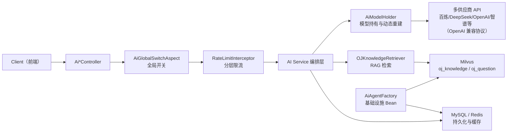
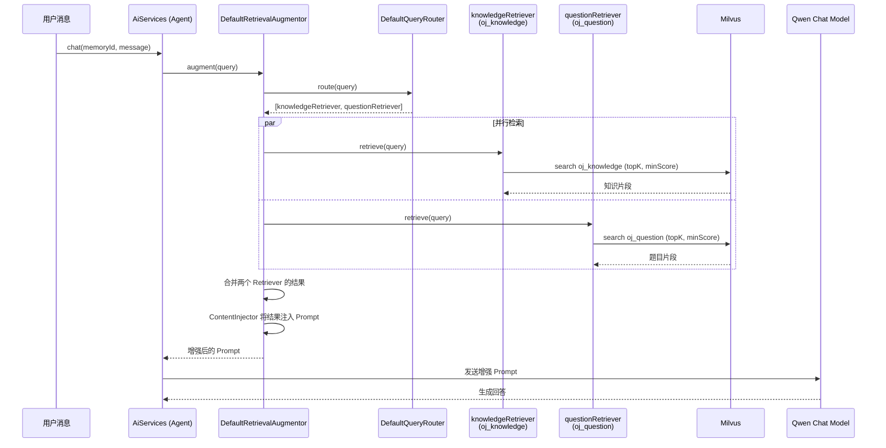
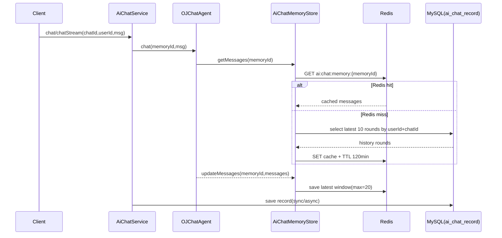
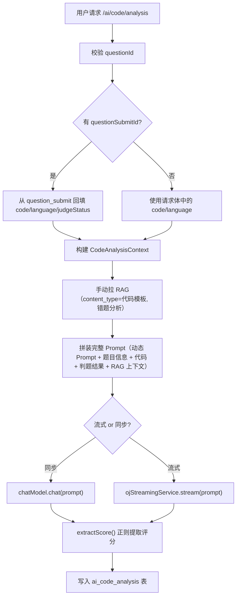
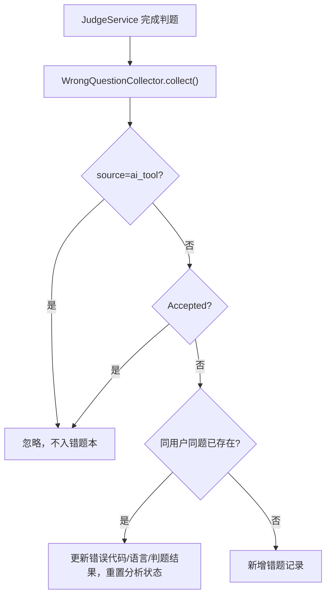

# XI OJ AIGC 工程化实施文档（进阶版）

更新时间：2026-04-27
适用对象：有 Java/Spring 开发经验，希望快速接手 XI OJ AIGC 模块并持续迭代的工程师

---

## 1. 文档目标与阅读方式

本文件不是"施工清单"，而是"项目介绍 + 实现机制 + 优化决策 + 迭代指南"。核心解决五件事：

1. XI OJ AIGC 的整体设计是什么，边界在哪里。
2. 每个 AI 模块如何实现，关键代码在哪里，为什么这样实现。
3. 当前相比基础 Demo 做了哪些工程化优化，每项优化的技术决策与代码落地点。
4. 各模块的特色功能与设计亮点深度剖析。
5. 下一阶段应该优先优化什么，如何落地。

推荐阅读顺序：

1. 先读第 2、3 章：概念统一 + 总架构。
2. 再读第 4 章：Bean 能力矩阵，建立"模型能力地图"。
3. 然后读第 5~11 章：逐模块深挖实现步骤与设计决策。
4. 重点读第 12 章：相对基础 Demo 的全部优化点深度解析。
5. 最后读第 13~16 章：风险、测试、演进路线。

---

## 2. 核心概念统一（避免术语误解）

1. `LLM`：大语言模型，负责生成自然语言输出。本项目使用阿里 DashScope（通义千问）系列。
2. `Embedding`：把文本转为高维向量（本项目 1024 维），用于语义检索。
3. `RAG`：Retrieval-Augmented Generation，先检索再把检索结果注入 Prompt，降低幻觉。
4. `Agent`：封装"模型 + 能力（RAG/Tools/Memory）"的执行单元，由 LangChain4j `AiServices` 构建。
5. `Tool`：Agent 可调用的后端函数（如查题、判题、查错题），通过 `@Tool` 注解声明。
6. `Memory`：多轮会话上下文记忆；本项目采用 `Redis L1 + MySQL L2` 双层持久化。
7. `SSE`：Server-Sent Events，服务端流式推送协议，前端可边收边渲染。
8. `metadata`：向量附加标签（如 `content_type`、`difficulty`、`tag`），用于检索时的精准过滤。
9. `AOP 守门链`：全局开关切面 + 限流拦截器的统一入口，在业务逻辑之前拦截。
10. `Milvus`：开源向量数据库，本项目使用 COSINE 相似度度量。

---

## 3. 总体架构与职责分层



分层职责：

1. Controller 层：鉴权后的业务入口，负责参数接收、SSE 协议封装和响应格式统一。
2. AOP 守门层：AI 全局开关（`AiGlobalSwitchAspect`）+ 多维限流策略（`@RateLimit`）。
3. Service 层：业务编排（拼上下文、调 RAG、调模型、写库），是核心逻辑所在。
4. 基础能力层：模型持有与动态重建（`AiModelHolder`）、基础设施 Bean 工厂（`AiAgentFactory`）、向量检索（`OJKnowledgeRetriever`）、会话记忆存储（`AiChatMemoryStore`）。
5. 存储层：MySQL（持久化）+ Redis（缓存/记忆/限流/配置）+ Milvus（向量检索）。

设计原则：

1. 先守门再执行业务，避免无效 token 消耗和 API 调用成本。
2. 业务逻辑不直连底层 SDK，统一通过 `AiModelHolder` 获取模型实例，便于模型替换和动态重建。
3. AI 能力和业务规则分离，便于独立演进。
4. 所有 AI 流式接口统一 SSE 协议，降低前后端联调成本。

---

## 4. 模型与 Bean 能力矩阵

| Bean | 对应模块 | Memory | RAG | Tools | SSE流式 | 使用场景 |
|---|---|---|---|---|---|---|
| `OJChatAgent` | AI 问答 | ✅ 多轮记忆（Redis+MySQL） | ✅ 自动注入 | ✅ 7个工具 | ✅ | 交互式编程问答 |
| `OJQuestionParseAgent` | 题目解析 | ❌ 单次无状态 | ✅ 自动注入 | ❌ | ✅ | 结构化题目分析 |
| `OJStreamingService` | 代码分析、错题分析 | ❌ | 手动调用 RAG | ❌ | ✅ | 无状态流式分析 |
| `ChatLanguageModel`（通过 `AiModelHolder` 获取） | 代码分析、错题分析（非流式） | ❌ | 手动调用 RAG | ❌ | ❌ | 同步阻塞分析 |

能力理解：

1. `OJChatAgent` 是"完整交互型 Agent"，具备记忆、RAG、工具调用三大能力，适合多轮问答场景。
2. `OJQuestionParseAgent` 是"单次分析型 Agent"，有 RAG 但无记忆和工具，适合一次性题目解析。
3. `OJStreamingService` 是纯流式适配层，不承担业务规则，Prompt 由 Service 层完全控制。
4. 代码分析和错题分析选择"Service 手动拼 RAG"而非 Agent 自动 RAG，是因为这两个场景需要精确控制 `content_type` 过滤条件。

关键代码位置：

- `AiModelHolder.java`：`src/main/java/com/XI/xi_oj/ai/agent/AiModelHolder.java`（模型持有与动态重建）
- `AiAgentFactory.java`：`src/main/java/com/XI/xi_oj/ai/agent/AiAgentFactory.java`（基础设施 Bean 工厂）
- `AiConfigChangedEvent.java`：`src/main/java/com/XI/xi_oj/ai/event/AiConfigChangedEvent.java`（配置变更事件）
- `OJChatAgent.java`：`src/main/java/com/XI/xi_oj/ai/agent/OJChatAgent.java`
- `OJQuestionParseAgent.java`：`src/main/java/com/XI/xi_oj/ai/agent/OJQuestionParseAgent.java`
- `OJStreamingService.java`：`src/main/java/com/XI/xi_oj/ai/agent/OJStreamingService.java`

---

## 5. AiAgentFactory + AiModelHolder：基础设施与模型动态管理

### 5.1 设计目标

将 AI 基础设施 Bean（向量库连接、记忆存储）和 AI 模型实例（LLM、Embedding、Agent 代理）分离管理：
- **`AiAgentFactory`**（`@Configuration`）：负责创建基础设施 Bean（MilvusEmbeddingStore、ChatMemoryStore），这些 Bean 生命周期与应用一致，不需要动态刷新。
- **`AiModelHolder`**（`@Component`）：负责持有和动态重建所有 AI 模型实例和 Agent 代理。管理员修改 `ai_config` 配置后，通过 Spring 事件驱动即时重建受影响的模型，无需重启应用。支持多供应商热切换（百炼/DeepSeek/OpenAI/智谱/MiniMax/硅基流动/月之暗面），聊天模型统一使用 `OpenAiChatModel`（OpenAI 兼容协议）。
- API Key 通过 AES 加密后存入 `ai_config` 表，AES 密钥从环境变量 `${AI_ENCRYPT_KEY}` 注入。管理员在前端输入明文 Key，后端自动加密存储、读取时解密。
- 向量库连接参数外部化配置（`milvus.host`、`milvus.port`）。

### 5.2 Bean 与模型清单

```
AiAgentFactory（@Configuration — 基础设施 Bean，启动时创建，生命周期固定）
├── embeddingStore()          → MilvusEmbeddingStore (oj_knowledge, dim=1024, COSINE)
├── questionEmbeddingStore()  → MilvusEmbeddingStore (oj_question, dim=1024, COSINE)
└── chatMemoryStore()         → 委托给 AiChatMemoryStore（Redis L1 + MySQL L2）

AiModelHolder（@Component — 模型与代理，volatile 持有，配置变更时即时重建，支持多供应商热切换）
├── chatModel                 → OpenAiChatModel (temp=0.2, maxTokens=4096, 通用 OpenAI 兼容协议)
├── streamingChatModel        → OpenAiStreamingChatModel (temp=0.2, maxTokens=4096)
├── embeddingModel            → QwenEmbeddingModel（嵌入模型仍使用百炼 DashScope）
├── ojChatAgent               → AiServices 构建，绑定 chatModel + streamingModel + tools + RAG + memory
├── ojQuestionParseAgent      → AiServices 构建，绑定 chatModel + streamingModel + RAG（无 tools 无 memory）
└── ojStreamingService        → Lambda 实现，将 StreamingChatModel 适配为 Flux<String>
```

### 5.3 动态重建机制

管理员通过 `/admin/ai/config` 修改配置时，`AiConfigServiceImpl` 发布 `AiConfigChangedEvent`，`AiModelHolder` 通过 `@EventListener` 监听并按配置 key 精准重建受影响的模型：

| 配置 Key | 重建范围 |
|---------|---------|
| `ai.model.name` | chatModel + streamingChatModel + ojStreamingService + ojChatAgent + ojQuestionParseAgent（全部模型和代理） |
| `ai.model.embedding_name` | embeddingModel + ojChatAgent + ojQuestionParseAgent（嵌入模型 + 两个代理） |
| `ai.rag.top_k` / `ai.rag.similarity_threshold` | ojChatAgent + ojQuestionParseAgent（仅重建代理，因为 ContentRetriever 内含 RAG 参数） |

**为什么用 Holder 模式而非 `@RefreshScope` 或 `AtomicReference`：**
- `@RefreshScope` 需要 Spring Cloud 依赖，项目未引入，且对 AiServices 代理不友好。
- 在 Factory 里用 `AtomicReference` 无效——消费方通过 `@Resource` 持有的是 Bean 初始化时的直接引用，换了 AtomicReference 里的值也不会传播到字段注入的消费方。
- **Holder 模式**：消费方注入 `AiModelHolder` 本身（一个稳定的 Spring 单例），通过 `holder.getChatModel()` 获取最新实例——Holder 内部更换实例对消费方完全透明。

**为什么用 Spring 事件而非直接调用：**
- `AiModelHolder` 依赖 `AiConfigService`（读取配置值），`AiConfigServiceImpl` 需要通知 `AiModelHolder` 重建——构成循环依赖。
- 通过 `ApplicationEventPublisher` 发布 `AiConfigChangedEvent`，`AiModelHolder` 用 `@EventListener` 监听，完全解耦，无循环依赖。

**记忆不丢失：** 重建 Agent 代理时，`chatMemoryStore` 是构造注入的稳定引用（指向 `AiChatMemoryStore` 单例，底层 Redis + MySQL），不会被重建。新代理的 `chatMemoryProvider` lambda 引用同一个 `chatMemoryStore`，用户对话记忆完整保留。

### 5.4 关键设计决策

1. 双 MilvusEmbeddingStore：`oj_knowledge`（知识库）和 `oj_question`（题目向量）分离，避免检索污染。
2. `OJStreamingService` 用 Lambda + `Flux.create()` + `StreamingChatResponseHandler` 回调桥接 Reactor 响应式流。
3. `chatMemoryProvider` 使用 `MessageWindowChatMemory`（窗口大小 20），每个 `memoryId` 独立窗口。
4. `buildRetrievalAugmentor()` 的 `topK` 和 `minScore` 从配置中心动态读取，修改后即时重建 Agent 生效。
5. 所有消费方（Service 层）注入 `AiModelHolder` 而非直接注入模型 Bean，通过 getter 获取最新实例。

### 5.5 代码片段

**AiModelHolder 核心结构：**

```java
@Component
@Slf4j
public class AiModelHolder {

    // 触发重建的配置键集合（含供应商、API Key、base_url）
    private static final Set<String> MODEL_NAME_KEYS = Set.of(
            "ai.model.name", "ai.provider", "ai.provider.api_key_encrypted", "ai.model.base_url");
    private static final Set<String> EMBEDDING_NAME_KEYS = Set.of(
            "ai.model.embedding_name", "ai.embedding.api_key_encrypted");
    private static final Set<String> RAG_KEYS = Set.of("ai.rag.top_k", "ai.rag.similarity_threshold");

    private final AiConfigService aiConfigService;
    private final OJTools ojTools;
    private final MilvusEmbeddingStore embeddingStore;
    private final ChatMemoryStore chatMemoryStore;

    @Value("${ai.encrypt.key}")
    private String encryptKey;  // AES 密钥，用于解密数据库中的 API Key

    private volatile ChatModel chatModel;
    private volatile StreamingChatModel streamingChatModel;
    private volatile EmbeddingModel embeddingModel;
    private volatile OJChatAgent ojChatAgent;
    private volatile OJQuestionParseAgent ojQuestionParseAgent;
    private volatile OJStreamingService ojStreamingService;

    @PostConstruct
    public void init() {
        String apiKey = getDecryptedApiKey("ai.provider.api_key_encrypted");
        if (apiKey.isEmpty()) {
            log.warn("[AiModelHolder] API Key 未配置，跳过模型初始化");
            return;
        }
        this.chatModel = buildChatModel();
        this.streamingChatModel = buildStreamingChatModel();
        this.embeddingModel = buildEmbeddingModel();
        this.ojStreamingService = buildStreamingService(this.streamingChatModel);
        this.ojChatAgent = buildChatAgent();
        this.ojQuestionParseAgent = buildQuestionParseAgent();
    }

    @EventListener
    public void onConfigChanged(AiConfigChangedEvent event) {
        String key = event.getConfigKey();
        String apiKey = getDecryptedApiKey("ai.provider.api_key_encrypted");
        if (MODEL_NAME_KEYS.contains(key)) {
            if (apiKey.isEmpty()) return;
            // 重建聊天模型 + Agent，如 embedding 未初始化则一并构建
        } else if (EMBEDDING_NAME_KEYS.contains(key)) {
            if (apiKey.isEmpty()) return;
            // 重建嵌入模型 + Agent
        } else if (RAG_KEYS.contains(key)) {
            // 仅重建 Agent（ContentRetriever 参数变化）
        }
    }

    // 聊天模型：使用通用 OpenAiChatModel，支持所有 OpenAI 兼容平台
    private ChatModel buildChatModel() {
        return OpenAiChatModel.builder()
                .apiKey(getDecryptedApiKey("ai.provider.api_key_encrypted"))
                .baseUrl(aiConfigService.getConfigValue("ai.model.base_url"))
                .modelName(aiConfigService.getConfigValue("ai.model.name"))
                .temperature(0.2).maxTokens(4096).build();
    }

    // 从数据库读取加密的 API Key 并解密
    private String getDecryptedApiKey(String configKey) {
        String encrypted = aiConfigService.getConfigValue(configKey);
        if (encrypted == null || encrypted.isEmpty()) return "";
        return AiEncryptUtil.decrypt(encryptKey, encrypted);
    }

    public ChatModel getChatModel() { return chatModel; }
    public OJChatAgent getOjChatAgent() { return ojChatAgent; }
    // ... 其他 getter
}
```

**OJStreamingService Lambda 桥接（在 AiModelHolder 内部构建）：**

```java
private OJStreamingService buildStreamingService(StreamingChatLanguageModel model) {
    return fullPrompt -> Flux.create(sink -> model.chat(
            fullPrompt,
            new StreamingChatResponseHandler() {
                @Override public void onPartialResponse(String partialResponse) {
                    sink.next(partialResponse == null ? "" : partialResponse);
                }
                @Override public void onCompleteResponse(ChatResponse chatResponse) {
                    sink.complete();
                }
                @Override public void onError(Throwable error) {
                    sink.error(error);
                }
            }
    ));
}
```

**消费方注入方式（以 AiChatServiceImpl 为例）：**

```java
@Resource
private AiModelHolder aiModelHolder;

// 使用时通过 getter 获取最新模型实例
aiModelHolder.getOjChatAgent().chat(memoryId, message);
aiModelHolder.getOjChatAgent().chatStream(memoryId, message);
```

---

## 6. RAG 模块：检索增强生成的完整实现

### 6.1 模块目标

1. 让 AI 回答"有依据"，减少幻觉。
2. 让不同场景（题解/错题/相似题）检索互不干扰。
3. 在可接受成本下保证响应速度。

### 6.2 关键实现文件

- `OJKnowledgeRetriever.java`：`src/main/java/com/XI/xi_oj/ai/rag/OJKnowledgeRetriever.java`
- `KnowledgeInitializer.java`：`src/main/java/com/XI/xi_oj/ai/rag/KnowledgeInitializer.java`
- `QuestionVectorSyncService.java`：`src/main/java/com/XI/xi_oj/ai/rag/QuestionVectorSyncService.java`
- `QuestionVectorSyncJob.java`：`src/main/java/com/XI/xi_oj/job/cycle/QuestionVectorSyncJob.java`
- `KnowledgeImportController.java`：`src/main/java/com/XI/xi_oj/controller/KnowledgeImportController.java`

### 6.3 双 Collection 架构

```
Milvus
├── oj_knowledge (知识库)
│   ├── 算法知识（二分查找、动态规划等）
│   ├── 错题分析模板（常见 WA/TLE/MLE 原因）
│   └── metadata: content_type, tag, title
│
└── oj_question (题目向量)
    ├── 所有题目的向量化表示
    └── metadata: question_id, content_type="题目", tag, difficulty
```

为什么分两个 collection：
- 知识库检索（代码分析、错题分析）需要按 `content_type` 过滤"代码模板"或"错题分析"。
- 相似题推荐需要按 `difficulty` 过滤并排除自身。
- 混合存储会导致检索结果互相污染，降低召回精度。

### 6.4 Agent 自动 RAG 管线：DefaultRetrievalAugmentor + DefaultQueryRouter

`OJChatAgent` 和 `OJQuestionParseAgent` 通过 LangChain4j 的 `RetrievalAugmentor` 实现自动 RAG——用户发送消息后，框架自动完成"检索 → 注入"，Service 层无需手动调用检索方法。

#### 6.4.1 管线组件层次

```
RetrievalAugmentor（编排器，管理整个 RAG 管线）
│
├── QueryTransformer（可选，查询改写/扩展，当前未启用）
│
├── QueryRouter（路由器，决定 query 发给哪些 ContentRetriever）
│   └── DefaultQueryRouter（广播模式：将 query 同时发给所有注册的 Retriever）
│
├── ContentRetriever[]（检索器数组，每个绑定一个向量集合）
│   ├── EmbeddingStoreContentRetriever → embeddingStore (oj_knowledge)
│   └── EmbeddingStoreContentRetriever → questionEmbeddingStore (oj_question)
│
└── ContentInjector（注入器，将检索结果拼入 Prompt，使用框架默认实现）
```

#### 6.4.2 执行流程



#### 6.4.3 关键代码（AiModelHolder.buildRetrievalAugmentor）

```java
private RetrievalAugmentor buildRetrievalAugmentor() {
    int topK = Integer.parseInt(aiConfigService.getConfigValue("ai.rag.top_k"));
    double minScore = Double.parseDouble(aiConfigService.getConfigValue("ai.rag.similarity_threshold"));

    EmbeddingStoreContentRetriever knowledgeRetriever = EmbeddingStoreContentRetriever.builder()
            .embeddingStore(embeddingStore)           // oj_knowledge
            .embeddingModel(this.embeddingModel)
            .maxResults(topK)
            .minScore(minScore)
            .build();

    EmbeddingStoreContentRetriever questionRetriever = EmbeddingStoreContentRetriever.builder()
            .embeddingStore(questionEmbeddingStore)   // oj_question
            .embeddingModel(this.embeddingModel)
            .maxResults(topK)
            .minScore(minScore)
            .build();

    return DefaultRetrievalAugmentor.builder()
            .queryRouter(new DefaultQueryRouter(knowledgeRetriever, questionRetriever))
            .build();
}
```

Agent 构建时绑定：

```java
AiServices.builder(OJChatAgent.class)
    .chatModel(this.chatModel)
    .streamingChatModel(this.streamingChatModel)
    .tools(ojTools)
    .retrievalAugmentor(buildRetrievalAugmentor())   // 替代原来的 .contentRetriever()
    .chatMemoryProvider(...)
    .build();
```

#### 6.4.4 为什么用 DefaultQueryRouter（广播）而非智能路由

| 方案 | 描述 | 适用场景 |
|---|---|---|
| `DefaultQueryRouter`（广播） | 将 query 同时发给所有 Retriever，结果合并 | 集合数量少（2~3个），每个集合都可能有相关结果 |
| `LanguageModelQueryRouter`（智能路由） | 用 LLM 判断 query 应该发给哪个 Retriever | 集合数量多，且各集合领域差异大 |

当前选择广播模式的原因：
1. 只有 2 个集合，广播的额外检索开销可忽略（两次 Milvus 查询并行执行）。
2. 用户输入往往同时涉及知识和题目（如"介绍数组并推荐几道题"），广播能同时命中两个集合。
3. 智能路由需要额外一次 LLM 调用来判断路由目标，增加时延和 token 成本，对 2 个集合不划算。

#### 6.4.5 自动 RAG vs 手动 RAG 的使用边界

| 场景 | RAG 方式 | 原因 |
|---|---|---|
| AI 问答（OJChatAgent） | 自动（RetrievalAugmentor） | 通用问答，不需要精确控制检索条件 |
| 题目解析（OJQuestionParseAgent） | 自动（RetrievalAugmentor） | 同上 |
| 代码分析 | 手动（OJKnowledgeRetriever.retrieveByType） | 需要按 `content_type` 精确过滤"代码模板"和"错题分析" |
| 错题分析 | 手动（OJKnowledgeRetriever.retrieveByType） | 需要按 `content_type` 精确过滤"错题分析" |
| 相似题推荐 | 手动（OJKnowledgeRetriever.retrieveSimilarQuestions） | 需要按 `difficulty` 过滤 + 排除自身 |

自动 RAG 适合"通用检索 + 框架注入"的场景；手动 RAG 适合需要精确控制 metadata 过滤条件的场景。

### 6.5 三种手动检索方法详解

**方法一：`retrieve(query, topK, minScore)` — 通用知识检索**

直接搜索 `oj_knowledge` collection，不做 metadata 过滤。供 Service 层手动调用（如需要单独获取知识片段时）。

**方法二：`retrieveByType(query, contentTypes, topK, minScore)` — 按类型精准检索**

用于代码分析和错题分析。先请求 `topK * 2` 条候选结果，再在客户端按 `content_type` 过滤，最终取 `topK` 条。这种"多取再筛"策略弥补了 Milvus 不支持复杂 metadata 过滤的限制。

```java
// 代码分析场景：检索"代码模板"和"错题分析"两种类型
String ragContext = ojKnowledgeRetriever.retrieveByType(
    context.getTitle() + " " + context.getTags(),
    "代码模板,错题分析",  // 逗号分隔的类型列表
    3, 0.7
);
```

**方法三：`retrieveSimilarQuestions(questionId, questionContent, difficulty)` — 相似题推荐**

搜索 `oj_question` collection，支持：
- `content_type="题目"` 过滤（排除非题目向量）
- `difficulty` 可选过滤（同难度推荐）
- 排除自身（`!id.equals(questionId)`）
- 最多返回 4 道相似题

### 6.6 知识库初始化与导入

**启动自动导入（`KnowledgeInitializer implements CommandLineRunner`）：**

1. 应用启动时探测 `oj_knowledge` 是否有数据。
2. 若为空，自动从 classpath 导入 `algorithm_knowledge.md` 和 `error_analysis.md`。
3. Markdown 文件按 `---` 分隔符切块，每块包含 metadata 头（content_type/tag/title）和正文。
4. 正文长度建议 80~600 字符，过短信息量不足，过长影响向量质量。

**管理员手动导入（`KnowledgeImportController`）：**

- `POST /admin/knowledge/import` 接受 `.md` 文件上传。
- 复用 `KnowledgeInitializer.parseAndStore()` 解析逻辑。
- 导入后自动清除 RAG 缓存。

**题目向量定时同步（`QuestionVectorSyncJob`）：**

- 每日凌晨 2:00 全量重建 `oj_question` collection。
- 重建后自动清除 RAG 缓存，确保相似题推荐数据新鲜。

### 6.7 RAG 缓存机制（Redis）

```
缓存 Key 格式：ai:rag:cache:{MD5(query|topK|minScore)}
缓存 TTL：60 分钟
缓存清除时机：知识导入后 / 题目向量重建后
```

缓存的工程价值：
1. 避免重复的 Embedding 计算和 Milvus 网络请求。
2. 相同 query 的 RAG 结果直接从 Redis 返回，响应时延从 ~200ms 降至 ~5ms。
3. MD5 作为 cache key 保证固定长度，避免 Redis key 过长。

关于"RAG 缓存减少 token"的认知澄清：
- RAG 缓存主要减少的是向量检索开销和响应时延。
- 它不直接减少模型 token 消耗（因为检索结果仍然会注入 Prompt）。
- 真正降 token 需要做"上下文预算 + 裁剪/摘要"（见第 13 章优化路线）。

---

## 7. AI 问答模块：聊天记忆持久化深度解析

### 7.1 模块目标

1. 支持多轮连续上下文对话。
2. 支持跨请求、重进会话后记忆恢复（关闭浏览器再打开仍能续上）。
3. 控制上下文增长与 token 成本。
4. 支持 Agent 工具调用（查题、判题、查错题）。

### 7.2 关键代码

- `AiChatController.java`：`src/main/java/com/XI/xi_oj/controller/AiChatController.java`
- `AiChatServiceImpl.java`：`src/main/java/com/XI/xi_oj/service/impl/AiChatServiceImpl.java`
- `AiChatMemoryStore.java`：`src/main/java/com/XI/xi_oj/ai/store/AiChatMemoryStore.java`
- `AiChatAsyncService.java`：`src/main/java/com/XI/xi_oj/service/impl/AiChatAsyncService.java`
- `AiChatRecordMapper.java`：`src/main/java/com/XI/xi_oj/ai/store/AiChatRecordMapper.java`

### 7.3 双层记忆架构设计

```
┌─────────────────────────────────────────────────┐
│                  LangChain4j 框架层               │
│  MessageWindowChatMemory (maxMessages=20)        │
│       ↓ getMessages()    ↓ updateMessages()      │
├─────────────────────────────────────────────────┤
│              AiChatMemoryStore                    │
│  ┌──────────────┐    ┌──────────────────────┐    │
│  │  Redis L1    │    │  MySQL L2            │    │
│  │  TTL=120min  │    │  ai_chat_record 表   │    │
│  │  热记忆窗口   │    │  冷历史回源           │    │
│  └──────────────┘    └──────────────────────┘    │
├─────────────────────────────────────────────────┤
│              AiChatAsyncService                   │
│  流式完成后 @Async 异步写库                        │
└─────────────────────────────────────────────────┘
```

核心参数：
- `MAX_MESSAGES = 20`：滑动窗口上限，防止上下文无限增长导致 token 爆炸。
- `BACKFILL_ROUNDS = 10`：Redis miss 时从 MySQL 回源最近 10 轮对话恢复上下文。
- `MEMORY_TTL_MINUTES = 120`：Redis 记忆缓存 2 小时过期。

### 7.4 memoryId 设计与用户隔离

```java
// Service 层构建 memoryId
private String buildMemoryId(Long userId, String chatId) {
    return userId + ":" + chatId;  // 例如 "12345:chat-abc-123"
}
```

`MemorySession` 内部类负责解析 memoryId：
- 新格式 `userId:chatId`：支持同一 chatId 不同用户的记忆隔离。
- 旧格式 `chatId`（无冒号）：向后兼容，`userId` 为 null。
- 解析失败时 fallback 到 `default` session。

### 7.5 ChatMemoryStore 回调机制（重点）

`AiChatMemoryStore implements ChatMemoryStore` 是 LangChain4j 框架回调接口，不是手动调用：

1. `getMessages(memoryId)`：模型调用前，框架自动调用取历史消息。
   - Redis 命中 → 直接反序列化返回。
   - Redis 未命中 → 从 MySQL 加载最近 10 轮，重建为 `UserMessage`/`AiMessage` 对，回写 Redis。
2. `updateMessages(memoryId, messages)`：模型交互后，框架自动回写窗口。
   - 如果消息数超过 20，截取最新 20 条（滑动窗口）。
   - 序列化后写入 Redis。
3. `deleteMessages(memoryId)`：清空会话时删除 Redis 缓存。

### 7.6 流式与非流式的持久化差异

- 非流式（`chat()`）：同步调用模型 → 拿到完整 answer → 同步写 `ai_chat_record`。
- 流式（`chatStream()`）：`Flux<String>` 逐 token 推送 → `StringBuilder` 缓冲 → `doOnComplete` 触发 `@Async` 异步写库。

异步写库的好处：不阻塞 SSE 流的最后一个事件推送，用户体验更流畅。

### 7.7 记忆时序图



### 7.8 聊天历史的游标分页

传统 `LIMIT + OFFSET` 在数据量大时有性能问题且存在重复/漏读风险。本项目采用 `(createTime, id)` 复合游标：

```sql
SELECT * FROM ai_chat_record
WHERE user_id = #{userId} AND chat_id = #{chatId}
  AND (create_time < #{cursorTime}
       OR (create_time = #{cursorTime} AND id < #{cursorId}))
ORDER BY create_time DESC, id DESC
LIMIT #{pageSize}
```

优势：
- 无论翻到第几页，查询性能恒定。
- 不会因为新消息插入导致重复或漏读。

### 7.9 一致性说明

1. 正常完成一轮对话时，`updateMessages` 会更新 Redis 窗口，下一轮通常能看到上一轮。
2. 极端情况下若流式中断，可能出现 MySQL 异步落库滞后。
3. 这属于"最终一致"特征，不是"每次进入必须清 Redis 再重建"模型。

### 7.10 题目页上下文对话小窗

除了独立的 `/ai/chat` 问答页面，系统在题目做题页（`ViewQuestionView`）右下角嵌入了悬浮 AI 对话小窗（`AiChatWidget.vue`），让用户在做题过程中直接向 AI 提问。

**上下文注入机制：**

前端发送消息时携带 `questionId`，后端 `AiChatServiceImpl.buildContextualMessage()` 自动查询题目信息并拼接到用户消息前：

```
【当前题目上下文】
题目ID：123
标题：两数之和
题干：给定一个整数数组...
标签：["数组","哈希表"]
时间限制：1000ms
内存限制：262144KB
---
用户问题：这道题超时了怎么优化
```

Agent 收到带上下文的消息后，可以自然地调用 `query_question_info`、`query_user_wrong_question` 等工具，无需用户手动指定题目 ID。

**chatId 设计：** 小窗的 `chatId` 格式为 `q:{questionId}`，每道题独立会话，切换题目时自动重置。

**历史保存：** `saveRecord` 仍保存原始用户消息（不含上下文前缀），保证历史记录展示干净。

**关键代码：**
- 前端组件：`frontend/OJ_frontend/src/components/AiChatWidget.vue`
- 上下文构建：`AiChatServiceImpl.buildContextualMessage()`

---

## 8. AI 代码分析模块：无状态分析链路

### 8.1 模块目标

1. 对用户已提交的代码进行多维度分析（风格、正确性、复杂度、改进建议）。
2. 输出结构化改进建议并持久化，支持历史查询。
3. 自动提取评分（10 分制）。

### 8.2 实现流程



### 8.3 关键设计点

1. 双入口模式：支持从 `questionSubmitId` 自动回填（推荐），也支持直接传 `code`/`language`（灵活）。
2. 所有权校验：通过 `questionSubmitId` 查询时验证 `userId` 匹配，防止越权访问。
3. 评分提取：两个正则模式覆盖 AI 输出的常见评分格式：
   - `综合评分：8` → `SCORE_PATTERN_1`
   - `8/10` → `SCORE_PATTERN_2`
4. 手动 RAG 而非 Agent 自动 RAG：因为需要精确指定 `content_type` 为"代码模板,错题分析"。

### 8.4 关键代码

- `AiCodeAnalysisController.java`：`src/main/java/com/XI/xi_oj/controller/AiCodeAnalysisController.java`
- `AiCodeAnalysisServiceImpl.java`：`src/main/java/com/XI/xi_oj/service/impl/AiCodeAnalysisServiceImpl.java`

---

## 9. AI 题目解析模块：解析与推荐双链路

### 9.1 模块目标

1. 输出结构化题目解析（考点分析、解题思路、常见陷阱）。
2. 推荐同类题（按难度过滤的相似题）。

### 9.2 实现流程

1. 读取题目数据并构造结构化上下文（ID、标题、题干、标签、难度）。
2. 通过 `OJQuestionParseAgent` 获取解析文本（Agent 自动注入 RAG 上下文）。
3. 通过 `retrieveSimilarQuestions` 获取相似题 ID 列表。
4. 合并返回给前端。

### 9.3 与 AI 问答的区别

| 维度 | AI 问答 (OJChatAgent) | 题目解析 (OJQuestionParseAgent) |
|---|---|---|
| 记忆 | ✅ 多轮 | ❌ 单次 |
| 工具 | ✅ 查题/判题/查错题 | ❌ |
| RAG | 自动注入 | 自动注入 |
| SystemMessage | 编程教学助手 | 结构化题目分析助手 |

### 9.4 关键代码

- `AiQuestionParseController.java`：`src/main/java/com/XI/xi_oj/controller/AiQuestionParseController.java`
- `AiQuestionParseServiceImpl.java`：`src/main/java/com/XI/xi_oj/service/impl/AiQuestionParseServiceImpl.java`

---

## 10. AI 错题集模块：收集与分析分离架构

### 10.1 模块目标

1. 自动收集"真实失败提交"，无需用户手动操作。
2. 用户按需触发 AI 分析，形成"收集 → 分析 → 复习"闭环。
3. 基于艾宾浩斯遗忘曲线的智能复习提醒。

### 10.2 错题收集链路（自动）



关键设计：
- `source="ai_tool"` 的提交不入错题本，避免 AI 工具调用的测试代码污染错题集。
- Accepted 不入错题本。
- 同一用户同一题重复错误时更新而非新增，避免数据膨胀。
- 更新时重置 `wrongAnalysis`/`reviewPlan`/`similarQuestions`，强制用户重新触发分析。
- 整个收集过程 try-catch 包裹，失败不影响主判题流程。

### 10.3 错题分析链路（按需触发）

1. 用户请求 `/ai/wrong-question/analysis` 或 `/analysis/stream`。
2. 校验错题记录归属（`selectByIdAndUser`）。
3. 加载关联题目信息，构建 `WrongQuestionContext`。
4. 检索相似题（`retrieveSimilarQuestions`，按难度过滤）。
5. 检索 RAG 上下文（`retrieveByType`，类型为"错题分析"）。
6. 拼装完整 Prompt（动态 Prompt + 错题信息 + 错误代码 + 判题结果 + RAG + 相似题）。
7. 调用模型生成分析。
8. 持久化分析结果、复习计划、相似题列表，设置首次复习时间。

### 10.4 艾宾浩斯遗忘曲线复习机制

```java
private Date calcNextReviewTime(int reviewCount) {
    int days;
    if (reviewCount <= 1) days = 1;       // 第1次复习：1天后
    else if (reviewCount == 2) days = 3;  // 第2次复习：3天后
    else days = 7;                         // 第3次及以后：7天后
    return Date.from(LocalDateTime.now().plusDays(days)
            .atZone(ZoneId.systemDefault()).toInstant());
}
```

用户调用 `markReviewed()` 时：
- `reviewCount` 自增。
- `isReviewed` 设为 1。
- `nextReviewTime` 按遗忘曲线计算下次复习时间。

### 10.5 关键代码

- `WrongQuestionCollector.java`：`src/main/java/com/XI/xi_oj/service/impl/WrongQuestionCollector.java`
- `AiWrongQuestionServiceImpl.java`：`src/main/java/com/XI/xi_oj/service/impl/AiWrongQuestionServiceImpl.java`
- `AiWrongQuestionController.java`：`src/main/java/com/XI/xi_oj/controller/AiWrongQuestionController.java`

---

## 11. OJTools：Agent 工具调用体系

### 11.1 工具清单

| 工具名 | 功能 | 参数 | 调用链路 | 仅限 Agent |
|---|---|---|---|---|
| `query_question_info` | 按关键词/ID 查单道题详情 | `keyword` | `QuestionService.getByKeyword()` | OJChatAgent |
| `judge_user_code` | 提交代码判题 | `questionId, code, language`（userId 由 ThreadLocal/参数双重解析） | `AiJudgeService.submitCode()` | OJChatAgent |
| `query_user_wrong_question` | 按题目ID查用户单条错题记录 | `userId, questionId`（userId 由 ThreadLocal/参数双重解析） | `WrongQuestionService.getByUserAndQuestion()` | OJChatAgent |
| `search_questions` | 按关键词/标签/难度搜索题目列表 | `keyword, tag, difficulty`（均可选） | `QuestionService.getQueryWrapper()` + `page()` | OJChatAgent |
| `find_similar_questions` | 按题目ID查找向量相似题目 | `questionId` | `OJKnowledgeRetriever.retrieveSimilarQuestions()` + `QuestionService.listByIds()` | OJChatAgent |
| `list_user_wrong_questions` | 列出用户所有错题 | `userId`（由 ThreadLocal/参数双重解析） | `AiWrongQuestionService.listMyWrongQuestions()` | OJChatAgent |
| `query_user_submit_history` | 查询用户提交记录 | `userId, questionId`（questionId 可选） | `QuestionSubmitService.getQueryWrapper()` + `page()` | OJChatAgent |
| `query_user_mastery` | 分析用户各知识点掌握情况（AC率、错题数） | `userId`（由 ThreadLocal/参数双重解析） | `QuestionSubmitMapper.selectTagMastery()` | OJChatAgent |
| `get_question_hints` | 分层提示引导（Level 1考点→Level 2方向→Level 3框架） | `questionId, hintLevel` | `QuestionService.getById()` + `OJKnowledgeRetriever.retrieveSimilarQuestions()` | OJChatAgent |
| `run_custom_test` | 自定义输入测试用户代码并与标准答案对比 | `questionId, code, language, customInput` | `AiJudgeService.runCustomTest()` → `CodeSandBox.executeCode()` | OJChatAgent |
| `diagnose_error_pattern` | 分析用户错题的系统性错误模式 | `userId`（由 ThreadLocal/参数双重解析） | `AiWrongQuestionService.listMyWrongQuestions()` + `OJKnowledgeRetriever.retrieveByType()` | OJChatAgent |

### 11.2 userId 安全注入（ThreadLocal + 参数双重解析）

`judge_user_code`、`query_user_wrong_question`、`list_user_wrong_questions`、`query_user_submit_history`、`query_user_mastery`、`diagnose_error_pattern` 需要 `userId` 来标识当前用户。早期设计将 `userId` 作为工具参数由模型填写，存在安全隐患（模型可能幻觉出错误的 userId）。

当前方案采用双重解析：工具方法同时接受参数传入的 userId 和 ThreadLocal 中的 userId，优先使用参数值（流式场景下 ThreadLocal 跨线程失效时由模型从上下文信息中获取），ThreadLocal 作为同步调用的兜底：

```java
Long resolvedUserId = userId != null ? userId : CURRENT_USER_ID.get();
```

`AiChatServiceImpl` 在调用 Agent 前设置、调用后清理：

```java
OJTools.setCurrentUserId(userId);
try {
    agent.chatStream(memoryId, message);
} finally {
    OJTools.clearCurrentUserId();
}
```

工具方法内部通过 `CURRENT_USER_ID.get()` 获取当前用户 ID，不再暴露为模型可控参数。

### 11.3 AI 判题隔离机制（AiJudgeService）

AI 工具调用判题与用户正常提交的关键区别：

```java
questionSubmit.setSource("ai_tool");  // 标记为 AI 工具调用
```

- 用户做题统计（`solved_num`/`submit_num`）查询时 `WHERE source IS NULL` 过滤。
- 题目通过数（`question.acceptedNum`）更新时跳过 `ai_tool` 记录。
- 防止 AI 问答多轮对话中多次测试代码污染用户提交历史。
- 同步调用 `judgeService.doJudge()`（不走异步），确保 AI 能立即拿到判题结果。

### 11.4 ReAct 推理模式

`OJChatAgent` 的 `@SystemMessage` 指示 AI 使用 ReAct（Reasoning + Acting）模式：
- 先思考用户意图。
- 决定是否需要调用工具。
- 调用工具获取信息。
- 基于工具返回结果生成最终回答。

---

## 12. 全局治理：AI 开关、限流、配置中心、SSE 协议

### 12.1 全局 AI 开关（AOP 切面）

```java
@Pointcut("execution(public * com.XI.xi_oj.controller.Ai*Controller.*(..)) "
        + "&& !within(com.XI.xi_oj.controller.AiConfigController)")
public void aiControllerMethods() {}

@Before("aiControllerMethods()")
public void checkAiSwitch(JoinPoint joinPoint) {
    if (!aiConfigService.isAiEnabled()) {
        throw new BusinessException(ErrorCode.FORBIDDEN_ERROR, "AI 功能当前已关闭");
    }
}
```

设计要点：
- 通配 `Ai*Controller` 自动覆盖所有 AI 控制器，新增 AI 控制器无需手动注册。
- 排除 `AiConfigController`，确保管理员在 AI 关闭时仍能修改配置重新开启。
- 配置键 `ai.global.enable`，一键关闭所有 AI 功能，无需重启应用。

关键代码：`src/main/java/com/XI/xi_oj/aop/AiGlobalSwitchAspect.java`

### 12.2 AI 分层限流

| 限流维度 | 限流粒度 | 默认阈值 | 覆盖范围 | 算法 |
|---|---|---|---|---|
| `AI_GLOBAL_TOKEN_BUCKET` | 全局 | 桶容量20，每3秒补1令牌 | 所有 AI 接口共享 | 令牌桶 |
| `AI_USER_MINUTE` | 用户/分钟 | 10次 | 所有 AI 接口共享 | 滑动窗口 |
| `AI_IP_MINUTE` | IP/分钟 | 30次 | 所有 AI 接口共享 | 滑动窗口 |
| `AI_CHAT_USER_DAY` | 用户/天 | 100次 | 仅 AI 问答 | 每日计数 |
| `AI_CODE_USER_DAY` | 用户/天 | 30次 | 仅代码分析 | 每日计数 |
| `AI_QUESTION_USER_DAY` | 用户/天 | 50次 | 仅题目解析 | 每日计数 |
| `AI_WRONG_USER_DAY` | 用户/天 | 30次 | 仅错题分析 | 每日计数 |

限流规则存储在 `rate_limit_rule` 表中，通过 `@RateLimit` 注解声明，`RateLimitInterceptor` AOP 执行。

设计亮点：
- 全局令牌桶保护 AI API 配额，允许突发但控制长期速率。
- 分钟级限流防突发（共享池），日级限流控成本（按模块独立）。
- 限流规则可通过数据库动态调整，无需重启。

### 12.3 AI 配置中心与 Prompt 动态治理

**配置中心架构：**

```
┌──────────────┐     ┌──────────────┐     ┌──────────────┐
│  Admin 后台   │────→│  ai_config   │────→│  Redis 缓存   │
│  修改配置     │     │  MySQL 表    │     │  TTL=5min    │
└──────────────┘     └──────────────┘     └──────┬───────┘
                           │                      │
                           │ (模型/RAG 参数)       │ (Prompt/开关)
                           ↓                      ↓
                    ┌──────────────────┐    ┌──────────────┐
                    │ AiConfigChanged  │    │  Service 层   │
                    │ Event (即时)     │    │ 读取配置      │
                    └────────┬─────────┘    │ (最多5min)   │
                             ↓              └──────────────┘
                    ┌──────────────────┐
                    │  AiModelHolder   │
                    │  即时重建模型/代理 │
                    └──────────────────┘
```

**两类配置的生效方式：**
- **模型/RAG 参数**（`ai.model.name`、`ai.model.embedding_name`、`ai.rag.top_k`、`ai.rag.similarity_threshold`）：修改后通过 `AiConfigChangedEvent` → `AiModelHolder.onConfigChanged()` **即时重建**受影响的模型和代理，无需重启。
- **Prompt/开关类配置**（`ai.prompt.*`、`ai.global.enable`）：每次请求时从 Redis 读取，Redis TTL 5 分钟后回源 MySQL，最多 5 分钟生效。

可动态配置的参数（白名单）：
- `ai.model.name`：对话模型名称
- `ai.model.embedding_name`：Embedding 模型名称
- `ai.rag.top_k`：RAG 检索 TopK
- `ai.rag.similarity_threshold`：RAG 相似度阈值
- `ai.prompt.code_analysis`：代码分析 Prompt 模板
- `ai.prompt.wrong_analysis`：错题分析 Prompt 模板
- `ai.prompt.question_parse`：题目解析 Prompt 模板
- `ai.global.enable`：全局开关
- `ai.model.api_key`：API Key（仅读取，禁止通过接口修改）

**Prompt 动态治理的三层防护：**

```java
public String getPrompt(String promptKey, String defaultValue) {
    String value = getConfigValue(promptKey);
    // 第一层：空值回退
    if (value == null || value.isBlank()) return defaultValue;
    // 第二层：乱码检测回退
    if (looksLikeMojibake(value)) return defaultValue;
    // 第三层：正常返回
    return value;
}
```

乱码检测（`looksLikeMojibake`）：
- 检测 Unicode 替换字符 `�`。
- 检测常见 GBK/UTF-8 误解码特征字符（`锛`、`銆`、`闂` 等）。
- 防止数据库编码问题导致乱码 Prompt 直接进入模型。

**缓存穿透防护：**

```java
// 配置不存在时缓存 NULL 占位符，防止反复穿透到 MySQL
if (config == null || config.getIsEnable() != 1) {
    redisTemplate.opsForValue().set(cacheKey, "__NULL__", TimeUtil.minutes(5));
    return null;
}
```

### 12.4 SSE 统一协议

所有 AI 流式接口统一输出 JSON 文本事件：

| 事件类型 | 格式 | 说明 |
|---|---|---|
| 普通 token | `data: {"d":"..."}` | 每个 token 一个事件 |
| 结束事件 | `data: {"done":true}` | 流式完成标记 |
| 错误事件 | `event: error` + `data: {"error":"..."}` | 异常信息 |

Controller 层统一封装：

```java
return aiChatService.chatStream(chatId, loginUser.getId(), message)
    .map(token -> ServerSentEvent.<String>builder()
            .data(toJson(singletonPayload("d", token)))
            .build())
    .concatWith(Flux.just(ServerSentEvent.<String>builder()
            .data(toJson(singletonPayload("done", true)))
            .build()))
    .onErrorResume(e -> Flux.just(ServerSentEvent.<String>builder()
            .event("error")
            .data(toJson(singletonPayload("error", e.getMessage())))
            .build()));
```

工程价值：
1. 前端只需一个 SSE 解析器即可复用所有 AI 流式接口（问答/代码分析/题目解析/错题分析）。
2. 错误事件使用独立 `event` 类型，前端可区分正常数据和异常。
3. `done` 事件明确标记流结束，前端无需依赖 SSE 连接关闭来判断完成。

---

## 13. 相对基础 Demo 的工程化优化全景（已落地）

本章是文档的核心章节，详细阐述 XI OJ AIGC 相比基础 LangChain4j Demo 做了哪些工程化提升，每项优化的技术决策、代码落地点和工程价值。

### 13.1 优化总览表

| # | 优化方向 | 基础 Demo 常见做法 | XI OJ 当前做法 | 工程价值 |
|---|---|---|---|---|
| 1 | 模型管理 | Controller 直接 new 或直注模型 | `AiModelHolder` 持有模型 + 配置变更即时重建 + 多供应商热切换 | 解耦、可替换、动态生效 |
| 2 | 向量检索架构 | 单向量库混合检索 | 双 collection：`oj_knowledge` + `oj_question` | 避免检索污染 |
| 3 | RAG 过滤 | 仅按相似度阈值 | `content_type` + `difficulty` metadata 过滤 | 精准召回 |
| 4 | RAG 检索性能 | 每次直查向量库 | RAG 结果 Redis 缓存（TTL 60min） | 降时延、提吞吐 |
| 5 | 会话记忆 | 仅内存态或单 Redis | `Redis L1 + MySQL L2` 双层记忆 | 可恢复、可追溯 |
| 6 | 流式协议 | 模块各自定义 | 统一 `d/done/error` JSON 事件 | 前端协议统一 |
| 7 | 参数治理 | Prompt/模型参数硬编码 | `ai_config` 配置中心动态治理 | 运维友好 |
| 8 | 风险控制 | 无统一守门 | 全局开关 AOP + AI 七维限流（含全局令牌桶） | 成本与稳定可控 |
| 9 | 历史分页 | OFFSET 翻页 | 游标分页 `(createTime,id)` | 避免重复漏读 |
| 10 | AI 判题隔离 | 与正常提交混用 | `source='ai_tool'` 隔离 | 不污染统计 |
| 11 | Prompt 安全 | 无防护 | 乱码检测 + 空值回退 + 默认值兜底 | 防止异常 Prompt |
| 12 | 缓存穿透 | 无处理 | NULL 占位符 `__NULL__` | 防止 DB 被击穿 |
| 13 | 错题收集 | 手动添加 | 判题后自动收集 + Upsert | 零操作成本 |
| 14 | 复习机制 | 无 | 艾宾浩斯遗忘曲线（1/3/7天） | 科学复习节奏 |
| 15 | 知识库管理 | 硬编码或手动 | 启动自动导入 + 管理员手动导入 + 定时同步 | 知识可维护 |

### 13.2 优化点深度解析

#### 优化 1：模型动态管理 + 多供应商热切换（AiModelHolder + AiAgentFactory）

**基础 Demo 的问题：**
- 在 Controller 或 Service 中直接 `new QwenChatModel(...)`，模型参数散落各处。
- 更换模型需要改多处代码并重启应用。
- API Key 可能硬编码在代码中。
- 模型参数写死在 `@Bean` 方法中，修改后必须重启才能生效。
- 绑定单一供应商 SDK，切换供应商需要改代码。

**XI OJ 的做法：**
- 基础设施 Bean（MilvusEmbeddingStore、ChatMemoryStore）集中在 `AiAgentFactory`（`@Configuration`）中创建，生命周期与应用一致。
- AI 模型实例和 Agent 代理由 `AiModelHolder`（`@Component`）用 `volatile` 引用持有，支持运行时动态重建。
- 聊天模型统一使用 `OpenAiChatModel`（LangChain4j OpenAI 兼容模块），通过 `baseUrl` + `modelName` 动态切换供应商，支持百炼/DeepSeek/OpenAI/智谱/MiniMax/硅基流动/月之暗面等所有 OpenAI 兼容平台。
- 模型名称、供应商、API 端点从 `ai_config` 表动态读取（`ai.provider`、`ai.model.name`、`ai.model.base_url`）。
- 管理员修改模型/供应商/RAG 配置后，`AiConfigServiceImpl` 发布 `AiConfigChangedEvent`，`AiModelHolder` 监听事件并按配置 key **即时重建**受影响的模型和代理，无需重启。
- 所有消费方注入 `AiModelHolder` 单例，通过 getter 获取最新模型实例（Holder 模式），重建对消费方透明。
- API Key 通过 AES 加密后存入 `ai_config` 表（`ai.provider.api_key_encrypted`），AES 密钥从环境变量 `${AI_ENCRYPT_KEY}` 注入。加解密使用 Hutool `SecureUtil.aes`。

**工程价值：** 更换模型或供应商只需在前端 AI 配置页操作，模型和代理即时重建生效，无需改代码、无需重启。API Key 加密存储，安全性等同于环境变量方案。

#### 优化 2：双向量库隔离检索

**基础 Demo 的问题：**
- 所有向量存在同一个 collection，知识库文档和题目向量混在一起。
- 检索"相似题"时可能返回知识库文档，检索"错题分析"时可能返回题目。

**XI OJ 的做法：**
- `oj_knowledge`：存储算法知识、错题分析模板等教学内容。
- `oj_question`：存储所有题目的向量化表示（含题目 ID、标题、链接、题干、标签）。
- 两个 collection 独立创建、独立检索、独立维护。
- Agent 自动 RAG 通过 `DefaultRetrievalAugmentor` + `DefaultQueryRouter` 广播模式同时查询两个集合，结果自动合并注入 Prompt。
- 手动 RAG（代码分析、错题分析、相似题推荐）通过 `OJKnowledgeRetriever` 按需精确检索单个集合。

**工程价值：** 检索结果纯净，不同场景互不干扰，召回精度显著提升。

#### 优化 3：metadata 精准过滤

**基础 Demo 的问题：**
- 仅按向量相似度阈值过滤，无法区分知识类型。
- 所有检索结果混在一起，无法按场景定制。

**XI OJ 的做法：**
- 每个向量段附带 metadata：`content_type`（知识类型）、`tag`（标签）、`title`（标题）、`difficulty`（难度）。
- `retrieveByType()` 支持按 `content_type` 过滤（如"代码模板,错题分析"）。
- `retrieveSimilarQuestions()` 支持按 `difficulty` 过滤 + 排除自身。
- 采用"多取再筛"策略（请求 `topK*2`，客户端过滤后取 `topK`），弥补 Milvus 原生 metadata 过滤能力不足。

**工程价值：** 不同 AI 模块获得针对性的检索结果，提升回答质量。

#### 优化 4：RAG 检索结果 Redis 缓存

**基础 Demo 的问题：**
- 每次 RAG 检索都要：文本 → Embedding → Milvus 搜索 → 结果拼装。
- Embedding 计算和 Milvus 网络请求各需 ~100ms，总计 ~200ms。

**XI OJ 的做法：**
- 所有 RAG 检索结果缓存到 Redis（前缀 `ai:rag:cache:`，TTL 60 分钟）。
- Cache Key 使用 MD5 哈希（`MD5(query|topK|minScore)`），保证固定长度。
- 知识导入和向量重建后自动清除缓存（`clearRagCache()`）。

**工程价值：**
- 相同 query 的 RAG 结果从 ~200ms 降至 ~5ms。
- 减少 Embedding API 调用次数，降低 API 成本。
- 注意：这里减少的是检索开销，不是模型 token 消耗（检索结果仍会注入 Prompt）。

#### 优化 5：聊天记忆 Redis + MySQL 双层持久化

**基础 Demo 的问题：**
- 仅使用内存态 `ChatMemoryStore`，应用重启后记忆丢失。
- 或仅使用 Redis，无法做历史审计和长期追溯。

**XI OJ 的做法：**
- Redis 作为 L1 热记忆窗口（TTL 120 分钟），保证高频访问性能。
- MySQL `ai_chat_record` 作为 L2 冷历史，支持全量回溯和审计。
- Redis miss 时自动从 MySQL 回源最近 10 轮对话，重建记忆窗口。
- 滑动窗口上限 20 条消息，防止上下文无限增长。
- 流式场景使用 `@Async` 异步写库，不阻塞 SSE 推送。

**工程价值：**
- 用户关闭浏览器再打开，仍能续上之前的对话。
- 应用重启后记忆自动恢复。
- 历史记录可审计、可分页查询。

#### 优化 6：SSE 统一协议

**基础 Demo 的问题：**
- 每个流式接口自定义输出格式，前端需要为每个接口写不同的解析逻辑。
- 错误处理不统一，前端难以区分正常结束和异常中断。

**XI OJ 的做法：**
- 所有 AI 流式接口统一输出三种事件：`{"d":"token"}`、`{"done":true}`、`event:error + {"error":"msg"}`。
- Controller 层统一封装 `Flux<ServerSentEvent<String>>`。

**工程价值：** 前端一个 SSE 解析器复用所有 AI 流式接口，降低联调成本。

#### 优化 7：AI 配置中心与 Prompt 动态治理

**基础 Demo 的问题：**
- Prompt 硬编码在代码中，修改需要重新部署。
- 模型参数（温度、TopK 等）写死在配置文件中。

**XI OJ 的做法：**
- `ai_config` 表存储所有可调参数和 Prompt 模板。
- Redis 缓存配置值（TTL 5 分钟），减少 DB 查询。
- 管理员通过 `/admin/ai/config` 接口修改配置。
- **模型/供应商/RAG 参数**（`ai.provider`、`ai.provider.api_key_encrypted`、`ai.model.name`、`ai.model.base_url`、`ai.model.embedding_name`、`ai.rag.top_k`、`ai.rag.similarity_threshold`）修改后通过 `AiConfigChangedEvent` → `AiModelHolder` **即时重建**生效。
- **Prompt/开关类配置** 通过 Redis TTL 自然过期后回源 MySQL，最多 5 分钟生效。
- Prompt 读取三层防护：空值回退 → 乱码检测回退 → 正常返回。
- API Key 通过 AES 加密后存入 `ai_config` 表，管理员在前端输入明文 Key，后端自动加密存储。GET 接口返回脱敏值（`****xxxx`），POST 接口自动加密。
- 新增供应商连通性测试接口 `POST /admin/ai/provider/test`，管理员可在保存前验证 API Key 和端点是否可用。

**工程价值：** 运维人员可以在不重启应用的情况下调整 Prompt、模型参数、RAG 参数，甚至切换 AI 供应商。其中模型和 RAG 参数改完即时生效，Prompt 最多 5 分钟内生效。API Key 加密存储，安全性等同于环境变量方案。

#### 优化 8：全局开关 + AI 分层限流

**基础 Demo 的问题：**
- 无统一的 AI 功能开关，出问题时需要逐个接口处理。
- 无限流机制，用户可以无限调用 AI 接口，导致 API 成本失控。

**XI OJ 的做法：**
- AOP 切面自动拦截所有 `Ai*Controller`（排除配置控制器），一键关闭所有 AI 功能。
- 七维限流策略：全局令牌桶（保护 API 配额）+ 分钟级（用户/IP 共享）+ 日级（按模块独立）。
- 全局令牌桶采用 Redis Lua 脚本实现，允许突发但控制长期平均速率。
- 限流规则存储在数据库中，可动态调整，修改后即时生效。

**工程价值：** 成本可控、风险可控，出现异常时可以秒级关闭所有 AI 功能。全局令牌桶兜底防止所有用户请求总量超出 API 配额。

#### 优化 9：游标分页替代 OFFSET 分页

**基础 Demo 的问题：**
- `LIMIT + OFFSET` 在数据量大时性能线性下降。
- 新消息插入可能导致翻页时重复或漏读。

**XI OJ 的做法：**
- 聊天历史使用 `(createTime, id)` 复合游标分页。
- 无论翻到第几页，查询性能恒定（走索引）。
- 不受新消息插入影响。

#### 优化 10：AI 判题提交隔离

**基础 Demo 的问题：**
- AI 工具调用的判题提交与用户正常提交混在一起。
- AI 多轮对话中多次测试代码会污染用户的提交历史和统计数据。

**XI OJ 的做法：**
- `question_submit` 表新增 `source` 字段。
- AI 工具调用的提交标记为 `source="ai_tool"`。
- 用户统计查询时 `WHERE source IS NULL` 过滤。
- 同步调用判题（不走异步），确保 AI 能立即拿到结果。

#### 优化 11：Prompt 安全防护

**基础 Demo 的问题：**
- 从数据库读取的 Prompt 可能因编码问题变成乱码。
- 乱码 Prompt 直接进入模型会导致输出质量严重下降。

**XI OJ 的做法：**
- `looksLikeMojibake()` 检测 Unicode 替换字符和常见 GBK/UTF-8 误解码特征。
- 检测到乱码时自动回退到代码中的默认 Prompt。
- 空值同样回退默认值。

#### 优化 12：配置缓存穿透防护

**基础 Demo 的问题：**
- 查询不存在的配置键时，每次都穿透到 MySQL。
- 高并发下可能击穿数据库。

**XI OJ 的做法：**
- 配置不存在或被禁用时，缓存 `__NULL__` 占位符（TTL 5 分钟）。
- 后续请求命中占位符直接返回 null，不再查库。

#### 优化 13：错题自动收集 + Upsert

**基础 Demo 的问题：**
- 需要用户手动添加错题，操作成本高。
- 重复错误会产生多条记录。

**XI OJ 的做法：**
- 判题完成后自动调用 `WrongQuestionCollector.collect()`。
- 同用户同题已存在时更新（Upsert），不重复新增。
- 更新时重置分析状态，强制重新分析。
- 整个过程 try-catch 包裹，不影响主判题流程。

#### 优化 14：艾宾浩斯遗忘曲线复习机制

**基础 Demo 的问题：**
- 无复习提醒机制，错题分析完就结束了。

**XI OJ 的做法：**
- 基于遗忘曲线计算下次复习时间（1天/3天/7天递增）。
- `markReviewed()` 接口记录复习次数并更新下次复习时间。
- 为后续"复习提醒推送"和"学习看板"提供数据基础。

#### 优化 15：知识库全生命周期管理

**基础 Demo 的问题：**
- 知识库数据手动导入，无自动化流程。
- 无法在线更新知识库。

**XI OJ 的做法：**
- 启动时自动检测并导入初始知识（`CommandLineRunner`）。
- 管理员可通过 API 上传 Markdown 文件导入新知识。
- 题目向量每日凌晨 2:00 自动全量重建。
- 导入/重建后自动清除 RAG 缓存。

---

## 14. 数据层与 SQL 变更说明

### 14.1 关键表结构

| 表名 | 用途 | 关键字段 |
|---|---|---|
| `ai_config` | AI 配置中心 | configKey, configValue, isEnable |
| `ai_chat_record` | 聊天记录持久化 | userId, chatId, question, answer, usedTokens |
| `ai_code_analysis` | 代码分析结果 | userId, questionId, code, analysisResult, score |
| `ai_wrong_question` | 错题集 | userId, questionId, wrongCode, language, wrongAnalysis, reviewPlan, similarQuestions, reviewCount, nextReviewTime |
| `question` | 题目表（新增 difficulty） | difficulty |
| `question_submit` | 提交表（新增 source） | source（ai_tool 隔离标记） |
| `rate_limit_rule` | 限流规则 | ruleType, maxCount, timeWindow |

### 14.2 SQL 脚本清单

- `sql/ai.sql`：创建所有 AI 表、插入默认配置、限流规则、Prompt 模板。
- `sql/ai_schema_patch_20260422.sql`：新增 `question.difficulty` 和 `ai_wrong_question.language` 字段。
- `sql/ai_data_backfill_20260422.sql`：历史数据回填（错题语言、题目难度）。
- `sql/rate_limit.sql`：限流规则表和初始数据。

### 14.3 数据回填策略

`ai_data_backfill_20260422.sql` 采用两阶段回填策略：

1. 第一阶段：精确匹配 — 通过 `wrongCode` 精确匹配 `question_submit.code` 回填 `language`。
2. 第二阶段：模糊匹配 — 同用户同题目的最新提交记录回填。
3. 兜底：仍为空的记录设为 `"unknown"`。

---

## 15. 推荐开发顺序（接手实践）

1. 先确认 SQL 已执行，`ai_config` 表有基础参数。
2. 再验证 `AiAgentFactory` 基础设施 Bean 正常创建（检查 Milvus 连接）和 `AiModelHolder` 模型初始化成功（检查 DashScope API Key、启动日志 `all AI models and agents initialized`）。
3. 再验证 RAG：知识导入（启动日志）、题目向量同步、相似题检索。
4. 再验证守门：全局开关关闭/开启、限流触发。
5. 再逐模块联调：AI 问答 → 代码分析 → 题目解析 → 错题分析。
6. 最后做稳定性测试：SSE 流式、缓存命中、异步写库、并发限流。

---

## 16. 验收清单（功能 + 数据 + 稳定性）

### 功能验收

1. 全局开关关闭时所有 AI 接口是否统一返回 403。
2. AI 分钟级/日级限流是否正确命中。
3. SSE 是否稳定返回 `d/done/error` 三种事件。
4. 聊天重进会话是否续上上下文（Redis miss 时 MySQL 回源）。
5. 错题收集是否排除 `source=ai_tool` 和 Accepted。
6. 相似题推荐是否体现难度过滤。
7. 代码分析是否正确提取评分。
8. Prompt 乱码时是否回退默认值。

### 数据验收

1. `ai_chat_record` 是否持续增长并可游标分页。
2. `ai_code_analysis` 是否写入分析与评分。
3. `ai_wrong_question.language`、`question.difficulty` 是否有效。
4. Milvus 两个 collection 是否有有效数据。
5. Redis 缓存 key 是否按预期生成和过期。

### 稳定性验收

1. 高并发流式下接口是否超时可控。
2. Redis 失效后 MySQL 回源是否正确。
3. 异步写库失败是否仅降级、不影响主流程。
4. 错题收集失败是否不影响判题主流程。

---

## 17. 下一阶段优化路线图

### 17.1 RAG 质量提升

| 优化项 | 描述 | 优先级 |
|---|---|---|
| Rerank 重排序 | 在向量检索后增加 Cross-Encoder 重排序，提升 TopK 质量 | P0 |
| Query Rewrite | 用户 query 改写/扩展，提高召回鲁棒性 | P1 |
| `algorithm_type` metadata | 新增算法类型标签（如 DP/贪心/图论），支持更精准的类型过滤 | P1 |
| 离线评估体系 | 建立 Recall@K、MRR 等指标的离线评估集 | P2 |
| 上下文 token 预算器 | RAG 上下文裁剪/摘要，控制注入 Prompt 的 token 量 | P1 |

### 17.2 记忆与对话质量

| 优化项 | 描述 | 优先级 |
|---|---|---|
| 窗口 + 摘要混合记忆 | 超出窗口的历史消息自动摘要，保留关键信息 | P1 |
| 对话主题检测 | 自动检测话题切换，避免无关上下文干扰 | P2 |
| token 用量统计 | 记录每轮对话的 token 消耗，支持成本分析 | P1 |

### 17.3 系统可观测性

| 优化项 | 描述 | 优先级 |
|---|---|---|
| AI 监控看板 | 时延、token 消耗、缓存命中率、错误率、限流触发率 | P0 |
| 链路追踪 | 每次 AI 调用的完整链路（RAG → Prompt → Model → Response） | P1 |
| 异常告警 | 模型调用失败率超阈值时自动告警 | P1 |

### 17.4 业务功能增强

| 优化项 | 描述 | 优先级 | 状态 |
|---|---|---|---|
| 题目页上下文对话小窗 | 做题页嵌入悬浮 AI 对话，自动注入题目上下文，Agent 工具自然触发 | P0 | ✅ 已完成 |
| OJTools userId 安全注入 | 工具参数中的 userId 改为 ThreadLocal + 参数双重解析，防止模型幻觉 | P0 | ✅ 已完成 |
| OJTools 工具扩展（3→7→11） | 新增 search_questions、find_similar_questions、list_user_wrong_questions、query_user_submit_history 四个工具，覆盖题目搜索、相似推荐、错题列表、提交记录查询场景；再新增 query_user_mastery、get_question_hints、run_custom_test、diagnose_error_pattern 四个工具，支持智能辅导和错误诊断 | P0 | ✅ 已完成 |
| 智能辅导（苏格拉底式引导） | 系统 Prompt 升级为苏格拉底式教学策略，通过 query_user_mastery 个性化辅导 + get_question_hints 分层提示引导用户独立思考 | P0 | ✅ 已完成 |
| 错误诊断（深度分析） | run_custom_test 支持自定义输入反例验证 + diagnose_error_pattern 系统性错误模式分析 + 错题分析 Prompt 增强（错误分类/反例推测/针对性练习） | P0 | ✅ 已完成 |
| 错题复习提醒 | 基于 `nextReviewTime` 的定时提醒推送 | P1 | 待开发 |
| 学习看板 | 错题趋势、复习进度、AI 使用统计可视化 | P2 | 待开发 |
| 知识库增量同步 | 题目新增/修改时增量更新向量，替代全量重建 | P1 | 待开发 |
| 多模型支持 | 配置中心支持多模型切换（如 GPT-4、Claude 等） | P2 | 待开发 |

---

## 18. 总结

XI OJ AIGC 当前已经从"能跑通 Demo"演进到"可配置、可治理、可持续优化"的工程形态。核心体现在：

1. 架构层面：`AiModelHolder` 模型动态管理与即时重建、双向量库隔离、Agent/Service 分层清晰。
2. 性能层面：RAG 缓存、配置缓存、记忆缓存三级 Redis 缓存体系。
3. 安全层面：全局开关、分层限流、Prompt 乱码防护、缓存穿透防护、AI 判题隔离。
4. 可维护性：配置中心动态治理、SSE 统一协议、游标分页、知识库全生命周期管理。
5. 业务创新：自动错题收集、艾宾浩斯复习机制、ReAct 工具调用、相似题推荐、题目页上下文对话小窗。

后续迭代建议始终围绕两条主线：

1. 回答质量：RAG 精度（Rerank + Query Rewrite）+ 上下文治理（token 预算 + 混合记忆）。
2. 系统稳定：可观测性看板 + 链路追踪 + 异常告警 + 增量向量同步。
