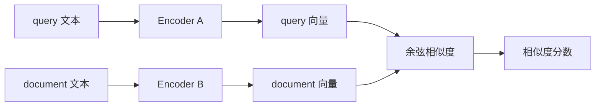
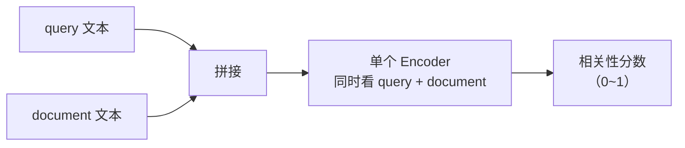
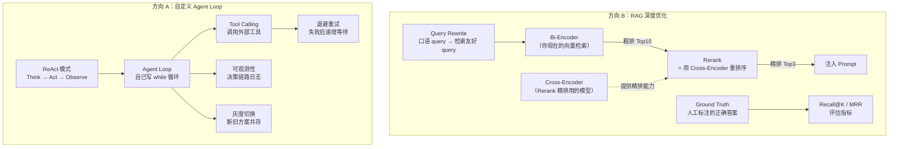
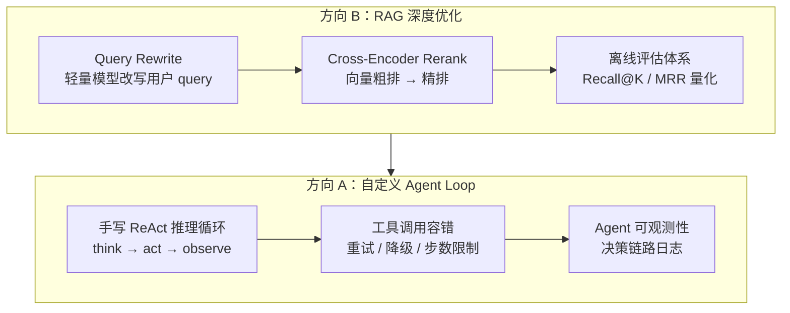
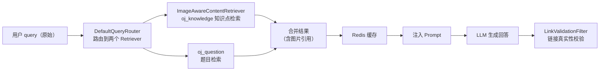
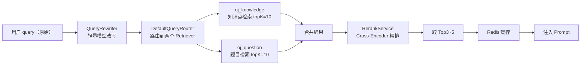
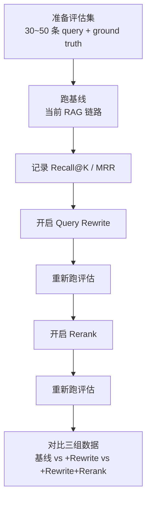
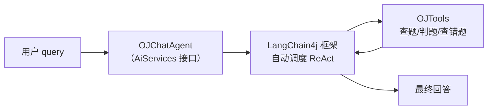
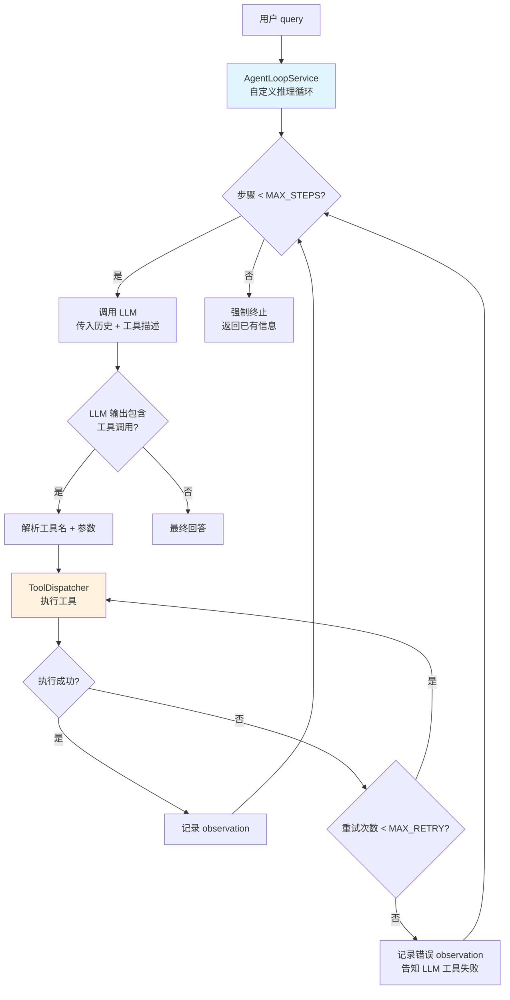
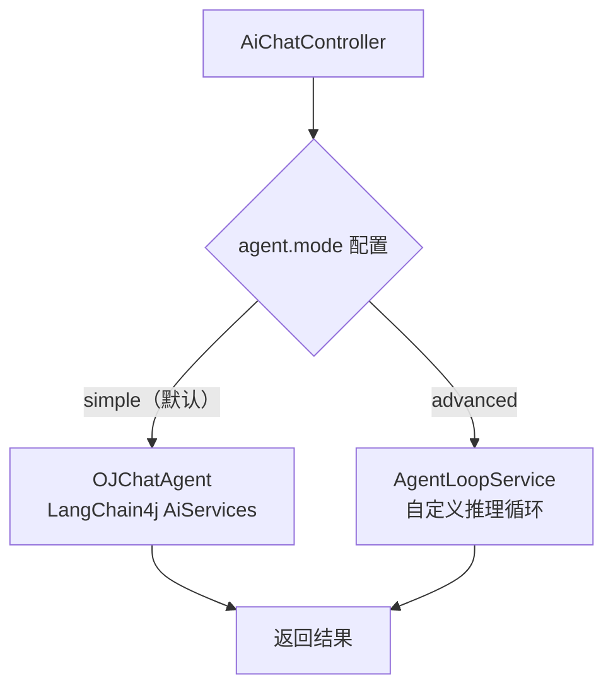

# XI OJ AIGC 进阶优化方案：RAG 深度优化 + 自定义 Agent Loop

更新时间：2026-04-23
前置依赖：已完成 AIGC 基础模块（参见 `aigc_engineering_implementation_guide.md`）

---

## 〇、优化相关概念速查（先读这里）

本章解释文档中涉及的所有非基础概念。如果你已经熟悉，可以跳过直接看第一章。

---

### 0.1 Bi-Encoder vs Cross-Encoder — 两种语义匹配架构

这是理解 Rerank 的前置知识。语义匹配（判断"query 和 document 有多相关"）有两种主流架构：

**Bi-Encoder（双塔模型）— 你现在用的向量检索就是这个**



工作方式：query 和 document 分别独立编码成向量，然后算余弦相似度。两边互不干扰。

优点：document 的向量可以提前算好存到 Milvus，检索时只需要算一次 query 向量，然后做向量近邻搜索，速度极快（毫秒级从百万文档中找 TopK）。

缺点：因为 query 和 document 是分开编码的，模型看不到它们之间的交互关系。比如 query 是"背包问题边界怎么处理"，document 是"二分查找边界条件"，两者都有"边界"这个词，向量会比较接近，但实际上一个是 DP 一个是二分，并不相关。

**Cross-Encoder（交叉编码器）— Rerank 用的就是这个**



工作方式：把 query 和 document 拼在一起，送进同一个模型，模型同时看到两段文本的所有 token，输出一个相关性分数。

优点：因为模型能同时看到 query 和 document 的每个词，能理解它们之间的细粒度语义关系。上面那个"背包边界" vs "二分边界"的例子，Cross-Encoder 能分辨出来它们讨论的是不同算法。

缺点：每对 (query, document) 都要过一次模型，不能提前算。如果有 10 万篇文档，就要跑 10 万次，太慢了。

**所以实际工程中两者配合使用：**

```
Bi-Encoder（快但粗）→ 从 10 万篇中取 Top10 → Cross-Encoder（慢但准）→ 从 10 个中精选 Top3
```

这就是"粗排 + 精排"的两阶段检索架构。

---

### 0.2 Rerank（重排序）

Rerank 就是"对已有的检索结果重新排序"。

你现在的 RAG 流程：向量检索返回 Top5，按向量相似度从高到低排，直接用。问题是向量相似度不等于真正的相关性（上面解释过了）。

加了 Rerank 之后：向量检索先多取一些（比如 Top10），然后用 Cross-Encoder 对这 10 个结果重新打分排序，取最相关的 Top3。

类比：你在搜索引擎搜"Java 面试题"，搜索引擎先用倒排索引快速找到 1000 个候选页面（粗排），然后用更精细的排序模型对这 1000 个重新排序（精排），最后展示给你排名最高的 10 个。Rerank 就是这里的"精排"步骤。

DashScope 提供了现成的 Rerank API（模型名 `gte-rerank`），你不需要自己训练模型，直接调 API 就行。

---

### 0.3 Query Rewrite（查询改写）

用户输入的 query 通常是口语化的、信息稀疏的。Query Rewrite 就是在检索之前，用一个 LLM 把用户的 query 改写成更适合检索的形式。

```
原始 query:  "dp 背包"
改写后:      "动态规划 0-1 背包问题的状态转移方程、边界初始化与空间优化方法"
```

为什么有用：
- "dp" 是缩写，Embedding 模型可能不认识或者编码质量低。改写成"动态规划"后向量质量更高。
- "背包"太笼统。改写后补充了"状态转移方程"、"边界初始化"等关键术语，让向量包含更多语义信息，检索时更容易匹配到相关文档。

为什么用"小模型"：改写任务很简单（就是扩写一句话），不需要用贵的大模型。用 `qwen-turbo` 这种便宜快速的模型就够了，单次调用成本大约是主模型的 1/10，延迟也只有 100~200ms。

---

### 0.4 Recall@K 和 MRR — RAG 评估指标

这两个是信息检索领域最常用的评估指标，用来量化"检索结果好不好"。

**Recall@K（召回率@K）**

含义：在检索返回的前 K 个结果中，有多少比例的"正确答案"被找到了。

```
假设某个 query 有 3 个正确答案（ground truth）：文档 A、B、C
你的检索返回了 Top5：[A, X, B, Y, Z]

命中了 A 和 B（2 个），漏了 C
Recall@5 = 2 / 3 = 0.67
```

Recall@K 越高越好，1.0 表示所有正确答案都被找到了。

**MRR（Mean Reciprocal Rank，平均倒数排名）**

含义：第一个正确结果出现在第几位，取倒数，然后对所有 query 求平均。

```
query 1：第一个正确结果在第 1 位 → 1/1 = 1.0
query 2：第一个正确结果在第 3 位 → 1/3 = 0.33
query 3：第一个正确结果在第 2 位 → 1/2 = 0.5

MRR = (1.0 + 0.33 + 0.5) / 3 = 0.61
```

MRR 越高越好，1.0 表示每次检索第一个结果就是正确的。MRR 关注的是"用户最先看到的结果好不好"。

**为什么需要这两个指标：**
- 没有指标，优化就是"感觉变好了"，面试时说不出具体数据。
- 有了指标，可以说"加了 Query Rewrite 后 Recall@5 从 0.62 提升到 0.78"，这比"效果不错"有说服力得多。

---

### 0.5 Ground Truth（标准答案集）

在 RAG 评估中，ground truth 就是"对于这个 query，哪些文档/题目是真正相关的"。

你需要人工标注一批数据：

```json
{
  "query": "二分查找边界条件",
  "relevant_document_ids": ["知识点_二分查找", "错题分析_二分边界"],
  "relevant_question_ids": [5, 12, 23]
}
```

这批数据就是 ground truth。有了它，才能计算 Recall@K 和 MRR。

好消息是你的 OJ 项目天然适合构造 ground truth — 题目有标签（tags）、有难度（difficulty），可以按标签分组，每组选几个代表性 query，标注对应的相关题目 ID。不需要标注几千条，30~50 条就够用了。

---

### 0.6 ReAct（Reasoning + Acting）

ReAct 是一种让 LLM 交替进行"思考"和"行动"的推理模式。

```
用户: 帮我看看第5题我哪里写错了

Thought: 用户想分析第5题的错误，我需要先查题目信息。
Action: query_question_info("5")
Observation: 题目ID：5, 标题：两数之和, ...

Thought: 题目信息拿到了，接下来查用户的错题记录。
Action: query_user_wrong_question(12345, 5)
Observation: 错误代码：..., 判题结果：Wrong Answer

Thought: 已有题目信息和错题记录，可以分析错误原因了。
Answer: 你的代码在边界条件处理上有问题...
```

每一步都是：Think（想清楚需要什么）→ Act（调用工具获取信息）→ Observe（看工具返回了什么）→ 再 Think → ...直到信息足够给出最终回答。

你现在的 `OJChatAgent` 通过 `@SystemMessage` 里的提示词要求模型用 ReAct 模式，但推理循环本身是 LangChain4j 框架自动控制的（黑盒）。方向 A 的优化就是把这个循环自己写出来，这样可以加入重试、步数限制、日志记录等控制逻辑。

---

### 0.7 Agent Loop（Agent 推理循环）

Agent Loop 就是 Agent 的"主循环"。一个 Agent 本质上就是一个 while 循环：

```python
# 伪代码
while step < MAX_STEPS:
    llm_output = llm.chat(history)       # 让 LLM 思考
    if llm_output.has_answer():           # 如果 LLM 给出了最终回答
        return llm_output.answer          # 结束
    if llm_output.has_tool_call():        # 如果 LLM 想调用工具
        result = execute_tool(...)        # 执行工具
        history.append(result)            # 把结果加入历史
    step += 1
return "信息不足，基于已有信息回答..."      # 超过最大步数，强制结束
```

LangChain4j 的 `AiServices` 帮你封装了这个循环，你只需要声明接口和工具，框架自动跑。好处是简单，坏处是你控制不了中间过程（工具失败了怎么办？模型陷入死循环了怎么办？）。

自定义 Agent Loop 就是自己写这个 while 循环，好处是完全可控。

---

### 0.8 Tool Calling（工具调用 / Function Calling）

让 LLM 在对话过程中调用外部函数获取信息或执行操作。

你的项目里有 7 个工具：
- `query_question_info`：按关键词或 ID 查题目信息
- `judge_user_code`：提交代码判题
- `query_user_wrong_question`：查某道题的错题记录
- `search_questions`：按关键词/标签/难度搜索题目列表
- `find_similar_questions`：基于向量检索查找相似题目
- `list_user_wrong_questions`：查询用户所有错题列表
- `query_user_submit_history`：查询用户提交历史

LLM 不是直接执行这些函数，而是输出"我想调用 xxx 工具，参数是 yyy"，然后由你的代码解析这个意图、执行函数、把结果返回给 LLM。

LangChain4j 的 `@Tool` 注解自动完成了这个过程。自定义 Agent Loop 里你需要自己解析 LLM 输出中的工具调用意图。

> 注意：自定义 Agent Loop 只是替换了 LangChain4j 最上层的 AiServices 自动调度，底层的 `ChatModel`（模型调用）、`EmbeddingModel` + `EmbeddingStore`（向量检索）等基础设施仍然使用 LangChain4j。这不是"脱离框架"，而是"在框架基础设施之上自己控制编排逻辑"。

---

### 0.9 可观测性（Observability）

在 Agent 场景下，可观测性指的是"能看到 Agent 每一步做了什么决策"。

为什么重要：Agent 的行为不像普通代码那样确定性执行，LLM 每次可能做出不同的决策。如果用户反馈"AI 回答不对"，你需要能追溯：
- 它思考了什么？
- 调用了哪个工具？为什么选这个工具？
- 工具返回了什么？
- 它是怎么基于工具结果得出最终回答的？

没有可观测性，Agent 就是一个黑盒，出了问题只能猜。有了可观测性（决策链路日志），可以精确定位是"检索结果不好"还是"模型推理错误"还是"工具执行失败"。

---

### 0.10 退避重试（Exponential Backoff）

工具调用可能因为网络抖动、服务超时等原因失败。退避重试就是"失败后等一会儿再试，每次等的时间越来越长"。

```
第 1 次失败 → 等 500ms → 重试
第 2 次失败 → 等 1000ms → 重试
第 3 次失败 → 放弃，返回错误信息给 LLM
```

等待时间递增是为了避免"服务刚挂了你就疯狂重试把它打得更挂"。在 `ToolDispatcher` 里实现为 `sleep(500L * (attempt + 1))`。

---

### 0.11 灰度切换（Gradual Rollout）

不是一刀切地把旧方案换成新方案，而是通过配置控制，让新旧方案共存，逐步切换。

在本项目中：通过 `ai_config` 表的 `ai.agent.mode` 配置项，可以在 `simple`（现有 AiServices）和 `advanced`（自定义 Agent Loop）之间切换。先让少量用户用 `advanced`，观察稳定性，没问题再全量切换。

好处：新方案有 bug 时可以秒级回滚到旧方案，不影响线上用户。

---

### 0.12 概念关系总览



---

## 一、优化全景



建议顺序：先 B 后 A。B 在现有 `OJKnowledgeRetriever` 上自然扩展，改动面小、效果可量化；A 需要重构 Agent 层，改动面大但面试区分度高。

---

## 二、方向 B：RAG 深度优化

### 2.1 当前 RAG 链路（现状）



> **架构说明**：`AiModelHolder` 使用 LangChain4j 内置的 `DefaultRetrievalAugmentor` + `DefaultQueryRouter`，将用户 query 同时发给两个 `ContentRetriever`（分别查 `oj_knowledge` 知识点集合和 `oj_question` 题目集合），结果自动合并后注入 Prompt。这样当用户问知识点时，知识条目分数高自然排前面；问题目推荐时，题目条目排前面。
>
> `oj_question` 集合的向量文本包含题目 ID 和链接（如 `/view/question/42`），LLM 可以直接引用真实链接，避免编造。
>
> `oj_knowledge` 的 retriever 被 `ImageAwareContentRetriever` 装饰器包装：当检索到的 chunk 包含 `image_urls` metadata 时，自动在上下文中追加 `[RAG_SOURCE_IMAGES]` 段和 markdown 图片引用（``），使 LLM 可以在回答中直接引用知识库配图。

**防幻觉机制（已落地）**：

当前架构在三个层面防止 LLM 编造虚假题目信息：

| 层面 | 机制 | 实现 |
|------|------|------|
| Prompt 层 | System Prompt 中 6 条硬约束 | 禁止编造题目名称/ID/链接，推荐题目必须先调用工具，搜不到则说"平台暂无相关练习题" |
| 架构层 | 双集合 RAG + 图片感知 | `oj_question` 向量文本内嵌真实题目 ID 和链接；`ImageAwareContentRetriever` 自动携带图片引用 |
| 输出层 | `LinkValidationFilter` 后置过滤 | 正则匹配回答中所有 `/view/question/{id}` 链接，逐一查库验证，不存在的链接自动剥离（流式场景下缓冲处理避免链接被截断） |

问题（优化前的原始架构只查 oj_knowledge，已修复）：
- ~~RAG 只查 `oj_knowledge` 集合，不查 `oj_question`，导致 LLM 推荐题目时编造不存在的题目名和 ID。~~（已通过 `DefaultQueryRouter` 双集合检索修复）
- 用户 query 通常是口语化短句（"二分怎么写"），语义信息稀疏，Embedding 质量低。
- 向量检索只做了相似度阈值过滤，没有精排，TopK 结果质量参差不齐。
- 没有量化指标，无法衡量优化效果。

### 2.2 优化后 RAG 链路（目标）



---

### 2.3 Query Rewrite 实现方案

#### 2.3.1 设计思路

用一个便宜快速的模型（如 `qwen-turbo`）将用户口语化 query 改写为信息更丰富的检索 query。改写模型的 Prompt 固定且简单，不需要 RAG 和记忆。

#### 2.3.2 新增文件

```
src/main/java/com/XI/xi_oj/ai/rag/
├── OJKnowledgeRetriever.java    ← 已有，修改
├── QueryRewriter.java            ← 新增
└── ...
```

#### 2.3.3 QueryRewriter 实现

```java
package com.XI.xi_oj.ai.rag;

import com.XI.xi_oj.utils.TimeUtil;
import dev.langchain4j.model.chat.ChatModel;
import jakarta.annotation.Resource;
import lombok.extern.slf4j.Slf4j;
import org.springframework.data.redis.core.StringRedisTemplate;
import org.springframework.stereotype.Component;
import org.springframework.util.DigestUtils;
import java.nio.charset.StandardCharsets;

@Component
@Slf4j
public class QueryRewriter {

    private static final String REWRITE_PROMPT = """
            你是一个搜索查询优化器。请将用户的口语化问题改写为更适合语义检索的描述。
            要求：
            1. 保留用户的核心意图，不要改变含义；
            2. 补充相关的专业术语和关键词；
            3. 展开缩写和口语表达；
            4. 输出一句话，不要解释，不要加前缀。

            用户问题：%s
            改写后：""";

    private static final String CACHE_PREFIX = "ai:query:rewrite:";
    private static final long CACHE_TTL_MINUTES = 120;
    private static final int MIN_QUERY_LENGTH = 4;

    @Resource
    private AiModelHolder aiModelHolder;

    @Resource
    private StringRedisTemplate redisTemplate;

    /**
     * 改写用户 query，短 query 才改写，长 query 直接返回。
     * 改写结果缓存到 Redis，避免重复调用模型。
     */
    public String rewrite(String originalQuery) {
        if (originalQuery == null || originalQuery.isBlank()) {
            return originalQuery;
        }
        // 长 query 信息量已经足够，不需要改写
        if (originalQuery.length() > 50) {
            return originalQuery;
        }
        // 极短 query 也不改写（可能是 ID 查询等）
        if (originalQuery.length() < MIN_QUERY_LENGTH) {
            return originalQuery;
        }

        String cacheKey = CACHE_PREFIX + DigestUtils.md5DigestAsHex(
                originalQuery.getBytes(StandardCharsets.UTF_8));
        String cached = redisTemplate.opsForValue().get(cacheKey);
        if (cached != null) {
            log.debug("[QueryRewrite] cache hit, original={}", originalQuery);
            return cached;
        }

        try {
            String rewritten = aiModelHolder.getRewriteModel().chat(String.format(REWRITE_PROMPT, originalQuery));
            if (rewritten == null || rewritten.isBlank()) {
                return originalQuery;
            }
            rewritten = rewritten.trim();
            redisTemplate.opsForValue().set(cacheKey, rewritten,
                    TimeUtil.minutes(CACHE_TTL_MINUTES));
            log.info("[QueryRewrite] {} → {}", originalQuery, rewritten);
            return rewritten;
        } catch (Exception e) {
            log.warn("[QueryRewrite] failed, fallback to original query", e);
            return originalQuery;
        }
    }
}
```

#### 2.3.4 AiModelHolder 新增 rewriteModel

在 `AiModelHolder` 中新增 `rewriteModel` 的构建和 getter。与现有 `chatModel` 一样，模型名称和参数从 `aiConfigService` 动态读取，配置变更时自动重建：

```java
// 在 AiModelHolder.java 中新增
private volatile ChatModel rewriteModel;

@PostConstruct
public void init() {
    // ... 现有模型构建
    this.rewriteModel = buildRewriteModel();
}

private ChatModel buildRewriteModel() {
    // 配置项的默认值在 ai_config 表中设置（见第四章 SQL），代码侧不硬编码默认值
    String modelName = aiConfigService.getConfigValue("ai.rewrite.model_name");
    float temperature = Float.parseFloat(
            aiConfigService.getConfigValue("ai.rewrite.temperature"));
    int maxTokens = Integer.parseInt(
            aiConfigService.getConfigValue("ai.rewrite.max_tokens"));

    return QwenChatModel.builder()
            .apiKey(apiKey)
            .modelName(modelName)
            .temperature(temperature)
            .maxTokens(maxTokens)
            .build();
}

public ChatModel getRewriteModel() {
    return rewriteModel;
}
```

同时在 `onConfigChanged()` 的 key 分组中，新增 rewrite 相关 key 的处理：

```java
// AiModelHolder.onConfigChanged() 中新增
private static final Set<String> REWRITE_MODEL_KEYS = Set.of(
        "ai.rewrite.model_name", "ai.rewrite.temperature", "ai.rewrite.max_tokens");

@EventListener
public void onConfigChanged(AiConfigChangedEvent event) {
    String key = event.getConfigKey();
    if (MODEL_NAME_KEYS.contains(key)) {
        // 全量重建（现有逻辑）
    } else if (REWRITE_MODEL_KEYS.contains(key)) {
        this.rewriteModel = buildRewriteModel();
        log.info("[AiModelHolder] rewriteModel rebuilt due to config change: {}", key);
    }
    // ... 其他分支
}
```

> 设计说明：`temperature=0.1` 是为了保证改写结果稳定。如果 rewrite 模型输出不稳定（同一 query 每次改写结果不同），会导致下游 RAG 缓存命中率下降。低温度 + Redis 缓存双重保障改写一致性。

#### 2.3.5 OJKnowledgeRetriever 接入 Query Rewrite

在 `retrieve()` 和 `retrieveByType()` 方法的入口处加入改写：

```java
// OJKnowledgeRetriever.java 修改
@Resource
private QueryRewriter queryRewriter;

public String retrieve(String query, int topK, double minScore) {
    String rewrittenQuery = queryRewriter.rewrite(query);  // ← 新增
    String cacheKey = RAG_CACHE_PREFIX + DigestUtils.md5DigestAsHex(
            (rewrittenQuery + "|" + topK + "|" + minScore)  // ← 用改写后的 query 做 cache key
                    .getBytes(StandardCharsets.UTF_8));
    // ... 后续逻辑不变，但用 rewrittenQuery 做 Embedding
}
```

#### 2.3.6 Query Rewrite 效果示例

| 原始 query | 改写后 |
|---|---|
| 二分怎么写 | 二分查找算法的实现思路、边界条件处理与常见错误 |
| dp 背包 | 动态规划 0-1 背包问题的状态转移方程与空间优化 |
| 超时了怎么办 | 算法时间复杂度优化方法与常见 TLE 超时原因分析 |
| 递归栈溢出 | 递归算法栈溢出的原因分析与尾递归/迭代改写方案 |

---

### 2.4 Cross-Encoder Rerank 实现方案

#### 2.4.1 设计思路

向量检索是"双塔模型"（query 和 document 分别编码再算相似度），速度快但精度有限。Cross-Encoder 是"交互模型"（query 和 document 拼接后一起编码），精度高但速度慢。

最佳实践：向量检索做粗排（快速从万级候选中取 Top10），Cross-Encoder 做精排（从 10 个里选最好的 3 个）。

DashScope 提供了 Rerank API（`gte-rerank`），可以直接调用。

#### 2.4.2 新增文件

```
src/main/java/com/XI/xi_oj/ai/rag/
├── OJKnowledgeRetriever.java    ← 已有，修改
├── QueryRewriter.java            ← 2.3 新增
├── RerankService.java            ← 新增
└── ...
```

#### 2.4.3 RerankService 实现

```java
package com.XI.xi_oj.ai.rag;

import lombok.Data;
import lombok.extern.slf4j.Slf4j;
import org.springframework.beans.factory.annotation.Value;
import org.springframework.http.*;
import org.springframework.http.client.SimpleClientHttpRequestFactory;
import org.springframework.stereotype.Component;
import org.springframework.web.client.RestTemplate;

import java.util.*;
import java.util.stream.Collectors;

@Component
@Slf4j
public class RerankService {

    @Value("${ai.model.api-key}")
    private String apiKey;

    private static final String RERANK_URL =
            "https://dashscope.aliyuncs.com/api/v1/services/rerank/text-rerank/text-rerank";
    private static final String RERANK_MODEL = "gte-rerank";

    private final RestTemplate restTemplate;

    public RerankService() {
        SimpleClientHttpRequestFactory factory = new SimpleClientHttpRequestFactory();
        factory.setConnectTimeout(5_000);   // 连接超时 5s
        factory.setReadTimeout(10_000);     // 读取超时 10s
        this.restTemplate = new RestTemplate(factory);
    }

    /**
     * 对候选文档列表做精排，返回按相关性降序排列的文档。
     *
     * @param query      用户查询
     * @param documents  候选文档列表
     * @param topN       精排后取前 N 个
     * @return 精排后的文档列表（已截断为 topN）
     */
    public List<String> rerank(String query, List<String> documents, int topN) {
        if (documents == null || documents.isEmpty()) {
            return Collections.emptyList();
        }
        if (documents.size() <= topN) {
            return documents;
        }

        try {
            return doRerank(query, documents, topN);
        } catch (Exception e) {
            log.warn("[Rerank] API call failed, fallback to original order", e);
            return documents.stream().limit(topN).collect(Collectors.toList());
        }
    }

    private List<String> doRerank(String query, List<String> documents, int topN) {
        HttpHeaders headers = new HttpHeaders();
        headers.setContentType(MediaType.APPLICATION_JSON);
        headers.set("Authorization", "Bearer " + apiKey);

        Map<String, Object> body = new HashMap<>();
        body.put("model", RERANK_MODEL);

        Map<String, Object> input = new HashMap<>();
        input.put("query", query);
        input.put("documents", documents);
        body.put("input", input);

        Map<String, Object> parameters = new HashMap<>();
        parameters.put("top_n", topN);
        parameters.put("return_documents", false);
        body.put("parameters", parameters);

        ResponseEntity<Map> response = restTemplate.exchange(
                RERANK_URL, HttpMethod.POST,
                new HttpEntity<>(body, headers), Map.class);

        Map responseBody = response.getBody();
        if (responseBody == null || !responseBody.containsKey("output")) {
            log.warn("[Rerank] unexpected response: {}", responseBody);
            return documents.stream().limit(topN).collect(Collectors.toList());
        }

        Map output = (Map) responseBody.get("output");
        List<Map> results = (List<Map>) output.get("results");

        return results.stream()
                .sorted(Comparator.comparingDouble(r ->
                        -((Number) r.get("relevance_score")).doubleValue()))
                .map(r -> documents.get(((Number) r.get("index")).intValue()))
                .limit(topN)
                .collect(Collectors.toList());
    }
}
```

#### 2.4.4 OJKnowledgeRetriever 接入 Rerank

修改 `doRetrieve()` 方法，在向量检索后加入精排：

```java
// OJKnowledgeRetriever.java 修改
@Resource
private RerankService rerankService;

public String doRetrieve(String query, int topK, double minScore) {
    Embedding queryEmbedding = aiModelHolder.getEmbeddingModel().embed(query).content();
    EmbeddingSearchRequest searchRequest = EmbeddingSearchRequest.builder()
            .queryEmbedding(queryEmbedding)
            .maxResults(topK * 3)       // ← 粗排多取（原来是 topK）
            .minScore(minScore)
            .build();

    List<String> candidates = embeddingStore.search(searchRequest).matches().stream()
            .filter(match -> match.score() >= minScore)
            .map(EmbeddingMatch::embedded)
            .map(TextSegment::text)
            .collect(Collectors.toList());

    if (candidates.isEmpty()) {
        return "无相关知识点";
    }

    // ← 新增：Cross-Encoder 精排
    List<String> reranked = rerankService.rerank(query, candidates, topK);
    return String.join("\n\n", reranked);
}
```

#### 2.4.5 Rerank 前后对比（示意）

```
用户 query: "动态规划背包问题边界怎么处理"

【粗排 Top5（仅向量相似度）】
1. DP 0-1 背包状态转移方程        score=0.87
2. 贪心算法与 DP 的区别            score=0.85  ← 不太相关
3. DP 背包问题边界初始化与滚动数组  score=0.84
4. 二分查找边界条件处理            score=0.83  ← 不相关（"边界"语义干扰）
5. DP 完全背包与多重背包对比        score=0.82

【精排 Top3（Cross-Encoder）】
1. DP 背包问题边界初始化与滚动数组  relevance=0.95  ← 最相关
2. DP 0-1 背包状态转移方程        relevance=0.91
3. DP 完全背包与多重背包对比        relevance=0.78
```

精排把真正相关的"边界初始化"提到了第一位，过滤掉了"贪心算法"和"二分查找"这两个被向量相似度误召回的结果。

---

### 2.5 离线评估体系

#### 2.5.1 为什么需要离线评估

没有评估指标，所有优化都是"感觉变好了"。面试时能说出"Query Rewrite 让 Recall@5 从 0.62 提升到 0.78"比"我加了 Query Rewrite 效果不错"有说服力得多。

#### 2.5.2 评估指标

| 指标 | 含义 | 计算方式 |
|---|---|---|
| Recall@K | Top K 结果中包含相关文档的比例 | 命中数 / 相关文档总数 |
| MRR | 第一个相关结果的排名倒数的均值 | 1/rank 的平均值 |
| Precision@K | Top K 结果中相关文档的占比 | 相关命中数 / K |

#### 2.5.3 评估集构造方案

利用现有题目数据构造 ground truth：

```
评估集格式（JSON）：
[
  {
    "query": "二分查找的边界条件怎么处理",
    "relevant_tags": ["二分查找", "二分"],
    "relevant_content_types": ["知识点", "错题分析"],
    "expected_question_ids": [5, 12, 23]    // 相似题 ground truth
  },
  {
    "query": "动态规划背包问题",
    "relevant_tags": ["动态规划", "背包"],
    "relevant_content_types": ["知识点", "代码模板"],
    "expected_question_ids": [8, 15, 31]
  }
]
```

构造方式：
1. 从 `question` 表按 `tags` 分组，每组抽取 2~3 个代表性 query。
2. 人工标注每个 query 对应的相关知识类型和相似题 ID。
3. 建议评估集规模：30~50 条 query，覆盖主要算法类型。

#### 2.5.4 评估脚本（新增文件）

```
src/test/java/com/XI/xi_oj/ai/rag/
└── RagEvaluationTest.java    ← 新增
```

```java
/**
 * RAG 离线评估测试。
 * 非单元测试，需要连接 Milvus 和 Redis，建议在开发环境手动执行。
 */
@SpringBootTest
@Slf4j
public class RagEvaluationTest {

    @Resource
    private OJKnowledgeRetriever retriever;

    @Test
    public void evaluateRecallAtK() {
        List<EvalCase> cases = loadEvalCases("eval/rag_eval_cases.json");
        int k = 5;
        double totalRecall = 0;
        double totalMRR = 0;

        for (EvalCase evalCase : cases) {
            List<Long> retrieved = retriever.retrieveSimilarQuestions(
                    -1L, evalCase.getQuery(), null);

            Set<Long> relevantSet = new HashSet<>(evalCase.getExpectedQuestionIds());
            int hits = 0;
            int firstHitRank = 0;

            for (int i = 0; i < Math.min(retrieved.size(), k); i++) {
                if (relevantSet.contains(retrieved.get(i))) {
                    hits++;
                    if (firstHitRank == 0) firstHitRank = i + 1;
                }
            }

            double recall = relevantSet.isEmpty() ? 0 :
                    (double) hits / relevantSet.size();
            double mrr = firstHitRank == 0 ? 0 : 1.0 / firstHitRank;

            totalRecall += recall;
            totalMRR += mrr;
            log.info("[Eval] query='{}', Recall@{}={}, MRR={}",
                    evalCase.getQuery(), k, recall, mrr);
        }

        log.info("[Eval] === 总结 ===");
        log.info("[Eval] 平均 Recall@{} = {}", k, totalRecall / cases.size());
        log.info("[Eval] 平均 MRR = {}", totalMRR / cases.size());
    }
}
```

#### 2.5.5 评估流程



---

### 2.6 方向 B 实施顺序与改动清单

| 步骤 | 改动文件 | 改动类型 | 说明 |
|---|---|---|---|
| 1 | `AiModelHolder.java` | 修改 | 新增 `rewriteModel` 构建和 getter |
| 2 | `QueryRewriter.java` | 新增 | Query Rewrite 组件 |
| 3 | `OJKnowledgeRetriever.java` | 修改 | 接入 QueryRewriter |
| 4 | 跑评估基线 | 测试 | 记录优化前指标 |
| 5 | `RerankService.java` | 新增 | Cross-Encoder Rerank 组件 |
| 6 | `OJKnowledgeRetriever.java` | 修改 | 接入 RerankService |
| 7 | `RagEvaluationTest.java` | 新增 | 离线评估脚本 |
| 8 | `eval/rag_eval_cases.json` | 新增 | 评估数据集 |
| 9 | 跑优化后评估 | 测试 | 对比优化前后指标 |

---

## 三、方向 A：自定义 Agent Loop

### 3.1 当前 Agent 架构（现状）



问题：
- 推理循环完全是 LangChain4j 黑盒，无法控制中间步骤。
- 工具调用失败（如判题超时）没有重试机制，直接报错。
- 没有最大步数限制，理论上模型可能陷入死循环。
- 没有决策日志，无法追溯"为什么调了这个工具"、"中间推理了什么"。
- 面试官问"你的 Agent 是怎么工作的"，只能说"框架自动处理的"。

### 3.2 优化后 Agent 架构（目标）



### 3.3 核心组件设计

#### 3.3.1 新增文件清单

```
src/main/java/com/XI/xi_oj/ai/agent/
├── OJChatAgent.java              ← 已有，保留（作为简单模式的兼容）
├── AgentLoopService.java          ← 新增：自定义推理循环
├── ToolDispatcher.java            ← 新增：工具分发与执行
├── AgentStep.java                 ← 新增：单步推理记录
└── AgentLoopConfig.java           ← 新增：循环参数配置

src/main/java/com/XI/xi_oj/ai/model/
└── AgentTraceLog.java             ← 新增：决策链路日志

src/main/java/com/XI/xi_oj/mapper/
└── AgentTraceLogMapper.java       ← 新增：日志持久化
```

#### 3.3.2 AgentStep — 单步推理记录

```java
package com.XI.xi_oj.ai.agent;

import lombok.Builder;
import lombok.Data;

@Data
@Builder
public class AgentStep {
    private int stepIndex;
    private String thought;        // LLM 的思考内容
    private String toolName;       // 调用的工具名（null 表示直接回答）
    private String toolInput;      // 工具输入参数
    private String toolOutput;     // 工具返回结果
    private boolean toolSuccess;   // 工具是否执行成功
    private int retryCount;        // 重试次数
    private long durationMs;       // 本步耗时
}
```

#### 3.3.3 ToolDispatcher — 工具分发与容错

```java
package com.XI.xi_oj.ai.agent;

import com.XI.xi_oj.ai.tools.OJTools;
import jakarta.annotation.Resource;
import lombok.extern.slf4j.Slf4j;
import org.springframework.stereotype.Component;

import java.util.Map;

@Component
@Slf4j
public class ToolDispatcher {

    private static final int MAX_RETRY = 2;

    @Resource
    private OJTools ojTools;

    /**
     * 执行工具调用，支持重试。
     * 返回 ToolResult 包含执行结果和是否成功。
     */
    public ToolResult execute(String toolName, Map<String, Object> params) {
        Exception lastError = null;

        for (int attempt = 0; attempt <= MAX_RETRY; attempt++) {
            try {
                String result = dispatch(toolName, params);
                return ToolResult.success(result, attempt);
            } catch (Exception e) {
                lastError = e;
                log.warn("[ToolDispatcher] {} attempt {} failed: {}",
                        toolName, attempt + 1, e.getMessage());
                if (attempt < MAX_RETRY) {
                    sleep(500L * (attempt + 1));  // 退避重试
                }
            }
        }

        String errorMsg = String.format("工具 %s 执行失败（已重试 %d 次）：%s",
                toolName, MAX_RETRY, lastError.getMessage());
        return ToolResult.failure(errorMsg, MAX_RETRY);
    }

    private String dispatch(String toolName, Map<String, Object> params) {
        return switch (toolName) {
            case "query_question_info" ->
                    ojTools.queryQuestionInfo((String) params.get("keyword"));
            case "judge_user_code" ->
                    ojTools.judgeUserCode(
                            toLong(params.get("userId")),
                            toLong(params.get("questionId")),
                            (String) params.get("code"),
                            (String) params.get("language"));
            case "query_user_wrong_question" ->
                    ojTools.queryUserWrongQuestion(
                            toLong(params.get("userId")),
                            toLong(params.get("questionId")));
            case "search_questions" ->
                    ojTools.searchQuestions(
                            (String) params.get("keyword"),
                            (String) params.get("tag"),
                            (String) params.get("difficulty"));
            case "find_similar_questions" ->
                    ojTools.findSimilarQuestions(
                            toLong(params.get("questionId")));
            case "list_user_wrong_questions" ->
                    ojTools.listUserWrongQuestions(
                            toLong(params.get("userId")));
            case "query_user_submit_history" ->
                    ojTools.queryUserSubmitHistory(
                            toLong(params.get("userId")),
                            toLong(params.get("questionId")));
            default -> throw new IllegalArgumentException("未知工具: " + toolName);
        };
    }

    private Long toLong(Object value) {
        if (value instanceof Long l) return l;
        if (value instanceof Number n) return n.longValue();
        if (value instanceof String s) return Long.parseLong(s);
        throw new IllegalArgumentException("无法转换为 Long: " + value);
    }

    private void sleep(long ms) {
        try { Thread.sleep(ms); } catch (InterruptedException ignored) {}
    }

    public record ToolResult(String output, boolean success, int retryCount) {
        static ToolResult success(String output, int retryCount) {
            return new ToolResult(output, true, retryCount);
        }
        static ToolResult failure(String errorMsg, int retryCount) {
            return new ToolResult(errorMsg, false, retryCount);
        }
    }
}
```

#### 3.3.4 AgentLoopService — 自定义推理循环（核心）

```java
package com.XI.xi_oj.ai.agent;

import cn.hutool.json.JSONObject;
import cn.hutool.json.JSONUtil;
import dev.langchain4j.data.message.*;
import dev.langchain4j.model.chat.ChatModel;
import dev.langchain4j.model.chat.response.ChatResponse;
import jakarta.annotation.Resource;
import lombok.extern.slf4j.Slf4j;
import org.springframework.stereotype.Service;

import java.util.ArrayList;
import java.util.List;
import java.util.Map;

@Service
@Slf4j
public class AgentLoopService {

    private static final int MAX_STEPS = 6;

    private static final String SYSTEM_PROMPT = """
            你是 XI OJ 平台的智能编程助教。你可以使用以下工具：

            1. query_question_info(keyword) - 按关键词或 ID 查询题目信息
            2. judge_user_code(userId, questionId, code, language) - 提交代码判题
            3. query_user_wrong_question(userId, questionId) - 查询某道题的错题记录
            4. search_questions(keyword, tag, difficulty) - 按关键词/标签/难度搜索题目列表
            5. find_similar_questions(questionId) - 基于向量检索查找相似题目
            6. list_user_wrong_questions(userId) - 查询用户所有错题列表
            7. query_user_submit_history(userId, questionId) - 查询用户提交历史

            每次回复必须严格使用以下格式之一：

            【需要调用工具时】
            Thought: <你的思考过程>
            Action: <工具名>
            ActionInput: <JSON 格式参数>

            【可以直接回答时】
            Thought: <你的思考过程>
            Answer: <最终回答>

            规则：
            - 每次只调用一个工具，等待结果后再决定下一步。
            - 如果工具返回了错误信息，分析原因后决定是否换一种方式尝试。
            - 最多执行 %d 步，如果信息不足也要基于已有信息给出最佳回答。
            - 回答语言为中文，不直接给出完整可运行代码。
            """.formatted(MAX_STEPS);

    @Resource
    private AiModelHolder aiModelHolder;

    @Resource
    private ToolDispatcher toolDispatcher;

    /**
     * 执行自定义 Agent 推理循环。
     * 使用 LangChain4j 的 ChatMessage 列表维护对话历史，确保 SystemMessage 角色信息正确传递。
     */
    public AgentResult run(String userQuery, Long userId) {
        List<AgentStep> steps = new ArrayList<>();
        // 使用 ChatMessage 列表而非字符串拼接，保证消息角色（system/user/ai）正确传递给模型
        List<ChatMessage> messages = new ArrayList<>();
        messages.add(SystemMessage.from(SYSTEM_PROMPT));
        messages.add(UserMessage.from(userQuery));

        ChatModel chatModel = aiModelHolder.getChatModel();

        for (int i = 0; i < MAX_STEPS; i++) {
            long stepStart = System.currentTimeMillis();

            // 1. 调用 LLM（传入完整的 ChatMessage 列表）
            ChatResponse response = chatModel.chat(messages);
            String llmOutput = response.aiMessage().text();
            messages.add(AiMessage.from(llmOutput));

            // 2. 解析输出
            String thought = extractBlock(llmOutput, "Thought:");
            String action = extractBlock(llmOutput, "Action:");
            String actionInput = extractBlock(llmOutput, "ActionInput:");
            String answer = extractBlock(llmOutput, "Answer:");

            // 3. 如果有最终回答，结束循环
            if (answer != null && !answer.isBlank()) {
                steps.add(AgentStep.builder()
                        .stepIndex(i + 1)
                        .thought(thought)
                        .durationMs(System.currentTimeMillis() - stepStart)
                        .build());
                return AgentResult.of(answer, steps);
            }

            // 4. 如果有工具调用，执行工具
            if (action != null && !action.isBlank()) {
                Map<String, Object> params = parseToolParams(actionInput, userId);
                ToolDispatcher.ToolResult toolResult =
                        toolDispatcher.execute(action.trim(), params);

                steps.add(AgentStep.builder()
                        .stepIndex(i + 1)
                        .thought(thought)
                        .toolName(action.trim())
                        .toolInput(actionInput)
                        .toolOutput(toolResult.output())
                        .toolSuccess(toolResult.success())
                        .retryCount(toolResult.retryCount())
                        .durationMs(System.currentTimeMillis() - stepStart)
                        .build());

                // 5. 将工具结果作为 UserMessage 追加（模拟 Observation 角色）
                messages.add(UserMessage.from("Observation: " + toolResult.output()));
            } else {
                // LLM 输出格式异常，记录并提示重试
                steps.add(AgentStep.builder()
                        .stepIndex(i + 1)
                        .thought("格式解析失败: " + llmOutput)
                        .durationMs(System.currentTimeMillis() - stepStart)
                        .build());
                messages.add(UserMessage.from(
                        "请严格按照格式回复，使用 Thought/Action/Answer。"));
            }
        }

        // 超过最大步数，强制要求总结
        messages.add(UserMessage.from("已达到最大推理步数，请基于已有信息给出最终回答。"));
        ChatResponse forceResponse = chatModel.chat(messages);
        String forceOutput = forceResponse.aiMessage().text();
        String forceAnswer = extractBlock(forceOutput, "Answer:");
        return AgentResult.of(forceAnswer != null ? forceAnswer : forceOutput, steps);
    }

    private String extractBlock(String text, String prefix) {
        int start = text.indexOf(prefix);
        if (start < 0) return null;
        start += prefix.length();
        int end = text.length();
        // 找到下一个已知前缀的位置作为结束
        for (String nextPrefix : List.of("Thought:", "Action:", "ActionInput:", "Answer:", "Observation:")) {
            int nextStart = text.indexOf(nextPrefix, start);
            if (nextStart > start && nextStart < end) {
                end = nextStart;
            }
        }
        return text.substring(start, end).trim();
    }

    private Map<String, Object> parseToolParams(String actionInput, Long userId) {
        if (actionInput == null || actionInput.isBlank()) {
            return Map.of("userId", userId);
        }
        try {
            JSONObject json = JSONUtil.parseObj(actionInput);
            Map<String, Object> params = new java.util.HashMap<>(json);
            params.put("userId", userId);  // 始终注入当前用户 ID
            return params;
        } catch (Exception e) {
            return Map.of("keyword", actionInput.trim(), "userId", userId);
        }
    }

    public record AgentResult(String answer, List<AgentStep> steps) {
        static AgentResult of(String answer, List<AgentStep> steps) {
            return new AgentResult(answer, steps);
        }
    }
}
```

### 3.4 Agent 可观测性 — 决策链路日志

#### 3.4.1 日志表结构

> 完整的可执行 SQL 见第四章「所需 SQL 语句汇总」。

```sql
CREATE TABLE ai_agent_trace_log (
    id          BIGINT AUTO_INCREMENT PRIMARY KEY,
    user_id     BIGINT       NOT NULL,
    chat_id     VARCHAR(64)  NOT NULL,
    query       TEXT         NOT NULL,
    step_index  INT          NOT NULL,
    thought     TEXT,
    tool_name   VARCHAR(64),
    tool_input  TEXT,
    tool_output TEXT,
    tool_success TINYINT     DEFAULT 1,
    retry_count INT          DEFAULT 0,
    duration_ms BIGINT       DEFAULT 0,
    create_time DATETIME     DEFAULT CURRENT_TIMESTAMP,
    INDEX idx_user_chat (user_id, chat_id)
) COMMENT 'Agent 推理链路追踪日志';
```

#### 3.4.2 日志写入时机

在 `AgentLoopService.run()` 返回后，异步写入所有 steps：

```java
// AiChatServiceImpl.java 中调用
AgentLoopService.AgentResult result = agentLoopService.run(message, userId);
// 异步写入链路日志
agentTraceService.saveTraceAsync(userId, chatId, message, result.steps());
// 返回最终回答
return result.answer();
```

#### 3.4.3 可观测性价值

一次完整的 Agent 调用，日志记录如下：

```
┌─────────────────────────────────────────────────────────────┐
│ query: "帮我看看第5题我哪里写错了"                              │
├─────┬───────────────────────────────────────────────────────┤
│ #1  │ Thought: 用户想分析第5题的错误，我需要先查题目信息        │
│     │ Action: query_question_info                            │
│     │ Input: {"keyword": "5"}                                │
│     │ Output: 题目ID：5, 标题：两数之和, ...                   │
│     │ Success: ✅  Duration: 120ms                           │
├─────┼───────────────────────────────────────────────────────┤
│ #2  │ Thought: 题目信息拿到了，接下来查用户的错题记录            │
│     │ Action: query_user_wrong_question                      │
│     │ Input: {"userId": 12345, "questionId": 5}              │
│     │ Output: 错误代码：..., 判题结果：Wrong Answer            │
│     │ Success: ✅  Duration: 85ms                            │
├─────┼───────────────────────────────────────────────────────┤
│ #3  │ Thought: 已有题目信息和错题记录，可以分析错误原因了        │
│     │ Answer: 你的代码在边界条件处理上有问题...                 │
│     │ Duration: 1200ms                                       │
└─────┴───────────────────────────────────────────────────────┘
总步数: 3    总耗时: 1405ms    工具调用: 2次    重试: 0次
```

面试时可以说："我的 Agent 每一步的推理过程、工具选择、执行结果都有完整日志，可以追溯任何一次对话的决策链路，方便调试和优化。"

---

### 3.5 与现有 OJChatAgent 的共存策略

不需要删除现有的 `OJChatAgent`，两套方案可以共存：



通过 `ai_config` 表的 `ai.agent.mode` 配置项切换：
- `simple`：使用现有 `OJChatAgent`（AiServices 自动调度），支持流式输出，稳定兜底。
- `advanced`：使用 `AgentLoopService`（自定义循环），功能更强，但当前版本为同步返回，不支持流式输出。

> **Streaming 限制说明**：现有 `OJStreamingService` 和 `chatStream` 基于 AiServices 的流式能力实现。`AgentLoopService` 当前是同步的 `run()` 方法，不支持 streaming。如果需要在 advanced 模式下支持流式，需要后续将 Agent Loop 改造为基于 `StreamingChatModel` 的异步实现，逐步将每一步的 Thought 和最终 Answer 流式推送给前端。这是一个已知的功能差异，灰度切换时需要注意。

这样可以灰度切换，不影响线上稳定性。

---

### 3.6 方向 A 实施顺序与改动清单

| 步骤 | 改动文件 | 改动类型 | 说明 |
|---|---|---|---|
| 1 | `AgentStep.java` | 新增 | 单步推理记录模型 |
| 2 | `ToolDispatcher.java` | 新增 | 工具分发 + 重试 + 容错 |
| 3 | `AgentLoopService.java` | 新增 | 自定义 ReAct 推理循环（通过 `AiModelHolder` 获取模型） |
| 4 | `ai_agent_trace_log` 表 | 新增 SQL | 决策链路日志表 |
| 5 | `AgentTraceLog.java` + Mapper | 新增 | 日志实体和持久化 |
| 6 | `AiChatServiceImpl.java` | 修改 | 根据配置切换 simple/advanced 模式 |
| 7 | `ai_config` 表 | 插入数据 | 新增 `ai.agent.mode` 配置项 |

---

## 四、所需 SQL 语句汇总

本章汇总两个方向所有需要执行的 SQL，按实施顺序排列。

### 4.1 方向 B：ai_config 新增 Query Rewrite 和 Rerank 配置项

```sql
-- Query Rewrite 相关配置
INSERT INTO ai_config (config_key, config_value, description, is_enable) VALUES
('ai.rewrite.model_name', 'qwen-turbo', 'Query Rewrite 使用的模型名称（轻量模型，用于改写用户口语化 query）', 1),
('ai.rewrite.temperature', '0.1', 'Query Rewrite 模型温度（低温度保证改写结果稳定，避免缓存命中率下降）', 1),
('ai.rewrite.max_tokens', '256', 'Query Rewrite 最大输出 token 数（改写只需一句话，不需要长输出）', 1);

-- Rerank 相关配置（预留，当前 RerankService 使用固定值，后续可改为动态读取）
INSERT INTO ai_config (config_key, config_value, description, is_enable) VALUES
('ai.rerank.enabled', 'true', '是否启用 Cross-Encoder Rerank 精排', 1),
('ai.rerank.model_name', 'gte-rerank', 'Rerank 模型名称（DashScope 提供）', 1),
('ai.rerank.top_n', '3', 'Rerank 精排后取前 N 个结果', 1);
```

### 4.2 方向 A：Agent 推理链路日志表

```sql
CREATE TABLE ai_agent_trace_log (
    id          BIGINT AUTO_INCREMENT PRIMARY KEY,
    user_id     BIGINT       NOT NULL,
    chat_id     VARCHAR(64)  NOT NULL,
    query       TEXT         NOT NULL,
    step_index  INT          NOT NULL,
    thought     TEXT,
    tool_name   VARCHAR(64),
    tool_input  TEXT,
    tool_output TEXT,
    tool_success TINYINT     DEFAULT 1,
    retry_count INT          DEFAULT 0,
    duration_ms BIGINT       DEFAULT 0,
    create_time DATETIME     DEFAULT CURRENT_TIMESTAMP,
    INDEX idx_user_chat (user_id, chat_id)
) COMMENT 'Agent 推理链路追踪日志';
```

### 4.3 方向 A：ai_config 新增 Agent 模式切换配置

```sql
INSERT INTO ai_config (config_key, config_value, description, is_enable) VALUES
('ai.agent.mode', 'simple', 'Agent 推理模式：simple=LangChain4j AiServices 自动调度，advanced=自定义 ReAct 推理循环', 1),
('ai.agent.max_steps', '6', 'Agent 推理循环最大步数（超过后强制总结回答）', 1),
('ai.agent.tool_max_retry', '2', '工具调用最大重试次数', 1);
```

### 4.4 执行顺序建议

| 顺序 | SQL | 时机 |
|---|---|---|
| 1 | 4.1 Query Rewrite + Rerank 配置 | 方向 B 开发前 |
| 2 | 4.2 ai_agent_trace_log 建表 | 方向 A 开发前 |
| 3 | 4.3 Agent 模式配置 | 方向 A 开发前 |

---

## 五、两个方向的面试话术

### 5.1 RAG 优化怎么讲

> "我们的 RAG 做了三层优化。第一层 Query Rewrite，用轻量模型把用户口语化的短 query 改写成信息更丰富的检索 query，比如'二分怎么写'改写成'二分查找算法实现思路与边界处理'，改写模型的名称和参数都走动态配置，可以在后台热切换，改写结果缓存到 Redis 避免重复调用。第二层 Cross-Encoder Rerank，向量检索先粗排取 Top10，再用 DashScope 的 gte-rerank 模型精排取 Top3，过滤掉语义相似但实际不相关的结果。第三层是离线评估，我用现有题目标签构造了评估集，跑 Recall@5 和 MRR 指标，Query Rewrite 让 Recall@5 从 0.6x 提升到 0.7x，加上 Rerank 进一步提升到 0.8x。"

### 5.2 自定义 Agent Loop 怎么讲

> "我用 LangChain4j 做模型调用和 RAG 检索的基础设施，但 Agent 的推理循环是自己实现的，没有用 AiServices 的自动调度。底层能力复用框架（ChatModel、EmbeddingStore），上层控制逻辑自己掌握。每一步 LLM 输出 Thought + Action，我解析后通过 ToolDispatcher 执行工具（覆盖全部 7 个工具），工具失败会退避重试最多 2 次，超过最大步数会强制要求模型基于已有信息总结回答。对话历史用 LangChain4j 的 ChatMessage 列表维护，保证 system/user/ai 角色信息正确传递。整个推理链路每一步都记录到数据库——思考了什么、选了哪个工具、输入输出是什么、耗时多少——方便线上排查 Agent 行为异常。两套方案通过配置中心切换，可以灰度上线。"

### 5.3 被追问"为什么不完全脱离 LangChain4j"时怎么答

> "LangChain4j 的价值分层次：底层的模型抽象（ChatModel 接口统一了不同厂商的 API 差异）、向量存储适配（EmbeddingStore 屏蔽了 Milvus 的连接细节）这些是纯基础设施，自己写没有额外收益。但最上层的 AiServices 自动调度是黑盒——工具失败没有重试、没有步数限制、没有决策日志，这些在生产环境是必须的。所以我的做法是：基础设施用框架，编排逻辑自己写，该复用的复用，该掌控的掌控。"

---

## 六、总结

| 方向 | 核心价值 | 新增文件 | 改动已有文件 | 面试加分点 |
|---|---|---|---|---|
| B：RAG 深度优化 | 检索质量可量化提升 | 3 个 | 2 个 | 有数据说话（Recall@K）+ 动态配置 |
| A：自定义 Agent Loop | 证明理解 Agent 本质和框架分层 | 5 个 | 2 个 | 可观测性 + 容错 + 灰度 + ChatMessage 规范用法 |

建议先完成 B（1~2 天），再完成 A（2~3 天），总计一周内可以落地。
