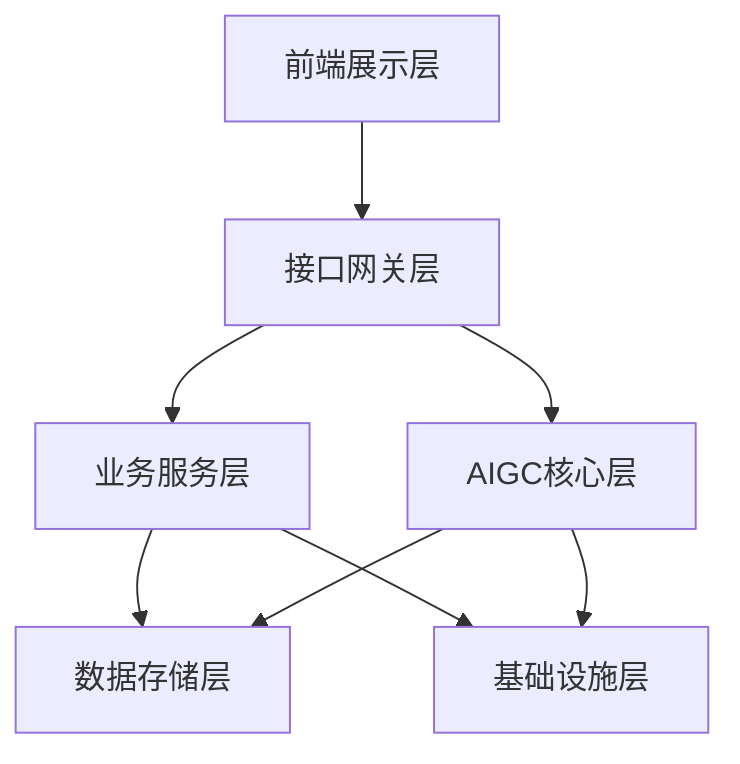
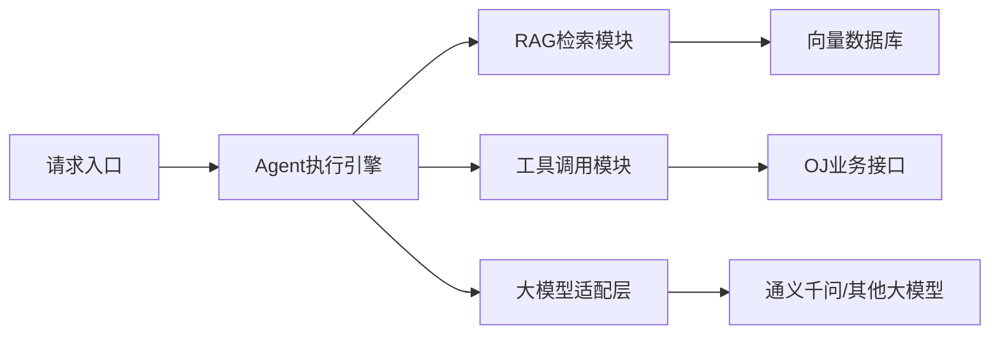
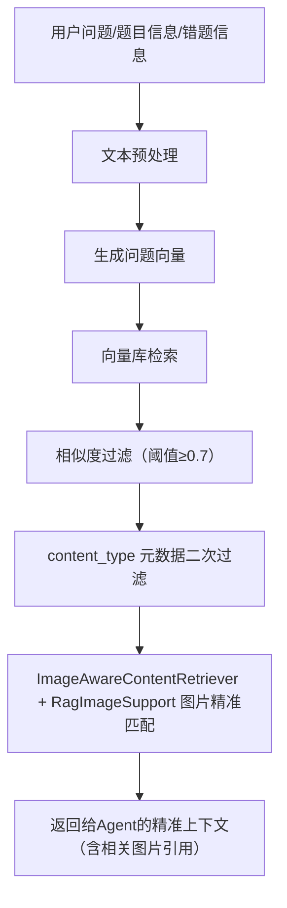
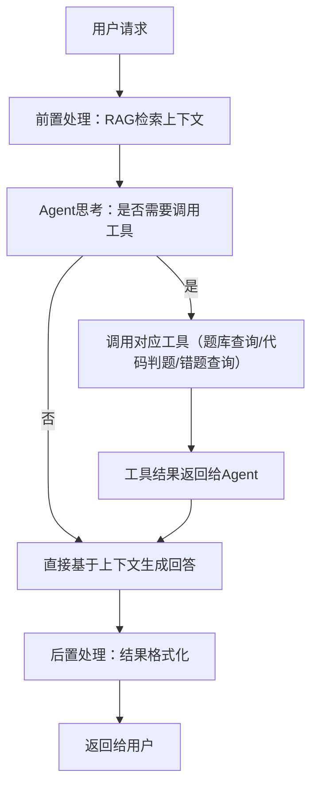
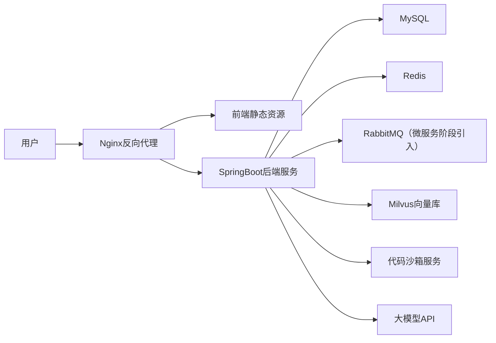

# XI OJ 平台AIGC能力整合与功能拓展设计
文档版本：V1.1
适用范围：IOJ平台现有项目二次开发、AIGC能力落地
更新日期：2026年04月

> **当前落地状态（2026-04-22）**
> 1. 当前仓库已完成 AIGC 相关依赖、配置、SQL 预埋及大部分核心业务代码落地，包含 AI 问答、AI 错题分析、AI 题目解析、题目评论区、题目向量同步等模块；
> 2. 本文档中仍保留了部分“目标实现方案”式代码块，但涉及 5.3 / 5.4 / 5.5 / 5.10 的章节已按当前仓库真实实现方式同步更新；
> 3. 现有提交限流（submit 维度）与 AI 专属限流（见 5.9）均已接入，后续新增 AI 接口应继续复用同一套限流体系。

## 一、方案概述
### 1.1 项目背景
本方案基于现有XI OJ平台进行二次开发与优化，在保留原有核心判题、题库、用户体系的基础上，深度整合AIGC能力，解决用户编程学习中「错题无指导、解题无思路、学习无路径」的核心痛点，同时完善平台的用户管理、互动社区、个性化配置等基础功能，打造「练-评-学-练」闭环的智能化OJ学习平台。

### 1.2 核心目标
1. **落地AIGC核心能力**：基于LangChain4j实现RAG+Agent技术架构，完成AI代码分析、AI智能判题、AI问答助手、AI题目解析、相似题推荐、AI错题本六大核心AI功能；
2. **完善平台基础能力**：新增AI功能全局开关、用户信息管理、登录注册优化、题目评论区等功能，补齐平台产品能力；
3. **前端体验优化**：对齐现有AI分析、AI问答页面的交互逻辑，完成前端页面的统一优化与适配；
4. **可拓展架构设计**：实现业务层与AIGC层解耦，支持后续功能的快速迭代。

### 1.3 适配范围
- 完全兼容现有OJ平台的Java SpringBoot技术栈、MySQL数据库、代码沙箱判题体系；
- 完全适配「AI判题、AI助手自动回复、AI分析题目、AI分析提交代码、AI问答、AI开关、用户信息管理、评论区、AI错题本」的功能需求；
- 兼容当前项目基线：**Java 21（最低 Java 17）+ Spring Boot 3.3.x**，兼容 LangChain4j 1.0.0-beta3 方案。

## 二、整体架构设计
本方案采用**分层解耦架构**，将AIGC能力作为独立的核心层封装，与现有业务系统完全解耦，既保证现有功能的稳定性，又支持后续能力的快速迭代。

### 2.1 整体架构图


### 2.2 分层职责说明
| 层级 | 核心模块 | 职责说明 |
|------|----------|----------|
| 前端展示层 | AI分析页面、AI问答页面、题目详情页、代码提交页、用户中心、评论区、错题本 | 负责用户交互与页面渲染，对接后端AI接口与业务接口，对齐现有页面的交互逻辑 |
| 接口网关层 | 接口鉴权、流量控制、AI开关拦截、参数校验 | 统一入口管理，拦截非法请求，根据AI全局开关控制AI接口的访问，保障接口安全 |
| 业务服务层 | 题库管理、代码判题、用户管理、评论管理、错题管理、提交记录管理、系统配置管理 | 保留OJ平台原有核心业务能力，新增用户管理、评论区、错题本等扩展功能，为AI层提供业务数据支撑 |
| AIGC核心层 | RAG检索模块、Agent执行模块、大模型适配模块、工具调用模块 | 整个平台的AI能力核心，封装所有AI相关逻辑，与业务层完全解耦，通过工具调用对接业务能力 |
| 数据存储层 | MySQL业务库、Milvus向量库、Redis缓存库 | 分别存储业务数据、AI向量知识库、高频缓存数据（AI问答、相似题检索结果） |
| 基础设施层 | 代码沙箱、大模型API服务、日志监控 | 提供底层能力支撑，包括代码运行、大模型调用、系统监控。异步任务当前通过 `@Async` 实现，拆微服务后引入消息队列 |

### 2.3 AIGC核心层内部架构

- **Agent执行引擎**：基于LangChain4j的AiServices实现（simple 模式），或自定义 `AgentLoopService` ReAct 循环实现（advanced 模式），负责AI的思考、工具调用决策、结果整合，是AIGC层的调度核心；
- **RAG检索模块**：负责题目、题解、知识点、错题分析的向量检索，为AI提供精准的上下文信息，解决大模型幻觉问题；
- **工具调用模块**：封装OJ平台的题库查询、代码判题、用户数据查询、错题查询等能力，供Agent按需调用；
- **大模型适配层**：统一封装大模型调用接口，支持多模型快速切换，兼容国内主流大模型。

## 三、技术栈选型
所有选型均兼容现有项目技术栈，无侵入式改造，同时保证生产级可用性。

### 3.1 基础技术栈
| 技术领域 | 选型 | 版本要求 | 核心用途 |
|----------|------|----------|----------|
| 开发语言 | Java | JDK 21（最低17） | 后端核心开发，与当前项目基线一致 |
| 后端框架 | Spring Boot | 3.3.x | 项目核心框架，适配现有业务代码 |
| 前端框架 | Vue / React | 与现有项目一致 | 前端页面优化与新功能开发 |
| 关系型数据库 | MySQL | 5.7+ / 8.0 | 业务数据存储，兼容现有question表等结构 |
| 缓存数据库 | Redis | 6.0+ | 高频AI检索结果、用户会话、接口限流缓存 |
| 消息队列 | RabbitMQ | 3.x+ | 异步处理AI任务、向量库数据同步、代码判题任务（**当前单体阶段不引入，拆微服务后再接入**） |

### 3.2 AIGC专属技术栈
| 技术领域 | 选型 | 版本要求 | 核心用途 | 选型理由 |
|----------|------|----------|----------|----------|
| AI应用框架 | LangChain4j | 1.0.0-beta3（与 BOM 一致） | Agent、RAG、工具调用的核心实现 | Java生态原生适配，与项目技术栈完全兼容，官方持续维护 |
| SSE流式输出 | langchain4j-reactor | 与LangChain4j BOM一致 | 将 AiServices 接口返回值适配为 `Flux<String>`，支持 SSE 推流 | 官方 Reactor 适配模块，无需手写回调，与 Spring WebFlux 无缝集成 |
| 向量数据库 | Milvus | 2.3+ | 题目、题解、算法知识点的向量化存储与检索 | 开源轻量，Java生态适配好，支持单机部署，满足中小规模数据需求 |
| 大模型 | 阿里百炼 qwen-plus | - | 文本生成、代码分析、问答交互核心 | 国内合规可访问，代码理解能力强，支持长上下文，阿里百炼平台按量计费，适配OJ场景 |
| 嵌入模型 | 阿里百炼 text-embedding-v3 | - | 文本向量化生成 | 中文适配性强，默认维度1024可配置，与主模型生态统一 |

### 3.3 项目核心依赖（pom.xml）
> **与当前仓库对齐说明（2026-04-29）**
> - 已引入：`langchain4j`、`langchain4j-community-dashscope`、`langchain4j-open-ai`、`langchain4j-milvus`；
> - `langchain4j-open-ai` 提供通用 OpenAI 兼容接口适配，支持百炼/DeepSeek/智谱等所有兼容平台热切换。

```xml
<!-- BOM放在 dependencyManagement 中统一管理版本，避免版本冲突 -->
<dependencyManagement>
    <dependencies>
        <!-- LangChain4j 核心 BOM（AiServices/RAG/Tools 均内置，无需额外引入） -->
        <dependency>
            <groupId>dev.langchain4j</groupId>
            <artifactId>langchain4j-bom</artifactId>
            <version>1.0.0-beta3</version>
            <type>pom</type>
            <scope>import</scope>
        </dependency>
        <!-- LangChain4j Community BOM（DashScope/Milvus 等社区模块） -->
        <dependency>
            <groupId>dev.langchain4j</groupId>
            <artifactId>langchain4j-community-bom</artifactId>
            <version>1.0.0-beta3</version>
            <type>pom</type>
            <scope>import</scope>
        </dependency>
    </dependencies>
</dependencyManagement>

<dependencies>
    <!-- Spring Boot核心依赖 -->
    <dependency>
        <groupId>org.springframework.boot</groupId>
        <artifactId>spring-boot-starter-web</artifactId>
    </dependency>
    <dependency>
        <groupId>org.springframework.boot</groupId>
        <artifactId>spring-boot-starter-data-redis</artifactId>
    </dependency>
    <!-- RabbitMQ：当前单体阶段不引入，拆微服务后再添加此依赖 -->
    <!--
    <dependency>
        <groupId>org.springframework.boot</groupId>
        <artifactId>spring-boot-starter-amqp</artifactId>
    </dependency>
    -->
    <dependency>
        <groupId>org.springframework.boot</groupId>
        <artifactId>spring-boot-starter-validation</artifactId>
    </dependency>

    <!-- MySQL驱动 -->
    <dependency>
        <groupId>com.mysql</groupId>
        <artifactId>mysql-connector-j</artifactId>
        <scope>runtime</scope>
    </dependency>

    <!-- LangChain4j 核心（版本由 BOM 管理） -->
    <dependency>
        <groupId>dev.langchain4j</groupId>
        <artifactId>langchain4j</artifactId>
    </dependency>
    <!-- LangChain4j Reactor 适配（Flux<String> SSE 流式输出，版本由 BOM 管理） -->
    <dependency>
        <groupId>dev.langchain4j</groupId>
        <artifactId>langchain4j-reactor</artifactId>
    </dependency>
    <!-- 阿里百炼（DashScope）适配层（版本由 Community BOM 管理） -->
    <dependency>
        <groupId>dev.langchain4j</groupId>
        <artifactId>langchain4j-community-dashscope</artifactId>
    </dependency>
    <!-- OpenAI 兼容接口适配层（支持百炼/DeepSeek/智谱等所有兼容平台热切换） -->
    <dependency>
        <groupId>dev.langchain4j</groupId>
        <artifactId>langchain4j-open-ai</artifactId>
    </dependency>
    <!-- Milvus 向量库适配层（版本由 BOM 管理） -->
    <dependency>
        <groupId>dev.langchain4j</groupId>
        <artifactId>langchain4j-milvus</artifactId>
    </dependency>
    <!-- Spring WebFlux（启用 Flux 返回值支持，与 spring-boot-starter-web 共存） -->
    <dependency>
        <groupId>org.springframework.boot</groupId>
        <artifactId>spring-boot-starter-webflux</artifactId>
    </dependency>

    <!-- 工具类依赖 -->
    <dependency>
        <groupId>org.projectlombok</groupId>
        <artifactId>lombok</artifactId>
        <optional>true</optional>
    </dependency>
    <dependency>
        <groupId>cn.hutool</groupId>
        <artifactId>hutool-all</artifactId>
        <version>5.8.20</version>
    </dependency>
    <dependency>
        <groupId>com.alibaba.fastjson2</groupId>
        <artifactId>fastjson2</artifactId>
        <version>2.0.40</version>
    </dependency>

    <!-- 测试依赖 -->
    <dependency>
        <groupId>org.springframework.boot</groupId>
        <artifactId>spring-boot-starter-test</artifactId>
        <scope>test</scope>
    </dependency>
</dependencies>
```

### 3.4 application.yml 完整配置参考

> **开发注意**：以下配置涵盖 Milvus、异步线程池、@Scheduled 等关键项，缺少任意一项均可能导致启动失败或功能异常。所有敏感值（密码、Key）统一通过环境变量注入。
>
> **路径口径说明**：当前项目已配置 `server.servlet.context-path=/api`，因此 Controller 示例中应写业务相对路径（如 `/ai/chat`），对外访问路径才是 `/api/ai/chat`。

```yaml
spring:
  application:
    name: springboot-init   # 与现有项目保持一致，勿随意修改

  # 数据库（本机）
  datasource:
    driver-class-name: com.mysql.cj.jdbc.Driver
    url: jdbc:mysql://localhost:3306/oj_db
    username: root
    password: 123456

  # Redis（本机）
  data:
    redis:
      database: 1
      host: localhost
      port: 6379
      timeout: 5000ms

  # RabbitMQ：当前单体阶段不引入，拆微服务后再配置
  # rabbitmq:
  #   host: 192.168.26.132
  #   port: 5672
  #   username: guest
  #   password: guest

  # 异步线程池（@Async 方法依赖，如 AiChatAsyncService.saveRecordAsync）
  task:
    execution:
      pool:
        core-size: 5
        max-size: 20
        queue-capacity: 200
      thread-name-prefix: ai-async-
    # 定时任务线程池（@Scheduled 向量同步依赖）
    scheduling:
      pool:
        size: 3
      thread-name-prefix: ai-schedule-

# Milvus 向量库（虚拟机，固定地址）
milvus:
  host: 192.168.26.132
  port: 19530

# AI 配置（AES 密钥用于加解密数据库中的 API Key）
ai:
  encrypt:
    key: ${AI_ENCRYPT_KEY}   # ⚠️ 启动前必须设置：export AI_ENCRYPT_KEY=（任意16字符字符串）

# MyBatis-Plus（与现有项目保持一致）
mybatis-plus:
  configuration:
    map-underscore-to-camel-case: false   # 项目使用原始字段名，勿改为 true
    log-impl: org.apache.ibatis.logging.stdout.StdOutImpl
  global-config:
    db-config:
      logic-delete-field: isDelete
      logic-delete-value: 1
      logic-not-delete-value: 0
```

**主启动类需添加的注解（缺一不可）**：
```java
@SpringBootApplication
@MapperScan({"com.XI.xi_oj.mapper", "com.XI.xi_oj.ai.store"})
@EnableScheduling  // ← 5.10 定时同步 QuestionVectorSyncJob 依赖此注解
@EnableAsync       // ← 5.3 AiChatAsyncService.saveRecordAsync 依赖此注解
@EnableAspectJAutoProxy(proxyTargetClass = true, exposeProxy = true)
public class MainApplication {
    public static void main(String[] args) {
        SpringApplication.run(MainApplication.class, args);
    }
}
```
> 注：当前仓库主类已启用 `@EnableScheduling`、`@EnableAspectJAutoProxy`、`@EnableAsync`，并已将 `com.XI.xi_oj.ai.store` 加入 `@MapperScan`。

---

## 四、核心数据模型设计
### 4.1 兼容现有表结构
完全兼容现有`question`题目表结构，无需修改原有字段，仅通过关联字段实现AI功能与现有数据的联动。

### 4.2 新增业务表结构
#### 4.2.1 AI系统配置表（ai_config）
用于管理AI功能全局开关、大模型配置、限流规则等，实现AI功能的一键启停与动态配置。
```sql
CREATE TABLE IF NOT EXISTS ai_config
(
    id          bigint auto_increment comment 'id' primary key,
    config_key  varchar(128) NOT NULL comment '配置键',
    config_value text comment '配置值',
    description varchar(512) comment '配置描述',
    is_enable   tinyint default 1 not null comment '是否启用',
    createTime  datetime default CURRENT_TIMESTAMP not null comment '创建时间',
    updateTime  datetime default CURRENT_TIMESTAMP not null on update CURRENT_TIMESTAMP comment '更新时间',
    UNIQUE KEY uk_config_key (config_key)
) comment 'AI系统配置表' collate = utf8mb4_unicode_ci;
```
**初始化核心配置**：

> API Key 通过 AES 加密后存入 `ai.provider.api_key_encrypted` 字段，AES 密钥通过环境变量 `AI_ENCRYPT_KEY` 注入。管理员在前端 AI 配置页输入明文 Key，后端自动加密存储。

| config_key | config_value | description |
|------------|--------------|-------------|
| ai.global.enable | true | AI功能全局开关 |
| ai.provider | dashscope | 当前AI供应商（dashscope/deepseek/openai/zhipu/minimax/siliconflow/moonshot） |
| ai.provider.api_key_encrypted | （AES密文） | 聊天模型API密钥（AES加密存储，前端输入后自动加密） |
| ai.embedding.api_key_encrypted | （AES密文，可留空） | 嵌入模型API密钥（留空则使用聊天模型密钥） |
| ai.model.base_url | https://dashscope.aliyuncs.com/compatible-mode/v1 | API端点（选择供应商后自动填充，支持手动修改） |
| ai.model.name | qwen-plus | 聊天模型名称（支持预设选择或手动输入任意模型名） |
| ai.model.embedding_name | text-embedding-v3 | 嵌入模型名称，修改后需重建向量索引。修改后即时重建生效 |
| ai.rag.top_k | 3 | RAG检索返回条数（建议3-5）修改后即时重建生效 |
| ai.rag.similarity_threshold | 0.7 | RAG最小相似度阈值（0-1，值越高检索越严格）修改后即时重建生效 |

> **配置生效方式说明**：
> - `ai.global.enable`、`ai.prompt.*` 等配置通过 Redis 缓存（TTL 5 分钟）读取，修改后无需重启，最多 5 分钟内全局生效；
> - `ai.provider`、`ai.provider.api_key_encrypted`、`ai.model.name`、`ai.model.base_url`、`ai.model.embedding_name`、`ai.rag.*` 通过 `AiModelHolder` 动态持有，管理员修改后由 Spring 事件（`AiConfigChangedEvent`）触发即时重建，**无需重启服务**。

**API Key 加密存储方案**：

API Key 不再以明文存储在环境变量或数据库中，而是通过 AES 对称加密后存入 `ai_config` 表：

```
前端输入明文 Key → HTTPS 传输 → 后端 AES 加密 → 密文存入 ai_config 表 → 读取时解密 → 传给模型客户端
```

AES 密钥通过环境变量注入：
```yaml
# application.yml
ai:
  encrypt:
    key: ${AI_ENCRYPT_KEY}   # AES 密钥（16字符），用于加解密数据库中的 API Key
```
部署时在服务器或 Docker 中设置环境变量：
```bash
# Linux / Docker
export AI_ENCRYPT_KEY=myAesKey12345678   # 任意16字符字符串
```

**多供应商热切换**：

系统支持 7 家 AI 供应商热切换，均通过 OpenAI 兼容协议接入，管理员在前端选择供应商 → 输入 API Key → 保存即可生效，无需重启：

| 供应商 | 默认 base_url | 代表模型 |
|--------|---------------|----------|
| 阿里百炼（dashscope） | https://dashscope.aliyuncs.com/compatible-mode/v1 | qwen-plus, qwen-max |
| DeepSeek | https://api.deepseek.com/v1 | deepseek-chat, deepseek-reasoner |
| OpenAI | https://api.openai.com/v1 | gpt-4o, gpt-4o-mini |
| 智谱 AI（zhipu） | https://open.bigmodel.cn/api/paas/v4/ | glm-4-plus, glm-4-flash |
| MiniMax | https://api.minimax.chat/v1/ | abab6.5s-chat |
| 硅基流动（siliconflow） | https://api.siliconflow.cn/v1 | 多种开源模型 |
| 月之暗面（moonshot） | https://api.moonshot.cn/v1 | moonshot-v1-8k |

#### 4.2.2 AI对话记录表（ai_chat_record）
用于存储AI问答页面的用户对话历史，支持多轮对话与历史记录查看。
```sql
CREATE TABLE IF NOT EXISTS ai_chat_record
(
    id          bigint auto_increment comment 'id' primary key,
    user_id     bigint NOT NULL comment '用户id',
    question    text NOT NULL comment '用户问题',
    answer      text comment 'AI回答',
    chat_id     varchar(64) NOT NULL comment '会话id，用于区分多轮对话',
    used_tokens int default 0 comment '消耗token数',
    createTime  datetime default CURRENT_TIMESTAMP not null comment '创建时间',
    index idx_user_id (user_id),
    index idx_chat_id (chat_id)
) comment 'AI对话记录表' collate = utf8mb4_unicode_ci;
```

#### 4.2.3 代码分析记录表（ai_code_analysis）
用于存储用户提交代码的AI分析结果，支持历史分析记录回溯。
```sql
CREATE TABLE IF NOT EXISTS ai_code_analysis
(
    id              bigint auto_increment comment 'id' primary key,
    user_id         bigint NOT NULL comment '用户id',
    question_id     bigint NOT NULL comment '题目id',
    code            text NOT NULL comment '用户提交的代码',
    language        varchar(32) NOT NULL comment '代码语言',
    analysis_result text NOT NULL comment 'AI分析结果',
    score           int comment '代码评分',
    judge_result    varchar(32) comment '判题结果（AC/WA/TLE等）',
    createTime      datetime default CURRENT_TIMESTAMP not null comment '创建时间',
    index idx_user_id (user_id),
    index idx_question_id (question_id)
) comment '代码AI分析记录表' collate = utf8mb4_unicode_ci;
```

#### 4.2.4 题目评论表（question_comment）
用于实现题目评论区功能，支持用户交流、题解讨论。
```sql
CREATE TABLE IF NOT EXISTS question_comment
(
    id          bigint auto_increment comment 'id' primary key,
    question_id bigint NOT NULL comment '题目id',
    user_id     bigint NOT NULL comment '评论用户id',
    content     text NOT NULL comment '评论内容',
    parent_id   bigint default 0 comment '父评论id，用于回复',
    like_num    int default 0 not null comment '点赞数',
    is_delete   tinyint default 0 not null comment '是否删除',
    createTime  datetime default CURRENT_TIMESTAMP not null comment '创建时间',
    updateTime  datetime default CURRENT_TIMESTAMP not null on update CURRENT_TIMESTAMP comment '更新时间',
    index idx_question_id (question_id),
    index idx_user_id (user_id)
) comment '题目评论表' collate = utf8mb4_unicode_ci;
```

#### 4.2.5 用户信息拓展表（user_profile）
用于完善用户信息管理功能，兼容现有用户表，无需修改原有用户结构。
```sql
CREATE TABLE IF NOT EXISTS user_profile
(
    id              bigint auto_increment comment 'id' primary key,
    user_id         bigint NOT NULL comment '用户id',
    nickname        varchar(128) comment '用户昵称',
    avatar          varchar(512) comment '头像地址',
    school          varchar(128) comment '学校',
    signature       varchar(512) comment '个性签名',
    solved_num      int default 0 not null comment '已解决题目数',
    submit_num      int default 0 not null comment '总提交数',
    rating          int default 1200 not null comment '用户评分',
    createTime      datetime default CURRENT_TIMESTAMP not null comment '创建时间',
    updateTime      datetime default CURRENT_TIMESTAMP not null on update CURRENT_TIMESTAMP comment '更新时间',
    UNIQUE KEY uk_user_id (user_id)
) comment '用户信息拓展表' collate = utf8mb4_unicode_ci;
```

#### 4.2.6 AI错题本表（ai_wrong_question）
用于存储用户错题信息，支持错题自动收集、AI分析、复习计划生成。
```sql
CREATE TABLE IF NOT EXISTS ai_wrong_question
(
    id                  bigint auto_increment comment 'id' primary key,
    user_id             bigint NOT NULL comment '用户id',
    question_id         bigint NOT NULL comment '题目id',
    wrong_code          text NOT NULL comment '错误代码',
    language            varchar(32) comment '错误提交对应的代码语言',
    wrong_judge_result  varchar(32) NOT NULL comment '错误判题结果',
    wrong_analysis      text comment 'AI错误分析',
    review_plan         text comment 'AI生成的复习计划',
    similar_questions   text comment 'AI推荐的同类题目（JSON数组）',
    is_reviewed         tinyint default 0 not null comment '是否已复习',
    review_count        int default 0 not null comment '复习次数',
    next_review_time    datetime comment '下次复习时间',
    createTime          datetime default CURRENT_TIMESTAMP not null comment '创建时间',
    updateTime          datetime default CURRENT_TIMESTAMP not null on update CURRENT_TIMESTAMP comment '更新时间',
    index idx_user_id (user_id),
    index idx_question_id (question_id),
    index idx_next_review_time (next_review_time)
) comment 'AI错题本表' collate = utf8mb4_unicode_ci;
```

> 增量迁移脚本：`sql/ai_schema_patch_20260422.sql`
> 
> - `question` 表新增 `difficulty varchar(16)`
> - `ai_wrong_question` 表新增 `language varchar(32)`

### 4.3 向量库存储规范
向量库采用Milvus，集合名`oj_knowledge`，严格遵循以下存储规范，保证RAG检索的精准性。

#### 4.3.1 向量库核心字段
| 字段名 | 类型 | 说明 |
|--------|------|------|
| id | varchar | 主键，唯一标识 |
| vector | float向量 | 文本生成的向量，维度1024（匹配阿里百炼 text-embedding-v3，可配置为512/768/1024） |
| text | varchar | 原始文本内容 |
| question_id | bigint | 关联题目id（可选） |
| tag | varchar | 标签/考点（如哈希表、动态规划） |
| difficulty | varchar | 难度（已在 `question` 表中落地，建议值：easy / medium / hard） |
| content_type | varchar | 内容类型（题目/题解/知识点/代码模板/错题分析） |
| image_urls | varchar | 关联图片 URL（可选，逗号分隔多图，来自 PDF/Word 解析后上传 MinIO） |
| source_type | varchar | 来源格式（可选，md / pdf / docx） |

#### 4.3.2 存储内容范围
仅存储RAG检索所需的核心内容，避免无效数据引入噪声：
1. **题目核心信息**：title标题、content题干、tags标签（**不存标准答案，避免泄题风险**）；
2. **题解与知识点**：分步骤解题思路、算法考点讲解、代码模板、常见错误分析；
3. **相似题关联数据**：题目标签、考点、难度匹配信息；
4. **错题分析数据**：典型错误代码、错误原因分析、修正思路；
5. **PDF/Word 导入内容**：通过 `PdfDocumentParser` / `WordDocumentParser` 自动解析的知识块，按章节标题智能切片，图片上传 MinIO 后 URL 存入 `image_urls` metadata 字段。

## 五、核心功能模块详细设计
### 5.1 AIGC核心能力底座（RAG+Agent）
本模块是所有AI功能的核心，基于LangChain4j实现，与业务层完全解耦。

#### 5.1.1 RAG检索模块
**核心职责**：为AI提供精准的上下文信息，解决大模型幻觉问题，保证回答的准确性。

> **架构决策：不做混合检索（BM25+向量）**
> 当前知识库规模 100-600 条，所有查询均为中长文本（题目标题+考点+题干拼接），向量检索在此场景下精度最优；`content_type` 元数据过滤已等效替代关键词过滤的核心收益。混合检索在知识库超过万条、或出现大量短关键词查询时再引入，当前引入只增加工程复杂度，无实质精度提升。

**核心流程**：


> **图片精准匹配检索（2026-04-29 更新）**：`oj_knowledge` 集合的 `EmbeddingStoreContentRetriever` 被 `ImageAwareContentRetriever` 装饰器包装，内部委托 `RagImageSupport.appendRelevantImages()` 实现图片相关性过滤。PDF/Word 导入时，`PdfDocumentParser` 提取页面图片并上传 MinIO，同时通过空间定位（图片 Y 坐标 vs chunk 文本 Y 范围）和语义匹配（附近文本术语重叠）将图片精准分配到对应 chunk，生成 `image_refs` JSON metadata（含 url/title/tag/nearbyText/page）。检索时 `RagImageSupport` 解析 `image_refs`，按 query 术语相关性过滤，只将相关图片以 `[RAG_SOURCE_IMAGES]` 段注入 LLM 上下文。System Prompt 中配套增加了【图片引用规范】，要求 LLM 原样保留图片链接，禁止修改或编造图片 URL。

**核心代码实现**：
```java
/**
 * RAG检索核心类，负责向量库检索与上下文处理
 */
@Component
public class OJKnowledgeRetriever {

    @Autowired
    private MilvusEmbeddingStore embeddingStore;
    @Autowired
    private QwenEmbeddingModel embeddingModel;

    /**
     * 核心检索方法
     * @param query 用户问题/题目关键词
     * @param topK 返回条数
     * @param minScore 最小相似度阈值
     * @return 检索到的上下文内容
     */
    public String retrieve(String query, int topK, double minScore) {
        // 1. 生成问题向量
        Embedding queryEmbedding = embeddingModel.embed(query).content();
        
        // 2. 向量库检索（LangChain4j 1.0.0-beta3 新 API，minScore 在 builder 中服务端过滤）
        EmbeddingSearchRequest searchRequest = EmbeddingSearchRequest.builder()
                .queryEmbedding(queryEmbedding)
                .maxResults(topK)
                .minScore(minScore)
                .build();
        List<EmbeddingMatch<TextSegment>> matches = embeddingStore.search(searchRequest).matches();

        // 3. 内容拼接（空值防护）
        String context = matches.stream()
                .filter(match -> match.embedded() != null)
                .map(match -> match.embedded().text())
                .collect(Collectors.joining("\n\n"));

        // 4. 兜底返回
        return context.isBlank() ? "无相关知识点" : context;
    }

    /**
     * 相似题检索方法
     * @param questionId 题目id
     * @param questionContent 题目内容
     * @return 相似题目id列表
     */
    public List<Long> retrieveSimilarQuestion(Long questionId, String questionContent) {
        Embedding queryEmbedding = embeddingModel.embed(questionContent).content();
        List<EmbeddingMatch<TextSegment>> matches = embeddingStore.search(
                EmbeddingSearchRequest.builder()
                        .queryEmbedding(queryEmbedding)
                        .maxResults(4)
                        .minScore(0.75)
                        .build()).matches();
        return matches.stream()
                .filter(match -> match.embedded() != null)
                .map(match -> match.embedded().metadata().getLong("question_id"))
                .filter(id -> !id.equals(questionId))
                .collect(Collectors.toList());
    }

    /**
     * 按 content_type 过滤的检索方法
     * 供 5.2 代码分析、5.5 错题分析等无状态模块手动调用，精准控制检索范围
     * @param query       检索关键词（题目标题+考点拼接）
     * @param contentTypes 内容类型过滤，逗号分隔（如 "代码模板,错题分析"）
     * @param topK        返回条数
     * @param minScore    最小相似度阈值
     * @return 过滤后的上下文内容
     */
    public String retrieveByType(String query, String contentTypes, int topK, double minScore) {
        Embedding queryEmbedding = embeddingModel.embed(query).content();
        List<String> typeList = Arrays.asList(contentTypes.split(","));
        // 多取一倍以保证 content_type 过滤后仍有足够结果
        List<EmbeddingMatch<TextSegment>> matches = embeddingStore.search(
                EmbeddingSearchRequest.builder()
                        .queryEmbedding(queryEmbedding)
                        .maxResults(topK * 2)
                        .minScore(minScore)
                        .build()).matches();
        String context = matches.stream()
                .filter(match -> match.embedded() != null)
                .filter(match -> typeList.contains(
                        match.embedded().metadata().getString("content_type")))
                .limit(topK)
                .map(match -> match.embedded().text())
                .collect(Collectors.joining("\n\n"));
        return context.isBlank() ? "无相关知识点" : context;
    }
}
```

#### 5.1.1.1 RAG 优化方向一：知识点分块规范（200-400字/条）

> **当前项目落地状态（2026-04-28）**
> - 文档层已明确 `knowledge/*.md` 的 `---` 分块规范（200-400字/条）与质检标准；
> - 仓库已落地 `KnowledgeInitializer`、`KnowledgeImportController`、`QuestionVectorSyncJob`，知识库初始化、管理员手动导入、题目向量定时同步三条链路均已具备真实代码；
> - `KnowledgeInitializer.parseAndStore(...)` 已支持 `---` 分块解析、元数据校验（含 `image_urls`、`image_refs`、`source_type` 字段）、异常条目跳过、长度告警、导入后清理 RAG 缓存；
> - `KnowledgeImportController` 已扩展支持 `.md` / `.pdf` / `.docx` 三种格式，通过 `DocumentParser` 策略模式路由，超过 10MB 的大文件走 `KnowledgeImportAsyncService` 异步处理；
> - PDF/Word 解析器（`PdfDocumentParser`、`WordDocumentParser`）已实现文本提取 + 按章节标题智能切片 + 图片提取上传 MinIO，图片通过空间定位（Y 坐标匹配）和语义匹配（术语重叠）精准分配到对应 chunk，生成 `image_urls`（逗号分隔 URL）和 `image_refs`（JSON 数组，含 url/title/tag/nearbyText/page）两层 metadata；
> - RAG 检索侧通过 `ImageAwareContentRetriever` 装饰器 + `RagImageSupport` 工具类实现图片精准匹配：解析 `image_refs` 按 query 术语相关性过滤，只将相关图片注入 LLM 上下文，兼容仅有 `image_urls` 的旧 chunk（视觉类 query 时全量返回）；
> - 防幻觉三层防线已落地：Prompt 硬约束 + 双集合 RAG + `LinkValidationFilter` 输出层链接校验。
> **原则**：每条知识点独立、完整，过长则拆分，过短则合并。分块质量是比混合检索更有效的精度提升手段。

**知识文件分块规范（实操指南）**：
```
# 每条 --- 分隔的条目控制在 200-400 汉字（约 400-800 token）
# ✅ 好的分块（独立、完整）：
content_type: 知识点
tag: 二分查找
title: 二分查找边界条件处理

二分查找最容易出错的地方是循环条件和边界更新...（200-400字完整讲解）

---
content_type: 知识点
tag: 二分查找
title: 二分查找时间复杂度分析

二分查找每次将搜索范围缩小一半...（独立的另一知识点）

# ❌ 坏的分块（太短或太宽泛）：
content_type: 知识点
tag: 算法
title: 常见算法合集

一、排序算法：... 二、查找算法：... 三、图算法：...（包含太多主题，检索时语义稀释）
```

**检验标准**：对任意一条 text，遮住 metadata 后能否独立回答一个具体问题？能则合格，不能则需拆分或补充。

---

#### 5.1.1.2 RAG 优化方向二：丰富 metadata 字段（精准过滤）

> **当前项目落地状态（2026-04-22）**
> - `OJKnowledgeRetriever.retrieveByType(...)` 已支持基于 `content_type` 的知识库检索；
> - 题目向量现已从知识库向量中独立拆分到 `oj_question` collection，避免知识点检索与题目相似检索互相污染；
> - `question.difficulty` 已在题目向量同步时写入 metadata，并在相似题检索时支持按难度过滤；
> - `algorithm_type` 元数据增强链路仍未落地，属于下一阶段优化项。
当前实现已经把 `difficulty` 正式接入“题目向量同步 -> 相似题检索”这条链，但 `algorithm_type` 仍然建议保留为后续增强方向。

**题目向量同步时写入 difficulty metadata（已落地）**：
```java
@Service
public class QuestionVectorSyncService {

    @Resource
    private QuestionService questionService;

    @Resource(name = "questionEmbeddingStore")
    private MilvusEmbeddingStore questionEmbeddingStore;

    @Resource
    private EmbeddingModel embeddingModel;

    public int rebuildQuestionVectors() {
        List<Question> questions = questionService.list(new QueryWrapper<Question>()
                .eq("isDelete", 0));

        // 使用独立题目 collection，可安全全量重建，不影响知识点向量
        questionEmbeddingStore.removeAll();

        int success = 0;
        for (Question q : questions) {
            String text = String.format("题目标题：%s\n题干：%s\n考点标签：%s",
                    q.getTitle(), q.getContent(), q.getTags());

            Map<String, Object> metadataMap = new HashMap<>();
            metadataMap.put("question_id", q.getId());
            metadataMap.put("content_type", "题目");
            metadataMap.put("tag", q.getTags());
            metadataMap.put("difficulty", q.getDifficulty());

            Metadata metadata = Metadata.from(metadataMap);
            Embedding embedding = embeddingModel.embed(text).content();
            questionEmbeddingStore.add(embedding, TextSegment.from(text, metadata));
            success++;
        }
        return success;
    }
}
```

**算法类型推断辅助方法**：
```java
/**
 * 根据题目标签推断算法大类，用于 metadata 精准过滤
 * 标签到算法大类的映射，可按实际题库标签扩充
 */
private String inferAlgorithmType(String tagText) {
    Map<String, String> tagToType = Map.of(
            "动态规划", "DP",  "DP", "DP",
            "二分查找", "查找", "哈希表", "查找",
            "排序", "排序", "快速排序", "排序", "归并排序", "排序",
            "图", "图", "BFS", "图", "DFS", "图", "最短路", "图",
            "贪心", "贪心", "双指针", "双指针", "滑动窗口", "双指针",
            "栈", "数据结构", "队列", "数据结构", "堆", "数据结构"
    );
    List<String> tags = JSONUtil.toList(tagText, String.class);
    return tags.stream()
            .map(t -> tagToType.getOrDefault(t, ""))
            .filter(t -> !t.isEmpty())
            .findFirst()
            .orElse("综合");
}
```

**题目相似检索按 difficulty 过滤（已落地）**：
```java
/**
 * 支持难度过滤的相似题检索重载
 * 典型用途：错题分析时优先推荐同难度题目
 */
public List<Long> retrieveSimilarQuestions(Long questionId,
                                           String questionContent,
                                           String difficulty) {
    String normalizedDifficulty = normalizeDifficulty(difficulty);
    Embedding queryEmbedding = embeddingModel.embed(questionContent).content();
    return questionEmbeddingStore.search(
            EmbeddingSearchRequest.builder()
                    .queryEmbedding(queryEmbedding)
                    .maxResults(8)
                    .minScore(0.75)
                    .build())
            .matches()
            .stream()
            .filter(m -> m.embedded() != null)
            .filter(m -> "题目".equals(m.embedded().metadata().getString("content_type")))
            .filter(m -> normalizedDifficulty == null ||
                    normalizedDifficulty.equals(normalizeDifficulty(
                            m.embedded().metadata().getString("difficulty"))))
            .map(m -> m.embedded().metadata().getLong("question_id"))
            .filter(id -> id != null && !id.equals(questionId))
            .limit(4)
            .collect(Collectors.toList());
}
```

---

#### 5.1.1.3 RAG 优化方向三：相似题推荐 tag 前置过滤

> **当前项目落地状态（2026-04-22）**
> - 当前实现已升级为 `retrieveSimilarQuestions(Long questionId, String questionContent, String difficulty)`，支持同难度优先召回；
> - 文档中的 `retrieveSimilarQuestionByTag(...)`（tag 前置过滤）及 `AiQuestionParseService` 对接尚未在仓库落地；
> - 当前题目相似检索已使用独立的 `oj_question` collection，不再与知识点/错题分析向量混检；
> - tag 前置过滤仍属于“待实现增强项”，建议按“tag 粗筛 + 向量精排”两阶段继续补齐。
> **问题**：即使已有 difficulty 过滤，如果仍直接做全量题目向量召回，语义相似但考点完全不同的题目（如「动态规划题」与「字符串题」）仍可能被误召回。
>
> **优化**：先按 tag 交集筛选候选集，再做向量排序，相当于「粗筛 + 精排」两阶段策略，不引入任何新依赖。

```java
/**
 * 相似题推荐（优化版）：tag 前置过滤 + 向量排序
 * 两阶段策略：先按 tag 缩小候选集，再用向量相似度排序取 top3
 *
 * @param questionId      当前题目ID（排除自身）
 * @param questionContent 当前题目内容（用于向量化）
 * @param tags            当前题目标签列表（用于 tag 前置过滤）
 */
public List<Long> retrieveSimilarQuestionByTag(Long questionId,
                                                String questionContent,
                                                List<String> tags) {
    Embedding queryEmbedding = embeddingModel.embed(questionContent).content();
    // 多取候选（tag过滤会淘汰部分结果），minScore 0.65 在服务端过滤，减少网络传输
    List<EmbeddingMatch<TextSegment>> candidates = embeddingStore.search(
            EmbeddingSearchRequest.builder()
                    .queryEmbedding(queryEmbedding)
                    .maxResults(20)
                    .minScore(0.65)
                    .build()).matches();

    return candidates.stream()
            .filter(m -> m.embedded() != null)
            .filter(m -> {
                // tag 交集过滤：至少有1个相同考点标签
                String metaTag = m.embedded().metadata().getString("tag");
                if (metaTag == null) return false;
                List<String> metaTags = Arrays.asList(metaTag.split(","));
                return tags.stream().anyMatch(metaTags::contains);
            })
            .filter(m -> {
                Long id = m.embedded().metadata().getLong("question_id");
                return id != null && !id.equals(questionId);
            })
            .sorted(Comparator.comparingDouble(EmbeddingMatch::score).reversed())
            .limit(3)
            .map(m -> m.embedded().metadata().getLong("question_id"))
            .collect(Collectors.toList());
}
```

**在 `AiQuestionParseService` 中使用优化版方法**：
```java
public List<Long> getSimilarQuestions(QuestionVO question) {
    // 使用 tag 前置过滤版本，相似题考点更精准
    List<String> tags = JSON.parseArray(question.getTags(), String.class);
    return ojKnowledgeRetriever.retrieveSimilarQuestionByTag(
            question.getId(), question.getContent(), tags);
}
```

---

#### 5.1.1.4 RAG 优化方向四：检索结果 Redis 缓存（TTL 1小时）

> **当前项目落地状态（2026-04-22）**
> - 已落地：`retrieve(...)`、`retrieveByType(...)`、`retrieveSimilarQuestions(...)` 三条公开检索链路均已接入 Redis 缓存；
> - 代码口径：当前项目使用 `TimeUtil.minutes(RAG_CACHE_TTL_MINUTES)` 设置过期时间；
> - 已落地：`clearRagCache()` 管理入口，并在题目向量全量重建后主动清缓存。
> **问题**：同一道题目被不同用户反复触发 AI 解析时，`OJKnowledgeRetriever` 每次都需要调用 Embedding 模型生成向量、再请求 Milvus 检索，产生额外 API 费用与 RT 延迟。对于同一 query 字符串，检索结果在知识库未更新时完全幂等，完全可以缓存复用。
>
> **方案**：在 `retrieve`、`retrieveByType`、`retrieveSimilarQuestionByTag` 三个方法入口处，用 `query + contentTypes + topK` 拼接缓存 Key，先查 Redis，命中则直接返回；未命中时正常走 Embedding + Milvus，结果写入 Redis（TTL = 1小时）。利用现有 `StringRedisTemplate`，**零新增依赖**。
>
> **适用范围**：`OJKnowledgeRetriever` 的所有公开检索方法；`OJChatAgent` 的 `@UserMessage` 路径由 LangChain4j 框架负责，不在此处缓存（多轮上下文每次均不同）。

**核心实现（在 `OJKnowledgeRetriever` 中新增缓存层）**：
```java
@Component
@Slf4j
public class OJKnowledgeRetriever {

    @Autowired
    private MilvusEmbeddingStore embeddingStore;
    @Autowired
    private QwenEmbeddingModel embeddingModel;
    @Autowired
    private StringRedisTemplate redisTemplate;

    /** 缓存前缀，与 ai:config: 命名空间隔离 */
    private static final String RAG_CACHE_PREFIX = "ai:rag:cache:";
    /** 缓存 TTL：1小时，知识库日常不变，同一题目多用户复用 */
    private static final long RAG_CACHE_TTL_MINUTES = 60;

    // ── 核心检索（带缓存） ───────────────────────────────────────
    public String retrieve(String query, int topK, double minScore) {
        String cacheKey = RAG_CACHE_PREFIX + DigestUtils.md5DigestAsHex(
                (query + "|" + topK + "|" + minScore).getBytes(StandardCharsets.UTF_8));
        String cached = redisTemplate.opsForValue().get(cacheKey);
        if (cached != null) {
            log.debug("[RAG Cache] HIT key={}", cacheKey);
            return cached;
        }
        String result = doRetrieve(query, topK, minScore);
        redisTemplate.opsForValue().set(cacheKey, result, TimeUtil.minutes(RAG_CACHE_TTL_MINUTES));
        return result;
    }

    private String doRetrieve(String query, int topK, double minScore) {
        Embedding queryEmbedding = embeddingModel.embed(query).content();
        List<EmbeddingMatch<TextSegment>> matches = embeddingStore.search(
                EmbeddingSearchRequest.builder()
                        .queryEmbedding(queryEmbedding)
                        .maxResults(topK)
                        .minScore(minScore)
                        .build()).matches();
        String context = matches.stream()
                .filter(match -> match.embedded() != null)
                .map(match -> match.embedded().text())
                .collect(Collectors.joining("\n\n"));
        return context.isBlank() ? "无相关知识点" : context;
    }

    // retrieveByType / retrieveSimilarQuestionByTag 同理：入口先查缓存，
    // 原有检索逻辑抽为 doXxx() 私有方法，结果写缓存后返回，此处略。

    /**
     * 手动刷新 RAG 缓存（导入新知识库数据后调用）
     * 可在 Admin 接口或知识库导入完成事件中触发
     */
    public void clearRagCache() {
        Set<String> keys = redisTemplate.keys(RAG_CACHE_PREFIX + "*");
        if (keys != null && !keys.isEmpty()) {
            redisTemplate.delete(keys);
            log.info("[RAG Cache] 已清除 {} 条 RAG 缓存", keys.size());
        }
    }
}
```

**缓存 Key 设计说明**：

| 字段 | 说明 |
|------|------|
| 前缀 `ai:rag:cache:` | 与其他 Redis Key 命名空间隔离，便于批量清除 |
| MD5(query + topK + minScore) | 32位定长，避免长 query 撑大 Key；不同参数组合互不冲突 |
| TTL 60分钟 | 知识库非实时写入，1小时内结果完全一致；导入新数据后手动调用 `clearRagCache()` |

**节省成本估算（参考）**：同一道题目一天被查询 50次，Embedding API 调用从 50次降为 1次（首次命中后全部走缓存），对高频热门题目效果显著。

---

#### 5.1.2 AiConfigService — 配置读取服务（完整实现）

> **开发注意**：`AiModelHolder`、`AiGlobalSwitchAspect` 均依赖本类，**必须先于 5.1.3 实现**。Prompt 动态管理所需的 `getPrompt()` 方法与完整 `READABLE_KEYS` 已一并写入本节，无需在后续章节回头修改。

**Entity：`AiConfig.java`**
```java
@Data
@TableName("ai_config")
public class AiConfig {
    @TableId(type = IdType.AUTO)
    private Long id;
    private String configKey;
    private String configValue;
    private String description;
    private Integer isEnable;
    private Date createTime;
    private Date updateTime;
}
```

**Mapper：`AiConfigMapper.java`**
```java
@Mapper
public interface AiConfigMapper extends BaseMapper<AiConfig> {

    @Select("SELECT * FROM ai_config WHERE config_key = #{configKey} LIMIT 1")
    AiConfig selectByConfigKey(@Param("configKey") String configKey);

    @Update("UPDATE ai_config SET config_value = #{configValue}, updateTime = NOW() " +
            "WHERE config_key = #{configKey}")
    int updateValueByKey(@Param("configKey") String configKey,
                         @Param("configValue") String configValue);
}
```

**Service：`AiConfigService.java`**
```java
/**
 * AI 配置服务
 * 读取逻辑：优先走 Redis 缓存（TTL 5分钟），缓存未命中回落到 MySQL，
 * 并将结果回写缓存，下次请求直接命中；修改配置时同步删除缓存，5分钟内全局生效。
 */
@Service
@Slf4j
public class AiConfigService {

    @Autowired
    private AiConfigMapper aiConfigMapper;

    @Autowired
    private StringRedisTemplate redisTemplate;

    private static final String CACHE_PREFIX = "ai:config:";
    /** 空值占位符，防止缓存穿透 */
    private static final String NULL_PLACEHOLDER = "__NULL__";
    private static final long CACHE_TTL_MINUTES = 5;

    /**
     * 获取配置值
     * @param configKey 配置键（如 "ai.model.name"）
     * @return 配置值；配置不存在或已禁用时返回 null
     */
    public String getConfigValue(String configKey) {
        String cacheKey = CACHE_PREFIX + configKey;
        String cached = redisTemplate.opsForValue().get(cacheKey);
        if (cached != null) {
            return NULL_PLACEHOLDER.equals(cached) ? null : cached;
        }
        // 缓存未命中 → 查数据库
        AiConfig config = aiConfigMapper.selectByConfigKey(configKey);
        if (config == null || config.getIsEnable() != 1) {
            // 缓存空值，防止缓存穿透（TTL 较短）
            redisTemplate.opsForValue().set(cacheKey, NULL_PLACEHOLDER,
                    CACHE_TTL_MINUTES, TimeUnit.MINUTES);
            log.warn("[AiConfig] 配置 {} 不存在或已禁用", configKey);
            return null;
        }
        String value = config.getConfigValue();
        redisTemplate.opsForValue().set(cacheKey, value, CACHE_TTL_MINUTES, TimeUnit.MINUTES);
        return value;
    }

    /**
     * 更新配置（同步删除 Redis 缓存，下次读取时自动回填）
     */
    public void updateConfig(String configKey, String configValue) {
        aiConfigMapper.updateValueByKey(configKey, configValue);
        redisTemplate.delete(CACHE_PREFIX + configKey);
        log.info("[AiConfig] 配置 {} 已更新并刷新缓存", configKey);
    }

    /**
     * 检查 AI 功能全局开关
     * @return true = 开启，false = 关闭（含配置不存在情况）
     */
    public boolean isAiEnabled() {
        String value = getConfigValue("ai.global.enable");
        return "true".equalsIgnoreCase(value);
    }

    /**
     * 获取 Prompt 模板（含降级兜底）
     * 供 5.2/5.4/5.5 各模块 Service 层调用，避免 Prompt 硬编码在 Java 代码中。
     * 管理员在后台修改 ai_config 对应行后，5分钟内全局生效，无需重启。
     *
     * @param promptKey    配置键，如 "ai.prompt.code_analysis"
     * @param defaultValue 降级默认值（配置不存在或 is_enable=0 时使用）
     * @return Prompt 字符串
     */
    public String getPrompt(String promptKey, String defaultValue) {
        String value = getConfigValue(promptKey);
        if (value == null || value.isBlank()) {
            log.warn("[AiConfig] Prompt {} 未配置，使用默认值", promptKey);
            return defaultValue;
        }
        return value;
    }
}
```

**Admin 配置管理 Controller：`AiConfigController.java`**
```java
@RestController
@RequestMapping("/admin/ai")
@Slf4j
public class AiConfigController {

    @Autowired
    private AiConfigService aiConfigService;

    @Value("${ai.encrypt.key}")
    private String encryptKey;

    private static final List<String> READABLE_KEYS = Arrays.asList(
            "ai.global.enable",
            "ai.provider", "ai.provider.api_key_encrypted", "ai.embedding.api_key_encrypted",
            "ai.model.name", "ai.model.base_url", "ai.model.embedding_name",
            "ai.rag.top_k", "ai.rag.similarity_threshold",
            "ai.prompt.code_analysis", "ai.prompt.wrong_analysis", "ai.prompt.question_parse",
            "ai.prompt.chat_system"
    );

    private static final Set<String> ENCRYPTED_KEYS = Set.of(
            "ai.provider.api_key_encrypted", "ai.embedding.api_key_encrypted"
    );

    /** 获取所有可读 AI 配置（加密字段脱敏返回） */
    @GetMapping("/config")
    @AuthCheck(mustRole = "admin")
    public BaseResponse<Map<String, String>> getConfig() {
        Map<String, String> result = new LinkedHashMap<>();
        for (String key : READABLE_KEYS) {
            String value = aiConfigService.getConfigValue(key);
            if (ENCRYPTED_KEYS.contains(key) && value != null && !value.isEmpty()) {
                String plain = AiEncryptUtil.decrypt(encryptKey, value);
                result.put(key, maskApiKey(plain));  // 返回 ****xxxx 脱敏值
            } else {
                result.put(key, value);
            }
        }
        return ResultUtils.success(result);
    }

    /** 修改 AI 配置（加密字段自动 AES 加密存储） */
    @PostMapping("/config")
    @AuthCheck(mustRole = "admin")
    public BaseResponse<String> updateConfig(@RequestBody AiConfigUpdateRequest request) {
        String key = request.getConfigKey();
        String value = request.getConfigValue();
        if (ENCRYPTED_KEYS.contains(key)) {
            if (value == null || value.isEmpty() || value.startsWith("****")) {
                return ResultUtils.success("密钥未修改，跳过更新");
            }
            String encrypted = AiEncryptUtil.encrypt(encryptKey, value);
            aiConfigService.updateConfig(key, encrypted);
            return ResultUtils.success("密钥已加密保存，模型即时重建生效");
        }
        aiConfigService.updateConfig(key, value);
        return ResultUtils.success("配置更新成功，模型与 RAG 参数即时重建生效");
    }

    /** 测试供应商连通性（用传入的 apiKey + baseUrl + model 发一个最小请求） */
    @PostMapping("/provider/test")
    @AuthCheck(mustRole = "admin")
    public BaseResponse<String> testProviderConnection(@RequestBody Map<String, String> request) {
        OpenAiChatModel testModel = OpenAiChatModel.builder()
                .apiKey(request.get("apiKey"))
                .baseUrl(request.get("baseUrl"))
                .modelName(request.get("modelName"))
                .maxTokens(10).build();
        String reply = testModel.chat("hi");
        return ResultUtils.success("连接成功，模型响应：" + reply);
    }
}
```

**初始化 SQL（在 `ai.sql` 中补充以下 INSERT）**：
```sql
-- Prompt 动态管理：各模块 Prompt 模板，可由管理员在后台调整，无需重启
INSERT INTO ai_config (config_key, config_value, description, is_enable) VALUES
('ai.prompt.code_analysis',
 '你是一位资深 Java/算法教学助手，请对以下代码进行多维度分析：\n1. 代码风格与规范评分（10分制）；\n2. 逻辑正确性与边界情况；\n3. 时间/空间复杂度分析；\n4. 针对错误给出改进建议，不直接给出完整答案。\n回答语言：中文，格式清晰。',
 '代码智能分析模块 Prompt 前置引导语', 1),

('ai.prompt.wrong_analysis',
 '你是一位编程学习辅导专家，基于以下错题信息，请：\n1. 指出错误根本原因（逻辑错误/边界遗漏/算法选择不当）；\n2. 给出分步骤改正思路，不直接提供完整正确代码；\n3. 总结该类题目的通用解题规律。\n回答语言：中文，适合初学者理解。',
 '错题本分析模块 Prompt 前置引导语', 1),

('ai.prompt.question_parse',
 '你是XI OJ平台的题目解析助手，请对以下题目进行结构化分析：\n1. 考点分析：涉及哪些算法与数据结构；\n2. 分步骤解题思路，引导用户独立思考；\n3. 常见易错点与边界情况。\n回答格式结构清晰，语言通俗，适配编程初学者。',
 '题目解析模块 Prompt 前置引导语', 1);
```

> **Service 层调用示例**（以代码分析模块为代表，5.2/5.5 同理）：
> ```java
> // AiCodeAnalysisServiceImpl.java
> String systemPrompt = aiConfigService.getPrompt(
>         "ai.prompt.code_analysis",
>         "你是一位资深 Java/算法教学助手，请对以下代码进行多维度分析，回答语言：中文。");
> String fullPrompt = systemPrompt + "\n\n" + buildContextPrompt(question, userCode, judgeResult, ragContext);
> ```
> `is_enable=0` 可快速回退到代码默认值，无需修改数据库数据。

---

#### 5.1.3 Agent执行模块
**核心职责**：负责AI的思考决策、工具调用、结果整合，实现代码分析、问答、判题、错题分析等核心AI功能。
**核心流程**：


**架构说明**：
根据各模块的调用特性，Agent 层分为三类实例，由 `AiModelHolder` 动态持有（支持配置变更后即时重建）。基础设施 Bean（Milvus 连接、ChatMemoryStore）仍由 `AiAgentFactory` 以 `@Bean` 方式提供：

| Bean | 对应模块 | Memory | RAG | Tools | SSE流式 |
|------|----------|--------|-----|-------|---------|
| `OJChatAgent` | 5.3 AI问答（simple 模式） | ✅ 多轮记忆 | ✅ | ✅ 11个工具 | ✅ |
| `AgentLoopService` | 5.3 AI问答（advanced 模式） | ❌（Service 层管理） | ✅ 自行检索（QueryRewrite+Rerank） | ✅ 11个工具（ToolDispatcher） | ✅ 流式（StreamingChatModel） |
| `OJQuestionParseAgent` | 5.4 题目解析 | ❌ 单次会话 | ✅ | ❌ | ✅ |
| `OJStreamingService` | 5.2 代码分析、5.5 错题分析 | ❌ | 手动调用 RAG | ❌ | ✅ |
| `ChatModel`（直接注入） | 5.2 代码分析、5.5 错题分析（非流式） | ❌ | 手动调用 RAG | ❌ | ❌ |

**核心代码实现**：
```java
// ─────────────────────────────────────────────
// Agent 接口一：5.3 AI问答（有状态，多轮对话）
// ─────────────────────────────────────────────
public interface OJChatAgent {

    @SystemMessage("""
            你是XI OJ平台的智能编程助教，严格遵循以下规则：
            1. 仅回答编程、算法、OJ题目相关问题，无关问题直接拒绝；
            2. 分析代码或错题时，先指出错误、再给出改进思路，不直接提供完整可运行的标准答案；
            3. 解题讲解需分步骤，适配新手学习节奏，结合RAG提供的知识点进行说明；
            4. 如需查询题目信息、评测代码、查询错题，调用对应工具完成；
            5. 回答语言为中文，格式清晰，重点突出。
            【思考规范 - ReAct模式】：收到问题后，先明确：我需要哪些信息？是否需要调用工具？
            若需调用工具，等工具返回结果后再基于结果决策下一步，不要在工具返回前跳到结论。
            """)
    String chat(
            @MemoryId String chatId,
            @UserMessage String userQuery
    );

    // SSE 流式输出：方法名不同，返回 Flux<String>，框架自动路由到 StreamingChatModel
    @SystemMessage("""
            你是XI OJ平台的智能编程助教，严格遵循以下规则：
            1. 仅回答编程、算法、OJ题目相关问题，无关问题直接拒绝；
            2. 分析代码或错题时，先指出错误、再给出改进思路，不直接提供完整可运行的标准答案；
            3. 解题讲解需分步骤，适配新手学习节奏，结合RAG提供的知识点进行说明；
            4. 如需查询题目信息、评测代码、查询错题，调用对应工具完成；
            5. 回答语言为中文，格式清晰，重点突出。
            【思考规范 - ReAct模式】：收到问题后，先明确：我需要哪些信息？是否需要调用工具？
            若需调用工具，等工具返回结果后再基于结果决策下一步，不要在工具返回前跳到结论。
            """)
    Flux<String> chatStream(
            @MemoryId String chatId,
            @UserMessage String userQuery
    );
}

// ─────────────────────────────────────────────
// Agent 接口二：5.4 题目解析（无状态，单次会话）
// ─────────────────────────────────────────────
public interface OJQuestionParseAgent {

    @SystemMessage("""
            你是XI OJ平台的题目解析助手，负责对题目进行结构化分析：
            1. 结合提供的知识点进行考点分析，说明涉及哪些算法与数据结构；
            2. 提供分步骤解题思路，引导用户独立思考，不直接给出完整代码；
            3. 指出常见易错点与边界情况；
            4. 回答格式结构清晰，语言通俗，适配编程初学者。
            """)
    String parse(@UserMessage String questionContext);

    // SSE 流式输出
    @SystemMessage("""
            你是XI OJ平台的题目解析助手，负责对题目进行结构化分析：
            1. 结合提供的知识点进行考点分析，说明涉及哪些算法与数据结构；
            2. 提供分步骤解题思路，引导用户独立思考，不直接给出完整代码；
            3. 指出常见易错点与边界情况；
            4. 回答格式结构清晰，语言通俗，适配编程初学者。
            """)
    Flux<String> parseStream(@UserMessage String questionContext);
}

// ─────────────────────────────────────────────
// Agent 接口三：5.2/5.5 无状态流式输出（手动拼 Prompt 后直接推流）
// ─────────────────────────────────────────────
public interface OJStreamingService {
    // 无 @SystemMessage：Prompt 由 Service 层完整构建后传入
    // 无 @MemoryId：每次独立，无状态
    Flux<String> stream(@UserMessage String fullPrompt);
}

// ─────────────────────────────────────────────
// AI工厂：基础设施 Bean（Milvus 连接、ChatMemoryStore）
// ─────────────────────────────────────────────
@Configuration
public class AiAgentFactory {

    @Value("${milvus.host:localhost}")
    private String milvusHost;

    @Value("${milvus.port:19530}")
    private int milvusPort;

    @Bean
    public MilvusEmbeddingStore embeddingStore() {
        return MilvusEmbeddingStore.builder()
                .host(milvusHost)
                .port(milvusPort)
                .collectionName("oj_knowledge")
                .dimension(1024)
                .autoFlushOnInsert(true)
                .metricType(MetricType.COSINE)
                .build();
    }

    @Bean
    public MilvusEmbeddingStore questionEmbeddingStore() { /* 同上，collectionName="oj_question" */ }

    @Bean
    public ChatMemoryStore chatMemoryStore(AiChatMemoryStore aiChatMemoryStore) {
        return aiChatMemoryStore;
    }
}

// ─────────────────────────────────────────────
// AiModelHolder：动态持有 AI 模型和 Agent 代理
// 管理员修改 ai_config 后通过 AiConfigChangedEvent 触发即时重建
// 支持多供应商热切换（通过 OpenAiChatModel 兼容协议）
// ─────────────────────────────────────────────
@Component
@Slf4j
public class AiModelHolder {

    private final AiConfigService aiConfigService;
    private final OJTools ojTools;
    private final MilvusEmbeddingStore embeddingStore;
    private final ChatMemoryStore chatMemoryStore;

    @Value("${ai.encrypt.key}")
    private String encryptKey;  // AES 密钥，用于解密数据库中的 API Key

    // volatile 保证多线程可见性
    private volatile ChatModel chatModel;
    private volatile StreamingChatModel streamingChatModel;
    private volatile EmbeddingModel embeddingModel;
    private volatile OJChatAgent ojChatAgent;
    private volatile OJQuestionParseAgent ojQuestionParseAgent;
    private volatile OJStreamingService ojStreamingService;

    // 触发重建的配置键集合
    private static final Set<String> MODEL_NAME_KEYS = Set.of(
            "ai.model.name", "ai.provider", "ai.provider.api_key_encrypted", "ai.model.base_url");
    private static final Set<String> EMBEDDING_NAME_KEYS = Set.of(
            "ai.model.embedding_name", "ai.embedding.api_key_encrypted");

    @PostConstruct
    public void init() {
        String apiKey = getDecryptedApiKey("ai.provider.api_key_encrypted");
        if (apiKey.isEmpty()) {
            log.warn("[AiModelHolder] API Key 未配置，跳过模型初始化。请在管理后台配置供应商密钥后自动生效");
            return;
        }
        this.chatModel = buildChatModel();
        this.streamingChatModel = buildStreamingChatModel();
        this.embeddingModel = buildEmbeddingModel();
        this.ojStreamingService = buildStreamingService(this.streamingChatModel);
        this.ojChatAgent = buildChatAgent();
        this.ojQuestionParseAgent = buildQuestionParseAgent();
    }

    @EventListener
    public void onConfigChanged(AiConfigChangedEvent event) {
        String key = event.getConfigKey();
        String apiKey = getDecryptedApiKey("ai.provider.api_key_encrypted");
        // MODEL_NAME_KEYS（含 provider/apiKey/baseUrl/modelName）→ 重建聊天模型 + Agent
        // EMBEDDING_NAME_KEYS → 重建嵌入模型 + Agent
        // RAG_KEYS → 仅重建 Agent（内部 ContentRetriever 使用新参数）
        // 所有分支均先检查 API Key 是否可用，为空则跳过
    }

    // 聊天模型构建：使用通用 OpenAiChatModel，支持所有 OpenAI 兼容平台
    private ChatModel buildChatModel() {
        String modelName = aiConfigService.getConfigValue("ai.model.name");
        String baseUrl = aiConfigService.getConfigValue("ai.model.base_url");
        String apiKey = getDecryptedApiKey("ai.provider.api_key_encrypted");
        return OpenAiChatModel.builder()
                .apiKey(apiKey).baseUrl(baseUrl).modelName(modelName)
                .temperature(0.2).maxTokens(4096).build();
    }

    // 嵌入模型构建：仍使用 QwenEmbeddingModel（百炼 embedding 服务）
    private EmbeddingModel buildEmbeddingModel() {
        String embeddingName = aiConfigService.getConfigValue("ai.model.embedding_name");
        String apiKey = getDecryptedApiKey("ai.embedding.api_key_encrypted");
        if (apiKey.isEmpty()) apiKey = getDecryptedApiKey("ai.provider.api_key_encrypted");
        return QwenEmbeddingModel.builder().apiKey(apiKey).modelName(embeddingName).build();
    }

    // 从数据库读取加密的 API Key 并解密
    private String getDecryptedApiKey(String configKey) {
        String encrypted = aiConfigService.getConfigValue(configKey);
        if (encrypted == null || encrypted.isEmpty()) return "";
        return AiEncryptUtil.decrypt(encryptKey, encrypted);
    }

    // getter 供消费方获取最新实例
    public ChatModel getChatModel() { return chatModel; }
    public StreamingChatModel getStreamingChatModel() { return streamingChatModel; }
    public EmbeddingModel getEmbeddingModel() { return embeddingModel; }
    public OJChatAgent getOjChatAgent() { return ojChatAgent; }
    public OJQuestionParseAgent getOjQuestionParseAgent() { return ojQuestionParseAgent; }
    public OJStreamingService getOjStreamingService() { return ojStreamingService; }
}

// ─────────────────────────────────────────────
// SSE Controller 公共示例（以 5.3 AI问答为代表）
// ─────────────────────────────────────────────
// 【SSE Token 空格/换行丢失问题说明】
// LLM 输出的 token 可能以空格开头（如 " hello"）或包含 \n 换行符。
// 若直接写入 SSE 的 data 字段：
//   data:  hello      ← 两个空格，部分客户端解析为一个空格后再 trim，空格丢失
//   data: line1\nline2 ← \n 会被 SSE 协议解释为帧分隔符，直接破坏帧结构
// 解决方案：将每个 token 封装为 JSON { "d": "<token>" }，由前端解析 JSON 取值。
// 前端接收示例：
//   eventSource.onmessage = (e) => {
//     const { d } = JSON.parse(e.data);
//     output += d;   // 空格、换行、特殊字符全部安全保留
//   };
// ─────────────────────────────────────────────
@RestController
@RequestMapping("/ai")
public class AiChatController {

    @Autowired
    private OJChatAgent ojChatAgent;
    @Autowired
    private ObjectMapper objectMapper;  // Spring 自动注入，用于 JSON 序列化

    /**
     * 非流式接口：完整回答一次性返回
     */
    @RateLimit(types = {AI_USER_MINUTE, AI_IP_MINUTE, AI_CHAT_USER_DAY})
    @PostMapping("/chat")
    public BaseResponse<String> chat(@RequestBody AiChatRequest request, HttpServletRequest httpRequest) {
        String result = ojChatAgent.chat(request.getChatId(), request.getMessage());
        return ResultUtils.success(result);
    }

    /**
     * SSE 流式接口：每个 token 封装为 JSON {"d":"<token>"} 后推送
     * 前端通过 fetch + ReadableStream 或 @microsoft/fetch-event-source 接收
     */
    @RateLimit(types = {AI_USER_MINUTE, AI_IP_MINUTE, AI_CHAT_USER_DAY})
    @PostMapping(value = "/chat/stream", produces = MediaType.TEXT_EVENT_STREAM_VALUE)
    public Flux<ServerSentEvent<String>> chatStream(@RequestBody @Valid AiChatRequest request,
                                                    HttpServletRequest httpRequest) {
        return ojChatAgent.chatStream(request.getChatId(), request.getMessage())
                .map(token -> {
                    try {
                        // 封装为 JSON，保留空格、换行、特殊字符
                        String json = objectMapper.writeValueAsString(Map.of("d", token));
                        return ServerSentEvent.<String>builder().data(json).build();
                    } catch (Exception e) {
                        return ServerSentEvent.<String>builder().data("{\"d\":\"\"}").build();
                    }
                })
                // 结束信号：前端收到后关闭 EventSource 连接
                .concatWith(Flux.just(ServerSentEvent.<String>builder()
                        .data("{\"done\":true}")
                        .build()))
                .onErrorResume(e -> Flux.just(ServerSentEvent.<String>builder()
                        .event("error")
                        .data("{\"error\":\"" + e.getMessage() + "\"}")
                        .build()));
    }
}

/**
 * Agent可调用的OJ工具类
 * LangChain4j 1.0.0-beta3 口径：`@Tool` 仅支持 `name` 与 `value`，不支持 `description`
 */
@Component
public class OJTools {

    @Autowired
    private QuestionService questionService;
    @Autowired
    private AiJudgeService aiJudgeService;
    @Autowired
    private WrongQuestionService wrongQuestionService;

    @Tool(
            name = "query_question_info",
            value = "查询OJ题目的详细信息，入参为题目ID或题目关键词，返回题干、考点、难度、标准答案"
    )
    public String queryQuestionInfo(String keyword) {
        QuestionVO question = questionService.getByKeyword(keyword);
        if (question == null) {
            return "未找到对应题目，请确认题目ID/关键词是否正确";
        }
        return String.format("""
                题目ID：%d
                标题：%s
                题干：%s
                考点：%s
                难度：%s
                标准答案：%s
                """,
                question.getId(),
                question.getTitle(),
                question.getContent(),
                question.getTags(),
                question.getDifficulty(),
                question.getAnswer()
        );
    }

    @Tool(
            name = "judge_user_code",
            value = "评测用户提交的代码，返回判题结果与错误信息。" +
                    "参数说明：questionId=题目ID（Long）；code=代码内容（String）；" +
                    "language=代码语言，如 java/python/cpp（String）；" +
                    "userId=当前登录用户ID（Long，从会话上下文获取）"
    )
    public String judgeUserCode(
            @P("题目ID，Long类型") Long questionId,
            @P("用户代码内容，完整字符串") String code,
            @P("代码语言，如 java / python / cpp") String language,
            @P("当前登录用户ID，Long类型") Long userId
    ) {
        JudgeResultDTO result = aiJudgeService.submitCode(questionId, code, language, userId);
        return String.format("""
                判题结果：%s
                执行用时：%sms
                内存占用：%sMB
                错误信息：%s
                """,
                result.getStatus(),
                result.getTimeUsed(),
                result.getMemoryUsed(),
                result.getErrorMsg()
        );
    }

    @Tool(
            name = "query_user_wrong_question",
            value = "查询用户的错题信息，返回错误代码、判题结果、历史分析。参数说明：userId=用户ID（Long）；questionId=题目ID（Long）"
    )
    public String queryUserWrongQuestion(
            @P("用户ID，Long类型") Long userId,
            @P("题目ID，Long类型") Long questionId
    ) {
        WrongQuestionVO wrongQuestion = wrongQuestionService.getByUserAndQuestion(userId, questionId);
        if (wrongQuestion == null) {
            return "未找到对应错题记录";
        }
        return String.format("""
                错误代码：%s
                错误判题结果：%s
                历史错误分析：%s
                复习次数：%d
                """,
                wrongQuestion.getWrongCode(),
                wrongQuestion.getWrongJudgeResult(),
                wrongQuestion.getWrongAnalysis(),
                wrongQuestion.getReviewCount()
        );
    }
}
```

#### 5.1.3.1 OJTools 依赖类完整实现

> **说明**：`OJTools` 引用了多个在项目中尚未落地的类/方法，导致该类无法编译。本节按依赖顺序逐一给出完整实现。实现顺序：`JudgeResultDTO` → `AiJudgeService 接口` → `AiJudgeServiceImpl（含 source 隔离）` → `AiWrongQuestion 实体` → `AiWrongQuestionMapper` → `WrongQuestionVO` → `WrongQuestionService` → `QuestionSubmit.source 字段` → `QuestionVO 字段补充` → `QuestionService.getByKeyword()` → `OJTools.judgeUserCode() 签名更新说明`。

---

**① JudgeResultDTO**
新建文件：`src/main/java/com/XI/xi_oj/model/dto/judge/JudgeResultDTO.java`
```java
package com.XI.xi_oj.model.dto.judge;

import lombok.AllArgsConstructor;
import lombok.Builder;
import lombok.Data;
import lombok.NoArgsConstructor;

/**
 * 判题结果 DTO
 * 由 JudgeService.submitCode() 构建并返回给 OJTools.judgeUserCode()
 * 字段命名与 OJTools 调用点（getStatus/getTimeUsed/getMemoryUsed/getErrorMsg）严格对齐
 */
@Data
@Builder
@NoArgsConstructor
@AllArgsConstructor
public class JudgeResultDTO {

    /**
     * 判题状态（Accepted / Wrong Answer / Time Limit Exceeded / Runtime Error 等）
     * 来源：JudgeInfo.message
     */
    private String status;

    /**
     * 执行用时（ms）
     * 来源：JudgeInfo.time
     */
    private Long timeUsed;

    /**
     * 内存占用（KB）
     * 来源：JudgeInfo.memory
     */
    private Long memoryUsed;

    /**
     * 详细错误信息（非 AC 时与 status 相同；AC 时为 null）
     */
    private String errorMsg;
}
```

---

**② AiJudgeService 接口**
新建文件：`src/main/java/com/XI/xi_oj/service/AiJudgeService.java`
```java
package com.XI.xi_oj.service;

import com.XI.xi_oj.model.dto.judge.JudgeResultDTO;

/**
 * AI 判题服务接口
 * 职责：为 Agent Tool（OJTools）提供同步判题能力，与原 JudgeService 异步链路完全解耦。
 *
 * 单体阶段：实现类直接调用 JudgeService.doJudge()
 * 微服务阶段：只需将实现类中的 JudgeService 替换为 Feign Client，其他代码不动。
 */
public interface AiJudgeService {

    /**
     * AI工具调用入口：同步提交代码并等待判题结果
     *
     * @param questionId 题目ID
     * @param code       用户代码
     * @param language   代码语言（java / python / cpp）
     * @param userId     提交用户ID（由 OJTools 从会话上下文传入）
     * @return 判题结果 DTO
     */
    JudgeResultDTO submitCode(Long questionId, String code, String language, Long userId);
}
```

> **注意**：`OJTools` 注入 `AiJudgeService` 而非原 `JudgeService`，`JudgeService` 接口本身**不需要修改**。

---

**③ AiJudgeServiceImpl——实现 `submitCode()`**
新建文件：`src/main/java/com/XI/xi_oj/service/impl/AiJudgeServiceImpl.java`
```java
package com.XI.xi_oj.service.impl;

import cn.hutool.json.JSONUtil;
import com.XI.xi_oj.common.ErrorCode;
import com.XI.xi_oj.exception.BusinessException;
import com.XI.xi_oj.judge.JudgeService;
import com.XI.xi_oj.judge.codesandbox.model.JudgeInfo;
import com.XI.xi_oj.model.dto.judge.JudgeResultDTO;
import com.XI.xi_oj.model.entity.Question;
import com.XI.xi_oj.model.entity.QuestionSubmit;
import com.XI.xi_oj.model.enums.QuestionSubmitStatusEnum;
import com.XI.xi_oj.service.QuestionService;
import com.XI.xi_oj.service.QuestionSubmitService;
import jakarta.annotation.Resource;
import lombok.extern.slf4j.Slf4j;
import org.springframework.stereotype.Service;

/**
 * AI 判题服务实现
 *
 * 单体阶段：直接调用 JudgeService.doJudge()（同进程，无 RPC 开销）
 * 微服务阶段：将 JudgeService 替换为 judge-service 的 Feign Client 即可，其余逻辑不变。
 */
@Service
@Slf4j
public class AiJudgeServiceImpl implements AiJudgeService {

    @Resource
    private JudgeService judgeService;             // 单体阶段：直接注入；微服务阶段：换成 Feign Client

    @Resource
    private QuestionService questionService;

    @Resource
    private QuestionSubmitService questionSubmitService;

    @Override
    public JudgeResultDTO submitCode(Long questionId, String code, String language, Long userId) {
        // 1. 校验题目是否存在
        Question question = questionService.getById(questionId);
        if (question == null) {
            throw new BusinessException(ErrorCode.NOT_FOUND_ERROR, "题目不存在");
        }

        // 2. 构建提交记录（绕过异步路径，确保可同步拿到 id）
        // ⚠️ 必须设置 source="ai_tool"，将 AI 工具调用的判题记录与用户正常提交隔离：
        //    - 用户做题统计（solved_num / submit_num）查询时 WHERE source IS NULL 过滤此类记录
        //    - 题目通过数（question.acceptedNum）更新时同样跳过 ai_tool 记录
        //    - 防止 AI 问答多轮对话中多次测试代码污染用户提交历史
        QuestionSubmit questionSubmit = new QuestionSubmit();
        questionSubmit.setUserId(userId);
        questionSubmit.setQuestionId(questionId);
        questionSubmit.setCode(code);
        questionSubmit.setLanguage(language);
        questionSubmit.setStatus(QuestionSubmitStatusEnum.WAITING.getValue());
        questionSubmit.setJudgeInfo("{}");
        questionSubmit.setSource("ai_tool");   // ← 关键：标记为 AI 工具调用，排除在用户统计之外
        boolean saved = questionSubmitService.save(questionSubmit);
        if (!saved) {
            throw new BusinessException(ErrorCode.SYSTEM_ERROR, "提交记录创建失败");
        }

        // 3. 同步调用 doJudge（AI 工具调用必须拿到结果，不走 CompletableFuture.runAsync）
        QuestionSubmit judged;
        try {
            judged = judgeService.doJudge(questionSubmit.getId());
        } catch (Exception e) {
            log.error("[AiJudge] 判题异常 questionId={}: {}", questionId, e.getMessage());
            return JudgeResultDTO.builder()
                    .status("判题失败")
                    .errorMsg(e.getMessage())
                    .build();
        }

        // 4. 反序列化 JudgeInfo JSON → JudgeResultDTO
        JudgeInfo judgeInfo = JSONUtil.toBean(judged.getJudgeInfo(), JudgeInfo.class);
        String status;
        if (judgeInfo.getMessage() != null && !judgeInfo.getMessage().isBlank()) {
            status = judgeInfo.getMessage();
        } else {
            status = QuestionSubmitStatusEnum.SUCCEED.getValue().equals(judged.getStatus())
                    ? "Accepted" : "Failed";
        }

        return JudgeResultDTO.builder()
                .status(status)
                .timeUsed(judgeInfo.getTime())
                .memoryUsed(judgeInfo.getMemory())
                .errorMsg("Accepted".equalsIgnoreCase(status) ? null : status)
                .build();
    }
}
```

> **设计说明**：
> - `AiJudgeService` 接口放在 `service` 包下，`AiJudgeServiceImpl` 放在 `service/impl` 包下，与原 `JudgeService` 接口同层，拆微服务时替换实现类即可。
> - `JudgeService` 接口无需添加任何方法，判题核心逻辑保持不变。
> - 微服务阶段只需将 `AiJudgeServiceImpl` 中的 `JudgeService judgeService` 替换为 Feign Client，`OJTools` 和接口层代码**零改动**。
> - **source 字段隔离**：AI 工具调用的判题记录统一打上 `source='ai_tool'` 标记。`question_submit` 表需新增此列（见下方 SQL），`QuestionSubmit` 实体需添加对应字段；统计查询（solved_num / submit_num / acceptedNum）均需加 `WHERE source IS NULL OR source != 'ai_tool'` 过滤，避免 AI 测试行为污染用户真实统计数据。

---

**④ AiWrongQuestion 实体**
新建文件：`src/main/java/com/XI/xi_oj/model/entity/AiWrongQuestion.java`
```java
package com.XI.xi_oj.model.entity;

import com.baomidou.mybatisplus.annotation.*;
import lombok.Data;

import java.io.Serializable;
import java.util.Date;

/**
 * AI 错题本
 * 对应数据库表：ai_wrong_question
 * 注意：项目配置 map-underscore-to-camel-case: false，
 * 因此下划线列名必须使用 @TableField 显式映射
 */
@TableName(value = "ai_wrong_question")
@Data
public class AiWrongQuestion implements Serializable {

    @TableId(type = IdType.AUTO)
    private Long id;

    @TableField("user_id")
    private Long userId;

    @TableField("question_id")
    private Long questionId;

    /** 用户提交的错误代码 */
    @TableField("wrong_code")
    private String wrongCode;

    /** 错题记录对应的代码语言（java / python / cpp 等） */
    private String language;

    /** 错误判题结果（非 Accepted 的状态文本，如 Wrong Answer） */
    @TableField("wrong_judge_result")
    private String wrongJudgeResult;

    /** AI 生成的错误原因分析 */
    @TableField("wrong_analysis")
    private String wrongAnalysis;

    /** AI 生成的复习计划 */
    @TableField("review_plan")
    private String reviewPlan;

    /** AI 推荐的同类题目 ID（JSON 数组，如 [12, 34, 56]） */
    @TableField("similar_questions")
    private String similarQuestions;

    /** 是否已复习（0-否 1-是） */
    @TableField("is_reviewed")
    private Integer isReviewed;

    /** 复习次数 */
    @TableField("review_count")
    private Integer reviewCount;

    /** 下次复习时间（艾宾浩斯遗忘曲线调度） */
    @TableField("next_review_time")
    private Date nextReviewTime;

    private Date createTime;

    private Date updateTime;

    @TableField(exist = false)
    private static final long serialVersionUID = 1L;
}
```

---

**⑤ AiWrongQuestionMapper**
新建文件：`src/main/java/com/XI/xi_oj/mapper/AiWrongQuestionMapper.java`
```java
package com.XI.xi_oj.mapper;

import com.baomidou.mybatisplus.core.mapper.BaseMapper;
import com.XI.xi_oj.model.entity.AiWrongQuestion;
import org.apache.ibatis.annotations.Mapper;
import org.apache.ibatis.annotations.Param;
import org.apache.ibatis.annotations.Select;

@Mapper
public interface AiWrongQuestionMapper extends BaseMapper<AiWrongQuestion> {

    /**
     * 按用户ID + 题目ID 精确查询最近一条错题记录
     */
    @Select("SELECT * FROM ai_wrong_question WHERE user_id = #{userId} " +
            "AND question_id = #{questionId} ORDER BY create_time DESC LIMIT 1")
    AiWrongQuestion selectByUserAndQuestion(@Param("userId") Long userId,
                                            @Param("questionId") Long questionId);
}
```

---

**⑥ WrongQuestionVO**
新建文件：`src/main/java/com/XI/xi_oj/model/dto/question/WrongQuestionVO.java`
```java
package com.XI.xi_oj.model.dto.question;

import com.XI.xi_oj.model.entity.AiWrongQuestion;
import lombok.Data;
import org.springframework.beans.BeanUtils;

import java.io.Serializable;

/**
 * 错题封装类（只读 VO，供 OJTools 和 Controller 层返回）
 * 字段名与 OJTools.queryUserWrongQuestion() 调用点严格对齐：
 *   getWrongCode() / getWrongJudgeResult() / getWrongAnalysis() / getReviewCount()
 */
@Data
public class WrongQuestionVO implements Serializable {

    private Long id;

    private Long userId;

    private Long questionId;

    /** 错误代码 */
    private String wrongCode;

    /** 错误判题结果 */
    private String wrongJudgeResult;

    /** AI 错误分析 */
    private String wrongAnalysis;

    /** 复习次数 */
    private Integer reviewCount;

    /** 是否已复习 */
    private Integer isReviewed;

    /**
     * 实体转 VO
     */
    public static WrongQuestionVO objToVo(AiWrongQuestion wrongQuestion) {
        if (wrongQuestion == null) {
            return null;
        }
        WrongQuestionVO vo = new WrongQuestionVO();
        BeanUtils.copyProperties(wrongQuestion, vo);
        return vo;
    }

    private static final long serialVersionUID = 1L;
}
```

---

**⑦ WrongQuestionService 接口 + 实现类**
新建文件：`src/main/java/com/XI/xi_oj/service/WrongQuestionService.java`
```java
package com.XI.xi_oj.service;

import com.baomidou.mybatisplus.extension.service.IService;
import com.XI.xi_oj.model.entity.AiWrongQuestion;
import com.XI.xi_oj.model.dto.question.WrongQuestionVO;

/**
 * 针对表【ai_wrong_question(AI错题本)】的数据库操作 Service
 * 供 OJTools 与错题收集器注入
 */
public interface WrongQuestionService extends IService<AiWrongQuestion> {

    /**
     * 查询指定用户的指定题目错题记录，并封装为 VO
     *
     * @param userId     用户ID
     * @param questionId 题目ID
     * @return 错题 VO；无记录时返回 null
     */
    WrongQuestionVO getByUserAndQuestion(Long userId, Long questionId);
}
```

新建文件：`src/main/java/com/XI/xi_oj/service/impl/WrongQuestionServiceImpl.java`
```java
package com.XI.xi_oj.service.impl;

import com.baomidou.mybatisplus.extension.service.impl.ServiceImpl;
import com.XI.xi_oj.mapper.AiWrongQuestionMapper;
import com.XI.xi_oj.model.entity.AiWrongQuestion;
import com.XI.xi_oj.model.dto.question.WrongQuestionVO;
import com.XI.xi_oj.service.WrongQuestionService;
import jakarta.annotation.Resource;
import org.springframework.stereotype.Service;

@Service
public class WrongQuestionServiceImpl
        extends ServiceImpl<AiWrongQuestionMapper, AiWrongQuestion>
        implements WrongQuestionService {

    @Resource
    private AiWrongQuestionMapper aiWrongQuestionMapper;

    @Override
    public WrongQuestionVO getByUserAndQuestion(Long userId, Long questionId) {
        AiWrongQuestion wrongQuestion =
                aiWrongQuestionMapper.selectByUserAndQuestion(userId, questionId);
        return WrongQuestionVO.objToVo(wrongQuestion);
    }
}
```

---

**⑧ QuestionSubmit 实体——补充 `source` 字段**
修改文件：`src/main/java/com/XI/xi_oj/model/entity/QuestionSubmit.java`（在 `isDelete` 字段之前添加）
```java
/**
 * 提交来源（null / "" = 用户正常提交；"ai_tool" = AI 工具调用的测试性提交）
 * 用途：将 Agent judgeUserCode 工具调用产生的判题记录与用户正常提交隔离，
 *       避免 AI 测试行为影响 solved_num / submit_num / question.acceptedNum 统计
 * 对应 DDL：ALTER TABLE question_submit ADD COLUMN source varchar(32) DEFAULT NULL ...
 */
private String source;
```

> **注意**：`source` 字段在 MyBatis-Plus 查询中默认参与 INSERT/UPDATE。`AiJudgeServiceImpl` 已在构建提交记录时调用 `questionSubmit.setSource("ai_tool")`，无需其他地方手动设置。

---

**⑨ QuestionVO——补充 `answer` 和 `difficulty` 字段**
修改文件：`src/main/java/com/XI/xi_oj/model/vo/QuestionVO.java`（在 `judgeConfig` 字段之后添加）
```java
/**
 * 题目标准答案
 * 来源：Question.answer（通过 BeanUtils.copyProperties 自动复制）
 * 注意：返回给普通用户时 Controller 层可将此字段置 null
 */
private String answer;

/**
 * 题目难度（easy / medium / hard）
 */
private String difficulty;
```

> **说明**：
> - `answer` 字段：`Question` 实体已有 `answer` 字段，在 `QuestionVO` 中添加后，`objToVo()` 里的 `BeanUtils.copyProperties(question, questionVO)` 会自动完成赋值，无需修改 `objToVo()` 方法。
> - `difficulty` 字段：当前已在 `question` 表与 `Question` 实体中落地，`BeanUtils.copyProperties` 会自动完成赋值，`OJTools.queryQuestionInfo()` 与 AI 错题分析都可以直接读取。

**⑨.1 题目管理接口——补齐 `difficulty` 入参、校验与筛选**

本块是把数据库中的 `question.difficulty` 真正接到现有题目管理链路中，避免“表里有字段，但新增 / 编辑 / 查询接口用不到”的断链问题。

需要修改的文件如下：

1. `src/main/java/com/XI/xi_oj/model/dto/question/QuestionAddRequest.java`
2. `src/main/java/com/XI/xi_oj/model/dto/question/QuestionEditRequest.java`
3. `src/main/java/com/XI/xi_oj/model/dto/question/QuestionUpdateRequest.java`
4. `src/main/java/com/XI/xi_oj/model/dto/question/QuestionQueryRequest.java`
5. `src/main/java/com/XI/xi_oj/model/enums/QuestionDifficultyEnum.java`
6. `src/main/java/com/XI/xi_oj/service/impl/QuestionServiceImpl.java`

`QuestionAddRequest / QuestionEditRequest / QuestionUpdateRequest` 中新增：

```java
/**
 * 题目难度（easy / medium / hard）
 */
private String difficulty;
```

`QuestionQueryRequest` 中同样新增：

```java
/**
 * 题目难度（easy / medium / hard）
 */
private String difficulty;
```

新增枚举 `QuestionDifficultyEnum`：

```java
public enum QuestionDifficultyEnum {

    EASY("easy", "easy"),
    MEDIUM("medium", "medium"),
    HARD("hard", "hard");
}
```

在 `QuestionServiceImpl.validQuestion(...)` 中补充难度校验：

```java
if (StringUtils.isNotBlank(difficulty)) {
    String normalizedDifficulty = difficulty.trim().toLowerCase(Locale.ROOT);
    if (QuestionDifficultyEnum.getEnumByValue(normalizedDifficulty) == null) {
        throw new BusinessException(ErrorCode.PARAMS_ERROR, "题目难度不合法，只能为 easy / medium / hard");
    }
    question.setDifficulty(normalizedDifficulty);
}
```

这样做的目的有两个：

1. 统一把前端传入的 `Easy / EASY / easy` 归一化成数据库里的标准值；
2. 避免后续 AI 错题分析、题库筛选、向量 metadata 写入时出现脏值。

在 `QuestionServiceImpl.getQueryWrapper(...)` 中补充难度过滤：

```java
if (StringUtils.isNotBlank(difficulty)) {
    queryWrapper.eq("difficulty", difficulty.trim().toLowerCase(Locale.ROOT));
}
```

这里不需要额外修改 `QuestionController`，原因是：

1. `add / update / edit` 三个接口本身已经使用 `BeanUtils.copyProperties(request, question)`；
2. 只要 DTO 中补进 `difficulty` 字段，它就会自动复制到 `Question` 实体；
3. 真正的合法性校验与格式归一化统一收口在 `QuestionServiceImpl.validQuestion(...)`，避免 Controller 分散校验逻辑。

> **实现顺序建议**：
> 1. 先补四个 DTO 的 `difficulty` 字段；
> 2. 再新增 `QuestionDifficultyEnum`；
> 3. 然后补 `QuestionServiceImpl.validQuestion(...)` 的合法性校验；
> 4. 最后补 `getQueryWrapper(...)` 的按难度筛选。
>
> 这样可以保证新增 / 编辑 / 查询三条链路同时闭环，不会出现“前端能传、数据库也有字段，但服务层没校验”或“详情页能展示，列表页却无法筛选”的半接入状态。

---

**⑩ QuestionService 接口——补充 `getByKeyword()` + QuestionServiceImpl 实现**
修改文件：`src/main/java/com/XI/xi_oj/service/QuestionService.java`（在接口末尾添加）
```java
/**
 * 按关键词查询题目
 * 优先按 ID 精确匹配（keyword 可解析为 Long 时），降级为标题模糊搜索
 *
 * @param keyword 题目ID（数字字符串）或标题关键词
 * @return 匹配的 QuestionVO；未找到时返回 null
 */
QuestionVO getByKeyword(String keyword);
```

修改文件：`src/main/java/com/XI/xi_oj/service/impl/QuestionServiceImpl.java`（在类体末尾添加方法）
```java
@Override
public QuestionVO getByKeyword(String keyword) {
    if (keyword == null || keyword.isBlank()) {
        return null;
    }
    // 1. 优先 ID 精确查找
    try {
        long id = Long.parseLong(keyword.trim());
        Question question = this.getById(id);
        if (question != null && question.getIsDelete() == 0) {
            return QuestionVO.objToVo(question);
        }
    } catch (NumberFormatException ignored) {
        // 非数字字符串，走标题模糊查找
    }
    // 2. 标题模糊查找，取第一条匹配
    QueryWrapper<Question> wrapper = new QueryWrapper<>();
    wrapper.like("title", keyword)
           .eq("isDelete", 0)
           .last("LIMIT 1");
    Question question = this.getOne(wrapper);
    return QuestionVO.objToVo(question);
}
```

---

**⑪ OJTools.judgeUserCode() 签名更新说明**

`OJTools.judgeUserCode()` 原签名缺少 `userId` 参数，需增加第四个 `@P` 注解参数，并更新 `@Tool` 的 `value` 说明，同时将 `judgeService.submitCode()` 的调用也传入 `userId`：

```java
@Tool(
        name = "judge_user_code",
        value = "评测用户提交的代码，返回判题结果与错误信息。" +
                "参数说明：questionId=题目ID（Long）；code=代码内容（String）；" +
                "language=代码语言，如 java/python/cpp（String）；" +
                "userId=当前登录用户ID（Long，从会话上下文获取）"
)
public String judgeUserCode(
        @P("题目ID，Long类型") Long questionId,
        @P("用户代码内容，完整字符串") String code,
        @P("代码语言，如 java / python / cpp") String language,
        @P("当前登录用户ID，Long类型") Long userId
) {
    JudgeResultDTO result = judgeService.submitCode(questionId, code, language, userId);
    return String.format("""
            判题结果：%s
            执行用时：%sms
            内存占用：%sMB
            错误信息：%s
            """,
            result.getStatus(),
            result.getTimeUsed(),
            result.getMemoryUsed(),
            result.getErrorMsg()
    );
}
```

> **System Message 中需补充提示**：在 `OJChatAgent` 的 `@SystemMessage` 中，可以在规则 4 后追加一条：「4.1. 调用 judge_user_code 工具时，需从当前对话上下文中获取 userId 并传入；若用户未提供，提示用户登录后再操作。」

---

#### 5.1.3.2 智能辅导与错误诊断工具扩展（7→11）

在原有 7 个工具基础上，新增 4 个工具方法，支持两个方向的 AI 能力增强：

**方向一：智能辅导（苏格拉底式引导）**

| 工具名 | 功能 | 核心实现 |
|--------|------|----------|
| `query_user_mastery` | 按知识点标签统计用户 AC 率和错题数，薄弱知识点排在前面 | `QuestionSubmitMapper.selectTagMastery()` — 聚合 SQL 通过 `JSON_TABLE` 展开 tags JSON 数组，JOIN question_submit 和 ai_wrong_question 统计 |
| `get_question_hints` | 分层提示引导用户独立思考，Level 1 考点→Level 2 方向→Level 3 框架 | 复用 `OJKnowledgeRetriever.retrieveSimilarQuestions()` 检索相似题，从 answer 字段提取算法关键词（不暴露完整答案） |

**方向二：错误诊断（WA/TLE/MLE 深度分析）**

| 工具名 | 功能 | 核心实现 |
|--------|------|----------|
| `run_custom_test` | 用自定义输入分别执行用户代码和标准答案，对比输出 | `AiJudgeService.runCustomTest()` → 直接调用 `CodeSandBox.executeCode()`，不创建提交记录 |
| `diagnose_error_pattern` | 聚合用户错题记录，按错误类型和知识点维度统计系统性错误模式 | 复用 `AiWrongQuestionService.listMyWrongQuestions()` + `OJKnowledgeRetriever.retrieveByType()` |

**新增依赖类**：

`CustomTestResultDTO`（`src/main/java/com/XI/xi_oj/model/dto/judge/CustomTestResultDTO.java`）：
```java
@Data @Builder @NoArgsConstructor @AllArgsConstructor
public class CustomTestResultDTO {
    private String userOutput;
    private String expectedOutput;
    private boolean match;
    private String errorMsg;
}
```

**系统 Prompt 升级**：`AiModelHolder.DEFAULT_CHAT_SYSTEM_PROMPT` 新增苏格拉底式辅导策略和错误诊断策略指令，引导 AI 主动使用新工具进行个性化教学和深度错误分析。

**错题分析 Prompt 升级**：`AiWrongQuestionServiceImpl.DEFAULT_WRONG_ANALYSIS_PROMPT` 增加错误分类（5 种类型）、反例推测、针对性练习建议维度。

---

### 5.2 AI代码智能分析与判题模块
**功能描述**：对用户提交的代码进行多维度分析，包括代码评分、错误分析、改进建议、判题结果解读，对应截图中的「代码查看与智能分析」页面。

**调用模式**：无状态单次调用，直接注入共享 `ChatModel`，RAG 检索由 Service 层手动执行后注入 Prompt。

> **沙箱调用说明**：5.2 代码分析**不主动调用代码沙箱**。AI 分析的对象是"用户通过 OJ 正常提交流程已得到的判题结果"，沙箱在前序正常提交时已执行完毕。AI 只做分析师，不做裁判员。若用户想让 AI 在问答中测试代码，走 `OJTools.judgeUserCode` 工具（见 5.1.3），该工具才会触发沙箱并产生 `source='ai_tool'` 的隔离提交记录。

**核心流程**：
1. 用户提交代码后，先通过OJ原有代码沙箱完成判题，获取判题结果；
2. Service 层手动调用 `OJKnowledgeRetriever.retrieveByType()` 检索「代码模板+错题分析」类知识点；
3. 将「题目信息、用户代码、判题结果、RAG检索结果」拼装为完整 Prompt，直接调用 `ChatModel`；
4. 分析结果存入`ai_code_analysis`表，返回给前端展示。

**核心Prompt模板**：
```
【当前题目信息】
标题：{{title}}
题干：{{content}}
考点：{{tags}}
标准答案：{{answer}}

【用户提交代码】
语言：{{language}}
代码内容：
{{userCode}}

【判题结果】
状态：{{judgeStatus}}
错误信息：{{errorMsg}}

请你完成以下分析：
1. 代码风格与规范评分（10分制），列出优点与改进建议；
2. 代码质量与可读性评分（10分制），分析逻辑优缺点；
3. 针对判题结果，详细说明代码错误的原因，给出修改思路，不直接提供完整正确代码；
4. 结合题目考点，给出优化方向与学习建议。
回答格式清晰，分点说明，语言通俗易懂，适配编程新手。
```

**`CodeAnalysisContext.java`（Service 层入参 DTO，字段完整定义）**：
```java
/**
 * 代码分析上下文 DTO
 * 由 Controller 层组装后传入 AiCodeAnalysisService.analyzeCode()
 */
@Data
@Builder
@NoArgsConstructor
@AllArgsConstructor
public class CodeAnalysisContext {
    /** 题目ID（用于查关联记录） */
    private Long questionId;
    /** 题目标题 */
    private String title;
    /** 题目内容（题干） */
    private String content;
    /** 考点标签（逗号分隔，如 "哈希表,双指针"） */
    private String tags;
    /** 题目难度（简单/中等/困难） */
    private String difficulty;
    /** 标准答案（仅用于 Prompt 中提示 AI，不对用户展示） */
    private String answer;
    /** 用户提交的代码 */
    private String userCode;
    /** 代码语言（Java/Python/C++/Go 等） */
    private String language;
    /** 判题状态（Accepted / Wrong Answer / Time Limit Exceeded / Runtime Error 等） */
    private String judgeStatus;
    /** 判题详细错误信息（如编译报错内容、WA 的期望输出与实际输出） */
    private String errorMsg;
    /** 当前登录用户ID（用于写库 ai_code_analysis） */
    private Long userId;
}
```

**Service 层调用示例（手动 RAG）**：
```java
@Service
public class AiCodeAnalysisService {

    @Autowired
    private ChatModel chatModel;                      // 注入工厂创建的共享 ChatModel
    @Autowired
    private OJKnowledgeRetriever ojKnowledgeRetriever; // 手动 RAG

    public String analyzeCode(CodeAnalysisContext ctx) {
        // Step 1：手动 RAG 检索，按 content_type 精准过滤
        String ragContext = ojKnowledgeRetriever.retrieveByType(
                ctx.getTitle() + " " + ctx.getTags(),
                "代码模板,错题分析",   // 只检索这两类，避免噪声
                3, 0.7
        );

        // Step 2：拼装完整 Prompt，RAG 结果作为独立段落注入
        String prompt = String.format("""
                【当前题目信息】
                标题：%s  题干：%s  考点：%s  标准答案：%s
                【用户提交代码】
                语言：%s
                %s
                【判题结果】
                状态：%s  错误信息：%s
                【相关知识点参考】
                %s
                请完成：代码评分、错误原因分析、改进建议、学习建议。
                """,
                ctx.getTitle(), ctx.getContent(), ctx.getTags(), ctx.getAnswer(),
                ctx.getLanguage(), ctx.getUserCode(),
                ctx.getJudgeStatus(), ctx.getErrorMsg(),
                ragContext   // ← RAG 结果注入
        );

        // Step 3：直接调用 ChatModel，无状态单次输出
        return chatModel.chat(prompt);
    }
}
```

**当前仓库落地状态（2026-04-22）**：
- 已落地 `AiCodeAnalysisController`，对外提供阻塞式分析、SSE 流式分析、历史查询三个接口；
- 已落地 `AiCodeAnalysisService` / `AiCodeAnalysisServiceImpl`；
- 已落地 `AiCodeAnalysis` 实体与 `AiCodeAnalysisMapper`，分析结果会写入 `ai_code_analysis` 表；
- 已接入 `ai.prompt.code_analysis` 动态 Prompt 配置、`AI_CODE_USER_DAY` 每日限流、`OJKnowledgeRetriever.retrieveByType(...)` 手动 RAG；
- 代码分析链路不触发沙箱，只读取已有判题结果（可从 `questionSubmitId` 回填上下文）。

**当前接口设计**：
| 接口地址 | 请求方式 | 说明 |
|---------|---------|------|
| `/ai/code/analysis` | POST | 阻塞式代码分析，返回完整文本 |
| `/ai/code/analysis/stream` | POST | SSE 流式代码分析（RequestBody 传 `AiCodeAnalysisRequest`） |
| `/ai/code/history` | GET | 查询当前登录用户的代码分析历史 |

**`AiCodeAnalysisRequest` 入参口径**：
1. 必填：`questionId`
2. 推荐：传 `questionSubmitId`（从历史提交自动回填 `code/language/judgeStatus/errorMsg`）
3. 若不传 `questionSubmitId`，则必须自行传 `code + language`，`judgeStatus/errorMsg` 可选

**实现依赖关系与推荐顺序**：
1. 先确保 4.2.3 `ai_code_analysis` 表已执行；
2. 新增 `AiCodeAnalysis` 实体与 `AiCodeAnalysisMapper`；
3. 实现 `AiCodeAnalysisServiceImpl`（串联 `QuestionService + QuestionSubmitService + OJKnowledgeRetriever + ChatModel/OJStreamingService + AiConfigService`）；
4. 最后实现 `AiCodeAnalysisController`，挂接登录态、限流、SSE 输出协议。

**当前 Service 核心逻辑**：
```java
@Service
public class AiCodeAnalysisServiceImpl implements AiCodeAnalysisService {

    @Resource
    private ChatLanguageModel chatModel;
    @Resource
    private OJStreamingService ojStreamingService;
    @Resource
    private OJKnowledgeRetriever ojKnowledgeRetriever;
    @Resource
    private QuestionService questionService;
    @Resource
    private QuestionSubmitService questionSubmitService;
    @Resource
    private AiConfigService aiConfigService;
    @Resource
    private AiCodeAnalysisMapper aiCodeAnalysisMapper;

    @Override
    public String analyzeCode(Long userId, AiCodeAnalysisRequest request) {
        CodeAnalysisContext context = buildContext(userId, request);
        String prompt = buildPrompt(context);
        String analysis = chatModel.chat(prompt);
        saveAnalysis(context, analysis);
        return analysis;
    }

    @Override
    public Flux<String> analyzeCodeStream(Long userId, Long questionId, Long questionSubmitId) {
        AiCodeAnalysisRequest request = new AiCodeAnalysisRequest();
        request.setQuestionId(questionId);
        request.setQuestionSubmitId(questionSubmitId);
        CodeAnalysisContext context = buildContext(userId, request);
        String prompt = buildPrompt(context);
        StringBuilder buffer = new StringBuilder();
        return ojStreamingService.stream(prompt)
                .doOnNext(buffer::append)
                .doOnComplete(() -> saveAnalysis(context, buffer.toString()));
    }
}
```

**当前 Controller 挂接方式**：
```java
@RestController
@RequestMapping("/ai/code")
public class AiCodeAnalysisController {

    @RateLimit(types = {AI_USER_MINUTE, AI_IP_MINUTE, AI_CODE_USER_DAY})
    @PostMapping("/analysis")
    public BaseResponse<String> analyzeCode(@RequestBody @Valid AiCodeAnalysisRequest request,
                                            HttpServletRequest httpRequest) { ... }

    @RateLimit(types = {AI_USER_MINUTE, AI_IP_MINUTE, AI_CODE_USER_DAY})
    @PostMapping(value = "/analysis/stream", produces = MediaType.TEXT_EVENT_STREAM_VALUE)
    public Flux<ServerSentEvent<String>> analyzeCodeStream(@RequestBody @Valid AiCodeAnalysisRequest request,
                                                           HttpServletRequest httpRequest) { ... }

    @GetMapping("/history")
    public BaseResponse<List<AiCodeAnalysis>> listHistory(@RequestParam(required = false) Long questionId,
                                                          @RequestParam(defaultValue = "20") Integer pageSize,
                                                          HttpServletRequest httpRequest) { ... }
}
```

### 5.3 AI问答助手模块
**功能描述**：实现自由对话式 AI 问答，支持算法提问、代码调试、题目讲解，并支持多轮记忆、历史分页与清空会话。

**本节最终方案（已切换）**：`Redis + MySQL` 双层记忆，不再依赖 Caffeine。

**核心流程（当前实现口径）**：
1. Controller 完成登录态获取、限流与请求参数校验；
2. Service 层构造 `memoryId = userId + ":" + chatId`，防止不同用户同 chatId 串会话；
3. Agent 通过 `MessageWindowChatMemory + ChatMemoryStore` 读写会话窗口；
4. ChatMemoryStore 先查 Redis，未命中回源 MySQL 最近 N 轮，再回填 Redis；
5. 非流式同步写库；流式在 `doOnComplete` 后异步写库；
6. 清空会话时同步删除 MySQL 历史 + Redis 记忆。

#### 5.3.1 相关实体与请求模型（缺漏补齐）

**`AiChatRecord.java`**（路径：`com.XI.xi_oj.ai.model`）：
```java
@Data
@TableName("ai_chat_record")
public class AiChatRecord implements Serializable {

    @TableId(type = IdType.AUTO)
    private Long id;

    @TableField("user_id")
    private Long userId;

    private String question;

    private String answer;

    @TableField("chat_id")
    private String chatId;

    @TableField("used_tokens")
    private Integer usedTokens;

    private LocalDateTime createTime;
}
```

**`AiChatHistoryPageRequest.java` / `AiChatHistoryPageResponse.java`**（路径：`com.XI.xi_oj.ai.model`）：
```java
@Data
public class AiChatHistoryPageRequest {
    @NotBlank(message = "chatId 不能为空")
    private String chatId;
    private LocalDateTime cursorTime;
    private Long cursorId;
    private Integer pageSize = 20;
}

@Data
@Builder
@NoArgsConstructor
@AllArgsConstructor
public class AiChatHistoryPageResponse {
    private List<AiChatRecord> records;
    private LocalDateTime nextCursorTime;
    private Long nextCursorId;
}
```

#### 5.3.2 Mapper（含回源与游标分页）

**`AiChatRecordMapper.java`**：
```java
@Mapper
public interface AiChatRecordMapper extends BaseMapper<AiChatRecord> {

    // Redis miss 回源（兼容旧格式，仅 chatId）
    List<AiChatRecord> selectLatestByChatId(String chatId, Integer rounds);

    // Redis miss 回源（推荐格式，userId + chatId）
    List<AiChatRecord> selectLatestByUserAndChat(Long userId, String chatId, Integer rounds);

    // 历史全量
    List<AiChatRecord> selectByUserAndChat(Long userId, String chatId);

    // 游标分页
    List<AiChatRecord> selectHistoryByCursor(Long userId, String chatId,
                                             LocalDateTime cursorTime, Long cursorId, Integer pageSize);

    // 清空历史
    int deleteByUserAndChat(Long userId, String chatId);
}
```

#### 5.3.3 ChatMemoryStore（Redis + MySQL）

**`AiChatMemoryStore.java`**（路径：`com.XI.xi_oj.ai.store`）：
```java
@Component
public class AiChatMemoryStore implements ChatMemoryStore {

    // getMessages:
    // 1) redis hit -> return
    // 2) redis miss -> query mysql latest rounds -> convert to ChatMessage -> write redis -> return

    // updateMessages:
    // keep last MAX_MESSAGES and overwrite redis

    // deleteMessages:
    // delete redis key
}
```

> 说明：`memoryId` 兼容两种格式：`userId:chatId`（推荐）和旧格式 `chatId`（兼容历史数据）。

#### 5.3.4 模型持有与 Agent 构建（AiModelHolder，方法签名按 1.0.0-beta3）

**`AiAgentFactory.java`（基础设施 Bean）**：
```java
@Bean
public ChatMemoryStore chatMemoryStore(AiChatMemoryStore aiChatMemoryStore) {
    return aiChatMemoryStore;
}
```

**`AiModelHolder.java`（动态构建 OJChatAgent，关键片段）**：
```java
private OJChatAgent buildChatAgent() {
    return AiServices.builder(OJChatAgent.class)
            .chatLanguageModel(this.chatModel)
            .streamingChatLanguageModel(this.streamingChatModel)
            .tools(ojTools)
            .contentRetriever(buildRetriever())
            .chatMemoryProvider(memoryId -> MessageWindowChatMemory.builder()
                    .id(memoryId)
                    .maxMessages(20)
                    .chatMemoryStore(chatMemoryStore)
                    .build())
            .build();
}
```

> 版本注意：在 `langchain4j-milvus:1.0.0-beta3` 中，`autoCreateCollection(true)` 不存在，应使用 `autoFlushOnInsert(true)`。

#### 5.3.5 Service（SSE 异步写库 + 清空联动）

**`AiChatAsyncService.java`**：
```java
@Service
public class AiChatAsyncService {
    @Async
    public void saveRecordAsync(Long userId, String chatId, String question, String answer) {
        // insert ai_chat_record
    }
}
```

**`AiChatService.java` + `AiChatServiceImpl.java`**：
```java
public interface AiChatService {
    String chat(String chatId, Long userId, String message);
    Flux<String> chatStream(String chatId, Long userId, String message);
    AiChatHistoryPageResponse getChatHistoryByCursor(Long userId, AiChatHistoryPageRequest req);
    List<AiChatRecord> getChatHistory(Long userId, String chatId);
    void clearHistory(Long userId, String chatId);
}

// Impl 核心点：
// 1) memoryId = userId + ":" + chatId
// 2) chatStream doOnComplete -> AiChatAsyncService.saveRecordAsync(...)
// 3) clearHistory 同时删 mysql + redis（含 legacy chatId key）
```

#### 5.3.6 Controller（当前接口）

**`AiChatController.java`**：
```java
POST /ai/chat
POST /ai/chat/stream
GET  /ai/chat/history
POST /ai/chat/history/page
POST /ai/chat/clear
```

#### 5.3.7 开发顺序与依赖关系（新增）

建议按以下顺序实现，避免循环返工：
1. `sql/ai.sql`（确认 `ai_chat_record`）-> `AiChatRecord` 实体；
2. `AiChatRecordMapper`（先有回源查询、游标查询、清空查询）；
3. `AiChatMemoryStore`（依赖 Mapper + Redis + TimeUtil）；
4. `AiAgentFactory`（注入 `ChatMemoryStore`，提供基础设施 Bean）+ `AiModelHolder`（动态构建 `OJChatAgent`）；
5. `AiChatAsyncService`（先建异步落库能力）；
6. `AiChatService` / `AiChatServiceImpl`（串起 Agent + DB + MemoryStore）；
7. `AiChatController`（暴露 chat/stream/history/page/clear）；
8. `AiGlobalSwitchAspect`（全局开关拦截）；
9. 联调顺序：非流式 -> 流式 -> 游标分页 -> 清空会话。

**核心功能特性（更新后）**：
- 多轮记忆持久化：`Redis + MySQL`，不依赖 Caffeine；
- 会话隔离：`memoryId=userId:chatId`，避免跨用户串会话；
- SSE 结束后异步写库，不阻塞推流；
- 支持历史全量、游标分页、清空会话；
- 兼容旧 key：清空时会同时删 `chatId` 旧格式记忆 key。

### 5.4 AI题目解析与相似题推荐模块
**功能描述**：为题目提供AI自动解析，根据当前题目考点、难度推荐相似题目，帮助用户针对性练习。

**当前仓库落地状态（2026-04-22）**：
- 已落地 `AiModelHolder` 动态持有 `OJQuestionParseAgent`（配置变更后即时重建）；
- 已落地 `AiQuestionParseService` / `AiQuestionParseServiceImpl`；
- 已落地 `AiQuestionParseController`，对外提供阻塞式解析、SSE 流式解析、相似题检索三个接口；
- 已接入 `ai.prompt.question_parse` 动态 Prompt 配置（`AiConfigService.getPrompt()` 内置乱码检测，异常配置自动回退默认模板）、`AI_QUESTION_USER_DAY` 每日限流、`OJKnowledgeRetriever.retrieveSimilarQuestions(...)` 难度过滤相似题推荐。

**调用模式**：5.4 采用“无状态 Agent + 单独向量检索”的双链路设计。
1. 题目解析正文：走 `OJQuestionParseAgent`，AiService 无记忆，RAG 由框架自动注入；
2. 相似题推荐：走 `OJKnowledgeRetriever.retrieveSimilarQuestions(...)`，不调用大模型，直接返回题目 ID 列表；
3. 流式输出：直接调用 `OJQuestionParseAgent.parseStream(...)`，由 `AiQuestionParseController` 统一包装为 SSE JSON 事件。

**实现依赖关系与推荐顺序**：
1. 先完成 5.1 `AiModelHolder` 中的 `ojQuestionParseAgent` 构建逻辑，否则 Service 层没有可用的 Agent 实例；
2. 再完成 5.10 的知识库导入 / 题目向量同步，否则 5.4 的 RAG 检索与相似题推荐拿不到有效上下文；
3. 之后实现 `AiQuestionParseServiceImpl`，负责串联 `QuestionService + AiConfigService + OJQuestionParseAgent + OJKnowledgeRetriever`；
4. 最后实现 `AiQuestionParseController`，挂接登录态、限流、SSE 输出协议。

**当前接口设计**：
| 接口地址 | 请求方式 | 说明 |
|---------|---------|------|
| `/ai/question/parse` | POST | 阻塞式返回 AI 题目解析 + 相似题 ID |
| `/ai/question/parse/stream` | POST | SSE 流式返回 AI 题目解析（RequestBody 传 `AiQuestionParseRequest`） |
| `/ai/question/similar` | GET | 单独获取相似题 ID 列表 |

**核心 Prompt 组装方式**：
```java
String prompt = aiConfigService.getPrompt(
        "ai.prompt.question_parse",
        DEFAULT_PARSE_PROMPT
);

String context = prompt + "\n\n" + String.format("""
        当前题目信息：
        题目ID：%d
        标题：%s
        题干：%s
        标签：%s
        难度：%s

        请严格按以下结构输出：
        1. 考点分析
        2. 解题思路
        3. 常见易错点
        4. 延伸建议
        """,
        question.getId(),
        question.getTitle(),
        question.getContent(),
        formatTags(question.getTags()),
        defaultIfBlank(question.getDifficulty(), "未知")
);
```

**当前 Service 层核心逻辑**：
```java
@Service
public class AiQuestionParseServiceImpl implements AiQuestionParseService {

    @Resource
    private OJQuestionParseAgent ojQuestionParseAgent;
    @Resource
    private OJKnowledgeRetriever ojKnowledgeRetriever;
    @Resource
    private QuestionService questionService;
    @Resource
    private AiConfigService aiConfigService;

    @Override
    public AiQuestionParseResponse parseQuestion(Long userId, Long questionId) {
        Question question = requireQuestion(questionId);
        String context = buildQuestionContext(question);
        String analysis = ojQuestionParseAgent.parse(context);
        List<Long> similarQuestionIds = ojKnowledgeRetriever.retrieveSimilarQuestions(
                question.getId(),
                buildSimilarityQuery(question),
                question.getDifficulty()
        );
        return AiQuestionParseResponse.builder()
                .questionId(questionId)
                .analysis(analysis)
                .similarQuestionIds(similarQuestionIds)
                .build();
    }

    @Override
    public Flux<String> parseQuestionStream(Long userId, Long questionId) {
        Question question = requireQuestion(questionId);
        return ojQuestionParseAgent.parseStream(buildQuestionContext(question));
    }
}
```

**Controller 层挂接方式**：
```java
@RestController
@RequestMapping("/ai/question")
public class AiQuestionParseController {

    @RateLimit(types = {AI_USER_MINUTE, AI_IP_MINUTE, AI_QUESTION_USER_DAY})
    @PostMapping("/parse")
    public BaseResponse<AiQuestionParseResponse> parseQuestion(
            @RequestBody @Valid AiQuestionParseRequest request,
            HttpServletRequest httpRequest) {
        User loginUser = userService.getLoginUser(httpRequest);
        return ResultUtils.success(
                aiQuestionParseService.parseQuestion(loginUser.getId(), request.getQuestionId())
        );
    }

    @RateLimit(types = {AI_USER_MINUTE, AI_IP_MINUTE, AI_QUESTION_USER_DAY})
    @PostMapping(value = "/parse/stream", produces = MediaType.TEXT_EVENT_STREAM_VALUE)
    public Flux<ServerSentEvent<String>> parseQuestionStream(@RequestBody @Valid AiQuestionParseRequest request,
                                                             HttpServletRequest httpRequest) {
        ...
    }
}
```

### 5.5 AI错题本模块
**功能描述**：自动收集用户错题，AI分析错误原因，生成针对性的复习计划与同类题目推荐，帮助用户查漏补缺，巩固知识点。

**当前仓库落地状态（2026-04-22）**：
- 已实现：错题自动收集、错题列表、阻塞式 AI 分析、SSE 流式 AI 分析、标记已复习；
- 已接入：原判题链路 `JudgeServiceImpl`，判题完成后自动调用 `WrongQuestionCollector`；
- 暂未实现：定时复习提醒、按考点/难度/错误类型筛选。

**调用模式**：5.5 采用“手动 RAG + 共享模型”的无状态方案。
- 非流式：`AiWrongQuestionServiceImpl.analyzeWrongQuestion()` 直接注入 `ChatLanguageModel`；
- 流式：`AiWrongQuestionServiceImpl.analyzeWrongQuestionStream()` 调用 `OJStreamingService`；
- 其中 `OJStreamingService` 在当前项目里不是 `AiServices + Flux` 自动适配，而是直接基于 `StreamingChatLanguageModel.chat(String, StreamingChatResponseHandler)` 手动桥接成 `Flux<String>`，这样可以确保只使用当前 `langchain4j 1.0.0-beta3` 已验证存在的方法。

> **沙箱调用说明**：5.5 错题分析**不主动调用代码沙箱**。错题本分析的是“已有判题失败结果”，沙箱已经在正常提交时执行完毕。若用户要在对话中临时测试代码，仍走 `OJTools.judgeUserCode` 工具（见 5.1.3）。

#### 5.5.1 实现依赖关系与推荐顺序

本模块与前文、后文代码存在明确依赖，建议按如下顺序实现：

1. 先执行 SQL：`ai_wrong_question` 表必须存在，同时 `question_submit.source` 字段也必须存在，否则无法区分普通提交与 AI 工具测试提交；
2. 先实现数据模型：`AiWrongQuestion` 实体、`AiWrongQuestionMapper` 查询方法；
3. 再实现 OJTools 依赖的只读服务：`WrongQuestionService` + `WrongQuestionVO`，因为 `OJTools.queryUserWrongQuestion()` 依赖它；
4. 再实现 5.5 业务层：`WrongQuestionContext`、`WrongQuestionReviewRequest`、`AiWrongQuestionService`、`AiWrongQuestionServiceImpl`；
5. 再实现判题埋点：`WrongQuestionCollector`，并注入 `JudgeServiceImpl`，否则错题表不会自动产生数据；
6. 最后实现 `AiWrongQuestionController`，因为 Controller 只是业务层的外部入口。

**当前仓库对应文件**：
- `src/main/java/com/XI/xi_oj/model/entity/AiWrongQuestion.java`
- `src/main/java/com/XI/xi_oj/mapper/AiWrongQuestionMapper.java`
- `src/main/java/com/XI/xi_oj/model/dto/question/WrongQuestionContext.java`
- `src/main/java/com/XI/xi_oj/model/dto/question/WrongQuestionReviewRequest.java`
- `src/main/java/com/XI/xi_oj/service/WrongQuestionService.java`
- `src/main/java/com/XI/xi_oj/service/impl/WrongQuestionServiceImpl.java`
- `src/main/java/com/XI/xi_oj/service/AiWrongQuestionService.java`
- `src/main/java/com/XI/xi_oj/service/impl/AiWrongQuestionServiceImpl.java`
- `src/main/java/com/XI/xi_oj/service/impl/WrongQuestionCollector.java`
- `src/main/java/com/XI/xi_oj/controller/AiWrongQuestionController.java`
- `src/main/java/com/XI/xi_oj/judge/JudgeServiceImpl.java`

#### 5.5.2 当前接口口径（以真实代码为准）

| 接口 | 方式 | 说明 |
|------|------|------|
| `/ai/wrong-question/list` | GET | 获取当前登录用户的错题列表 |
| `/ai/wrong-question/analysis` | GET | 阻塞式错题分析 |
| `/ai/wrong-question/analysis/stream` | POST | SSE 流式错题分析（RequestBody 传 `WrongQuestionReviewRequest`） |
| `/ai/wrong-question/review` | POST | 标记已复习，并推进下次复习时间 |

**Controller 入参 DTO**：
- `WrongQuestionReviewRequest`：只包含 `wrongQuestionId`；
- `WrongQuestionContext`：仅在 Service 内部组装，不直接暴露给前端。

#### 5.5.3 数据字段口径与当前限制

当前这两个字段已经正式字段化：

1. `question.difficulty`：供题目详情、OJTools 查题、AI 错题分析、后续按难度筛题共用；
2. `ai_wrong_question.language`：记录当次错误提交使用的语言，供错题分析 Prompt 直接读取。

当前实现口径：

1. `AiWrongQuestionServiceImpl.buildContext()` 优先读取数据库中的真实值；
2. 仅当历史旧数据尚未回填时，才对空值兜底显示 `"未知"`；
3. 新写入的错题记录会由 `WrongQuestionCollector.collect(...)` 同步落库 `language`。

#### 5.5.4 错题自动收集触发点

`WrongQuestionCollector` 必须在判题完成处埋点，不能靠用户手动“加入错题本”。当前仓库已经接入到 `JudgeServiceImpl`。

当前实现规则如下：

- `source = ai_tool` 的测试性提交**不入错题本**，避免污染用户学习记录；
- `Accepted / 成功` **不入错题本**；
- 同一用户同一题若已有错题记录，则更新而不是重复插入；
- 更新旧记录时会清空旧分析、旧复习计划、旧相似题和复习状态，确保重新分析得到的是最新结果。

**当前 Mapper 最少需要的方法**：
```java
@Mapper
public interface AiWrongQuestionMapper extends BaseMapper<AiWrongQuestion> {

    @Select("SELECT * FROM ai_wrong_question WHERE user_id = #{userId} " +
            "AND question_id = #{questionId} ORDER BY createTime DESC, id DESC LIMIT 1")
    AiWrongQuestion selectByUserAndQuestion(@Param("userId") Long userId,
                                            @Param("questionId") Long questionId);

    @Select("SELECT * FROM ai_wrong_question WHERE id = #{wrongQuestionId} " +
            "AND user_id = #{userId} LIMIT 1")
    AiWrongQuestion selectByIdAndUser(@Param("wrongQuestionId") Long wrongQuestionId,
                                      @Param("userId") Long userId);

    @Select("SELECT * FROM ai_wrong_question WHERE user_id = #{userId} " +
            "ORDER BY updateTime DESC, id DESC")
    List<AiWrongQuestion> selectListByUser(@Param("userId") Long userId);
}
```

#### 5.5.5 Service 层真实职责

`AiWrongQuestionServiceImpl` 当前承担以下职责：

1. 校验错题是否属于当前用户；
2. 查询题目基础信息，组装 `WrongQuestionContext`；
3. 手动调用 `OJKnowledgeRetriever.retrieveByType(..., "错题分析", ...)` 检索错题分析知识；
4. 调用 `OJKnowledgeRetriever.retrieveSimilarQuestions(..., difficulty)` 推荐同难度优先的相似题；
5. 先读取 `ai.prompt.wrong_analysis`（若缺失或疑似乱码则自动回退默认模板），再拼装 Prompt，调用 `ChatLanguageModel.chat(prompt)` 或 `OJStreamingService.stream(prompt)`；
6. 将 AI 输出回写到 `wrong_analysis`、`review_plan`、`similar_questions`；
7. 标记复习时按 1 天 / 3 天 / 7 天节奏推进 `next_review_time`。

**当前已实现，后续可扩展**：
- 已实现：自动收集、重新分析覆盖旧结果、流式/非流式双模式、基础复习节奏；
- 后续扩展：按标签筛选、复习提醒定时任务、语言维度分析、错题统计看板。

### 5.6 系统配置与AI开关模块
**功能描述**：实现AI功能的全局管控、动态配置，无需重启服务即可修改AI相关参数。

**核心功能**：
- AI功能全局一键启停，关闭后所有AI接口不可访问，前端隐藏AI相关入口；
- 大模型API密钥、模型名称、参数动态配置；
- RAG检索参数、用户限流规则动态调整；
- 配置修改日志记录，支持配置回滚。

#### 5.6.1 AI 全局开关 AOP 拦截器

> **实现原理**：以 Spring AOP 切面拦截所有 AI Controller 方法，在执行前检查 `ai.global.enable` 配置值。关闭时统一抛 `BusinessException`，与现有全局异常处理器对齐，无需修改任何 Controller 代码。

**pom 依赖**（已含于 `spring-boot-starter-aop`，Spring Boot 默认引入，无需单独添加）：
```xml
<dependency>
    <groupId>org.springframework.boot</groupId>
    <artifactId>spring-boot-starter-aop</artifactId>
</dependency>
```

**核心实现：`AiGlobalSwitchAspect.java`**
```java
/**
 * AI 全局开关切面
 * 切点：匹配所有以 Ai 开头的 Controller（AiChatController、AiCodeAnalysisController、AiWrongQuestionController 等），
 * 明确排除 AiConfigController（管理员配置接口不受 AI 开关影响）。
 * KnowledgeImportController 和 RateLimitController 因命名不以 "Ai" 开头，不受 AI 开关影响——
 * 这是有意为之：知识库导入和限流规则管理属于平台基础运维能力，不应因 AI 功能关闭而被禁用。
 */
@Aspect
@Component
@Slf4j
public class AiGlobalSwitchAspect {

    @Resource
    private AiConfigService aiConfigService;

    @Pointcut("execution(public * com.XI.xi_oj.controller.Ai*Controller.*(..)) && !within(com.XI.xi_oj.controller.AiConfigController)")
    public void aiControllerMethods() {}

    @Before("aiControllerMethods()")
    public void checkAiSwitch(JoinPoint joinPoint) {
        if (!aiConfigService.isAiEnabled()) {
            log.info("[AI Switch] blocked request: {}",
                    joinPoint.getSignature().toShortString());
            throw new BusinessException(ErrorCode.FORBIDDEN_ERROR,
                    "AI 功能当前已关闭，请联系管理员开启");
        }
    }
}
```

**前端配合方案**（示意）：
```javascript
// 前端在页面初始化时调用此接口，根据 ai.global.enable 决定是否渲染 AI 入口
GET /api/admin/ai/config  // 返回 { "ai.global.enable": "false", ... }
// 若 ai.global.enable === "false"，隐藏所有 AI 相关按钮/菜单
```

**开关操作示例（管理员通过接口一键切换）**：
```bash
# 关闭 AI 功能（5分钟内全局生效，无需重启）
curl -X POST /api/admin/ai/config \
  -H "Authorization: Bearer <admin_token>" \
  -d '{"configKey":"ai.global.enable","configValue":"false"}'

# 重新开启
curl -X POST /api/admin/ai/config \
  -d '{"configKey":"ai.global.enable","configValue":"true"}'
```

### 5.7 用户与权限管理模块
**功能描述**：完善用户信息管理、登录注册、权限控制体系。

**核心功能**：
- 用户注册、登录、密码找回功能优化；
- 个人信息管理（昵称、头像、学校、个性签名）；
- 个人做题数据统计（已解决题目数、提交数、通过率、评分）；
- 管理员权限管控，支持题目管理、用户管理、AI配置管理。

#### 5.7.1 用户资料 Service + Controller 实现

**`UserProfileService.java`**：
```java
@Service
@Slf4j
public class UserProfileService {

    @Autowired
    private UserProfileMapper userProfileMapper;

    @Autowired
    private QuestionSubmitMapper questionSubmitMapper; // 现有提交记录 Mapper

    /**
     * 获取用户资料（不存在则自动初始化）
     */
    public UserProfile getOrCreateProfile(Long userId) {
        UserProfile profile = userProfileMapper.selectByUserId(userId);
        if (profile == null) {
            profile = new UserProfile();
            profile.setUserId(userId);
            userProfileMapper.insert(profile);
        }
        return profile;
    }

    /**
     * 更新个人信息（仅允许修改可编辑字段，统计字段由系统维护）
     */
    public void updateProfile(Long userId, UserProfileUpdateRequest request) {
        UserProfile profile = getOrCreateProfile(userId);
        if (StringUtils.isNotBlank(request.getNickname()))   profile.setNickname(request.getNickname());
        if (StringUtils.isNotBlank(request.getAvatar()))     profile.setAvatar(request.getAvatar());
        if (StringUtils.isNotBlank(request.getSchool()))     profile.setSchool(request.getSchool());
        if (StringUtils.isNotBlank(request.getSignature()))  profile.setSignature(request.getSignature());
        userProfileMapper.updateById(profile);
    }

    /**
     * 同步做题统计数据（可由定时任务或判题结果回调触发）
     * 调用时机：每次判题完成后、或每日凌晨定时全量同步
     * ⚠️ 统计时过滤 source='ai_tool' 记录：AI 工具调用的测试性提交不计入用户做题成绩
     */
    public void syncUserStats(Long userId) {
        int solvedNum = questionSubmitMapper.countAcceptedByUser(userId);
        int submitNum = questionSubmitMapper.countTotalByUser(userId);
        UserProfile profile = getOrCreateProfile(userId);
        profile.setSolvedNum(solvedNum);
        profile.setSubmitNum(submitNum);
        userProfileMapper.updateById(profile);
    }
}
```

**`UserProfileMapper.java`**：
```java
@Mapper
public interface UserProfileMapper extends BaseMapper<UserProfile> {

    @Select("SELECT * FROM user_profile WHERE user_id = #{userId} LIMIT 1")
    UserProfile selectByUserId(@Param("userId") Long userId);
}
```

**`QuestionSubmitMapper.java`（补充统计方法，必须过滤 `source='ai_tool'`）**：

> 以下两个方法是 `UserProfileService.syncUserStats()` 的依赖。`source IS NULL OR source != 'ai_tool'` 确保 AI 工具调用产生的测试性提交不计入用户做题成绩，也不计入题目通过数。

```java
// 追加到现有 QuestionSubmitMapper 接口中

/**
 * 统计用户 AC 题目数（去重）
 * ⚠️ WHERE source IS NULL OR source != 'ai_tool'：排除 AI 工具调用的测试性提交
 */
@Select("SELECT COUNT(DISTINCT questionId) FROM question_submit " +
        "WHERE userId = #{userId} AND status = 2 AND isDelete = 0 " +
        "AND (source IS NULL OR source != 'ai_tool')")
int countAcceptedByUser(@Param("userId") Long userId);

/**
 * 统计用户总提交数
 * ⚠️ 同上，排除 ai_tool 来源的记录
 */
@Select("SELECT COUNT(*) FROM question_submit " +
        "WHERE userId = #{userId} AND isDelete = 0 " +
        "AND (source IS NULL OR source != 'ai_tool')")
int countTotalByUser(@Param("userId") Long userId);
```

**`UserProfileController.java`**：
```java
@RestController
@RequestMapping("/user")
public class UserProfileController {

    @Autowired
    private UserProfileService userProfileService;

    /** 查看用户资料（公开接口，支持查看他人资料） */
    @GetMapping("/profile/{userId}")
    public BaseResponse<UserProfile> getProfile(@PathVariable Long userId) {
        return ResultUtils.success(userProfileService.getOrCreateProfile(userId));
    }

    /** 更新当前用户个人信息 */
    @PostMapping("/profile/update")
    public BaseResponse<String> updateProfile(@RequestBody UserProfileUpdateRequest request,
                                               HttpServletRequest httpRequest) {
        Long userId = UserHolder.getCurrentUserId(httpRequest);
        userProfileService.updateProfile(userId, request);
        return ResultUtils.success("个人信息更新成功");
    }

    /** 获取当前用户做题统计（实时同步后返回） */
    @GetMapping("/stats")
    public BaseResponse<UserProfile> getUserStats(HttpServletRequest httpRequest) {
        Long userId = UserHolder.getCurrentUserId(httpRequest);
        userProfileService.syncUserStats(userId);
        return ResultUtils.success(userProfileService.getOrCreateProfile(userId));
    }
}
```

**`UserProfileUpdateRequest.java`（入参 DTO）**：
```java
@Data
public class UserProfileUpdateRequest {
    /** 昵称（可选，为空则不修改） */
    private String nickname;
    /** 头像 URL（可选） */
    private String avatar;
    /** 学校（可选） */
    private String school;
    /** 个性签名（可选，最多512字） */
    @Size(max = 512, message = "个性签名不能超过512字")
    private String signature;
}
```

### 5.8 题目评论与互动模块
**功能描述**：为每道题目新增评论区，支持用户发布评论、回复、点赞，实现用户间的学习交流。

**当前仓库落地状态（2026-04-22）**：
- 已实现：评论发布、回复、评论树查询、点赞/取消点赞、逻辑删除；
- 已实现：根评论按热度排序，回复按创建时间排序；
- 暂未实现：评论举报、审核流、敏感词过滤、分页加载。

#### 5.8.1 实现依赖关系与推荐顺序

评论区虽然独立于 AI 模块，但也有清晰的实现顺序：

1. 先执行 `question_comment` 建表 SQL；
2. 再创建实体 `QuestionComment`；
3. 再创建 Mapper：`QuestionCommentMapper`；
4. 再创建接口交互模型：`CommentAddRequest`、`CommentLikeRequest`、`CommentDeleteRequest`、`CommentVO`；
5. 再实现 `QuestionCommentService` 与 `QuestionCommentServiceImpl`；
6. 最后实现 `QuestionCommentController` 暴露接口。

**当前仓库对应文件**：
- `src/main/java/com/XI/xi_oj/model/entity/QuestionComment.java`
- `src/main/java/com/XI/xi_oj/mapper/QuestionCommentMapper.java`
- `src/main/java/com/XI/xi_oj/model/dto/comment/CommentAddRequest.java`
- `src/main/java/com/XI/xi_oj/model/dto/comment/CommentLikeRequest.java`
- `src/main/java/com/XI/xi_oj/model/dto/comment/CommentDeleteRequest.java`
- `src/main/java/com/XI/xi_oj/model/vo/CommentVO.java`
- `src/main/java/com/XI/xi_oj/service/QuestionCommentService.java`
- `src/main/java/com/XI/xi_oj/service/impl/QuestionCommentServiceImpl.java`
- `src/main/java/com/XI/xi_oj/controller/QuestionCommentController.java`

#### 5.8.2 当前接口口径（以真实代码为准）

| 接口 | 方式 | 说明 |
|------|------|------|
| `/comment/add` | POST | 发布评论或回复 |
| `/comment/list` | GET | 按题目查询评论树 |
| `/comment/like` | POST | 点赞 / 取消点赞 |
| `/comment/delete` | POST | 删除评论（作者或管理员） |

#### 5.8.3 当前后端实现要点

**1. `CommentVO` 是评论树节点，不是数据库实体**

`CommentVO` 当前字段口径如下：

```java
@Data
public class CommentVO implements Serializable {
    private Long id;
    private Long questionId;
    private Long userId;
    private String content;
    private Long parentId;
    private Integer likeNum;
    private Date createTime;
    private List<CommentVO> replies = new ArrayList<>();
}
```

这里 `createTime` 在真实代码里是 `Date`，不是字符串。

**2. `QuestionCommentServiceImpl` 负责完整业务校验**

当前 Service 已做以下校验：

- 发表评论前先校验题目是否存在；
- 回复评论时先校验父评论是否存在，且必须属于同一道题；
- 删除评论时校验是否为评论作者或管理员；
- 查询评论树时先平铺全部评论，再组装为树结构。

**3. 点赞逻辑必须以 Redis 返回值为准**

当前仓库的点赞状态通过 Redis Set `comment:like:{commentId}` 维护。实现时不要使用“先 `isMember` 再更新数据库”的方式，否则并发下可能把 `like_num` 加重。

推荐口径如下：

```java
public boolean toggleLike(Long commentId, Long userId) {
    String likeKey = "comment:like:" + commentId;
    String userMember = String.valueOf(userId);

    Long removed = redisTemplate.opsForSet().remove(likeKey, userMember);
    if (removed != null && removed > 0) {
        commentMapper.decrementLike(commentId);
        return false;
    }

    Long added = redisTemplate.opsForSet().add(likeKey, userMember);
    if (added != null && added > 0) {
        commentMapper.incrementLike(commentId);
    }
    return true;
}
```

**4. 评论排序规则**

当前代码的排序规则已经明确：

- 根评论：`like_num DESC, createTime ASC, id ASC`
- 回复评论：`createTime ASC, id ASC`

因此“热门评论优先展示”当前只针对根评论，回复不走热度排序。

#### 5.8.4 当前能力边界

为避免文档与代码不一致，这里明确当前未落地项：

- 评论举报与管理员审核：未实现；
- 评论敏感词审核：未实现；
- 评论分页与懒加载：未实现；
- 评论用户昵称 / 头像联表展示：未实现，当前只返回 `userId`。

若后续要继续扩展评论区，建议按以下顺序继续追加：

1. 增加评论举报表与后台审核接口；
2. 给 `CommentVO` 增加用户展示信息；
3. 再做分页 / 懒加载 / 楼中楼展示优化。

### 5.9 AI接口限流模块
**功能描述**：在现有 `@RateLimit` + Redis 限流体系基础上，扩展 AI 专属限流维度，控制大模型 API 调用成本，防止接口滥用，无需改动现有提交限流逻辑，完全向后兼容。

> **现状对齐（2026-04-27）**：`RateLimitTypeEnum` 已包含全部 `AI_*` 枚举值（含 `AI_GLOBAL_TOKEN_BUCKET`），拦截逻辑已实现并上线。

**整合方式选型**：

| 方案 | 说明 | 决策 |
|------|------|------|
| 复用现有 submit 维度 | AI 调用共享提交计数器 | ❌ 语义混乱，quota 相互干扰 |
| 新增 AI 专属枚举值 | 扩展 `RateLimitTypeEnum`，独立 Redis Key | ✅ 无侵入，向后兼容 |
| 独立新建 `@AiRateLimit` 注解 | 完全新建一套限流注解和 AOP | ❌ 代码重复，维护成本高 |

#### 5.9.1 新增限流维度（RateLimitTypeEnum）

在 `RateLimitTypeEnum` 中追加 6 个 AI 专属枚举值。分钟级跨功能共享（防突发），每日额度按功能拆分（精准成本控制）：

```java
// 追加到 RateLimitTypeEnum.java

/** AI接口 IP 分钟级限流（防代理滥用） */
AI_IP_MINUTE("ai:ip:minute"),

/** AI接口用户分钟级限流（全部AI功能共享，防突发调用） */
AI_USER_MINUTE("ai:user:minute"),

/** AI问答 用户每日限流（对话轻量，限额较宽） */
AI_CHAT_USER_DAY("ai:chat:user:day"),

/** AI代码分析 用户每日限流（沙箱+大模型双调用，成本最高） */
AI_CODE_USER_DAY("ai:code:user:day"),

/** AI题目解析 用户每日限流（进入题目页自动触发，中等成本） */
AI_QUESTION_USER_DAY("ai:question:user:day"),

/** AI错题分析 用户每日限流（与代码分析同级，成本较高） */
AI_WRONG_USER_DAY("ai:wrong:user:day");
```

#### 5.9.2 AOP 拦截器扩展（RateLimitInterceptor）

在 `checkRateLimit()` 的 `switch` 语句中追加 AI 分支。Redis Key 前缀使用 `ai` 与现有 `submit` 体系完全隔离：

```java
// 追加到 RateLimitInterceptor.checkRateLimit() 的 switch 语句末尾

case AI_IP_MINUTE -> {
    redisKey = "rl:ip:" + clientIp + ":ai";
    allowed = rateLimitRedisUtil.slidingWindowAllow(redisKey,
            rule.getWindow_seconds(), rule.getLimit_count());
    if (!allowed) {
        log.warn("[RateLimit] AI IP限流触发，ip={}", clientIp);
        throw new BusinessException(ErrorCode.TOO_MANY_REQUESTS,
                buildMessage(customMessage, "AI接口请求过于频繁，请稍后再试"));
    }
}
case AI_USER_MINUTE -> {
    redisKey = "rl:user:" + userId + ":ai:min";
    allowed = rateLimitRedisUtil.slidingWindowAllow(redisKey,
            rule.getWindow_seconds(), rule.getLimit_count());
    if (!allowed) {
        log.info("[RateLimit] AI用户分钟级限流触发，userId={}", userId);
        throw new BusinessException(ErrorCode.TOO_MANY_REQUESTS,
                buildMessage(customMessage,
                        "AI调用太频繁，每分钟最多调用 " + rule.getLimit_count() + " 次，请稍后再试"));
    }
}
case AI_CHAT_USER_DAY -> {
    String today = LocalDate.now().format(DAY_FORMATTER);
    redisKey = "rl:user:" + userId + ":ai:chat:day:" + today;
    allowed = rateLimitRedisUtil.dailyCountAllow(redisKey, rule.getLimit_count());
    if (!allowed) {
        log.info("[RateLimit] AI问答每日限流触发，userId={}", userId);
        throw new BusinessException(ErrorCode.TOO_MANY_REQUESTS,
                buildMessage(customMessage,
                        "今日AI问答次数已达上限（" + rule.getLimit_count() + " 次），明日再来吧"));
    }
}
case AI_CODE_USER_DAY -> {
    String today = LocalDate.now().format(DAY_FORMATTER);
    redisKey = "rl:user:" + userId + ":ai:code:day:" + today;
    allowed = rateLimitRedisUtil.dailyCountAllow(redisKey, rule.getLimit_count());
    if (!allowed) {
        log.info("[RateLimit] AI代码分析每日限流触发，userId={}", userId);
        throw new BusinessException(ErrorCode.TOO_MANY_REQUESTS,
                buildMessage(customMessage,
                        "今日AI代码分析次数已达上限（" + rule.getLimit_count() + " 次），明日再来吧"));
    }
}
case AI_QUESTION_USER_DAY -> {
    String today = LocalDate.now().format(DAY_FORMATTER);
    redisKey = "rl:user:" + userId + ":ai:question:day:" + today;
    allowed = rateLimitRedisUtil.dailyCountAllow(redisKey, rule.getLimit_count());
    if (!allowed) {
        log.info("[RateLimit] AI题目解析每日限流触发，userId={}", userId);
        throw new BusinessException(ErrorCode.TOO_MANY_REQUESTS,
                buildMessage(customMessage,
                        "今日AI题目解析次数已达上限（" + rule.getLimit_count() + " 次），明日再来吧"));
    }
}
case AI_WRONG_USER_DAY -> {
    String today = LocalDate.now().format(DAY_FORMATTER);
    redisKey = "rl:user:" + userId + ":ai:wrong:day:" + today;
    allowed = rateLimitRedisUtil.dailyCountAllow(redisKey, rule.getLimit_count());
    if (!allowed) {
        log.info("[RateLimit] AI错题分析每日限流触发，userId={}", userId);
        throw new BusinessException(ErrorCode.TOO_MANY_REQUESTS,
                buildMessage(customMessage,
                        "今日AI错题分析次数已达上限（" + rule.getLimit_count() + " 次），明日再来吧"));
    }
}
```

#### 5.9.3 限流规则 SQL 初始化

在 `rate_limit.sql` 末尾追加 AI 专属规则，与现有 submit 规则同表存储，管理员统一管理：

```sql
-- AI接口限流规则初始化（追加到 rate_limit_rule 表）
INSERT INTO rate_limit_rule (rule_key, limit_count, window_seconds, is_enable, description) VALUES
('ai:ip:minute',         30,  60,    1, 'AI接口IP分钟级限流（30次/分钟，防代理滥用）'),
('ai:user:minute',       10,  60,    1, 'AI接口用户分钟级限流（10次/分钟，全功能共享）'),
('ai:chat:user:day',     100, 86400, 1, 'AI问答用户每日限流（100次/天）'),
('ai:code:user:day',     30,  86400, 1, 'AI代码分析用户每日限流（30次/天）'),
('ai:question:user:day', 50,  86400, 1, 'AI题目解析用户每日限流（50次/天）'),
('ai:wrong:user:day',    30,  86400, 1, 'AI错题分析用户每日限流（30次/天）');
```

#### 5.9.4 AI Controller 注解应用示例

各 AI 接口按功能声明对应的维度组合，分钟级（共享）+ IP级 + 每日（专属）：

```java
// 5.3 AI问答：分钟级（共享） + IP级 + 每日（chat专属）
@RateLimit(
    types = {AI_USER_MINUTE, AI_IP_MINUTE, AI_CHAT_USER_DAY},
    message = "AI问答调用过于频繁，请稍后再试"
)
@PostMapping("/ai/chat")
public BaseResponse<String> chat(@RequestBody AiChatRequest request, HttpServletRequest httpRequest) { ... }

// 5.2 AI代码分析：分钟级 + IP级 + 每日（code专属）
@RateLimit(
    types = {AI_USER_MINUTE, AI_IP_MINUTE, AI_CODE_USER_DAY},
    message = "AI代码分析调用过于频繁，请稍后再试"
)
@PostMapping("/ai/code/analysis")
public BaseResponse<String> analyzeCode(@RequestBody AiCodeAnalysisRequest request, HttpServletRequest httpRequest) { ... }

// 5.4 AI题目解析：分钟级 + IP级 + 每日（question专属）
@RateLimit(
    types = {AI_USER_MINUTE, AI_IP_MINUTE, AI_QUESTION_USER_DAY},
    message = "AI解析调用过于频繁，请稍后再试"
)
@GetMapping("/ai/question/parse")
public BaseResponse<String> parseQuestion(@RequestParam Long questionId, HttpServletRequest httpRequest) { ... }

// 5.5 AI错题分析：分钟级 + IP级 + 每日（wrong专属）
@RateLimit(
    types = {AI_USER_MINUTE, AI_IP_MINUTE, AI_WRONG_USER_DAY},
    message = "AI错题分析调用过于频繁，请稍后再试"
)
@GetMapping("/ai/wrong-question/analysis")
public BaseResponse<String> analyzeWrongQuestion(@RequestParam Long wrongQuestionId, HttpServletRequest httpRequest) { ... }
```

#### 5.9.5 AI限流设计参考

| AI功能 | 分钟级（共享） | 每日专属额度 | 设计依据 |
|--------|--------------|------------|---------|
| AI问答（5.3） | 10次/分钟 | 100次/天 | 对话轻量，用户需求频繁，宽松日限 |
| AI代码分析（5.2） | 10次/分钟 | 30次/天 | 沙箱判题+大模型双调用，成本最高 |
| AI题目解析（5.4） | 10次/分钟 | 50次/天 | 进入题目页自动触发，中等成本 |
| AI错题分析（5.5） | 10次/分钟 | 30次/天 | 与代码分析同级，成本较高 |

> 以上限额为推荐默认值，存储于 `rate_limit_rule` 表中，管理员可通过现有 `/admin/rate-limit/rule/update` 接口动态调整，**无需重启服务**。规则变更后自动刷新 Redis 缓存（TTL 5分钟内生效）。

#### 5.9.6 AI 全局令牌桶限流

在用户级/IP级限流之上，新增系统级全局限流，保护 AI API 配额不被所有用户的请求总量打爆。

**算法选型**：令牌桶（Token Bucket），相比滑动窗口更适合全局场景——允许短时突发（桶内有余量时），同时控制长期平均速率。

**参数映射**（复用 `rate_limit_rule` 表，无需改表结构）：

| 字段 | 令牌桶含义 | 默认值 |
|------|-----------|--------|
| `limit_count` | 桶容量（最大突发量） | 20 |
| `window_seconds` | 每个令牌的补充间隔（秒） | 3 |

等效速率：约 20 次/分钟，最大突发 20 次。

**新增枚举**：
```java
AI_GLOBAL_TOKEN_BUCKET("ai:global:token_bucket")
```

**Redis 实现**：
- 数据结构：Hash（`tokens` + `lastRefill` 两个字段）
- Key：`rl:global:ai:bucket`
- Lua 脚本原子操作：根据时间差补充令牌 → 尝试消费 1 个 → 返回放行/拒绝
- TTL：`capacity × refillInterval × 2`

**检查顺序**：`AI_GLOBAL_TOKEN_BUCKET` 放在 `@RateLimit` 注解的 `types` 数组首位，最先检查。全局限流触发时返回"AI系统繁忙，请稍后再试"。

**热更新**：管理员通过前端 AI 配置页面修改参数后，调用 `updateRateLimitRule` 接口立即刷新 Redis 缓存，下次请求即使用新参数。

### 5.10 向量库数据导入方案

#### 5.10.1 导入策略总览

| 策略 | 触发方式 | 适用数据 | 执行时机 |
|------|---------|---------|---------|
| 启动自动初始化 | 应用启动时 `CommandLineRunner` | 算法知识点、错题分析（classpath 文件） | 首次启动时检测到向量库为空则自动导入 |
| 定时同步任务 | `@Scheduled` 凌晨定时 | MySQL `question` 表题目数据 | 每天凌晨2点增量同步新增/修改题目 |
| 管理员文件上传 | POST 接口上传 `.md` / `.pdf` / `.docx` 文件 | 人工编写的知识点、题解、错题分析，以及 PDF/Word 格式的算法教材 | 管理员随时补充，无需重启服务 |

知识点文件统一放置于 `src/main/resources/knowledge/`，格式为 Markdown，以 `---` 分隔每条条目，前3行为元数据，其余为正文内容。PDF/Word 文件通过 `DocumentParser` 解析器自动转换为相同的 markdown block 格式：
```
content_type: 知识点
tag: 二分查找
title: 二分查找基础模板与核心思想

二分查找用于在有序数组中高效定位目标值...

---
content_type: 错题分析
tag: 二分查找
title: 二分查找-WA-边界处理错误

【典型错误】循环条件写成 left < right 导致漏判右端点...
```

#### 5.10.2 核心代码实现

**当前仓库落地状态（2026-04-28）**：
- `KnowledgeInitializer` 已实现，并挂在应用启动链路 `CommandLineRunner`，支持 `image_urls`、`source_type` 新 metadata 字段；
- `KnowledgeImportController` 已实现管理员上传导入接口 `/admin/knowledge/import`，支持 `.md` / `.pdf` / `.docx` 三种格式，超过 10MB 走异步处理；
- `PdfDocumentParser` + `WordDocumentParser` 已实现文档解析 + 图片提取上传 MinIO；
- `QuestionVectorSyncService + QuestionVectorSyncJob` 已实现题目向量全量重建与定时同步；
- 当前项目已拆分双 collection：`oj_knowledge`（知识库）与 `oj_question`（题目向量），二者职责必须分开。

**实现依赖关系与推荐顺序**：
1. 先在 5.1 `AiAgentFactory` 中创建 `embeddingStore()` 与 `questionEmbeddingStore()` 两个 Bean；
2. 再实现 `KnowledgeInitializer`，保证 `oj_knowledge` 中先有知识点数据；
3. 再实现 `QuestionVectorSyncService / Job`，把 MySQL `question` 表同步到 `oj_question`；
4. 最后由 5.4 / 5.5 模块消费这两类向量数据：题目解析走 `oj_knowledge`，相似题推荐走 `oj_question`。

```java
// ─────────────────────────────────────────────
// 策略一：启动时自动初始化 knowledge collection（首次部署从 classpath 加载）
// ─────────────────────────────────────────────
@Component
@Slf4j
public class KnowledgeInitializer implements CommandLineRunner {

    @Resource
    @Qualifier("embeddingStore")
    private MilvusEmbeddingStore embeddingStore;
    @Resource
    private EmbeddingModel embeddingModel;
    @Resource
    private OJKnowledgeRetriever ojKnowledgeRetriever;

    private static final String[] KNOWLEDGE_FILES = {
        "knowledge/algorithm_knowledge.md",
        "knowledge/error_analysis.md"
    };

    @Override
    public void run(String... args) {
        if (hasKnowledgeData()) {
            log.info("[Knowledge Init] knowledge collection already has data, skip bootstrap import");
            return;
        }
        log.info("[Knowledge Init] knowledge collection is empty, start importing classpath markdown files");
        for (String filePath : KNOWLEDGE_FILES) {
            importFromClasspath(filePath);
        }
    }

    private void importFromClasspath(String filePath) {
        try {
            ClassPathResource resource = new ClassPathResource(filePath);
            if (!resource.exists()) {
                log.warn("[Knowledge Init] classpath resource not found: {}", filePath);
                return;
            }
            String content = StreamUtils.copyToString(resource.getInputStream(), StandardCharsets.UTF_8);
            int count = parseAndStore(content);
            log.info("[Knowledge Init] imported {} knowledge blocks from {}", count, filePath);
        } catch (Exception e) {
            log.error("[Knowledge Init] import failed, filePath={}", filePath, e);
        }
    }

    /**
     * 解析 Markdown 文件：按 --- 分隔条目，前3行为元数据，空行后为正文
     * 当前实现会：
     * 1. 跳过元数据缺失 / 正文为空的异常块；
     * 2. 对长度超出建议范围的条目打印 warn 日志；
     * 3. 导入成功后自动清理 RAG 缓存。
     */
    public int parseAndStore(String content) {
        String normalized = content.replace("\uFEFF", "");
        String[] blocks = normalized.split("(?m)^---\\s*$");
        int importedCount = 0;
        int skippedCount = 0;
        for (int i = 0; i < blocks.length; i++) {
            TextSegment segment = parseBlock(blocks[i], i + 1);
            if (segment == null) {
                skippedCount++;
                continue;
            }
            Embedding embedding = embeddingModel.embed(segment.text()).content();
            embeddingStore.add(embedding, segment);
            importedCount++;
        }
        if (importedCount > 0) {
            ojKnowledgeRetriever.clearRagCache();
        }
        log.info("[Knowledge Init] import finished, imported={}, skipped={}", importedCount, skippedCount);
        return importedCount;
    }

    private boolean hasKnowledgeData() {
        Embedding probe = embeddingModel.embed("knowledge init probe").content();
        List<EmbeddingMatch<TextSegment>> existing = embeddingStore.search(
                EmbeddingSearchRequest.builder()
                        .queryEmbedding(probe)
                        .maxResults(1)
                        .minScore(0.0)
                        .build()
        ).matches();
        return existing != null && !existing.isEmpty();
    }
}

// ─────────────────────────────────────────────
// 策略二：定时同步 MySQL 题目到独立题目向量库 oj_question（每日凌晨2点）
// ─────────────────────────────────────────────
@Service
@Slf4j
public class QuestionVectorSyncService {

    @Autowired
    private QuestionService questionService;
    @Autowired
    private EmbeddingModel embeddingModel;
    @Autowired
    @Qualifier("questionEmbeddingStore")
    private MilvusEmbeddingStore questionEmbeddingStore;
    @Autowired
    private OJKnowledgeRetriever ojKnowledgeRetriever;

    public int rebuildQuestionVectors() {
        List<Question> questions = questionService.list(new QueryWrapper<Question>()
                .eq("isDelete", 0));

        questionEmbeddingStore.removeAll();

        int success = 0, fail = 0;
        for (Question q : questions) {
            try {
                String text = String.format("题目标题：%s\n题干：%s\n考点标签：%s",
                        q.getTitle(), q.getContent(), q.getTags());
                Map<String, Object> metadataMap = new HashMap<>();
                metadataMap.put("question_id", q.getId());
                metadataMap.put("content_type", "题目");
                metadataMap.put("tag", q.getTags());
                metadataMap.put("difficulty", q.getDifficulty());
                Embedding embedding = embeddingModel.embed(text).content();
                questionEmbeddingStore.add(embedding,
                        TextSegment.from(text, Metadata.from(metadataMap)));
                success++;
            } catch (Exception e) {
                fail++;
                log.error("[向量同步] 题目 {} 同步失败: {}", q.getId(), e.getMessage());
            }
        }

        // 题目向量变更后，清理相似题检索缓存
        ojKnowledgeRetriever.clearRagCache();
        log.info("[向量同步] 完成，成功 {} 条，失败 {} 条", success, fail);
        return success;
    }
}

@Component
@Slf4j
public class QuestionVectorSyncJob {

    @Autowired
    private QuestionVectorSyncService questionVectorSyncService;

    @Scheduled(cron = "0 0 2 * * ?")
    public void syncQuestionsToMilvus() {
        questionVectorSyncService.rebuildQuestionVectors();
    }
}

// ─────────────────────────────────────────────
// 策略三：管理员上传文件导入 knowledge collection（支持 .md / .pdf / .docx）
// ─────────────────────────────────────────────
@RestController
@RequestMapping("/admin/knowledge")
@Slf4j
public class KnowledgeImportController {

    private static final long ASYNC_THRESHOLD = 10 * 1024 * 1024; // 10MB

    @Resource
    private KnowledgeInitializer knowledgeInitializer;
    @Resource
    private List<DocumentParser> documentParsers;
    @Resource
    private KnowledgeImportAsyncService importAsyncService;

    @PostMapping("/import")
    @AuthCheck(mustRole = "admin")
    public BaseResponse<String> importKnowledge(
            @RequestPart("file") MultipartFile file) throws IOException {
        if (file == null || file.isEmpty()) {
            throw new BusinessException(ErrorCode.PARAMS_ERROR, "文件不能为空");
        }
        String filename = file.getOriginalFilename();
        String extension = StringUtils.getFilenameExtension(filename);

        // Markdown 走原有逻辑
        if ("md".equalsIgnoreCase(extension) || "markdown".equalsIgnoreCase(extension)) {
            String content = new String(file.getBytes(), StandardCharsets.UTF_8);
            int count = knowledgeInitializer.parseAndStore(content);
            knowledgeInitializer.validateImportedCount(count);
            return ResultUtils.success("成功导入 " + count + " 条知识条目");
        }

        // PDF / Word 走文档解析器（策略模式路由）
        DocumentParser parser = documentParsers.stream()
                .filter(p -> p.supports(extension))
                .findFirst()
                .orElseThrow(() -> new BusinessException(ErrorCode.PARAMS_ERROR,
                        "不支持的文件格式: " + extension + "，仅支持 .md / .pdf / .docx"));

        // 大文件走异步处理（>10MB）
        if (file.getSize() > ASYNC_THRESHOLD) {
            String taskId = UUID.randomUUID().toString().replace("-", "").substring(0, 16);
            importAsyncService.importAsync(taskId, file.getBytes(), filename, parser);
            return ResultUtils.success("文件较大，已提交异步导入，任务ID: " + taskId);
        }

        // 同步解析（含图片提取上传 MinIO）
        ParseResult result = parser.parseWithImages(file.getInputStream(), filename);
        int count = knowledgeInitializer.parseAndStore(result.markdownBlocks());
        knowledgeInitializer.validateImportedCount(count);
        String imageInfo = result.imageUrls().isEmpty() ? "" :
                "，提取 " + result.imageUrls().size() + " 张图片";
        return ResultUtils.success("成功导入 " + count + " 条知识条目" + imageInfo);
    }

    @GetMapping("/import/status/{taskId}")
    @AuthCheck(mustRole = "admin")
    public BaseResponse<ImportTaskStatus> getImportStatus(@PathVariable String taskId) {
        ImportTaskStatus status = importAsyncService.getTaskStatus(taskId);
        if (status == null) {
            throw new BusinessException(ErrorCode.NOT_FOUND_ERROR, "任务不存在: " + taskId);
        }
        return ResultUtils.success(status);
    }
}
```

#### 5.10.3 知识文件存放位置

```
src/main/resources/
└── knowledge/
    ├── algorithm_knowledge.md   ← 算法知识点（约17条）
    └── error_analysis.md        ← 典型错误分析（约12条）
```

#### 5.10.4 导入接口规范

| 接口地址 | 请求方式 | 接口描述 |
|---------|---------|---------|
| /admin/knowledge/import | POST | 上传 .md / .pdf / .docx 文件批量导入知识点（PDF/Word 自动解析切片，图片上传 MinIO） |
| /admin/knowledge/import/status/{taskId} | GET | 查询大文件异步导入任务进度（超过 10MB 的文件走异步） |

## 六、开发与落地实施计划
采用分阶段落地策略，先完成核心AIGC能力，再完善基础功能，最后优化体验，保证每阶段都有可交付的成果。

| 阶段 | 周期 | 核心目标 | 交付内容 |
|------|------|----------|----------|
| 第一阶段：MVP核心落地 | 2周 | 完成AIGC核心底座搭建，实现核心AI功能 | 1. RAG+Agent核心代码开发完成<br>2. 向量库搭建与题目数据导入<br>3. AI代码分析、AI问答、AI题目解析核心功能上线<br>4. AI全局开关配置功能完成 |
| 第二阶段：功能完善 | 2周 | 补齐所有规划功能，完成前端页面适配 | 1. AI错题本功能开发完成<br>2. 用户信息管理、评论区功能开发完成<br>3. 前端AI分析、AI问答、错题本页面优化适配<br>4. 限流、缓存、监控等配套功能完成 |
| 第三阶段：测试与优化 | 1周 | 完成全功能测试，优化性能与体验 | 1. 全功能联调与压力测试<br>2. AI回答准确性优化、Prompt调优<br>3. 接口性能优化，用户体验细节打磨<br>4. 生产环境部署方案输出 |

## 七、部署与运维方案
### 7.1 环境配置要求
| 环境 | 最低配置 | 推荐配置 |
|------|----------|----------|
| 应用服务器 | 2核4G | 4核8G |
| MySQL数据库 | 2核2G | 2核4G |
| Redis缓存 | 1核1G | 1核2G |
| Milvus向量库 | 2核4G | 4核8G |
| 消息队列 | 1核1G | 1核2G |

### 7.2 部署架构
采用容器化部署方案，所有服务通过Docker统一编排，支持单机部署与后续集群扩容。


### 7.3 监控与告警
1. **接口监控**：监控AI接口的调用次数、响应时间、成功率、报错率；
2. **资源监控**：监控服务器、数据库、向量库的CPU、内存、磁盘使用率；
3. **大模型监控**：监控大模型API的token消耗、调用限流、异常报错；
4. **告警规则**：针对接口报错率超过5%、服务器CPU使用率超过80%、大模型API异常等场景，通过邮件/短信推送告警。

### 7.4 数据备份
- **MySQL业务库**：每日全量备份，保留30天备份记录；
- **Milvus向量库**：每周全量备份，每日增量备份；
- **Redis缓存**：开启持久化，避免缓存数据丢失。

## 八、风险控制与优化方案
### 8.1 核心风险与应对方案
| 风险场景 | 风险描述 | 应对方案 |
|----------|----------|----------|
| 大模型API异常 | API调用超时、限流、服务不可用 | 1. 实现多模型降级切换，主模型异常时自动切换备用模型；2. 接口超时重试机制；3. 高频问题缓存，减少API调用 |
| AI回答幻觉 | AI生成错误的解题思路、编造不存在的题目/链接、虚构图片URL | **已落地三层防线**：1. **Prompt 层**：System Prompt 中 6 条硬约束——禁止编造题目名称/ID/链接，推荐题目必须先调用 `searchQuestions` 工具，搜不到则回复"平台暂无相关练习题"；图片引用规范要求原样保留 RAG 检索到的图片链接，禁止修改或编造图片 URL；2. **架构层**：`DefaultQueryRouter` 双集合 RAG（`oj_knowledge` + `oj_question`），`oj_question` 向量文本内嵌真实题目 ID 和链接（`/view/question/{id}`），`ImageAwareContentRetriever` 装饰器自动携带图片引用；3. **输出层**：`LinkValidationFilter` 后置过滤器，正则匹配回答中所有 `/view/question/{id}` 链接，逐一查库验证，不存在的链接自动剥离（流式场景下缓冲处理避免链接被截断） |
| 并发量过高 | 大量用户同时调用AI接口，导致服务压力过大 | 1. 用户级别的调用次数限流；2. AI任务异步处理，避免阻塞主线程；3. 接口熔断降级，服务压力过大时关闭非核心AI功能 |
| 向量库检索性能下降 | 随着题目数据增多，检索耗时增加 | 1. Milvus开启索引优化，提升检索速度；2. 按考点、难度对向量库分库分表；3. 高频检索结果缓存到Redis |

### 8.2 性能优化方案
1. **缓存优化**：对高频题目解析、相似题检索结果、AI问答内容、错题分析进行Redis缓存，缓存有效期1小时，减少重复计算与API调用；
2. **异步优化**：代码分析、错题分析等耗时操作，当前通过 `@Async` 线程池异步处理，不阻塞用户主流程；向量库数据同步通过 `@Scheduled` 定时任务实现（拆微服务后再替换为消息队列）；
3. **RAG优化**：当前规模（百~千条）下纯向量检索已足够精准，`content_type` 元数据过滤进一步缩小搜索空间；知识点精细化分割（每条控制在200-400字）是比混合检索更有效的提升手段。混合检索（BM25+向量）在知识库超过万条、或出现大量短关键词查询时再引入；
4. **大模型优化**：调整大模型参数，temperature设置为0.1-0.3，减少随机性；maxTokens按需设置，避免无效token消耗，提升响应速度。

## 九、附录
### 9.1 核心接口规范

> SSE 流式接口统一使用 POST 方式（RequestBody 传入参数），响应头 `Content-Type: text/event-stream`，前端通过 `fetch` + `ReadableStream` 或 `@microsoft/fetch-event-source` 库接收（标准 `EventSource` 仅支持 GET，不适用）；每个 token 作为一条 `data` 事件推送（JSON 格式 `{"d":"..."}`），Agent 中间步骤状态通过 `event: status` + `{"d":"..."}` 推送，结束时推送 `{"done":true}`。

| 接口地址 | 请求方式 | 响应类型 | 接口描述 |
|----------|----------|----------|----------|
| /api/ai/chat | POST | application/json | AI问答对话（阻塞式，完整返回） |
| /api/ai/chat/stream | POST | text/event-stream | AI问答 SSE 流式接口（逐 token 推送） |
| /api/ai/chat/history | GET | application/json | 获取用户对话历史 |
| /api/ai/chat/clear | POST | application/json | 清空用户对话历史 |
| /api/ai/code/analysis | POST | application/json | 代码AI分析（阻塞式） |
| /api/ai/code/analysis/stream | POST | text/event-stream | 代码AI分析 SSE 流式接口 |
| /api/ai/code/history | GET | application/json | 获取用户代码分析历史 |
| /api/ai/question/parse | POST | application/json | 获取题目AI解析（阻塞式） |
| /api/ai/question/parse/stream | POST | text/event-stream | 题目AI解析 SSE 流式接口 |
| /api/ai/question/similar | GET | application/json | 获取相似题目推荐 |
| /api/ai/wrong-question/list | GET | application/json | 获取用户错题列表 |
| /api/ai/wrong-question/analysis | GET | application/json | 获取错题AI分析（阻塞式） |
| /api/ai/wrong-question/analysis/stream | POST | text/event-stream | 错题AI分析 SSE 流式接口 |
| /api/ai/wrong-question/review | POST | application/json | 标记错题已复习 |
| /api/admin/ai/config | POST | application/json | 修改AI系统配置 |
| /api/admin/ai/config | GET | application/json | 获取AI系统配置 |

## 十、施工级手册入口

为支持技术人员在**不依赖 AI 辅助**的情况下手工完成落地，已提供施工级执行手册：

- `MD/aigc_exec_steps.md`（V2.0，2026-04-16）

使用方式：

1. 先阅读本方案文档（明确架构与边界）；
2. 再严格按 `MD/aigc_exec_steps.md` 的里程碑（M0-M7）顺序执行；
3. 每个里程碑按 DoD 验收通过后再进入下一阶段。


