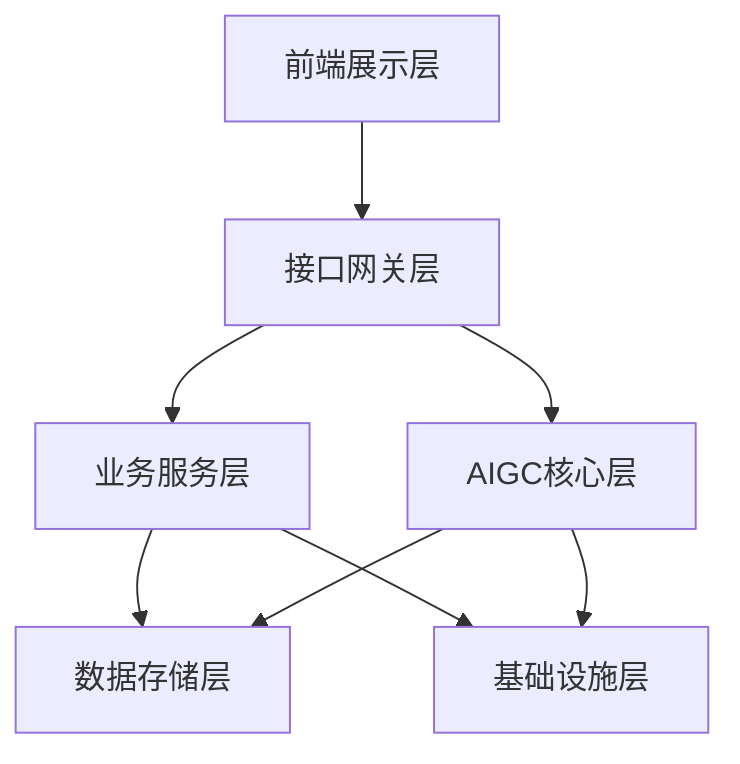
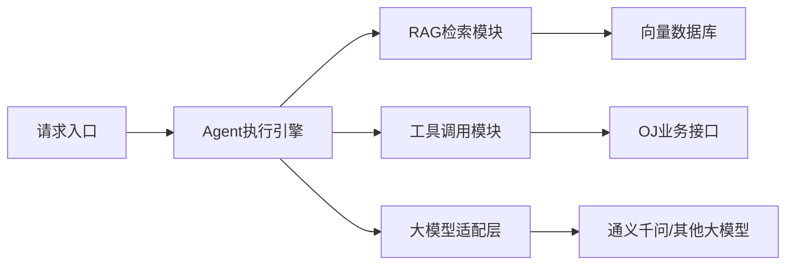
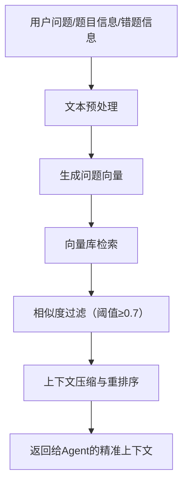
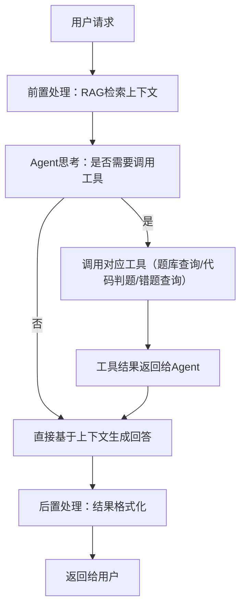
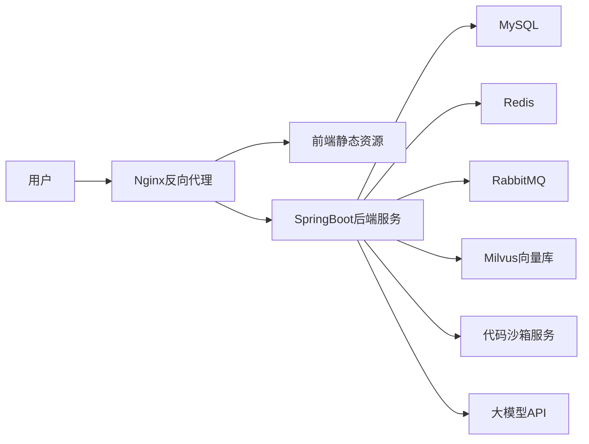

# XI OJ 平台AIGC能力整合与功能拓展设计
文档版本：V1.0
适用范围：IOJ平台现有项目二次开发、AIGC能力落地
更新日期：2026年03月

## 一、方案概述
### 1.1 项目背景
本方案基于现有XI OJ平台进行二次开发与优化，在保留原有核心判题、题库、用户体系的基础上，深度整合AIGC能力，解决用户编程学习中「错题无指导、解题无思路、学习无路径」的核心痛点，同时完善平台的用户管理、互动社区、个性化配置等基础功能，打造「练-评-学-练」闭环的智能化OJ学习平台。

### 1.2 核心目标
1. **落地AIGC核心能力**：基于LangChain4j实现RAG+Agent技术架构，完成AI代码分析、AI智能判题、AI问答助手、AI题目解析、相似题推荐、AI错题本六大核心AI功能；
2. **完善平台基础能力**：新增AI功能全局开关、用户信息管理、登录注册优化、题目评论区等功能，补齐平台产品能力；
3. **前端体验优化**：对齐现有AI分析、AI问答页面的交互逻辑，完成前端页面的统一优化与适配；
4. **可拓展架构设计**：实现业务层与AIGC层解耦，支持后续功能的快速迭代。

### 1.3 适配范围
- 完全兼容现有OJ平台的Java SpringBoot技术栈、MySQL数据库、代码沙箱判题体系；
- 完全适配「AI判题、AI助手自动回复、AI分析题目、AI分析提交代码、AI问答、AI开关、用户信息管理、评论区、AI错题本」的功能需求；
- 支持Java 8及以上版本，兼容LangChain4j全版本核心能力。

## 二、整体架构设计
本方案采用**分层解耦架构**，将AIGC能力作为独立的核心层封装，与现有业务系统完全解耦，既保证现有功能的稳定性，又支持后续能力的快速迭代。

### 2.1 整体架构图


### 2.2 分层职责说明
| 层级 | 核心模块 | 职责说明 |
|------|----------|----------|
| 前端展示层 | AI分析页面、AI问答页面、题目详情页、代码提交页、用户中心、评论区、错题本 | 负责用户交互与页面渲染，对接后端AI接口与业务接口，对齐现有页面的交互逻辑 |
| 接口网关层 | 接口鉴权、流量控制、AI开关拦截、参数校验 | 统一入口管理，拦截非法请求，根据AI全局开关控制AI接口的访问，保障接口安全 |
| 业务服务层 | 题库管理、代码判题、用户管理、评论管理、错题管理、提交记录管理、系统配置管理 | 保留OJ平台原有核心业务能力，新增用户管理、评论区、错题本等扩展功能，为AI层提供业务数据支撑 |
| AIGC核心层 | RAG检索模块、Agent执行模块、大模型适配模块、工具调用模块 | 整个平台的AI能力核心，封装所有AI相关逻辑，与业务层完全解耦，通过工具调用对接业务能力 |
| 数据存储层 | MySQL业务库、Milvus向量库、Redis缓存库 | 分别存储业务数据、AI向量知识库、高频缓存数据（AI问答、相似题检索结果） |
| 基础设施层 | 代码沙箱、大模型API服务、日志监控、消息队列 | 提供底层能力支撑，包括代码运行、大模型调用、系统监控、异步任务处理 |

### 2.3 AIGC核心层内部架构

- **Agent执行引擎**：基于LangChain4j的AgenticServices实现，负责AI的思考、工具调用决策、结果整合，是AIGC层的调度核心；
- **RAG检索模块**：负责题目、题解、知识点、错题分析的向量检索，为AI提供精准的上下文信息，解决大模型幻觉问题；
- **工具调用模块**：封装OJ平台的题库查询、代码判题、用户数据查询、错题查询等能力，供Agent按需调用；
- **大模型适配层**：统一封装大模型调用接口，支持多模型快速切换，兼容国内主流大模型。

## 三、技术栈选型
所有选型均兼容现有项目技术栈，无侵入式改造，同时保证生产级可用性。

### 3.1 基础技术栈
| 技术领域 | 选型 | 版本要求 | 核心用途 |
|----------|------|----------|----------|
| 开发语言 | Java | JDK 8+ | 后端核心开发，完全兼容现有项目 |
| 后端框架 | Spring Boot | 2.7+ / 3.x | 项目核心框架，适配现有业务代码 |
| 前端框架 | Vue / React | 与现有项目一致 | 前端页面优化与新功能开发 |
| 关系型数据库 | MySQL | 5.7+ / 8.0 | 业务数据存储，兼容现有question表等结构 |
| 缓存数据库 | Redis | 6.0+ | 高频AI检索结果、用户会话、接口限流缓存 |
| 消息队列 | RabbitMQ | 3.x+ | 异步处理AI任务、向量库数据同步、代码判题任务 |

### 3.2 AIGC专属技术栈
| 技术领域 | 选型 | 版本要求 | 核心用途 | 选型理由 |
|----------|------|----------|----------|----------|
| AI应用框架 | LangChain4j | 0.32.0+ | Agent、RAG、工具调用的核心实现 | Java生态原生适配，与项目技术栈完全兼容，官方持续维护 |
| 向量数据库 | Milvus | 2.3+ | 题目、题解、算法知识点的向量化存储与检索 | 开源轻量，Java生态适配好，支持单机部署，满足中小规模数据需求 |
| 大模型 | 阿里百炼 qwen-plus | - | 文本生成、代码分析、问答交互核心 | 国内合规可访问，代码理解能力强，支持长上下文，阿里百炼平台按量计费，适配OJ场景 |
| 嵌入模型 | 阿里百炼 text-embedding-v3 | - | 文本向量化生成 | 中文适配性强，默认维度1024可配置，与主模型生态统一 |

### 3.3 项目核心依赖（pom.xml）
```xml
<!-- BOM放在 dependencyManagement 中统一管理版本，避免版本冲突 -->
<dependencyManagement>
    <dependencies>
        <!-- LangChain4j 核心 BOM（AiServices/RAG/Tools 均内置，无需额外引入） -->
        <dependency>
            <groupId>dev.langchain4j</groupId>
            <artifactId>langchain4j-bom</artifactId>
            <version>1.0.0-beta3</version>
            <type>pom</type>
            <scope>import</scope>
        </dependency>
        <!-- LangChain4j Community BOM（DashScope/Milvus 等社区模块） -->
        <dependency>
            <groupId>dev.langchain4j</groupId>
            <artifactId>langchain4j-community-bom</artifactId>
            <version>1.0.0-beta3</version>
            <type>pom</type>
            <scope>import</scope>
        </dependency>
    </dependencies>
</dependencyManagement>

<dependencies>
    <!-- Spring Boot核心依赖 -->
    <dependency>
        <groupId>org.springframework.boot</groupId>
        <artifactId>spring-boot-starter-web</artifactId>
    </dependency>
    <dependency>
        <groupId>org.springframework.boot</groupId>
        <artifactId>spring-boot-starter-data-redis</artifactId>
    </dependency>
    <dependency>
        <groupId>org.springframework.boot</groupId>
        <artifactId>spring-boot-starter-amqp</artifactId>
    </dependency>
    <dependency>
        <groupId>org.springframework.boot</groupId>
        <artifactId>spring-boot-starter-validation</artifactId>
    </dependency>

    <!-- MySQL驱动 -->
    <dependency>
        <groupId>com.mysql</groupId>
        <artifactId>mysql-connector-j</artifactId>
        <scope>runtime</scope>
    </dependency>

    <!-- LangChain4j 核心（版本由 BOM 管理） -->
    <dependency>
        <groupId>dev.langchain4j</groupId>
        <artifactId>langchain4j</artifactId>
    </dependency>
    <!-- 阿里百炼（DashScope）适配层（版本由 Community BOM 管理） -->
    <dependency>
        <groupId>dev.langchain4j</groupId>
        <artifactId>langchain4j-community-dashscope</artifactId>
    </dependency>
    <!-- Milvus 向量库适配层（版本由 BOM 管理） -->
    <dependency>
        <groupId>dev.langchain4j</groupId>
        <artifactId>langchain4j-milvus</artifactId>
    </dependency>

    <!-- 工具类依赖 -->
    <dependency>
        <groupId>org.projectlombok</groupId>
        <artifactId>lombok</artifactId>
        <optional>true</optional>
    </dependency>
    <dependency>
        <groupId>cn.hutool</groupId>
        <artifactId>hutool-all</artifactId>
        <version>5.8.20</version>
    </dependency>
    <dependency>
        <groupId>com.alibaba.fastjson2</groupId>
        <artifactId>fastjson2</artifactId>
        <version>2.0.40</version>
    </dependency>

    <!-- 测试依赖 -->
    <dependency>
        <groupId>org.springframework.boot</groupId>
        <artifactId>spring-boot-starter-test</artifactId>
        <scope>test</scope>
    </dependency>
</dependencies>
```

## 四、核心数据模型设计
### 4.1 兼容现有表结构
完全兼容现有`question`题目表结构，无需修改原有字段，仅通过关联字段实现AI功能与现有数据的联动。

### 4.2 新增业务表结构
#### 4.2.1 AI系统配置表（ai_config）
用于管理AI功能全局开关、大模型配置、限流规则等，实现AI功能的一键启停与动态配置。
```sql
CREATE TABLE IF NOT EXISTS ai_config
(
    id          bigint auto_increment comment 'id' primary key,
    config_key  varchar(128) NOT NULL comment '配置键',
    config_value text comment '配置值',
    description varchar(512) comment '配置描述',
    is_enable   tinyint default 1 not null comment '是否启用',
    createTime  datetime default CURRENT_TIMESTAMP not null comment '创建时间',
    updateTime  datetime default CURRENT_TIMESTAMP not null on update CURRENT_TIMESTAMP comment '更新时间',
    UNIQUE KEY uk_config_key (config_key)
) comment 'AI系统配置表' collate = utf8mb4_unicode_ci;
```
**初始化核心配置**：
| config_key | config_value | description |
|------------|--------------|-------------|
| ai.global.enable | true | AI功能全局开关 |
| ai.model.api_key | xxx | 大模型API密钥（展示时前端脱敏） |
| ai.model.base_url | https://dashscope.aliyuncs.com/compatible-mode/v1 | 百炼OpenAI兼容端点，通常无需修改 |
| ai.model.name | qwen-plus | 聊天模型名称（可选：qwen-turbo / qwen-plus / qwen-max） |
| ai.model.embedding_name | text-embedding-v3 | 嵌入模型名称，修改后需重建向量索引 |
| ai.rag.top_k | 3 | RAG检索返回条数（建议3-5） |
| ai.rag.similarity_threshold | 0.7 | RAG最小相似度阈值（0-1，值越高检索越严格） |

#### 4.2.2 AI对话记录表（ai_chat_record）
用于存储AI问答页面的用户对话历史，支持多轮对话与历史记录查看。
```sql
CREATE TABLE IF NOT EXISTS ai_chat_record
(
    id          bigint auto_increment comment 'id' primary key,
    user_id     bigint NOT NULL comment '用户id',
    question    text NOT NULL comment '用户问题',
    answer      text comment 'AI回答',
    chat_id     varchar(64) NOT NULL comment '会话id，用于区分多轮对话',
    used_tokens int default 0 comment '消耗token数',
    createTime  datetime default CURRENT_TIMESTAMP not null comment '创建时间',
    index idx_user_id (user_id),
    index idx_chat_id (chat_id)
) comment 'AI对话记录表' collate = utf8mb4_unicode_ci;
```

#### 4.2.3 代码分析记录表（ai_code_analysis）
用于存储用户提交代码的AI分析结果，支持历史分析记录回溯。
```sql
CREATE TABLE IF NOT EXISTS ai_code_analysis
(
    id              bigint auto_increment comment 'id' primary key,
    user_id         bigint NOT NULL comment '用户id',
    question_id     bigint NOT NULL comment '题目id',
    code            text NOT NULL comment '用户提交的代码',
    language        varchar(32) NOT NULL comment '代码语言',
    analysis_result text NOT NULL comment 'AI分析结果',
    score           int comment '代码评分',
    judge_result    varchar(32) comment '判题结果（AC/WA/TLE等）',
    createTime      datetime default CURRENT_TIMESTAMP not null comment '创建时间',
    index idx_user_id (user_id),
    index idx_question_id (question_id)
) comment '代码AI分析记录表' collate = utf8mb4_unicode_ci;
```

#### 4.2.4 题目评论表（question_comment）
用于实现题目评论区功能，支持用户交流、题解讨论。
```sql
CREATE TABLE IF NOT EXISTS question_comment
(
    id          bigint auto_increment comment 'id' primary key,
    question_id bigint NOT NULL comment '题目id',
    user_id     bigint NOT NULL comment '评论用户id',
    content     text NOT NULL comment '评论内容',
    parent_id   bigint default 0 comment '父评论id，用于回复',
    like_num    int default 0 not null comment '点赞数',
    is_delete   tinyint default 0 not null comment '是否删除',
    createTime  datetime default CURRENT_TIMESTAMP not null comment '创建时间',
    updateTime  datetime default CURRENT_TIMESTAMP not null on update CURRENT_TIMESTAMP comment '更新时间',
    index idx_question_id (question_id),
    index idx_user_id (user_id)
) comment '题目评论表' collate = utf8mb4_unicode_ci;
```

#### 4.2.5 用户信息拓展表（user_profile）
用于完善用户信息管理功能，兼容现有用户表，无需修改原有用户结构。
```sql
CREATE TABLE IF NOT EXISTS user_profile
(
    id              bigint auto_increment comment 'id' primary key,
    user_id         bigint NOT NULL comment '用户id',
    nickname        varchar(128) comment '用户昵称',
    avatar          varchar(512) comment '头像地址',
    school          varchar(128) comment '学校',
    signature       varchar(512) comment '个性签名',
    solved_num      int default 0 not null comment '已解决题目数',
    submit_num      int default 0 not null comment '总提交数',
    rating          int default 1200 not null comment '用户评分',
    createTime      datetime default CURRENT_TIMESTAMP not null comment '创建时间',
    updateTime      datetime default CURRENT_TIMESTAMP not null on update CURRENT_TIMESTAMP comment '更新时间',
    UNIQUE KEY uk_user_id (user_id)
) comment '用户信息拓展表' collate = utf8mb4_unicode_ci;
```

#### 4.2.6 AI错题本表（ai_wrong_question）
用于存储用户错题信息，支持错题自动收集、AI分析、复习计划生成。
```sql
CREATE TABLE IF NOT EXISTS ai_wrong_question
(
    id                  bigint auto_increment comment 'id' primary key,
    user_id             bigint NOT NULL comment '用户id',
    question_id         bigint NOT NULL comment '题目id',
    wrong_code          text NOT NULL comment '错误代码',
    wrong_judge_result  varchar(32) NOT NULL comment '错误判题结果',
    wrong_analysis      text comment 'AI错误分析',
    review_plan         text comment 'AI生成的复习计划',
    similar_questions   text comment 'AI推荐的同类题目（JSON数组）',
    is_reviewed         tinyint default 0 not null comment '是否已复习',
    review_count        int default 0 not null comment '复习次数',
    next_review_time    datetime comment '下次复习时间',
    createTime          datetime default CURRENT_TIMESTAMP not null comment '创建时间',
    updateTime          datetime default CURRENT_TIMESTAMP not null on update CURRENT_TIMESTAMP comment '更新时间',
    index idx_user_id (user_id),
    index idx_question_id (question_id),
    index idx_next_review_time (next_review_time)
) comment 'AI错题本表' collate = utf8mb4_unicode_ci;
```

### 4.3 向量库存储规范
向量库采用Milvus，集合名`oj_knowledge`，严格遵循以下存储规范，保证RAG检索的精准性。

#### 4.3.1 向量库核心字段
| 字段名 | 类型 | 说明 |
|--------|------|------|
| id | varchar | 主键，唯一标识 |
| vector | float向量 | 文本生成的向量，维度1024（匹配阿里百炼 text-embedding-v3，可配置为512/768/1024） |
| text | varchar | 原始文本内容 |
| question_id | bigint | 关联题目id（可选） |
| tag | varchar | 标签/考点（如哈希表、动态规划） |
| difficulty | varchar | 难度（简单/中等/困难） |
| content_type | varchar | 内容类型（题目/题解/知识点/代码模板/错题分析） |

#### 4.3.2 存储内容范围
仅存储RAG检索所需的核心内容，避免无效数据引入噪声：
1. **题目核心信息**：title标题、content题干、tags标签、answer标准答案；
2. **题解与知识点**：分步骤解题思路、算法考点讲解、代码模板、常见错误分析；
3. **相似题关联数据**：题目标签、考点、难度匹配信息；
4. **错题分析数据**：典型错误代码、错误原因分析、修正思路。

## 五、核心功能模块详细设计
### 5.1 AIGC核心能力底座（RAG+Agent）
本模块是所有AI功能的核心，基于LangChain4j实现，与业务层完全解耦。

#### 5.1.1 RAG检索模块
**核心职责**：为AI提供精准的上下文信息，解决大模型幻觉问题，保证回答的准确性。
**核心流程**：


**核心代码实现**：
```java
/**
 * RAG检索核心类，负责向量库检索与上下文处理
 */
@Component
public class OJKnowledgeRetriever {

    @Autowired
    private MilvusEmbeddingStore embeddingStore;
    @Autowired
    private QwenEmbeddingModel embeddingModel;

    /**
     * 核心检索方法
     * @param query 用户问题/题目关键词
     * @param topK 返回条数
     * @param minScore 最小相似度阈值
     * @return 检索到的上下文内容
     */
    public String retrieve(String query, int topK, double minScore) {
        // 1. 生成问题向量
        Embedding queryEmbedding = embeddingModel.embed(query).content();
        
        // 2. 向量库检索
        List<EmbeddingMatch<TextSegment>> matches = embeddingStore.findRelevant(queryEmbedding, topK);
        
        // 3. 相似度过滤与内容拼接
        String context = matches.stream()
                .filter(match -> match.score() >= minScore)
                .map(EmbeddingMatch::embeddedObject)
                .map(TextSegment::text)
                .collect(Collectors.joining("\n\n"));
        
        // 4. 兜底返回
        return context.isBlank() ? "无相关知识点" : context;
    }

    /**
     * 相似题检索方法
     * @param questionId 题目id
     * @param questionContent 题目内容
     * @return 相似题目id列表
     */
    public List<Long> retrieveSimilarQuestion(Long questionId, String questionContent) {
        Embedding queryEmbedding = embeddingModel.embed(questionContent).content();
        return embeddingStore.findRelevant(queryEmbedding, 4)
                .stream()
                .filter(match -> match.score() >= 0.75)
                .map(EmbeddingMatch::embeddedObject)
                .map(segment -> segment.metadata().getLong("question_id"))
                .filter(id -> !id.equals(questionId))
                .collect(Collectors.toList());
    }
}
```

#### 5.1.2 Agent执行模块
**核心职责**：负责AI的思考决策、工具调用、结果整合，实现代码分析、问答、判题、错题分析等核心AI功能。
**核心流程**：


**核心代码实现**：
```java
/**
 * Agent能力接口定义
 * 注意：LangChain4j 中仅需 @SystemMessage / @UserMessage，无需 @Agent 注解
 */
public interface OJAssistantAgent {

    @SystemMessage("""
            你是XI OJ平台的智能编程助教，严格遵循以下规则：
            1. 仅回答编程、算法、OJ题目相关问题，无关问题直接拒绝；
            2. 分析代码或错题时，先指出错误、再给出改进思路，不直接提供完整可运行的标准答案；
            3. 解题讲解需分步骤，适配新手学习节奏，结合RAG提供的知识点进行说明；
            4. 如需查询题目信息、评测代码、查询错题，调用对应工具完成；
            5. 回答语言为中文，格式清晰，重点突出。
            """)
    String chat(@UserMessage String userQuery);
}

/**
 * Agent实例构建与管理
 * 使用 AiServices.builder()（LangChain4j 正确API），RAG通过 RetrievalAugmentor 注入
 */
@Configuration
public class OJAgentConfig {

    @Autowired
    private OJTools ojTools;
    @Autowired
    private MilvusEmbeddingStore embeddingStore;
    @Autowired
    private QwenEmbeddingModel embeddingModel;
    @Autowired
    private AiConfigService configService;

    @Bean
    public OJAssistantAgent ojAssistantAgent() {
        // 初始化阿里百炼大模型（LangChain4j 1.x 接口名为 ChatModel）
        ChatModel chatModel = QwenChatModel.builder()
                .apiKey(configService.getConfigValue("ai.model.api_key"))
                .modelName(configService.getConfigValue("ai.model.name"))  // 如 qwen-plus
                .temperature(0.2)
                .maxTokens(2048)
                .build();

        // 构建 RAG 内容检索器（topK 和 minScore 均从 ai_config 动态读取）
        int topK = Integer.parseInt(configService.getConfigValue("ai.rag.top_k"));
        double minScore = Double.parseDouble(configService.getConfigValue("ai.rag.similarity_threshold"));
        ContentRetriever contentRetriever = EmbeddingStoreContentRetriever.builder()
                .embeddingStore(embeddingStore)
                .embeddingModel(embeddingModel)
                .maxResults(topK)
                .minScore(minScore)
                .build();

        // 使用 AiServices.builder() 构建 Agent，通过 RetrievalAugmentor 集成 RAG
        return AiServices.builder(OJAssistantAgent.class)
                .chatLanguageModel(chatModel)
                .tools(ojTools)
                .contentRetriever(contentRetriever)
                .chatMemoryProvider(memoryId -> MessageWindowChatMemory.withMaxMessages(20))
                .build();
    }
}

/**
 * Agent可调用的OJ工具类
 */
@Component
public class OJTools {

    @Autowired
    private QuestionService questionService;
    @Autowired
    private JudgeService judgeService;
    @Autowired
    private WrongQuestionService wrongQuestionService;

    @Tool(
            name = "query_question_info",
            description = "查询OJ题目的详细信息，入参为题目ID或题目关键词，返回题干、考点、难度、标准答案"
    )
    public String queryQuestionInfo(String keyword) {
        QuestionVO question = questionService.getByKeyword(keyword);
        if (question == null) {
            return "未找到对应题目，请确认题目ID/关键词是否正确";
        }
        return String.format("""
                题目ID：%d
                标题：%s
                题干：%s
                考点：%s
                难度：%s
                标准答案：%s
                """,
                question.getId(),
                question.getTitle(),
                question.getContent(),
                question.getTags(),
                question.getDifficulty(),
                question.getAnswer()
        );
    }

    @Tool(
            name = "judge_user_code",
            description = "评测用户提交的代码，入参格式：题目ID|代码内容|代码语言，返回判题结果、错误信息"
    )
    public String judgeUserCode(String param) {
        String[] parts = param.split("\\|", 3);
        if (parts.length != 3) {
            return "参数格式错误，正确格式：题目ID|代码内容|代码语言";
        }
        JudgeResultDTO result = judgeService.submitCode(Long.parseLong(parts[0]), parts[1], parts[2]);
        return String.format("""
                判题结果：%s
                执行用时：%sms
                内存占用：%sMB
                错误信息：%s
                """,
                result.getStatus(),
                result.getTimeUsed(),
                result.getMemoryUsed(),
                result.getErrorMsg()
        );
    }

    @Tool(
            name = "query_user_wrong_question",
            description = "查询用户的错题信息，入参为用户ID和题目ID，返回错误代码、判题结果、历史分析"
    )
    public String queryUserWrongQuestion(String param) {
        String[] parts = param.split("\\|", 2);
        if (parts.length != 2) {
            return "参数格式错误，正确格式：用户ID|题目ID";
        }
        WrongQuestionVO wrongQuestion = wrongQuestionService.getByUserAndQuestion(
                Long.parseLong(parts[0]),
                Long.parseLong(parts[1])
        );
        if (wrongQuestion == null) {
            return "未找到对应错题记录";
        }
        return String.format("""
                错误代码：%s
                错误判题结果：%s
                历史错误分析：%s
                复习次数：%d
                """,
                wrongQuestion.getWrongCode(),
                wrongQuestion.getWrongJudgeResult(),
                wrongQuestion.getWrongAnalysis(),
                wrongQuestion.getReviewCount()
        );
    }
}
```

### 5.2 AI代码智能分析与判题模块
**功能描述**：对用户提交的代码进行多维度分析，包括代码评分、错误分析、改进建议、判题结果解读，对应截图中的「代码查看与智能分析」页面。

**核心流程**：
1. 用户提交代码后，先通过OJ原有代码沙箱完成判题，获取判题结果；
2. 将「题目信息、用户代码、判题结果、RAG检索的题解知识点」传入Agent；
3. Agent完成代码评分、错误分析、改进建议生成；
4. 分析结果存入`ai_code_analysis`表，返回给前端展示。

**核心Prompt模板**：
```
【当前题目信息】
标题：{{title}}
题干：{{content}}
考点：{{tags}}
标准答案：{{answer}}

【用户提交代码】
语言：{{language}}
代码内容：
{{userCode}}

【判题结果】
状态：{{judgeStatus}}
错误信息：{{errorMsg}}

请你完成以下分析：
1. 代码风格与规范评分（10分制），列出优点与改进建议；
2. 代码质量与可读性评分（10分制），分析逻辑优缺点；
3. 针对判题结果，详细说明代码错误的原因，给出修改思路，不直接提供完整正确代码；
4. 结合题目考点，给出优化方向与学习建议。
回答格式清晰，分点说明，语言通俗易懂，适配编程新手。
```

### 5.3 AI问答助手模块
**功能描述**：实现自由对话式AI问答，支持用户提问算法问题、代码调试、题目讲解，对应截图中的「AI问答」页面。

**核心流程**：
1. 用户输入问题，系统先校验AI功能开关与用户调用次数限制；
2. 通过RAG检索相关知识点与题目信息，拼接上下文；
3. 传入Agent完成回答生成，支持多轮对话（通过chat_id关联会话）；
4. 对话记录存入`ai_chat_record`表，返回给前端展示。

**核心功能特性**：
- 多轮对话历史记录查看与清空；
- 用户每日调用次数限流；
- 敏感内容过滤与合规校验；
- 高频问题缓存优化，提升响应速度。

### 5.4 AI题目解析与相似题推荐模块
**功能描述**：为题目提供AI自动解析，根据当前题目考点、难度推荐相似题目，帮助用户针对性练习。

**核心流程**：
1. 用户进入题目详情页，通过RAG检索该题目的题解、知识点、常见错误；
2. Agent生成结构化的题目解析，包括考点分析、解题思路、易错点提醒；
3. 通过向量库检索与当前题目相似度最高的3-4道题，返回题目ID与标题；
4. 前端拼接题目详情页链接，实现相似题一键跳转。

### 5.5 AI错题本模块
**功能描述**：自动收集用户错题，AI分析错误原因，生成针对性的复习计划与同类题目推荐，帮助用户查漏补缺，巩固知识点。

**核心流程**：
1. **错题自动收集**：用户提交代码判题失败（WA/TLE/RE等）后，系统自动将「题目ID、用户ID、错误代码、判题结果」存入`ai_wrong_question`表；
2. **AI错误分析**：将「题目信息、错误代码、判题结果、RAG检索的典型错误分析」传入Agent，Agent生成详细的错误原因分析、修正思路；
3. **复习计划生成**：Agent根据用户的错误类型、题目难度、考点，结合艾宾浩斯遗忘曲线，生成个性化的复习计划，包括下次复习时间、复习重点；
4. **同类题目推荐**：通过RAG检索与当前错题考点、难度、错误类型相似的3-4道题，存入`similar_questions`字段；
5. **复习提醒与记录**：用户完成复习后，更新`is_reviewed`、`review_count`、`next_review_time`字段，系统根据`next_review_time`推送复习提醒。

**核心Prompt模板**：
```
【当前错题信息】
题目ID：{{questionId}}
标题：{{title}}
题干：{{content}}
考点：{{tags}}
难度：{{difficulty}}

【用户错误代码】
语言：{{language}}
代码内容：
{{wrongCode}}

【错误判题结果】
状态：{{judgeStatus}}
错误信息：{{errorMsg}}

【RAG检索的典型错误分析】
{{typicalWrongAnalysis}}

请你完成以下任务：
1. 详细分析用户代码的错误原因，指出具体的逻辑漏洞、语法错误或边界问题；
2. 给出清晰的修正思路，引导用户自己修改代码，不直接提供完整正确代码；
3. 结合艾宾浩斯遗忘曲线，生成一个简单的复习计划，包括：
   - 本次复习重点
   - 下次复习时间（建议：首次复习在1天后，第二次在3天后，第三次在7天后）
4. 结合题目考点，推荐3道同类巩固练习题，只需要题目ID和标题。
回答格式清晰，分点说明，语言通俗易懂，鼓励用户自主思考。
```

**核心功能特性**：
- 错题自动收集，无需用户手动添加；
- AI多维度错误分析，定位问题根源；
- 个性化复习计划，科学巩固知识点；
- 同类题目推荐，针对性强化练习；
- 复习进度追踪，提醒用户及时复习；
- 错题本支持按考点、难度、错误类型筛选。

### 5.6 系统配置与AI开关模块
**功能描述**：实现AI功能的全局管控、动态配置，无需重启服务即可修改AI相关参数。

**核心功能**：
- AI功能全局一键启停，关闭后所有AI接口不可访问，前端隐藏AI相关入口；
- 大模型API密钥、模型名称、参数动态配置；
- RAG检索参数、用户限流规则动态调整；
- 配置修改日志记录，支持配置回滚。

### 5.7 用户与权限管理模块
**功能描述**：完善用户信息管理、登录注册、权限控制体系。

**核心功能**：
- 用户注册、登录、密码找回功能优化；
- 个人信息管理（昵称、头像、学校、个性签名）；
- 个人做题数据统计（已解决题目数、提交数、通过率、评分）；
- 管理员权限管控，支持题目管理、用户管理、AI配置管理。

### 5.8 题目评论与互动模块
**功能描述**：为每道题目新增评论区，支持用户发布评论、回复、点赞，实现用户间的学习交流。

**核心功能**：
- 题目评论发布、删除、回复；
- 评论点赞、取消点赞；
- 评论举报与管理员审核；
- 热门评论优先展示。

## 六、开发与落地实施计划
采用分阶段落地策略，先完成核心AIGC能力，再完善基础功能，最后优化体验，保证每阶段都有可交付的成果。

| 阶段 | 周期 | 核心目标 | 交付内容 |
|------|------|----------|----------|
| 第一阶段：MVP核心落地 | 2周 | 完成AIGC核心底座搭建，实现核心AI功能 | 1. RAG+Agent核心代码开发完成<br>2. 向量库搭建与题目数据导入<br>3. AI代码分析、AI问答、AI题目解析核心功能上线<br>4. AI全局开关配置功能完成 |
| 第二阶段：功能完善 | 2周 | 补齐所有规划功能，完成前端页面适配 | 1. AI错题本功能开发完成<br>2. 用户信息管理、评论区功能开发完成<br>3. 前端AI分析、AI问答、错题本页面优化适配<br>4. 限流、缓存、监控等配套功能完成 |
| 第三阶段：测试与优化 | 1周 | 完成全功能测试，优化性能与体验 | 1. 全功能联调与压力测试<br>2. AI回答准确性优化、Prompt调优<br>3. 接口性能优化，用户体验细节打磨<br>4. 生产环境部署方案输出 |

## 七、部署与运维方案
### 7.1 环境配置要求
| 环境 | 最低配置 | 推荐配置 |
|------|----------|----------|
| 应用服务器 | 2核4G | 4核8G |
| MySQL数据库 | 2核2G | 2核4G |
| Redis缓存 | 1核1G | 1核2G |
| Milvus向量库 | 2核4G | 4核8G |
| 消息队列 | 1核1G | 1核2G |

### 7.2 部署架构
采用容器化部署方案，所有服务通过Docker统一编排，支持单机部署与后续集群扩容。


### 7.3 监控与告警
1. **接口监控**：监控AI接口的调用次数、响应时间、成功率、报错率；
2. **资源监控**：监控服务器、数据库、向量库的CPU、内存、磁盘使用率；
3. **大模型监控**：监控大模型API的token消耗、调用限流、异常报错；
4. **告警规则**：针对接口报错率超过5%、服务器CPU使用率超过80%、大模型API异常等场景，通过邮件/短信推送告警。

### 7.4 数据备份
- **MySQL业务库**：每日全量备份，保留30天备份记录；
- **Milvus向量库**：每周全量备份，每日增量备份；
- **Redis缓存**：开启持久化，避免缓存数据丢失。

## 八、风险控制与优化方案
### 8.1 核心风险与应对方案
| 风险场景 | 风险描述 | 应对方案 |
|----------|----------|----------|
| 大模型API异常 | API调用超时、限流、服务不可用 | 1. 实现多模型降级切换，主模型异常时自动切换备用模型；2. 接口超时重试机制；3. 高频问题缓存，减少API调用 |
| AI回答幻觉 | AI生成错误的解题思路、代码分析、错题分析 | 1. 强化RAG检索，所有回答必须基于检索到的知识点；2. Prompt中增加约束，禁止编造题目、考点；3. 增加回答结果校验，与题目信息、判题结果交叉验证 |
| 并发量过高 | 大量用户同时调用AI接口，导致服务压力过大 | 1. 用户级别的调用次数限流；2. AI任务异步处理，避免阻塞主线程；3. 接口熔断降级，服务压力过大时关闭非核心AI功能 |
| 向量库检索性能下降 | 随着题目数据增多，检索耗时增加 | 1. Milvus开启索引优化，提升检索速度；2. 按考点、难度对向量库分库分表；3. 高频检索结果缓存到Redis |

### 8.2 性能优化方案
1. **缓存优化**：对高频题目解析、相似题检索结果、AI问答内容、错题分析进行Redis缓存，缓存有效期1小时，减少重复计算与API调用；
2. **异步优化**：代码分析、错题分析、向量库数据同步等耗时操作，通过消息队列异步处理，不阻塞用户主流程；
3. **RAG优化**：采用「关键词检索+向量检索」的混合检索模式，提升检索精准度与速度；对知识点精细化分割，减少检索噪声；
4. **大模型优化**：调整大模型参数，temperature设置为0.1-0.3，减少随机性；maxTokens按需设置，避免无效token消耗，提升响应速度。

## 九、附录
### 9.1 核心接口规范
| 接口地址 | 请求方式 | 接口描述 |
|----------|----------|----------|
| /api/ai/chat | POST | AI问答对话接口 |
| /api/ai/chat/history | GET | 获取用户对话历史 |
| /api/ai/chat/clear | POST | 清空用户对话历史 |
| /api/ai/code/analysis | POST | 代码AI分析接口 |
| /api/ai/code/history | GET | 获取用户代码分析历史 |
| /api/ai/question/parse | GET | 获取题目AI解析 |
| /api/ai/question/similar | GET | 获取相似题目推荐 |
| /api/ai/wrong-question/list | GET | 获取用户错题列表 |
| /api/ai/wrong-question/analysis | GET | 获取错题AI分析 |
| /api/ai/wrong-question/review | POST | 标记错题已复习 |
| /api/admin/ai/config | POST | 修改AI系统配置 |
| /api/admin/ai/config | GET | 获取AI系统配置 |