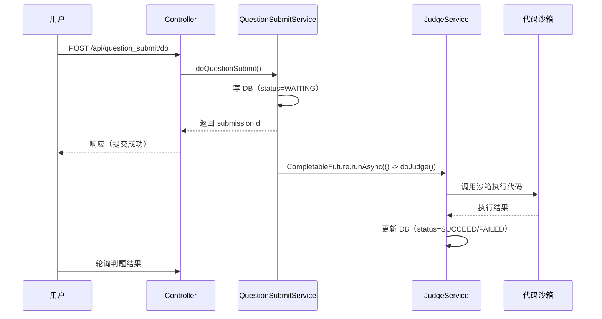
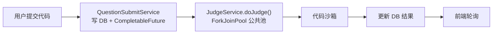
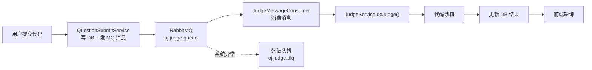
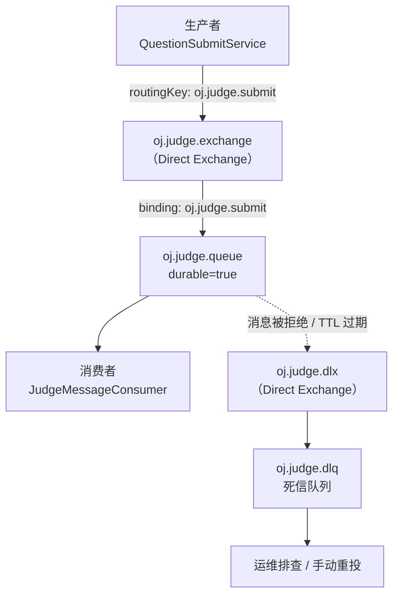
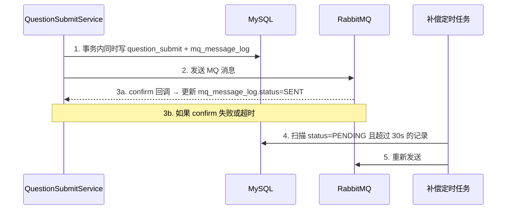
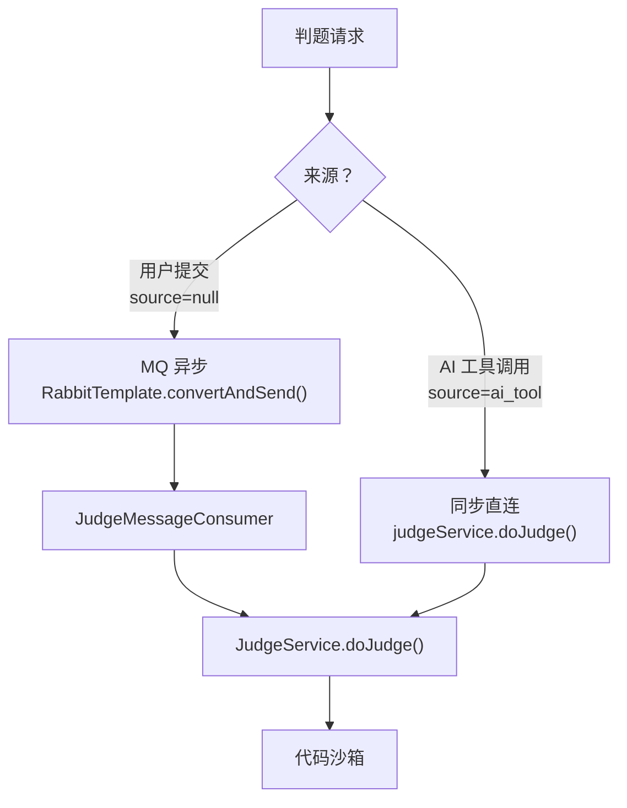
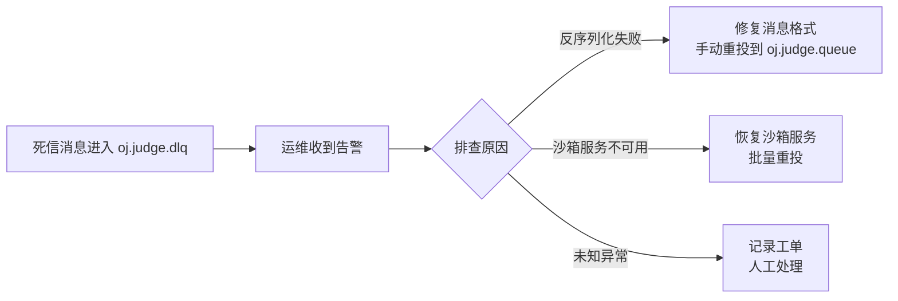

# XI OJ RabbitMQ 集成实施文档

更新时间：2026-04-29
适用对象：熟悉本项目单体架构的开发者，准备将判题链路从 `CompletableFuture` 异步迁移到 RabbitMQ 消息驱动模型
前置依赖：已阅读 `backend_dev.md` 和 `aigc_engineering_implementation_guide.md`

---

## 一、文档目标与适用范围

### 1.1 文档定位

本文档是 XI OJ 平台从**单体异步**演进到 **RabbitMQ 消息驱动**的完整实施指南。覆盖以下内容：

1. 当前异步架构的现状与瓶颈分析。
2. RabbitMQ 的引入范围、边界划定与架构对比。
3. 基础设施部署、Exchange/Queue 拓扑设计、消息协议定义。
4. 生产者改造、消费者实现的完整代码与设计决策。
5. AI 判题同步路径的保护策略。
6. 监控运维、测试方案、回滚机制与实施检查清单。

### 1.2 适用阶段

本文档适用于**微服务拆分阶段**。当前单体阶段的异步方案（`@Async` + `CompletableFuture`）已能满足需求，RabbitMQ 在以下条件满足时引入：

- 判题服务独立部署为微服务，需要跨进程异步通信。
- 提交量增长到需要削峰填谷的程度。
- 需要消息持久化保障，避免服务重启丢失判题任务。

### 1.3 不在本文档范围内

- AI 问答、代码分析等 AIGC 链路的 MQ 改造（这些链路通过 `@Async` 线程池已足够）。
- WebSocket 实时推送（当前轮询方案在判题场景下延迟可接受）。
- Kafka / RocketMQ 等其他消息中间件的对比选型（项目已确定使用 RabbitMQ）。

---

## 二、当前异步架构分析

### 2.1 现有异步模式总览

当前项目存在三种异步执行模式：

| 模式 | 使用位置 | 线程池 | 持久化 | 重试 | 监控 |
|------|----------|--------|--------|------|------|
| `CompletableFuture.runAsync()` | `QuestionSubmitServiceImpl.doQuestionSubmit()` | JVM ForkJoinPool（公共池） | 无 | 无 | 无 |
| `@Async` | `AiChatAsyncService`、`AgentTraceService`、`KnowledgeImportAsyncService` | Spring 托管池（`ai-async-`，core=5, max=20, queue=200） | 无 | 无 | 线程池指标可观测 |
| `@Scheduled` | `QuestionVectorSyncJob`（每日 2:00） | Spring 调度池（`ai-schedule-`，size=3） | N/A | N/A | N/A |

### 2.2 判题异步链路现状

当前用户提交代码的判题流程：



关键代码（`QuestionSubmitServiceImpl.java:93`）：

```java
CompletableFuture.runAsync(() -> judgeService.doJudge(questionSubmitId));
```

### 2.3 现有方案的问题

| 问题 | 说明 | 影响 |
|------|------|------|
| **无消息持久化** | `CompletableFuture` 在 JVM 内存中执行，服务重启后未完成的判题任务直接丢失 | 用户提交的代码"消失"，状态永远停在 `WAITING` |
| **无削峰能力** | ForkJoinPool 公共池无队列深度限制，高并发提交直接打满线程 | 沙箱服务被瞬时流量压垮，响应超时 |
| **无重试机制** | 沙箱调用超时或网络抖动导致判题失败，没有自动重试 | 需要用户手动重新提交 |
| **无法跨进程** | `CompletableFuture` 只能在同一 JVM 内执行 | 判题服务独立部署后无法使用 |
| **无监控指标** | ForkJoinPool 公共池不暴露业务级监控 | 无法感知判题积压、失败率等关键指标 |

### 2.4 AI 判题的特殊性

AI 工具调用判题（`AiJudgeServiceImpl.submitCode()`）是**同步阻塞**的，不走异步路径：

```java
// AiJudgeServiceImpl.java:66 — AI 工具调用必须拿到结果，不走异步
judgeService.doJudge(questionSubmitId);
```

原因：Agent ReAct 循环需要在同一轮对话中拿到判题结果才能继续推理。走 MQ 异步会导致 Agent 无法获取结果，整个推理链路断裂。

> **设计决策**：普通用户提交走 MQ 异步解耦，AI 工具调用走同步直连。两条链路按业务需求选择不同的通信方式，互不干扰。

---

## 三、RabbitMQ 引入范围与边界

### 3.1 引入范围

**只在一个场景引入 MQ：用户提交判题。**

| 场景 | 是否引入 MQ | 理由 |
|------|-------------|------|
| 用户提交代码判题 | 是 | 耗时 CPU 密集操作，需要削峰、持久化、跨进程通信 |
| AI 工具调用判题 | 否 | Agent 推理循环需要同步结果，走 MQ 异步会断裂推理链 |
| AI 聊天记录持久化 | 否 | 轻量级 INSERT，`@Async` 线程池足够，引入 MQ 过度设计 |
| Agent Trace 持久化 | 否 | 同上 |
| 知识库文档导入 | 否 | 低频操作，已有 `Semaphore(2)` 并发控制，无需 MQ |
| 向量库定时同步 | 否 | 定时任务，非事件驱动，不适合 MQ |

### 3.2 架构对比

**改造前（单体异步）：**



**改造后（MQ 驱动）：**



### 3.3 面试话术

> "判题是耗时的 CPU 密集操作，用 MQ 做异步解耦有三个好处：一是**削峰**，高并发提交时判题服务不会被打垮；二是**持久化**，判题服务重启后消息不丢；三是**重试**，沙箱执行超时可以自动重新投递。其他模块之间是 Feign 同步调用或 `@Async` 线程池，因为调用链路短、对实时性要求高，没必要引入 MQ 增加复杂度。"

> "AI 工具调用判题保持同步直连，因为 Agent 推理循环需要立即拿到判题结果才能进行下一步决策。两条链路按业务需求选择不同的通信方式——这不是技术偏好，是业务约束决定的。"

---

## 四、基础设施准备

### 4.1 Docker 部署 RabbitMQ

在现有 `docker-compose.yml` 中新增 RabbitMQ 服务：

```yaml
rabbitmq:
  image: rabbitmq:3.12-management
  container_name: oj_rabbitmq
  restart: unless-stopped
  volumes:
    - ./rabbitmq/data:/var/lib/rabbitmq
  environment:
    RABBITMQ_DEFAULT_USER: admin
    RABBITMQ_DEFAULT_PASS: ${RABBITMQ_PASSWORD}
  ports:
    - "5672:5672"     # AMQP 协议端口
    - "15672:15672"   # Management 管理面板
  healthcheck:
    test: ["CMD", "rabbitmq-diagnostics", "check_port_connectivity"]
    interval: 30s
    timeout: 10s
    retries: 3
```

部署后访问 `http://<host>:15672` 验证 Management 面板可用。

### 4.2 Maven 依赖

在 `pom.xml` 中取消注释（或新增）AMQP Starter：

```xml
<!-- RabbitMQ -->
<dependency>
    <groupId>org.springframework.boot</groupId>
    <artifactId>spring-boot-starter-amqp</artifactId>
</dependency>
```

该 Starter 自动引入 `spring-rabbit`、`amqp-client`，无需额外指定版本（由 Spring Boot BOM 管理）。

### 4.3 application.yml 配置

#### 开发环境（application.yml）

```yaml
spring:
  rabbitmq:
    host: 192.168.26.128
    port: 5672
    username: admin
    password: ${RABBITMQ_PASSWORD}
    virtual-host: /
    # 生产者确认模式：correlated 支持异步回调确认
    publisher-confirm-type: correlated
    publisher-returns: true
    listener:
      simple:
        # 手动确认模式
        acknowledge-mode: manual
        # 每个消费者预取 1 条，避免消息堆积在单个消费者
        prefetch: 1
        # 并发消费者数量
        concurrency: 2
        max-concurrency: 5
        # 消费者启动时自动声明队列
        missing-queues-fatal: false
```

#### 生产环境（application-prod.yml）

```yaml
spring:
  rabbitmq:
    host: ${RABBITMQ_HOST}
    port: ${RABBITMQ_PORT:5672}
    username: ${RABBITMQ_USERNAME}
    password: ${RABBITMQ_PASSWORD}
    virtual-host: /
    publisher-confirm-type: correlated
    publisher-returns: true
    connection-timeout: 5000
    listener:
      simple:
        acknowledge-mode: manual
        prefetch: 3
        concurrency: 3
        max-concurrency: 10
        retry:
          enabled: false
```

### 4.4 Spring Boot AMQP 自动配置

引入 `spring-boot-starter-amqp` 后，Spring Boot 自动完成：

1. 创建 `ConnectionFactory`（基于 yml 配置）。
2. 注册 `RabbitTemplate`（消息发送模板）。
3. 注册 `RabbitAdmin`（自动声明 Exchange/Queue/Binding）。
4. 启用 `@RabbitListener` 注解扫描。

无需手动创建 `ConnectionFactory` Bean，除非有多 vhost 或多集群需求。

---

## 五、Exchange / Queue / Binding 拓扑设计

### 5.1 命名规范

| 类型 | 命名格式 | 示例 |
|------|----------|------|
| Exchange | `oj.{业务域}.exchange` | `oj.judge.exchange` |
| Queue | `oj.{业务域}.queue` | `oj.judge.queue` |
| Routing Key | `oj.{业务域}.{动作}` | `oj.judge.submit` |
| 死信 Exchange | `oj.{业务域}.dlx` | `oj.judge.dlx` |
| 死信 Queue | `oj.{业务域}.dlq` | `oj.judge.dlq` |

### 5.2 拓扑结构



### 5.3 设计决策

| 决策点 | 选择 | 理由 |
|--------|------|------|
| Exchange 类型 | Direct | 判题只有一种消息类型，不需要 Topic 的通配符路由 |
| 队列持久化 | durable=true | 服务重启后队列和消息不丢失 |
| 消息持久化 | deliveryMode=2 | 配合队列持久化，保证消息写入磁盘 |
| 死信队列 | 独立 DLX + DLQ | 系统级异常（反序列化失败等）的消息转入死信，不阻塞正常消费 |
| 消息 TTL | 不设置 | 判题任务没有过期概念，积压的消息仍需处理 |

### 5.4 RabbitMQ 配置类

```java
package com.XI.xi_oj.config;

import org.springframework.amqp.core.*;
import org.springframework.amqp.support.converter.Jackson2JsonMessageConverter;
import org.springframework.amqp.support.converter.MessageConverter;
import org.springframework.context.annotation.Bean;
import org.springframework.context.annotation.Configuration;

@Configuration
public class RabbitMQConfig {

    public static final String JUDGE_EXCHANGE = "oj.judge.exchange";
    public static final String JUDGE_QUEUE = "oj.judge.queue";
    public static final String JUDGE_ROUTING_KEY = "oj.judge.submit";

    public static final String JUDGE_DLX = "oj.judge.dlx";
    public static final String JUDGE_DLQ = "oj.judge.dlq";
    public static final String JUDGE_DLQ_ROUTING_KEY = "oj.judge.dead";

    // ---- 死信交换机与队列 ----

    @Bean
    public DirectExchange judgeDlx() {
        return new DirectExchange(JUDGE_DLX, true, false);
    }

    @Bean
    public Queue judgeDlq() {
        return QueueBuilder.durable(JUDGE_DLQ).build();
    }

    @Bean
    public Binding judgeDlqBinding() {
        return BindingBuilder.bind(judgeDlq()).to(judgeDlx()).with(JUDGE_DLQ_ROUTING_KEY);
    }

    // ---- 业务交换机与队列 ----

    @Bean
    public DirectExchange judgeExchange() {
        return new DirectExchange(JUDGE_EXCHANGE, true, false);
    }

    @Bean
    public Queue judgeQueue() {
        return QueueBuilder.durable(JUDGE_QUEUE)
                .withArgument("x-dead-letter-exchange", JUDGE_DLX)
                .withArgument("x-dead-letter-routing-key", JUDGE_DLQ_ROUTING_KEY)
                .build();
    }

    @Bean
    public Binding judgeBinding() {
        return BindingBuilder.bind(judgeQueue()).to(judgeExchange()).with(JUDGE_ROUTING_KEY);
    }

    // ---- 消息序列化 ----

    @Bean
    public MessageConverter jsonMessageConverter() {
        return new Jackson2JsonMessageConverter();
    }
}
```

---

## 六、消息协议设计

### 6.1 消息体 DTO

```java
package com.XI.xi_oj.model.dto.mq;

import lombok.AllArgsConstructor;
import lombok.Builder;
import lombok.Data;
import lombok.NoArgsConstructor;

import java.io.Serializable;

@Data
@Builder
@NoArgsConstructor
@AllArgsConstructor
public class JudgeMessage implements Serializable {

    private Long questionSubmitId;

    private Long questionId;

    private Long userId;

    /**
     * 提交来源：null 表示普通用户提交，"ai_tool" 表示 AI 工具调用。
     * 消费者端做防御性校验：如果 source=ai_tool 则直接 ack 不处理。
     */
    private String source;
}
```

### 6.2 序列化方案

使用 `Jackson2JsonMessageConverter`（已在 `RabbitMQConfig` 中注册），消息在 RabbitMQ 中以 JSON 格式存储：

```json
{
  "questionSubmitId": 123456,
  "questionId": 5,
  "userId": 789,
  "source": null
}
```

优势：
- 可读性强，Management 面板可直接查看消息内容。
- 跨语言兼容，未来判题服务如果用其他语言重写也能消费。
- 减少消费端跨服务查询（消息体自包含关键信息）。

### 6.3 幂等性保障

判题操作天然具备幂等性保障——通过数据库状态机实现：

```
WAITING → RUNNING → SUCCEED / FAILED
```

`JudgeServiceImpl.doJudge()` 第 61-63 行已有守卫逻辑：

```java
if (!Objects.equals(questionSubmit.getStatus(), QuestionSubmitStatusEnum.WAITING.getValue())) {
    throw new BusinessException(ErrorCode.OPERATION_ERROR, "题目正在判题中");
}
```

即使同一条消息被重复消费（网络抖动导致 ACK 丢失），第二次消费时状态已不是 `WAITING`，会直接抛异常被 catch 后 ack，不会重复判题。

### 6.4 消息属性

| 属性 | 值 | 说明 |
|------|-----|------|
| `contentType` | `application/json` | Jackson2JsonMessageConverter 自动设置 |
| `deliveryMode` | 2（PERSISTENT） | 消息持久化到磁盘 |
| `messageId` | `judge_{questionSubmitId}` | 用于日志追踪和去重 |
| `timestamp` | 发送时间戳 | 用于监控消息延迟 |

---

## 七、生产者改造

### 7.1 改造目标

将 `QuestionSubmitServiceImpl.doQuestionSubmit()` 中的 `CompletableFuture.runAsync()` 替换为 `RabbitTemplate.convertAndSend()`。

### 7.2 代码对比

**改造前：**

```java
// QuestionSubmitServiceImpl.java:93
boolean result = questionSubmitService.save(questionSubmit);
ThrowUtils.throwIf(!result, ErrorCode.SYSTEM_ERROR, "提交失败");
Long questionSubmitId = questionSubmit.getId();

// 异步执行判题（ForkJoinPool 公共池，无持久化）
CompletableFuture.runAsync(() -> judgeService.doJudge(questionSubmitId));

return questionSubmitId;
```

**改造后：**

```java
// QuestionSubmitServiceImpl.java — MQ 版本
@Resource
private RabbitTemplate rabbitTemplate;

@Resource
private JudgeService judgeService;

@Value("${oj.judge.use-mq:true}")
private boolean useMQ;

public long doQuestionSubmit(QuestionSubmitAddRequest request, User loginUser) {
    // ... 参数校验、构建 QuestionSubmit 对象（省略，与原逻辑一致）

    boolean result = questionSubmitService.save(questionSubmit);
    ThrowUtils.throwIf(!result, ErrorCode.SYSTEM_ERROR, "提交失败");
    Long questionSubmitId = questionSubmit.getId();

    if (useMQ) {
        // MQ 异步判题：消息持久化，支持削峰、重试
        JudgeMessage message = JudgeMessage.builder()
                .questionSubmitId(questionSubmitId)
                .questionId(questionSubmit.getQuestionId())
                .userId(loginUser.getId())
                .source(null)
                .build();
        rabbitTemplate.convertAndSend(
                RabbitMQConfig.JUDGE_EXCHANGE,
                RabbitMQConfig.JUDGE_ROUTING_KEY,
                message
        );
    } else {
        // 降级：回退到原 CompletableFuture 方式
        CompletableFuture.runAsync(() -> judgeService.doJudge(questionSubmitId));
    }

    return questionSubmitId;
}
```

### 7.3 设计决策

| 决策点 | 选择 | 理由 |
|--------|------|------|
| 功能开关 `oj.judge.use-mq` | 配置项控制 | 支持灰度切换和快速回滚，不需要改代码重新部署 |
| 消息发送时机 | DB 写入成功后 | 保证消息对应的提交记录一定存在，消费者不会查不到 |
| 不使用事务消息 | 先写 DB 再发 MQ | 极端情况（DB 成功 + MQ 发送失败）通过定时补偿任务兜底 |

### 7.4 消息可靠投递（可选增强）

如果对消息丢失零容忍，可引入**本地消息表**模式：



本地消息表 DDL 见第十章。

> **建议**：初期不引入本地消息表，RabbitMQ 的 `publisher-confirm` + 队列持久化已能覆盖 99.9% 场景。只有在实际出现消息丢失时再升级为本地消息表方案。

---

## 八、消费者实现

### 8.1 JudgeMessageConsumer 完整代码

```java
package com.XI.xi_oj.mq;

import com.XI.xi_oj.config.RabbitMQConfig;
import com.XI.xi_oj.judge.JudgeService;
import com.XI.xi_oj.model.dto.mq.JudgeMessage;
import com.rabbitmq.client.Channel;
import lombok.extern.slf4j.Slf4j;
import org.springframework.amqp.rabbit.annotation.RabbitListener;
import org.springframework.amqp.support.AmqpHeaders;
import org.springframework.messaging.handler.annotation.Header;
import org.springframework.stereotype.Component;

import javax.annotation.Resource;

@Slf4j
@Component
public class JudgeMessageConsumer {

    @Resource
    private JudgeService judgeService;

    @RabbitListener(
            queues = RabbitMQConfig.JUDGE_QUEUE,
            ackMode = "MANUAL"
    )
    public void onMessage(JudgeMessage message,
                          Channel channel,
                          @Header(AmqpHeaders.DELIVERY_TAG) long deliveryTag) {
        Long questionSubmitId = message.getQuestionSubmitId();
        log.info("[Judge Consumer] received questionSubmitId={}, source={}",
                questionSubmitId, message.getSource());

        // 防御性过滤：AI 工具调用的判题不应该出现在 MQ 中
        if ("ai_tool".equals(message.getSource())) {
            log.warn("[Judge Consumer] skip ai_tool message, questionSubmitId={}",
                    questionSubmitId);
            safeAck(channel, deliveryTag);
            return;
        }

        try {
            judgeService.doJudge(questionSubmitId);
            safeAck(channel, deliveryTag);
            log.info("[Judge Consumer] success questionSubmitId={}", questionSubmitId);
        } catch (Exception e) {
            log.error("[Judge Consumer] failed questionSubmitId={}",
                    questionSubmitId, e);
            handleFailure(message, channel, deliveryTag, e);
        }
    }

    /**
     * 异常处理策略：
     * - 业务异常（编译错误、运行超时等）：标记失败 + ack，不重试
     * - 系统异常（DB 不可用、沙箱连接失败等）：nack + 不重入队（进死信）
     */
    private void handleFailure(JudgeMessage message, Channel channel,
                               long deliveryTag, Exception e) {
        try {
            if (isBusinessException(e)) {
                // 业务异常：判题本身失败，已在 doJudge 中标记 status=FAILED
                safeAck(channel, deliveryTag);
            } else {
                // 系统异常：进死信队列，运维排查后手动重投
                channel.basicNack(deliveryTag, false, false);
                log.error("[Judge Consumer] nack to DLQ, questionSubmitId={}",
                        message.getQuestionSubmitId());
            }
        } catch (Exception ackEx) {
            log.error("[Judge Consumer] ack/nack failed", ackEx);
        }
    }

    private boolean isBusinessException(Exception e) {
        // BusinessException 是项目自定义的业务异常
        return e instanceof com.XI.xi_oj.exception.BusinessException
                || e.getMessage() != null && e.getMessage().contains("判题");
    }

    private void safeAck(Channel channel, long deliveryTag) {
        try {
            channel.basicAck(deliveryTag, false);
        } catch (Exception e) {
            log.error("[Judge Consumer] ack failed, deliveryTag={}", deliveryTag, e);
        }
    }
}
```

### 8.2 消费者设计要点

| 要点 | 说明 |
|------|------|
| **Manual ACK** | 确保消息在判题完成后才确认，避免消费者崩溃导致消息丢失 |
| **不重入队** | 业务异常（编译错误等）重入队会无限循环；系统异常进死信队列由运维处理 |
| **prefetch=1** | 每次只取一条消息，避免单个消费者积压过多任务（判题是 CPU 密集型） |
| **source 过滤** | 防御性校验，即使 AI 判题消息误入 MQ 也不会被消费 |
| **幂等保障** | 依赖 `JudgeServiceImpl` 的状态机守卫（非 WAITING 状态直接拒绝） |

### 8.3 并发消费配置

```yaml
spring:
  rabbitmq:
    listener:
      simple:
        concurrency: 2        # 初始消费者数
        max-concurrency: 5    # 最大消费者数（按负载自动扩缩）
        prefetch: 1           # 每个消费者预取 1 条
```

并发数的选择依据：
- 判题操作主要瓶颈在代码沙箱（远程调用），不是 CPU。
- `concurrency=2` 意味着同时最多 2 个判题任务并行执行。
- 如果沙箱支持更高并发，可以调大 `max-concurrency`。
- 生产环境建议根据沙箱服务的承载能力动态调整。

---

## 九、AI 判题路径保护

### 9.1 核心原则

AI 工具调用判题（`AiJudgeServiceImpl.submitCode()`）**必须保持同步**，不经过 MQ。



### 9.2 保护措施（三层防御）

**第一层：入口隔离**

`AiJudgeServiceImpl` 直接调用 `judgeService.doJudge()`，完全不经过 `QuestionSubmitService.doQuestionSubmit()`，从入口就与 MQ 链路隔离：

```java
// AiJudgeServiceImpl.java — 同步路径，不走 MQ
@Override
public JudgeResultDTO submitCode(Long questionId, String code, String language, Long userId) {
    // ... 构建 QuestionSubmit，source="ai_tool"
    questionSubmitService.save(questionSubmit);
    // 同步调用，不走 MQ
    judgeService.doJudge(questionSubmit.getId());
    // ... 构建返回结果
}
```

**第二层：消费者防御性过滤**

即使 AI 判题消息误入 MQ（代码 bug 或人为误操作），消费者也会跳过：

```java
if ("ai_tool".equals(message.getSource())) {
    log.warn("[Judge Consumer] skip ai_tool message");
    safeAck(channel, deliveryTag);
    return;
}
```

**第三层：状态机守卫**

`JudgeServiceImpl.doJudge()` 的状态检查确保同一提交不会被重复判题：

```java
if (!Objects.equals(questionSubmit.getStatus(), QuestionSubmitStatusEnum.WAITING.getValue())) {
    throw new BusinessException(ErrorCode.OPERATION_ERROR, "题目正在判题中");
}
```

### 9.3 微服务阶段的演进路径

当判题服务独立部署为微服务后：

| 链路 | 单体阶段 | 微服务阶段 |
|------|----------|------------|
| 用户提交判题 | `CompletableFuture` → **MQ** | MQ（不变） |
| AI 工具判题 | `judgeService.doJudge()` 直接调用 | 替换为 **Feign Client** 同步调用判题服务 |

`AiJudgeService` 接口的 Javadoc 已预留了这个迁移路径：

```java
/**
 * 单体阶段：实现类直接调用 JudgeService.doJudge()
 * 微服务阶段：只需将实现类中的 JudgeService 替换为 Feign Client，其他代码不动。
 */
public interface AiJudgeService { ... }
```

---

## 十、数据库变更

### 10.1 question_submit 表现状

当前 `question_submit` 表已有 `status` 字段（0=待判题, 1=判题中, 2=成功, 3=失败），状态机逻辑完备，**无需新增字段**。

AI 工具提交通过 `source` 字段（值为 `"ai_tool"`）与普通提交区分，该字段已存在。

### 10.2 本地消息表（可选）

如果需要消息可靠投递的强保障，新增本地消息表：

```sql
-- 本地消息表：保障 MQ 消息可靠投递（可选，初期不引入）
CREATE TABLE IF NOT EXISTS `mq_message_log` (
    `id`                 BIGINT AUTO_INCREMENT PRIMARY KEY,
    `message_id`         VARCHAR(64)  NOT NULL COMMENT '消息唯一标识，格式: judge_{questionSubmitId}',
    `exchange`           VARCHAR(128) NOT NULL COMMENT '目标交换机',
    `routing_key`        VARCHAR(128) NOT NULL COMMENT '路由键',
    `message_body`       TEXT         NOT NULL COMMENT '消息体 JSON',
    `status`             TINYINT      NOT NULL DEFAULT 0 COMMENT '0=PENDING, 1=SENT, 2=FAILED',
    `retry_count`        INT          NOT NULL DEFAULT 0 COMMENT '重试次数',
    `max_retry`          INT          NOT NULL DEFAULT 3 COMMENT '最大重试次数',
    `next_retry_time`    DATETIME     NULL COMMENT '下次重试时间',
    `create_time`        DATETIME     NOT NULL DEFAULT CURRENT_TIMESTAMP,
    `update_time`        DATETIME     NOT NULL DEFAULT CURRENT_TIMESTAMP ON UPDATE CURRENT_TIMESTAMP,
    INDEX `idx_status_retry` (`status`, `next_retry_time`),
    UNIQUE INDEX `uk_message_id` (`message_id`)
) ENGINE=InnoDB DEFAULT CHARSET=utf8mb4 COMMENT='MQ 本地消息表（可靠投递保障）';
```

补偿定时任务逻辑：

```java
@Scheduled(fixedDelay = 30000)
public void compensate() {
    List<MqMessageLog> pendingList = mqMessageLogMapper.selectList(
            new LambdaQueryWrapper<MqMessageLog>()
                    .eq(MqMessageLog::getStatus, 0)
                    .le(MqMessageLog::getNextRetryTime, LocalDateTime.now())
                    .lt(MqMessageLog::getRetryCount, MqMessageLog::getMaxRetry)
    );
    for (MqMessageLog msg : pendingList) {
        try {
            rabbitTemplate.convertAndSend(msg.getExchange(), msg.getRoutingKey(),
                    JSON.parseObject(msg.getMessageBody(), JudgeMessage.class));
            msg.setStatus(1);
        } catch (Exception e) {
            msg.setRetryCount(msg.getRetryCount() + 1);
            msg.setNextRetryTime(LocalDateTime.now().plusSeconds(30L * msg.getRetryCount()));
            if (msg.getRetryCount() >= msg.getMaxRetry()) {
                msg.setStatus(2);
                log.error("[MQ Compensate] max retry reached, messageId={}", msg.getMessageId());
            }
        }
        mqMessageLogMapper.updateById(msg);
    }
}
```

> **再次强调**：本地消息表是可选增强，初期直接使用 `publisher-confirm` + 队列持久化即可。

---

## 十一、监控与运维

### 11.1 RabbitMQ Management 面板

访问 `http://<host>:15672`，重点关注：

| 面板 | 关注指标 | 告警阈值建议 |
|------|----------|-------------|
| Queues → `oj.judge.queue` | Ready（待消费数） | > 100 告警 |
| Queues → `oj.judge.queue` | Unacked（未确认数） | > 10 告警 |
| Queues → `oj.judge.dlq` | Ready（死信数） | > 0 告警 |
| Connections | 连接数 | 异常断开告警 |
| Channels | 通道数 | 与消费者数一致 |

### 11.2 Spring Boot Actuator 集成

```yaml
management:
  endpoints:
    web:
      exposure:
        include: health,metrics,info
  health:
    rabbit:
      enabled: true
```

健康检查端点 `GET /actuator/health` 会自动包含 RabbitMQ 连接状态：

```json
{
  "status": "UP",
  "components": {
    "rabbit": {
      "status": "UP",
      "details": {
        "version": "3.12.x"
      }
    }
  }
}
```

### 11.3 关键业务指标

| 指标 | 采集方式 | 说明 |
|------|----------|------|
| 消息发送成功率 | `publisher-confirm` 回调统计 | 发送失败时记录日志并触发告警 |
| 消费延迟 | 消息 timestamp vs 消费时间差 | 反映队列积压程度 |
| 判题成功率 | 消费者日志统计 | 区分业务失败和系统失败 |
| 死信队列深度 | Management API / Actuator | 非零即需要运维介入 |
| 消费者存活数 | Management 面板 Consumers 列 | 低于 `concurrency` 配置值需告警 |

### 11.4 死信队列处理流程



手动重投命令（通过 Management 面板或 `rabbitmqadmin`）：

```bash
# 将死信队列中的消息移回业务队列
rabbitmqadmin get queue=oj.judge.dlq count=10 ackmode=ack_requeue_true \
  --vhost=/ --username=admin --password=xxx
```

---

## 十二、测试方案

### 12.1 单元测试

使用 Spring Boot Test + 嵌入式 RabbitMQ（或 TestContainers）：

**方案 A：TestContainers（推荐）**

```xml
<dependency>
    <groupId>org.testcontainers</groupId>
    <artifactId>rabbitmq</artifactId>
    <scope>test</scope>
</dependency>
```

```java
@SpringBootTest
@Testcontainers
class JudgeMessageConsumerTest {

    @Container
    static RabbitMQContainer rabbit = new RabbitMQContainer("rabbitmq:3.12-management");

    @DynamicPropertySource
    static void rabbitProperties(DynamicPropertyRegistry registry) {
        registry.add("spring.rabbitmq.host", rabbit::getHost);
        registry.add("spring.rabbitmq.port", rabbit::getAmqpPort);
        registry.add("spring.rabbitmq.username", () -> "guest");
        registry.add("spring.rabbitmq.password", () -> "guest");
    }

    @Resource
    private RabbitTemplate rabbitTemplate;

    @Test
    void shouldConsumeAndJudge() throws InterruptedException {
        JudgeMessage message = JudgeMessage.builder()
                .questionSubmitId(1L)
                .questionId(1L)
                .userId(1L)
                .source(null)
                .build();

        rabbitTemplate.convertAndSend(
                RabbitMQConfig.JUDGE_EXCHANGE,
                RabbitMQConfig.JUDGE_ROUTING_KEY,
                message
        );

        // 等待消费者处理
        Thread.sleep(3000);

        // 验证判题结果已更新
        // ...
    }

    @Test
    void shouldSkipAiToolMessage() throws InterruptedException {
        JudgeMessage message = JudgeMessage.builder()
                .questionSubmitId(2L)
                .questionId(1L)
                .userId(1L)
                .source("ai_tool")
                .build();

        rabbitTemplate.convertAndSend(
                RabbitMQConfig.JUDGE_EXCHANGE,
                RabbitMQConfig.JUDGE_ROUTING_KEY,
                message
        );

        Thread.sleep(2000);

        // 验证该提交未被判题（状态仍为 WAITING）
        // ...
    }
}
```

### 12.2 集成测试场景

| 场景 | 验证点 | 预期结果 |
|------|--------|----------|
| 正常提交判题 | 消息发送 → 消费 → 判题完成 | status 从 WAITING → RUNNING → SUCCEED/FAILED |
| 沙箱超时 | 消费者异常处理 | status=FAILED，消息被 ack |
| 消费者宕机重启 | 未 ack 的消息重新投递 | 重启后消息被重新消费 |
| 重复消费 | 同一消息被消费两次 | 第二次因状态机守卫被拒绝，不影响结果 |
| AI 工具判题 | `source=ai_tool` 的消息 | 消费者跳过，直接 ack |
| 反序列化失败 | 发送格式错误的消息 | 消息进入死信队列 |
| MQ 不可用 | 关闭 RabbitMQ 后提交 | `useMQ=true` 时发送失败，需要降级处理 |
| 功能开关切换 | `oj.judge.use-mq=false` | 回退到 CompletableFuture 方式 |

### 12.3 压测要点

- 工具：JMeter / wrk 模拟并发提交。
- 关注指标：队列深度增长速率、消费速率、判题平均耗时、沙箱并发承载。
- 压测场景：50 并发提交，持续 5 分钟，观察队列是否持续积压。
- 预期：消费速率 >= 生产速率时队列深度稳定；否则需要增加消费者数或优化沙箱性能。

---

## 十三、回滚方案

### 13.1 功能开关

通过配置项 `oj.judge.use-mq` 控制判题链路走 MQ 还是原 `CompletableFuture`：

```yaml
oj:
  judge:
    use-mq: true   # true=MQ, false=CompletableFuture
```

该配置支持通过数据库 `ai_config` 表热更新（如果已接入配置中心），或通过修改 yml + 重启生效。

### 13.2 回滚步骤

| 步骤 | 操作 | 说明 |
|------|------|------|
| 1 | 设置 `oj.judge.use-mq=false` | 新提交走 CompletableFuture |
| 2 | 等待 `oj.judge.queue` 消费完毕 | Management 面板确认 Ready=0 |
| 3 | 停止消费者（可选） | 如果需要完全下线 MQ |
| 4 | 验证判题功能正常 | 提交代码，确认判题结果正确 |

### 13.3 灰度策略

可以按用户维度灰度：

```java
if (useMQ && shouldUseMQ(loginUser.getId())) {
    // MQ 路径
} else {
    // CompletableFuture 路径
}

private boolean shouldUseMQ(Long userId) {
    // 灰度比例：userId % 100 < grayPercent
    return userId % 100 < grayPercent;
}
```

---

## 十四、实施检查清单

### 阶段一：基础设施

- [ ] Docker 部署 RabbitMQ 3.12+，Management 面板可访问
- [ ] 创建 vhost、用户、权限（生产环境不使用 guest 账号）
- [ ] 验证 AMQP 5672 端口连通性

### 阶段二：代码开发

- [ ] `pom.xml` 添加 `spring-boot-starter-amqp` 依赖
- [ ] `application.yml` 添加 RabbitMQ 连接配置
- [ ] 创建 `RabbitMQConfig` 配置类（Exchange / Queue / Binding / DLQ）
- [ ] 创建 `JudgeMessage` DTO
- [ ] 改造 `QuestionSubmitServiceImpl.doQuestionSubmit()`，添加 MQ 发送逻辑
- [ ] 创建 `JudgeMessageConsumer` 消费者
- [ ] 添加 `oj.judge.use-mq` 功能开关
- [ ] 验证 `AiJudgeServiceImpl` 同步路径未受影响

### 阶段三：测试验证

- [ ] 单元测试通过（TestContainers）
- [ ] 集成测试：正常判题流程端到端验证
- [ ] 集成测试：消费者宕机重启后消息重新投递
- [ ] 集成测试：重复消费幂等性验证
- [ ] 集成测试：AI 工具判题不走 MQ
- [ ] 集成测试：死信队列接收异常消息
- [ ] 功能开关切换测试（MQ ↔ CompletableFuture）
- [ ] 前端轮询判题结果正常

### 阶段四：部署上线

- [ ] 生产环境 RabbitMQ 部署完成
- [ ] `application-prod.yml` 配置就绪（密码通过环境变量注入）
- [ ] Actuator 健康检查包含 RabbitMQ
- [ ] 灰度开启（`oj.judge.use-mq=true`，小比例用户）
- [ ] 监控面板确认消息收发正常
- [ ] 全量开启
- [ ] 观察 3 天无异常后，移除 CompletableFuture 降级代码（可选）

### 阶段五：可选增强

- [ ] 本地消息表（消息可靠投递强保障）
- [ ] 补偿定时任务
- [ ] Grafana 监控大盘（队列深度、消费延迟、死信数量）
- [ ] 告警规则配置（死信 > 0、队列积压 > 100）
```
