# XI OJ RabbitMQ 基础知识与项目实战文档

更新时间：2026-04-30
适用对象：后端开发者、面试准备
前置依赖：`rabbitmq_integration_guide.md`（集成实施文档）

---

## 一、文档定位与适用范围

本文档分为两条线索：

| 线索 | 内容 | 目标 |
|------|------|------|
| 基础知识线 | MQ 概念、AMQP 模型、Exchange 类型、可靠性机制、死信队列 | 从零建立 RabbitMQ 知识体系 |
| 项目实战线 | XI OJ 判题链路 MQ 改造的完整实现 | 理解每个概念在真实项目中的落地 |

每个基础概念讲完后，都会紧跟「项目映射」和「面试话术」，确保知识不悬空。

---

## 二、消息队列基础概念

### 2.1 什么是消息队列

消息队列（Message Queue）是一种**进程间异步通信机制**。生产者把消息发到队列，消费者从队列取出消息处理。两者不需要同时在线，也不需要知道对方的存在。

一句话定义：**消息队列 = 异步 + 解耦 + 缓冲**。

### 2.2 为什么需要消息队列

以 XI OJ 判题场景为例，改造前的问题：

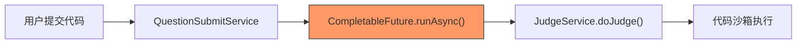

| 问题 | 说明 | 影响 |
|------|------|------|
| 任务丢失 | `CompletableFuture` 是纯内存操作，服务重启后未完成的判题任务永久丢失 | 用户提交永远卡在 WAITING |
| 无法削峰 | 高并发时所有判题任务挤在同一个线程池 | 代码沙箱被打垮，响应超时 |
| 无法重试 | 沙箱调用失败后没有重试机制 | 偶发网络抖动导致判题失败 |

### 2.3 三大核心价值

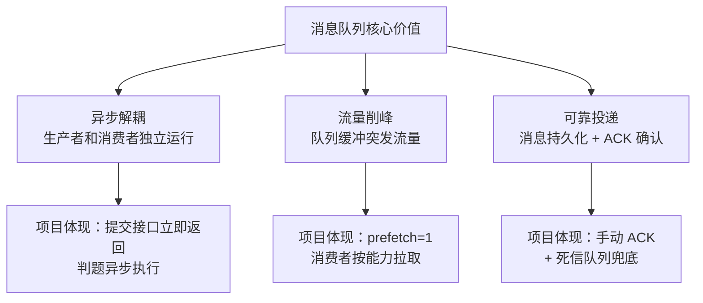

**异步解耦**：用户提交代码后，`QuestionSubmitServiceImpl` 只负责写数据库 + 发消息，立即返回 `submissionId`。判题由消费者独立完成，两者互不阻塞。

**流量削峰**：100 个用户同时提交，消息全部进入队列排队。消费者按 `prefetch=1` 逐条拉取，沙箱不会被瞬时流量打垮。

**可靠投递**：消息持久化到磁盘，消费者处理完才 ACK。服务重启后，未 ACK 的消息会重新投递。

### 2.4 同步 vs 异步通信模型

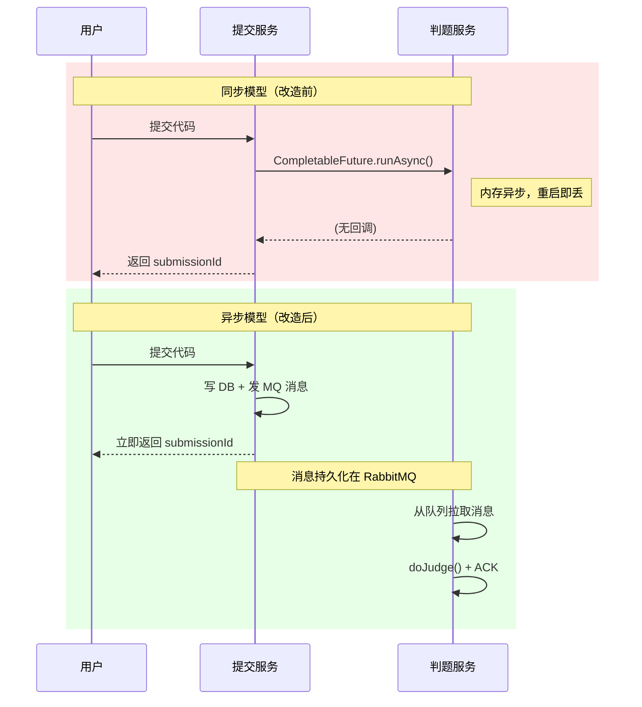

### 2.5 面试话术

> "我们 OJ 平台的判题链路原来用 `CompletableFuture` 做异步，但它是纯内存操作，服务一重启未完成的任务就丢了。引入 RabbitMQ 后，提交服务只负责**写库 + 发消息**，判题由消费者异步拉取执行。消息持久化在磁盘上，配合**手动 ACK** 和**死信队列**，即使消费者宕机，消息也不会丢失。同时通过 `prefetch` 控制消费速率，实现了**流量削峰**。"

---

## 三、RabbitMQ 核心模型

### 3.1 AMQP 协议基础

RabbitMQ 实现了 AMQP 0-9-1（Advanced Message Queuing Protocol）协议。AMQP 定义了消息中间件的标准通信模型：

- **Connection**：TCP 长连接，客户端与 Broker 之间的物理连接
- **Channel**：逻辑通道，复用同一个 Connection，避免频繁建立 TCP 连接
- **Virtual Host**：虚拟主机，逻辑隔离（类似数据库的 schema），项目配置 `virtual-host: /`

### 3.2 五大核心组件


| 组件 | 职责 | 项目对应 |
|------|------|----------|
| **Producer** | 发送消息到 Exchange | `QuestionSubmitServiceImpl` 中的 `rabbitTemplate.convertAndSend()` |
| **Exchange** | 根据路由规则分发消息到 Queue | `oj.judge.exchange`（Direct 类型），声明在 `RabbitMQConfig.java` |
| **Binding** | Exchange 和 Queue 之间的绑定关系 | Routing Key = `oj.judge.submit`，声明在 `RabbitMQConfig.judgeBinding()` |
| **Queue** | 存储消息，等待消费者拉取 | `oj.judge.queue`（持久化），声明在 `RabbitMQConfig.judgeQueue()` |
| **Consumer** | 从 Queue 拉取消息并处理 | `JudgeMessageConsumer.onMessage()` |

### 3.3 消息流转全链路

以一次用户提交判题为例，消息的完整生命周期：

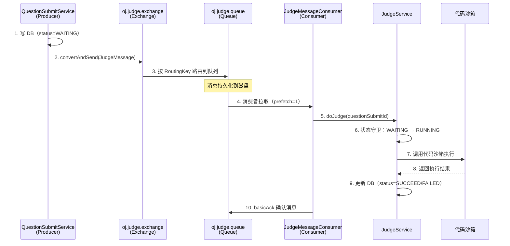

### 3.4 项目代码映射

关键代码位置：

- **生产者发送**：`QuestionSubmitServiceImpl.java:103-114` — 构建 `JudgeMessage` 并发送到 Exchange
- **Exchange/Queue 声明**：`RabbitMQConfig.java:36-51` — 主交换机、队列、绑定
- **消费者接收**：`JudgeMessageConsumer.java:23-49` — `@RabbitListener` 监听队列
- **判题执行**：`JudgeServiceImpl.java:48-141` — 状态守卫 + 沙箱调用 + 结果写回

---

## 四、Exchange 类型详解

### 4.1 四种 Exchange 类型

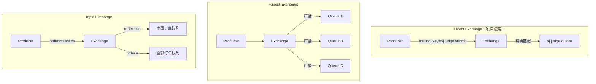

| 类型 | 路由规则 | 适用场景 | 性能 |
|------|----------|----------|------|
| **Direct** | Routing Key 精确匹配 | 点对点、一对一投递 | 最高 |
| **Fanout** | 忽略 Routing Key，广播到所有绑定队列 | 广播通知、日志分发 | 高 |
| **Topic** | Routing Key 模式匹配（`*` 匹配一个词，`#` 匹配零或多个词） | 多维度路由、事件分类 | 中等 |
| **Headers** | 根据消息头属性匹配（不常用） | 复杂路由条件 | 较低 |

### 4.2 项目为什么选 Direct Exchange

判题场景只有一种消息类型（判题请求），一个生产者，一个消费者队列。不需要广播，不需要模式匹配。Direct Exchange 是最简单、性能最高的选择。

关键代码（`RabbitMQConfig.java:36-38`）：

```java
@Bean
public DirectExchange judgeExchange() {
    return new DirectExchange(JUDGE_EXCHANGE, true, false);
    // 参数：name, durable（持久化）, autoDelete（自动删除）
}
```

> 如果未来需要扩展（比如增加"AI 判题队列"和"竞赛判题队列"），可以在同一个 Direct Exchange 上绑定不同的 Routing Key，或者升级为 Topic Exchange。当前阶段 Direct 足够。

---

## 五、消息可靠性保障

消息从生产者到消费者，经过三个阶段，每个阶段都可能丢消息：


### 5.1 生产者确认（Publisher Confirm）

**问题**：生产者调用 `convertAndSend()` 后，消息真的到达 Exchange 了吗？

**机制**：开启 Publisher Confirm 后，Broker 收到消息会异步回调通知生产者。

项目配置（`application.yml`）：

```yaml
spring:
  rabbitmq:
    publisher-confirm-type: correlated   # 异步确认，带 correlationId
    publisher-returns: true              # 消息无法路由到队列时回调
```

- `correlated`：每条消息带唯一 ID，Broker 确认后回调 `ConfirmCallback`
- `publisher-returns`：消息到达 Exchange 但无法路由到任何 Queue 时，触发 `ReturnsCallback`

### 5.2 消息持久化

**问题**：消息到达 Broker 后，Broker 宕机了怎么办？

**机制**：三层持久化保障：

| 层级 | 配置 | 项目实现 |
|------|------|----------|
| Exchange 持久化 | `durable=true` | `new DirectExchange(name, true, false)` |
| Queue 持久化 | `QueueBuilder.durable()` | `QueueBuilder.durable(JUDGE_QUEUE)` |
| 消息持久化 | `deliveryMode=2` | `Jackson2JsonMessageConverter` 默认设置 |

关键代码（`RabbitMQConfig.java:41-46`）：

```java
@Bean
public Queue judgeQueue() {
    return QueueBuilder.durable(JUDGE_QUEUE)  // 队列持久化
            .withArgument("x-dead-letter-exchange", JUDGE_DLX)
            .withArgument("x-dead-letter-routing-key", JUDGE_DLQ_ROUTING_KEY)
            .build();
}
```

### 5.3 消费者手动确认（Manual ACK）

**问题**：消费者取到消息后，还没处理完就宕机了怎么办？

**机制**：手动 ACK 模式下，消费者必须显式调用 `basicAck()` 告诉 Broker "我处理完了"。未 ACK 的消息会在消费者断开后重新投递。

项目配置（`application.yml`）：

```yaml
spring:
  rabbitmq:
    listener:
      simple:
        acknowledge-mode: manual   # 手动确认
```

关键代码（`JudgeMessageConsumer.java:41-45`）：

```java
try {
    judgeService.doJudge(questionSubmitId);
    safeAck(channel, deliveryTag);  // 判题成功才 ACK
} catch (Exception e) {
    handleFailure(message, channel, deliveryTag, e);  // 失败走异常处理
}
```

### 5.4 三种 ACK 操作对比

| 操作 | 方法 | 效果 | 项目使用场景 |
|------|------|------|-------------|
| **ACK** | `basicAck(tag, false)` | 确认消息，从队列移除 | 判题成功、业务异常（不可重试） |
| **NACK** | `basicNack(tag, false, true)` | 拒绝消息，重新入队 | （项目未使用，避免死循环） |
| **NACK to DLQ** | `basicNack(tag, false, false)` | 拒绝消息，不重入队，进死信 | 系统异常（沙箱崩溃等） |

### 5.5 面试话术

> "我们的消息可靠性是**三层保障**：第一层，生产者开启 `publisher-confirm-type: correlated`，确保消息到达 Broker；第二层，Exchange、Queue、消息全部持久化到磁盘，Broker 宕机后可恢复；第三层，消费者使用**手动 ACK**，只有 `doJudge()` 执行成功才确认消息。如果消费者宕机，未 ACK 的消息会自动重新投递给其他消费者。"

---

## 六、死信队列（DLQ）机制

### 6.1 什么是死信

死信（Dead Letter）是指无法被正常消费的消息。三种场景会产生死信：

| 场景 | 说明 | 项目是否涉及 |
|------|------|-------------|
| 消息被 NACK 且 `requeue=false` | 消费者明确拒绝，不重新入队 | ✅ 系统异常时触发 |
| 消息 TTL 过期 | 消息在队列中超过存活时间 | ❌ 未设置 TTL |
| 队列达到最大长度 | 队列满了，新消息被丢弃 | ❌ 未设置 max-length |

### 6.2 DLX + DLQ 架构

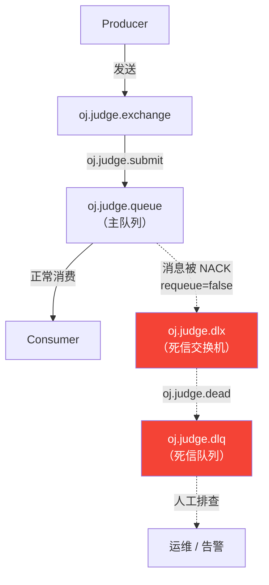

**工作原理**：主队列 `oj.judge.queue` 声明时绑定了死信交换机参数。当消息被 NACK（`requeue=false`）时，RabbitMQ 自动将消息转发到 `oj.judge.dlx`，再路由到 `oj.judge.dlq`。

### 6.3 项目实现

关键代码（`RabbitMQConfig.java`）：

```java
// 死信交换机
@Bean
public DirectExchange judgeDlx() {
    return new DirectExchange(JUDGE_DLX, true, false);
}

// 死信队列
@Bean
public Queue judgeDlq() {
    return QueueBuilder.durable(JUDGE_DLQ).build();
}

// 死信绑定
@Bean
public Binding judgeDlqBinding() {
    return BindingBuilder.bind(judgeDlq()).to(judgeDlx()).with(JUDGE_DLQ_ROUTING_KEY);
}

// 主队列声明时绑定 DLX
@Bean
public Queue judgeQueue() {
    return QueueBuilder.durable(JUDGE_QUEUE)
            .withArgument("x-dead-letter-exchange", JUDGE_DLX)           // 指定死信交换机
            .withArgument("x-dead-letter-routing-key", JUDGE_DLQ_ROUTING_KEY)  // 指定死信路由键
            .build();
}
```

### 6.4 消费者异常分类处理

消费者对异常做了分类，决定消息的去向：

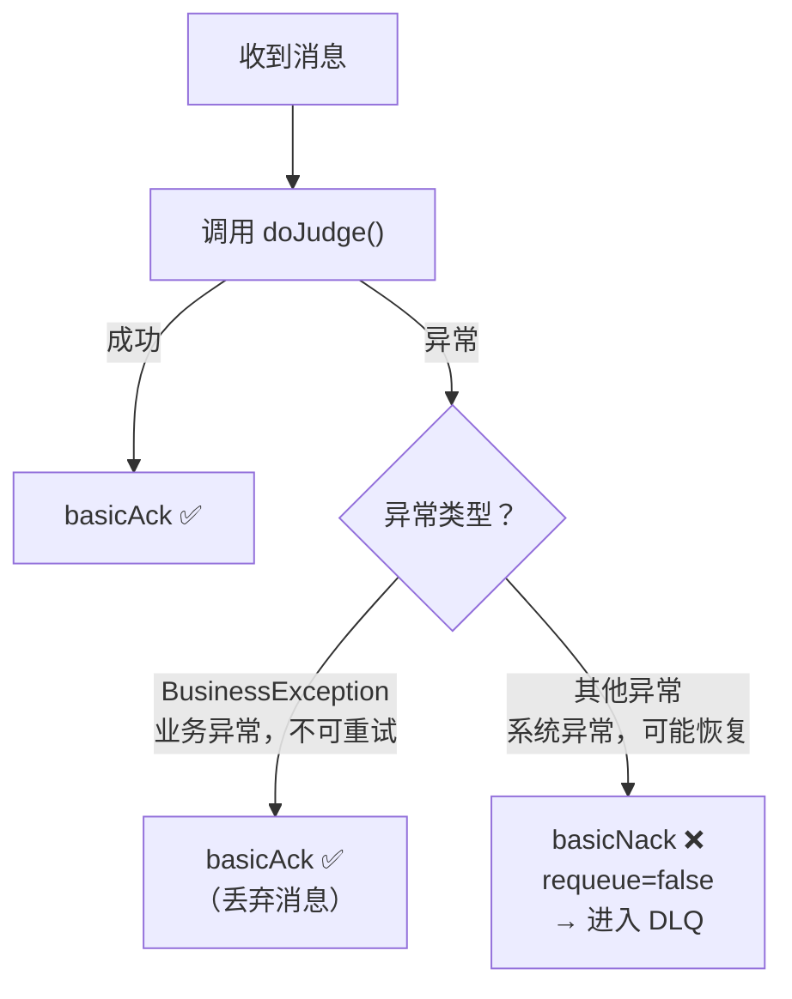

关键代码（`JudgeMessageConsumer.java:52-65`）：

```java
private void handleFailure(JudgeMessage message, Channel channel,
                           long deliveryTag, Exception e) {
    try {
        if (e instanceof BusinessException) {
            safeAck(channel, deliveryTag);  // 业务异常：参数错误、题目不存在等，重试也没用
        } else {
            channel.basicNack(deliveryTag, false, false);  // 系统异常：沙箱超时、网络抖动等，进 DLQ
        }
    } catch (Exception ackEx) {
        log.error("[Judge Consumer] ack/nack failed", ackEx);
    }
}
```

### 6.5 面试话术

> "我们对消费失败的消息做了**分类处理**：业务异常（比如题目不存在、参数错误）直接 ACK 丢弃，因为重试也不会成功；系统异常（比如沙箱超时、网络抖动）NACK 到**死信队列**，后续可以人工排查或者接告警系统自动重试。死信队列的实现是在主队列声明时通过 `x-dead-letter-exchange` 参数绑定死信交换机，RabbitMQ 原生支持，不需要额外代码。"

---

## 七、消费者设计模式

### 7.1 Prefetch 预取机制

Prefetch 控制消费者一次从队列预取多少条消息到本地缓冲区。

| prefetch 值 | 行为 | 适用场景 |
|-------------|------|----------|
| 1 | 每次只取一条，处理完再取下一条 | 任务耗时长、需要公平分发（判题场景） |
| 10-50 | 批量预取，提高吞吐 | 任务轻量、追求高吞吐 |
| 0（无限制） | 尽可能多地推送 | 不推荐，可能导致消费者 OOM |

项目配置（`application.yml`）：

```yaml
listener:
  simple:
    prefetch: 1          # 每次只取一条
    concurrency: 2       # 初始 2 个消费者线程
    max-concurrency: 5   # 最大 5 个消费者线程
```

**为什么 prefetch=1**：判题任务涉及代码沙箱调用，单次执行可能耗时数秒。如果预取过多，一个消费者囤积大量任务，其他消费者空闲，导致负载不均。`prefetch=1` 确保每个消费者处理完当前任务后才拉取下一条，实现公平分发。

### 7.2 并发消费者

Spring AMQP 的 `SimpleMessageListenerContainer` 支持动态调整消费者线程数：

```
concurrency=2, max-concurrency=5
```

含义：启动时创建 2 个消费者线程，当队列积压时自动扩展到最多 5 个。每个线程独立从队列拉取消息，并行执行判题。

### 7.3 手动 ACK vs 自动 ACK

| 模式 | 配置 | 行为 | 风险 |
|------|------|------|------|
| 自动 ACK | `acknowledge-mode: auto` | 消息投递到消费者后立即确认 | 消费者处理失败，消息已丢失 |
| 手动 ACK | `acknowledge-mode: manual` | 消费者显式调用 `basicAck()` 后才确认 | 忘记 ACK 会导致消息堆积 |

项目使用手动 ACK，因为判题是关键业务，不能容忍消息丢失。

### 7.4 幂等性保障：状态机模式

**问题**：如果同一条消息被投递两次（网络抖动、消费者超时重连），`doJudge()` 会不会执行两次？

**解决方案**：`JudgeServiceImpl` 内置了状态机守卫。

关键代码（`JudgeServiceImpl.java:61-63`）：

```java
// 如果题目提交状态不为等待中，就不用重复执行了
if (!questionSubmit.getStatus().equals(QuestionSubmitStatusEnum.WAITING.getValue())) {
    throw new BusinessException(ErrorCode.OPERATION_ERROR, "题目正在判题中");
}
```

状态流转：`WAITING → RUNNING → SUCCEED/FAILED`

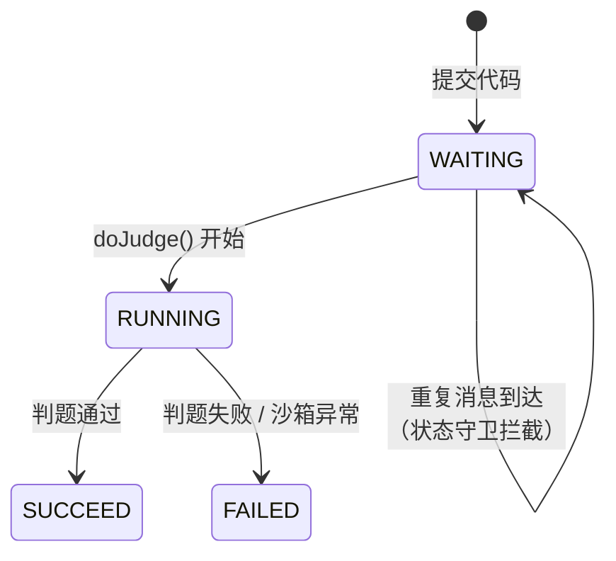

第一次消费时，状态从 `WAITING` 变为 `RUNNING`。如果消息重复投递，第二次消费时状态已经是 `RUNNING`，状态守卫直接抛出 `BusinessException`，消费者 ACK 丢弃。这就是**基于状态机的幂等性保障**。

### 7.5 消费者完整流程图

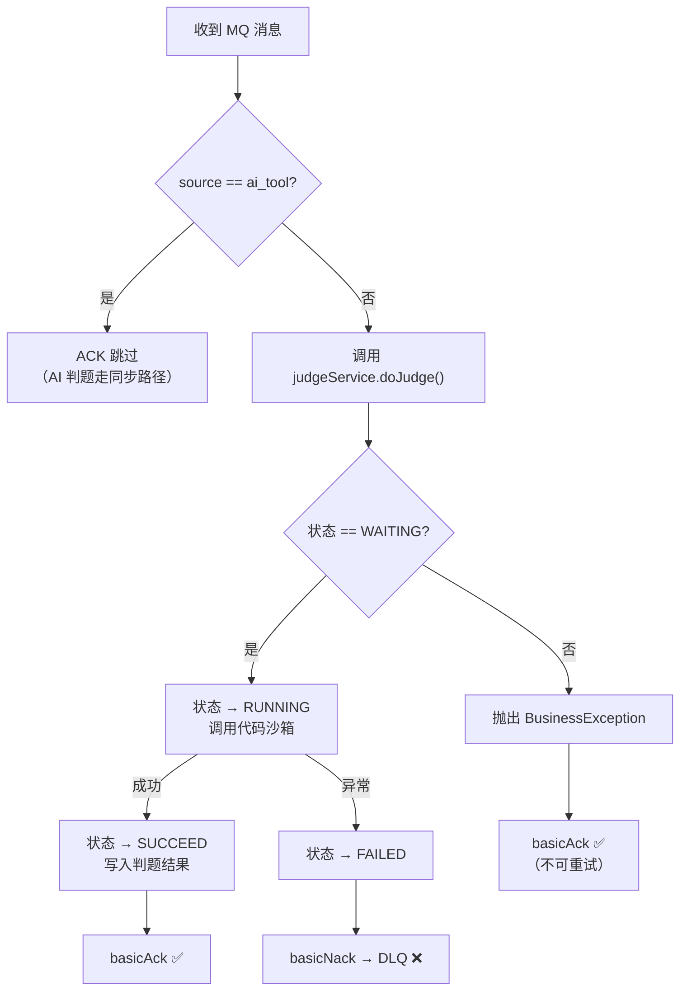

---

## 八、项目实战：判题链路 MQ 改造全流程

### 8.1 改造前后架构对比

```mermaid
flowchart TD
    subgraph BEFORE["改造前"]
        direction LR
        U1["用户提交"] --> S1["QuestionSubmitService"]
        S1 -->|"CompletableFuture<br/>（内存异步）"| J1["JudgeService"]
        J1 --> SB1["代码沙箱"]
    end

    subgraph AFTER["改造后"]
        direction LR
        U2["用户提交"] --> S2["QuestionSubmitService"]
        S2 -->|"RabbitTemplate<br/>（MQ 异步）"| MQ["RabbitMQ"]
        MQ --> C2["JudgeMessageConsumer"]
        C2 --> J2["JudgeService"]
        J2 --> SB2["代码沙箱"]
    end

    style BEFORE fill:#fff3e0
    style AFTER fill:#e8f5e9
```

**核心变化**：只替换了"触发 `doJudge()` 的方式"，从内存异步变为 MQ 异步。`doJudge()` 往下的所有逻辑（沙箱调用、结果解析、数据库更新）完全不变。

### 8.2 生产者改造：QuestionSubmitServiceImpl

改造点在 `doQuestionSubmit()` 方法的最后一段（`QuestionSubmitServiceImpl.java:101-117`）：

```java
// 异步执行判题服务
long questionSubmitId = questionSubmit.getId();
if (useMQ) {
    JudgeMessage message = JudgeMessage.builder()
            .questionSubmitId(questionSubmitId)
            .questionId(questionId)
            .userId(userId)
            .source(null)       // 普通用户提交，source 为 null
            .build();
    rabbitTemplate.convertAndSend(
            RabbitMQConfig.JUDGE_EXCHANGE,      // oj.judge.exchange
            RabbitMQConfig.JUDGE_ROUTING_KEY,    // oj.judge.submit
            message
    );
} else {
    CompletableFuture.runAsync(() -> judgeService.doJudge(questionSubmitId));
}
```

**设计要点**：

1. **功能开关**：`useMQ` 读取 `oj.judge.use-mq` 配置，默认 `true`。设为 `false` 可一键回滚到 `CompletableFuture` 方式
2. **消息体**：`JudgeMessage` 只携带必要的 ID 信息，不传递大对象（代码内容等由消费者从数据库读取）
3. **source 字段**：普通用户提交为 `null`，AI 工具提交为 `"ai_tool"`，用于消费者端过滤

### 8.3 消费者实现：JudgeMessageConsumer

完整消费逻辑（`JudgeMessageConsumer.java:23-49`）：

```java
@RabbitListener(queues = RabbitMQConfig.JUDGE_QUEUE, ackMode = "MANUAL")
public void onMessage(JudgeMessage message, Channel channel,
                      @Header(AmqpHeaders.DELIVERY_TAG) long deliveryTag) {
    Long questionSubmitId = message.getQuestionSubmitId();

    // 防御性过滤：AI 工具调用的判题走同步路径，不应出现在 MQ 中
    if ("ai_tool".equals(message.getSource())) {
        safeAck(channel, deliveryTag);
        return;
    }

    try {
        judgeService.doJudge(questionSubmitId);
        safeAck(channel, deliveryTag);
    } catch (Exception e) {
        handleFailure(message, channel, deliveryTag, e);
    }
}
```

**三个关键设计**：

| 设计 | 实现 | 原因 |
|------|------|------|
| 手动 ACK | `ackMode = "MANUAL"` + `basicAck()` | 确保判题完成后才确认消息 |
| AI 消息过滤 | `source == "ai_tool"` 时直接 ACK 跳过 | AI 判题需要同步结果，不走 MQ |
| 异常分类 | `BusinessException` → ACK，其他 → NACK to DLQ | 业务异常不可重试，系统异常进死信 |

### 8.4 AI 判题同步路径保护

AI Agent 的推理循环需要**同步**拿到判题结果才能继续下一步思考。因此 AI 判题有三层防御，确保不走 MQ：

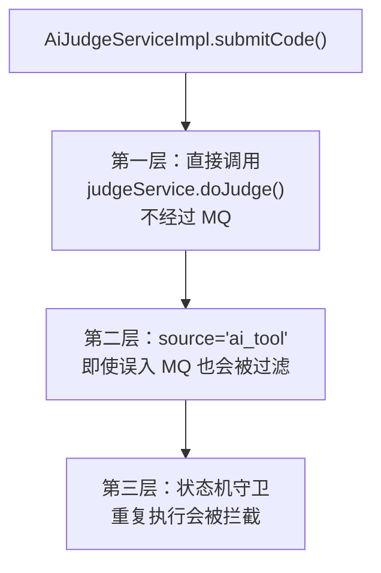

关键代码（`AiJudgeServiceImpl.java:61-69`）：

```java
questionSubmit.setSource("ai_tool");   // 标记为 AI 工具调用
// ...
// 同步调用 doJudge（AI 工具调用必须拿到结果，不走 MQ）
judged = judgeService.doJudge(questionSubmit.getId());
```

### 8.5 消息流转完整时序图

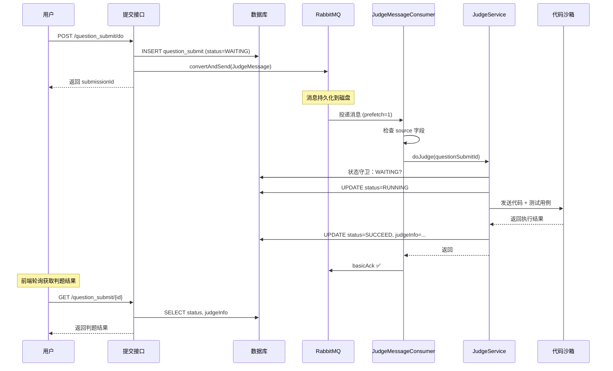

---

## 九、Spring Boot AMQP 配置详解

### 9.1 application.yml 配置项解析

```yaml
spring:
  rabbitmq:
    host: 192.168.26.128              # RabbitMQ 服务器地址
    port: 5672                         # AMQP 协议端口（管理面板是 15672）
    username: admin                    # 认证用户名
    password: 123456                   # 认证密码
    virtual-host: /                    # 虚拟主机（逻辑隔离，/ 是默认 vhost）
    publisher-confirm-type: correlated # 生产者确认模式：异步回调 + correlationId
    publisher-returns: true            # 消息无法路由到队列时触发回调
    listener:
      simple:
        acknowledge-mode: manual       # 消费者手动确认
        prefetch: 1                    # 每个消费者一次预取 1 条消息
        concurrency: 2                 # 初始消费者线程数
        max-concurrency: 5             # 最大消费者线程数
        missing-queues-fatal: false    # 队列不存在时不阻止应用启动
```

| 配置项 | 值 | 为什么这样配 |
|--------|-----|-------------|
| `publisher-confirm-type` | `correlated` | 比 `simple`（同步阻塞）性能更好，适合高并发场景 |
| `prefetch` | `1` | 判题任务耗时长，需要公平分发，避免单个消费者囤积 |
| `concurrency` / `max-concurrency` | `2` / `5` | 开发环境资源有限，生产环境可调大（`3` / `10`） |
| `missing-queues-fatal` | `false` | 应用启动时队列可能还未创建（由 `@Configuration` 声明），避免启动失败 |

### 9.2 功能开关

```yaml
oj:
  judge:
    use-mq: true   # true=走 MQ，false=回滚到 CompletableFuture
```

对应代码（`QuestionSubmitServiceImpl.java:62-63`）：

```java
@Value("${oj.judge.use-mq:true}")
private boolean useMQ;
```

### 9.3 RabbitMQConfig 配置类逐行解析

`RabbitMQConfig.java` 的职责是声明 MQ 拓扑结构（Exchange、Queue、Binding）和消息序列化方式。

**拓扑结构总览**：

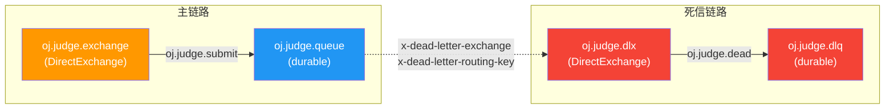

**Bean 声明顺序**：

| 顺序 | Bean | 说明 |
|------|------|------|
| 1 | `judgeDlx()` | 死信交换机（先声明，因为主队列依赖它） |
| 2 | `judgeDlq()` | 死信队列 |
| 3 | `judgeDlqBinding()` | 死信交换机 → 死信队列的绑定 |
| 4 | `judgeExchange()` | 主交换机 |
| 5 | `judgeQueue()` | 主队列（声明时绑定 DLX 参数） |
| 6 | `judgeBinding()` | 主交换机 → 主队列的绑定 |
| 7 | `jsonMessageConverter()` | Jackson JSON 序列化器 |

### 9.4 Jackson2JsonMessageConverter

```java
@Bean
public MessageConverter jsonMessageConverter() {
    return new Jackson2JsonMessageConverter();
}
```

Spring AMQP 默认使用 Java 序列化（`SimpleMessageConverter`），存在以下问题：

| 问题 | 说明 |
|------|------|
| 可读性差 | 消息体是二进制，在 RabbitMQ 管理面板中无法直接查看 |
| 跨语言不兼容 | 如果未来有非 Java 消费者，无法反序列化 |
| 安全风险 | Java 反序列化漏洞（CVE 历史悠久） |

使用 `Jackson2JsonMessageConverter` 后，消息体是 JSON 格式：

```json
{
  "questionSubmitId": 123,
  "questionId": 456,
  "userId": 789,
  "source": null
}
```

在 RabbitMQ 管理面板中可以直接查看消息内容，方便调试。

---

## 十、面试高频问题汇总

### 10.1 为什么引入 RabbitMQ？

> "我们 OJ 平台的判题链路原来用 `CompletableFuture` 做异步，但它是纯内存操作，服务一重启未完成的任务就丢了。引入 RabbitMQ 后，提交服务只负责**写库 + 发消息**，判题由消费者异步拉取执行。消息持久化在磁盘上，配合**手动 ACK** 和**死信队列**，即使消费者宕机，消息也不会丢失。同时通过 `prefetch` 控制消费速率，实现了**流量削峰**。"

### 10.2 消息可靠性怎么保障？

> "三层保障：第一层，生产者开启 `publisher-confirm`，确保消息到达 Broker；第二层，Exchange、Queue、消息全部**持久化**到磁盘；第三层，消费者使用**手动 ACK**，只有判题成功才确认。如果消费者宕机，未 ACK 的消息会自动重新投递。"

### 10.3 消费失败怎么处理？

> "我们对异常做了**分类处理**：`BusinessException`（参数错误、题目不存在）直接 ACK 丢弃，因为重试也不会成功；系统异常（沙箱超时、网络抖动）NACK 到**死信队列**，后续可以人工排查或接告警系统。"

### 10.4 怎么保证幂等性？

> "我们用**状态机模式**保证幂等。`JudgeServiceImpl.doJudge()` 开头有一个状态守卫：只有 `status=WAITING` 的提交才会执行判题，执行前先把状态改为 `RUNNING`。如果同一条消息被投递两次，第二次到达时状态已经不是 `WAITING`，直接抛出 `BusinessException` 被消费者 ACK 丢弃。"

### 10.5 为什么选 Direct Exchange 而不是 Topic？

> "判题场景只有一种消息类型、一个消费者队列，不需要模式匹配。Direct Exchange 是最简单、**路由性能最高**的选择。如果未来需要扩展（比如增加竞赛判题队列），可以在同一个 Exchange 上绑定不同的 Routing Key，或者升级为 Topic Exchange。"

### 10.6 AI 判题为什么不走 MQ？

> "AI Agent 的推理循环需要**同步**拿到判题结果才能继续下一步思考。走 MQ 是异步的，Agent 拿不到结果，推理链就断了。所以 `AiJudgeServiceImpl` 直接调用 `judgeService.doJudge()`，不经过 MQ。同时我们在消息体里加了 `source` 字段，消费者端也做了防御性过滤，即使 AI 消息误入队列也会被跳过。"

### 10.7 如果 RabbitMQ 挂了怎么办？

> "我们设计了**功能开关** `oj.judge.use-mq`，默认 `true`。如果 RabbitMQ 不可用，可以在配置中心把开关设为 `false`，系统自动降级到 `CompletableFuture` 异步模式。虽然降级后失去了消息持久化和削峰能力，但判题功能不会中断。"

### 10.8 prefetch 为什么设为 1？

> "判题任务涉及代码沙箱调用，单次执行可能耗时数秒甚至更长。如果 prefetch 设得大，一个消费者会囤积大量任务，其他消费者空闲，导致**负载不均**。设为 1 确保每个消费者处理完当前任务后才拉取下一条，实现**公平分发**。"
