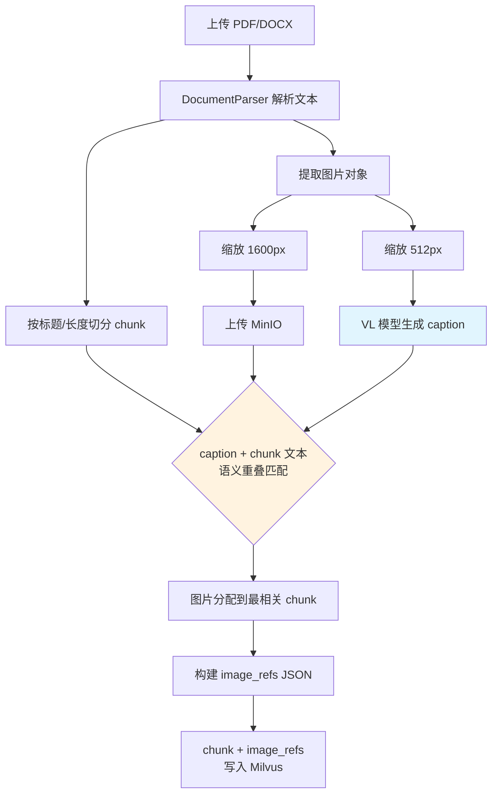
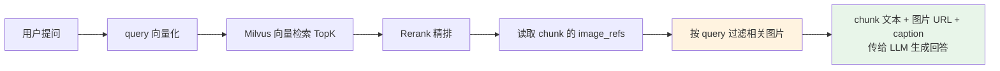
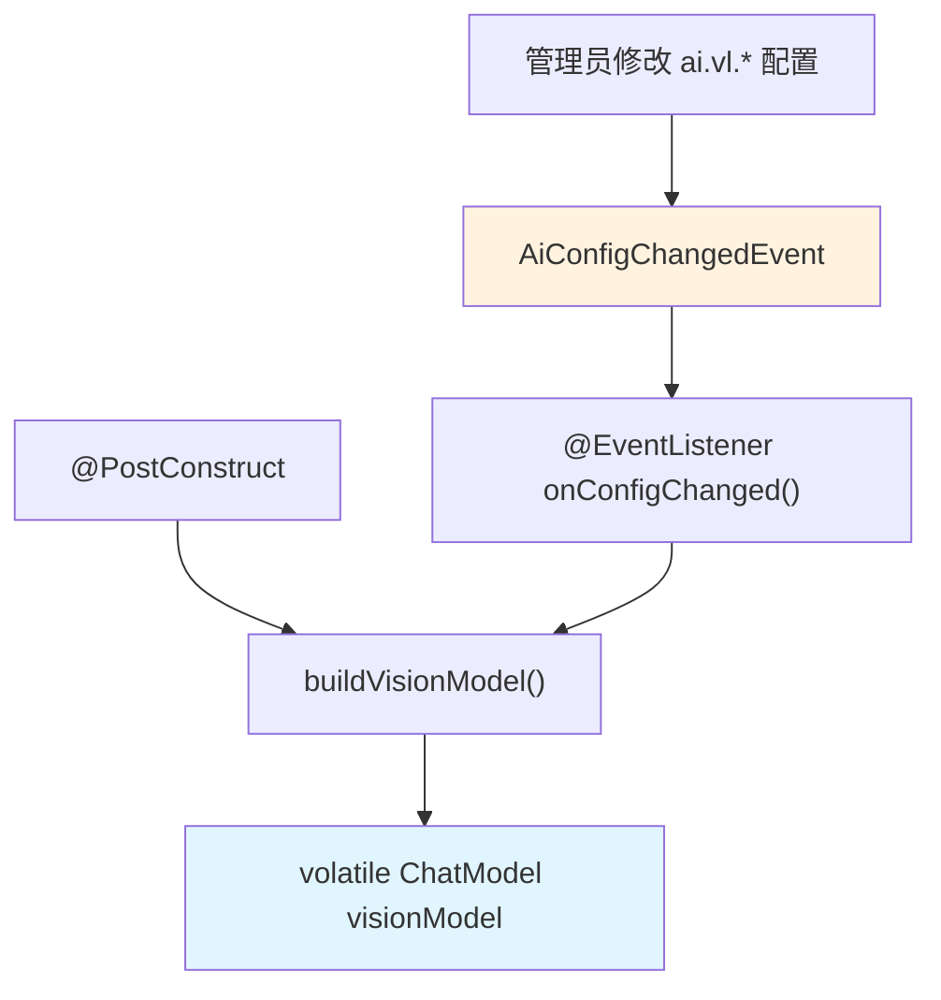
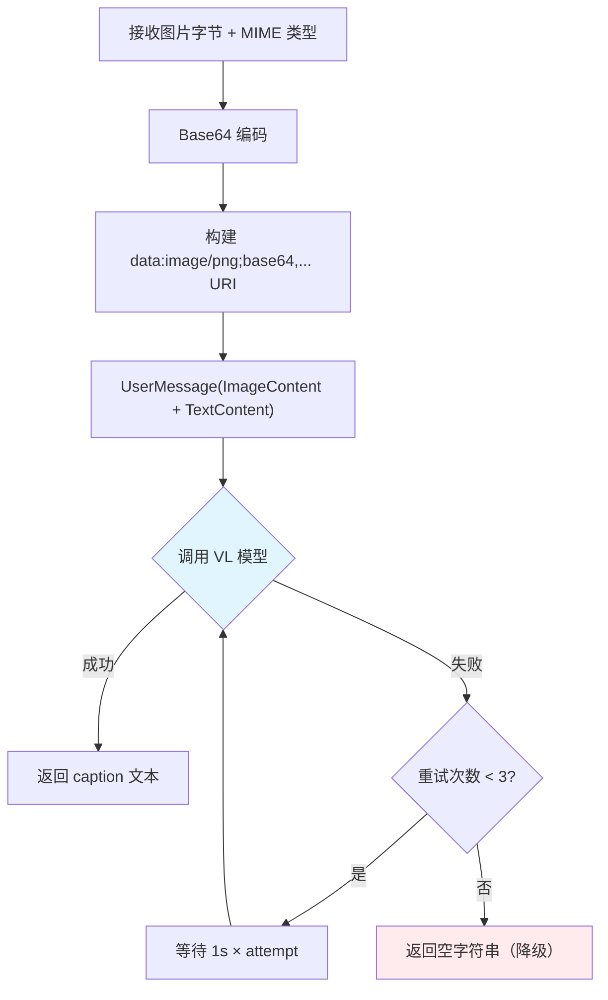
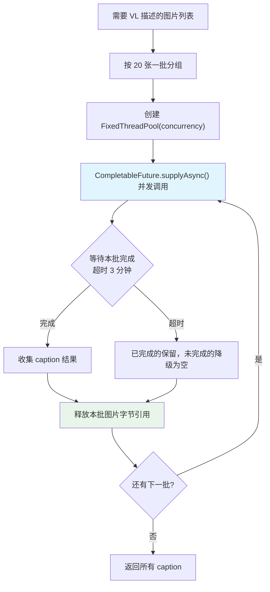
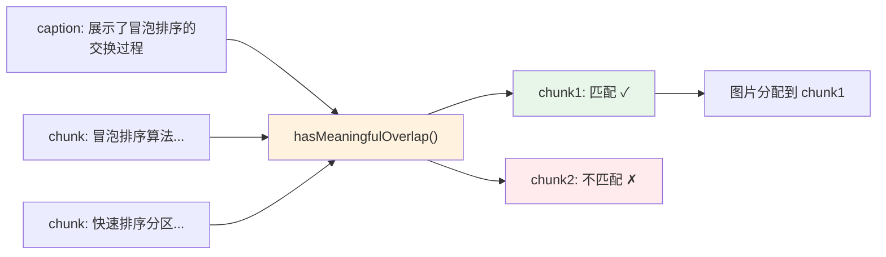
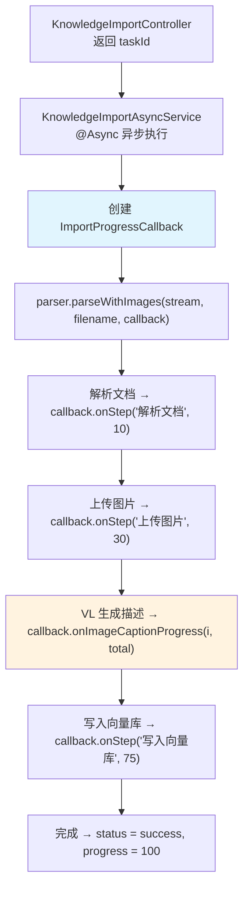

# XI OJ VL 视觉模型集成方案：图片描述自动生成 + 异步导入进度追踪

更新时间：2026-04-30
前置依赖：已完成知识库多格式导入（参见 `knowledge_multiformat_import_guide.md`）

---

## 〇、背景与动机

### 0.1 问题

RAG 知识库中大量 chunk 携带图片（算法流程图、数据结构示意图、代码截图），但系统只知道"这个 chunk 有哪些图片 URL"，不知道图片里画的是什么。

导致两个问题：

1. **图片分配不准**：PDF 导入时只能按页码和物理位置把图片挂到 chunk 上，一张"快速排序分区过程"的图可能被挂到"归并排序"的 chunk 里。
2. **LLM 无法判断图片相关性**：检索到 chunk 后，LLM 拿到的只有图片 URL 和附近文本，无法理解图片内容，只能盲目引用或忽略。

### 0.2 方案

在 PDF/Word 导入时，用 VL（Vision-Language）视觉模型为每张图片生成一句话描述（caption），写入 `image_refs` metadata。

```
导入前：image_refs.caption = ""（空）
导入后：image_refs.caption = "这张图展示了冒泡排序的交换过程，相邻元素逐步比较并交换位置"
```

### 0.3 为什么选 VL 而不是 OCR

| 维度 | OCR | VL 视觉模型 |
|------|-----|-------------|
| 能力 | 只能提取图片中的文字 | 理解图片语义，生成自然语言描述 |
| 算法图适用性 | 流程图、示意图中文字很少，OCR 提取结果碎片化 | 能描述"这是一棵二叉搜索树的插入过程" |
| 代码截图 | 能提取代码文本，但丢失结构 | 能描述"这段代码实现了动态规划的状态转移" |
| 成本 | 低 | 中（每张约 0.002 元） |

对于算法教材中的图片，VL 模型的语义理解能力远优于 OCR。

---

## 一、整体架构

### 1.1 导入阶段数据流



### 1.2 检索阶段数据流



caption 在检索阶段的作用：LLM 拿到 caption 后能理解"这张图画的是什么"，从而决定是否在回答中引用该图片。

---

## 二、VisionModelHolder — VL 模型生命周期管理

### 2.1 设计模式

遵循项目中 `AiModelHolder`、`QueryRewriter` 的热更新模式：



关键设计：
- `volatile` 保证多线程可见性，配置变更后新请求立即使用新模型
- 共用 DashScope API Key（`ai.provider.api_key_encrypted`）和 Base URL（`ai.model.base_url`）
- 独立的模型名称配置（`ai.vl.model_name`，默认 `qwen-vl-plus`）

### 2.2 数据库配置

```sql
INSERT INTO ai_config (config_key, config_value, description) VALUES
('ai.vl.model_name', 'qwen-vl-plus', '视觉理解模型名称（用于图片描述生成）'),
('ai.vl.concurrency', '4', 'VL模型并发调用数');
```

### 2.3 核心方法

```java
public String generateCaption(byte[] imageData, String mimeType)
```

调用流程：



为什么用 base64 而不是图片 URL：MinIO 部署在 localhost，DashScope 云端模型无法访问内网地址。base64 data URI 直接把图片内容编码在请求体中，绕过网络可达性问题。

### 2.4 Prompt 设计

```
请用一句话描述这张图片的内容，重点说明它展示了什么概念、数据结构或算法过程。只输出描述，不要加前缀。
```

约束"一句话"是为了控制 token 消耗和存储体积。强调"概念、数据结构或算法过程"是因为知识库内容以算法教材为主。

---

## 三、双轨图片缩放

### 3.1 为什么需要两种分辨率

| 用途 | 分辨率 | 原因 |
|------|--------|------|
| MinIO 存储（前端展示） | 1600px | 用户查看时需要清晰度 |
| VL 模型描述生成 | 512px | VL 只需理解图片语义，不需要像素级细节 |

### 3.2 内存收益

以一张 1000×800 的算法流程图为例：

| 分辨率 | PNG 字节大小（约） | 500 张总计 |
|--------|-------------------|-----------|
| 1600px | ~500KB | ~250MB |
| 512px | ~50KB | ~25MB |

512px 缩略图使 VL 处理阶段的内存占用降低约 10 倍。

### 3.3 实现

PDF 解析器中，图片提取后分两路处理：

```java
BufferedImage forUpload = scaleIfNeeded(buffered);   // → 1600px，上传 MinIO
byte[] pngBytes = toPngBytes(forUpload);
String url = minioService.uploadImage(pngBytes, objectName, "image/png");

BufferedImage vlScaled = scaleForVL(buffered);        // → 512px，用于 VL
byte[] vlBytes = toPngBytes(vlScaled);
imageDataMap.put(url, vlBytes);                       // 临时存储，分批处理后释放
```

Word 解析器中，原始图片字节在存入 `ImageWithCaption` 前先经过 `scaleForVL()` 缩放。

---

## 四、批量处理与容错

### 4.1 并发模型



### 4.2 超时层级

| 层级 | 超时时间 | 作用 |
|------|---------|------|
| 单次 API 请求 | 30 秒 | 防止单张图片卡住线程 |
| 单批（20 张） | 3 分钟 | 防止某批整体卡住 |
| 整体（PDF） | 15 分钟 | 防止导入任务无限挂起 |
| 整体（Word） | 10 分钟 | Word 图片通常少于 PDF |

### 4.3 容错策略

- 单张图片 VL 调用失败 → 降级为空 caption，不阻塞导入
- `generateCaption` 内置 3 次重试 + 指数退避（等待 1s、2s）
- 整批超时 → 已完成的图片保留 caption，未完成的降级
- `VisionModelHolder` 不可用（API Key 为空）→ 跳过整个 VL 步骤，所有图片 caption 为空

### 4.4 并发控制

- `Semaphore(2)` 限制最多 2 个并发导入任务
- 每个任务创建独立线程池，并发数由 `ai.vl.concurrency` 配置（默认 4，范围 1-16）
- 最大 VL 并发 = 2 × concurrency = 8 个请求，不会触发 DashScope 限流

---

## 五、caption 的两个作用

### 5.1 导入时：图片-chunk 语义匹配



`hasMeaningfulOverlap` 做术语级重叠匹配：提取 caption 和 chunk 文本中的关键术语，计算重叠比例。比纯粹按页码分配更准确。

### 5.2 检索时：LLM 理解图片内容

检索到的 chunk 携带 `image_refs` JSON，传给 LLM 的上下文包含：

```
[RAG_SOURCE_IMAGES]

图片描述：展示了冒泡排序的交换过程，相邻元素逐步比较并交换位置
```

LLM 看到 caption 后能判断：用户问的是"冒泡排序怎么工作"→ 这张图相关 → 在回答中引用。

---

## 六、异步导入进度追踪

### 6.1 为什么 PDF/DOCX 统一异步

加入 VL 描述生成后，即使一个 2MB 的 PDF 有 30 张图片，VL 处理也需要 1-2 分钟。HTTP 请求不能等这么久。所以 PDF/DOCX 统一走异步，Markdown 保持同步（无图片处理）。

### 6.2 后端进度回调



`ImportProgressCallback` 接口：

```java
public interface ImportProgressCallback {
    void onStep(String stepName, int progressPercent);
    void onImageCaptionProgress(int completed, int total);
    static ImportProgressCallback noop() { return new ImportProgressCallback() { ... }; }
}
```

进度分配：

| 阶段 | 进度范围 | 说明 |
|------|---------|------|
| 解析文档 | 0% → 10% | 文本提取 + chunk 切分 |
| 上传图片 | 10% → 30% | 图片提取 + MinIO 上传 |
| 生成图片描述 | 30% → 70% | VL 模型并发调用，按完成张数线性插值 |
| 写入向量库 | 70% → 100% | embedding + Milvus 写入 |

`onImageCaptionProgress(completed, total)` 在 30%-70% 区间内按比例计算：

```
progress = 30 + (completed / total) × 40
```

### 6.3 前端进度展示

前端每 2 秒轮询 `GET /admin/knowledge/import/status/{taskId}`，返回：

```json
{
  "status": "processing",
  "filename": "hello-algo.pdf",
  "message": "",
  "progress": 45,
  "currentStep": "生成图片描述 (12/30)"
}
```

用 Arco Design 的 `<a-progress>` 组件渲染进度条 + 当前步骤文字。导入完成（`status: success`）或失败（`status: failed`）后停止轮询。

---

## 七、配置项一览

| 配置 key | 默认值 | 说明 | 热更新 |
|----------|--------|------|--------|
| `ai.vl.model_name` | `qwen-vl-plus` | VL 视觉模型名称 | 是 |
| `ai.vl.concurrency` | `4` | VL 并发调用数（范围 1-16） | 是 |
| `ai.provider.api_key_encrypted` | — | DashScope API Key（共用） | 是 |
| `ai.model.base_url` | `https://dashscope.aliyuncs.com/compatible-mode/v1` | API 地址（共用） | 是 |

前端 AI 配置页面的"VL 视觉模型配置"区域可修改模型名称和并发数，保存后即时生效。

---

## 八、关键文件清单

| 文件 | 职责 |
|------|------|
| `VisionModelHolder.java` | VL 模型生命周期管理，caption 生成，热更新 |
| `ImportProgressCallback.java` | 进度回调接口 |
| `PdfDocumentParser.java` | PDF 解析 + 图片提取 + VL 集成 + 进度回调 |
| `WordDocumentParser.java` | Word 解析 + 图片提取 + VL 集成 + 进度回调 |
| `KnowledgeImportAsyncService.java` | 异步导入 + 进度状态管理 |
| `KnowledgeImportController.java` | PDF/DOCX 统一异步路由 |
| `AiConfigController.java` | VL 配置白名单 |
| `RagImageSupport.java` | `hasMeaningfulOverlap` 语义匹配 + `buildImageRefsJson` |
| `AiConfigView.vue` | 前端 VL 配置 + 进度条 |
