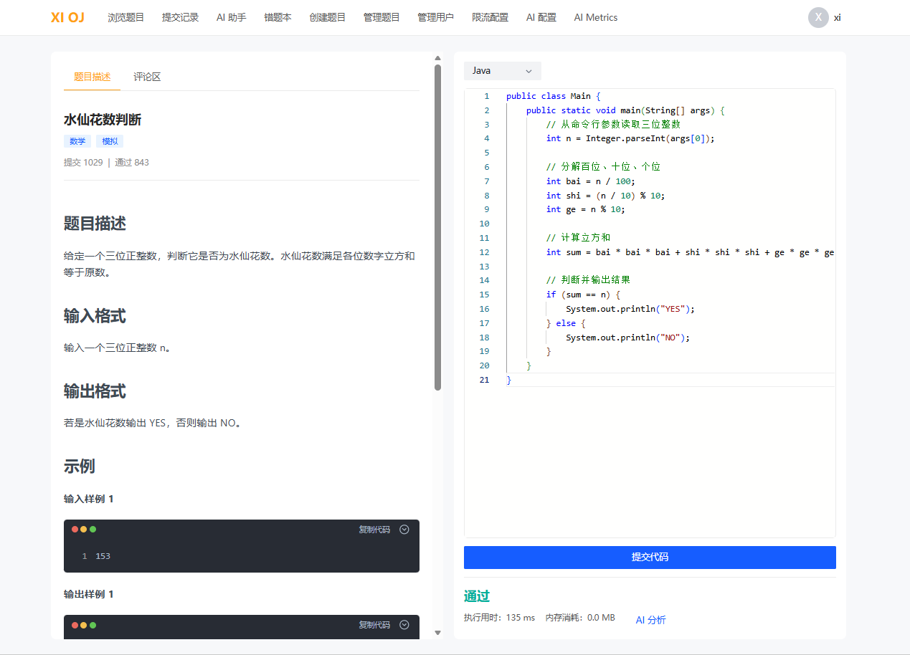
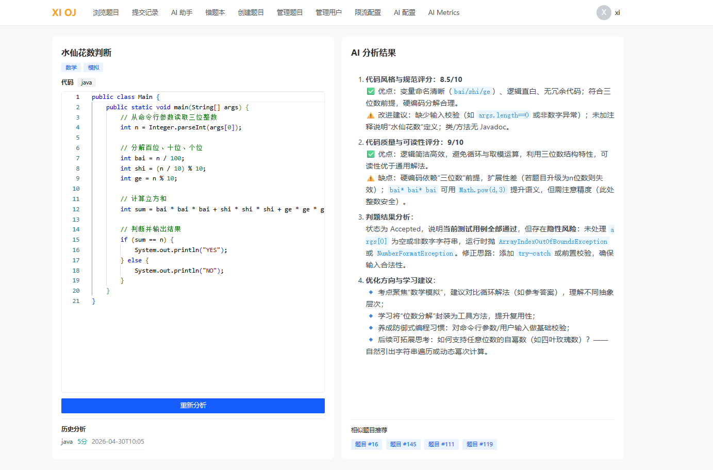
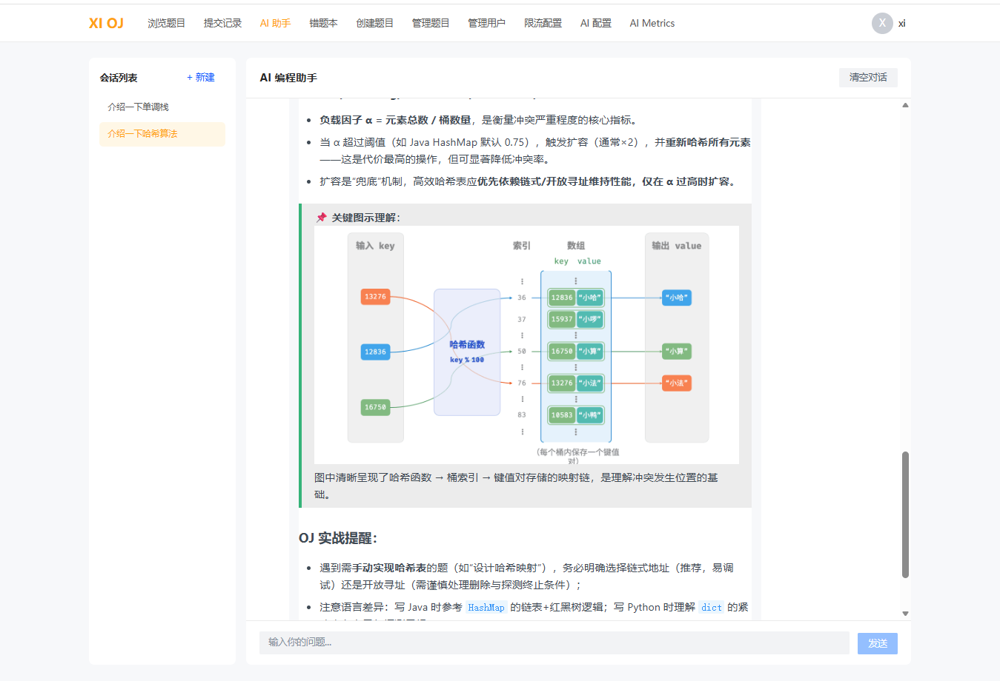
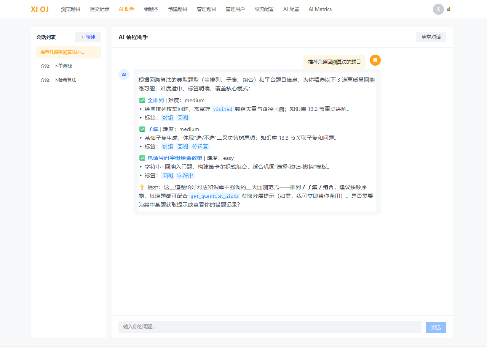
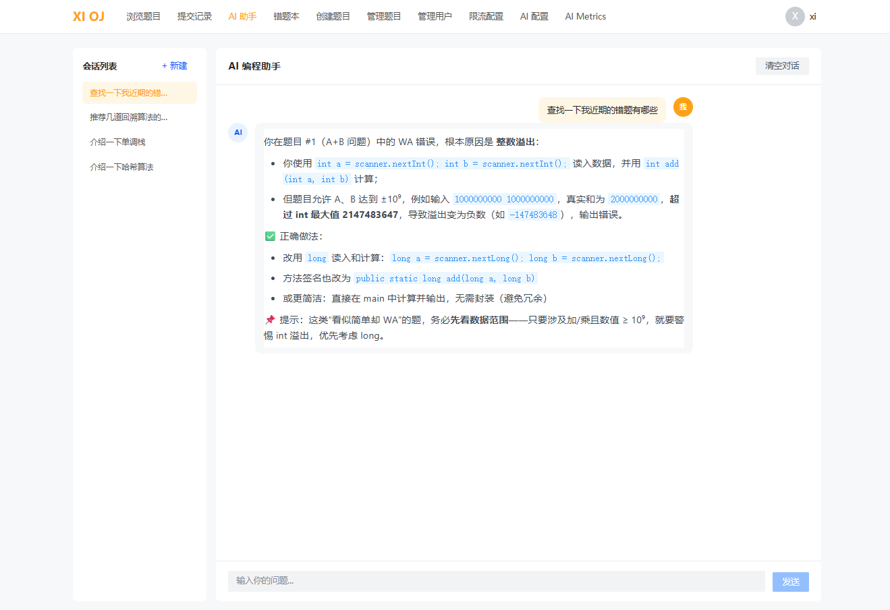
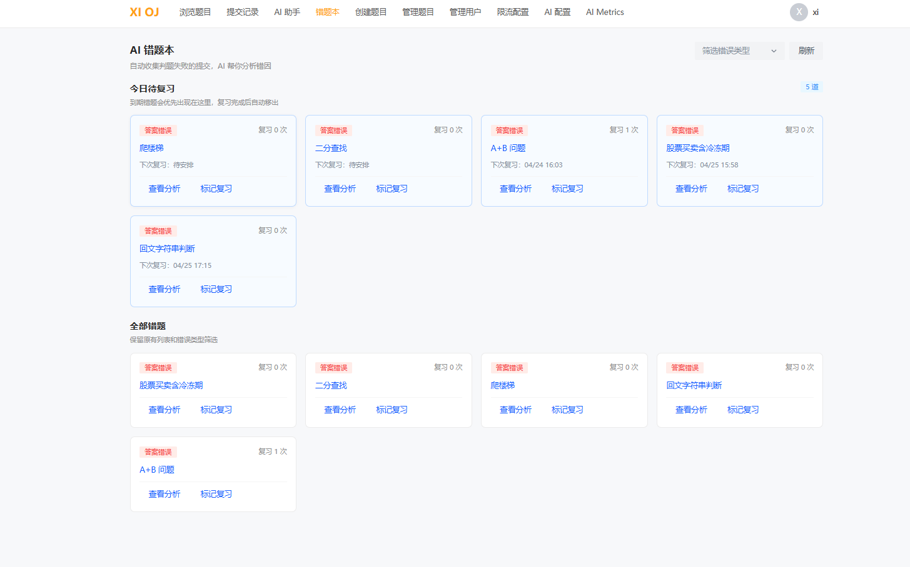
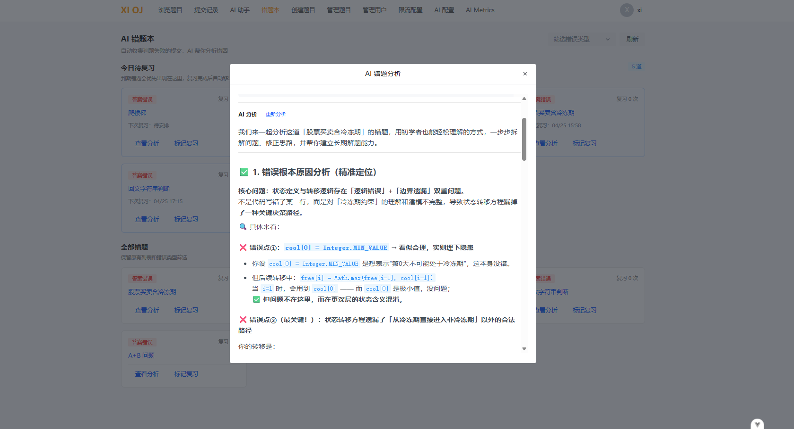
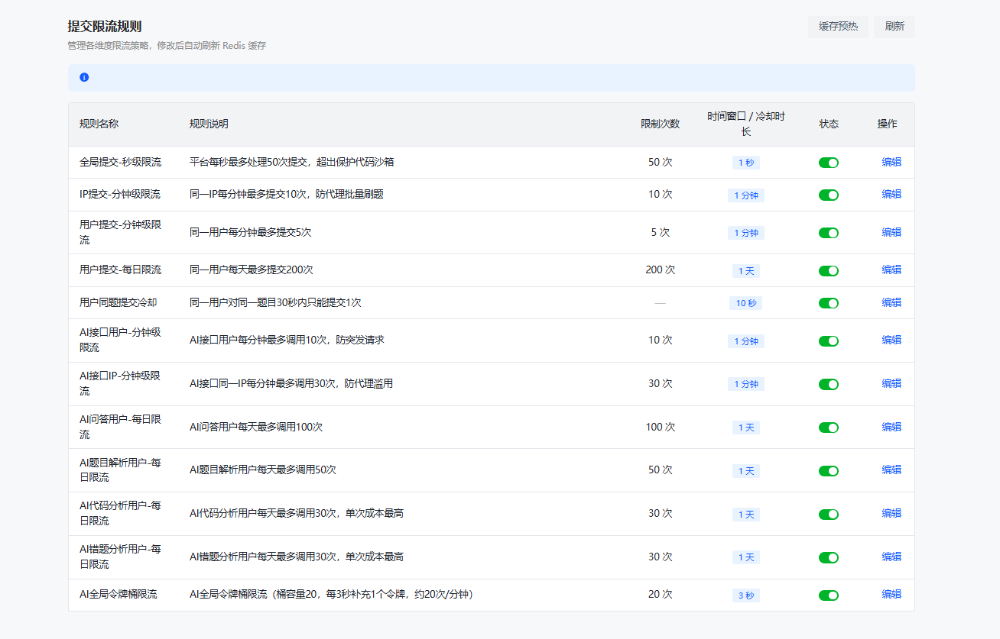
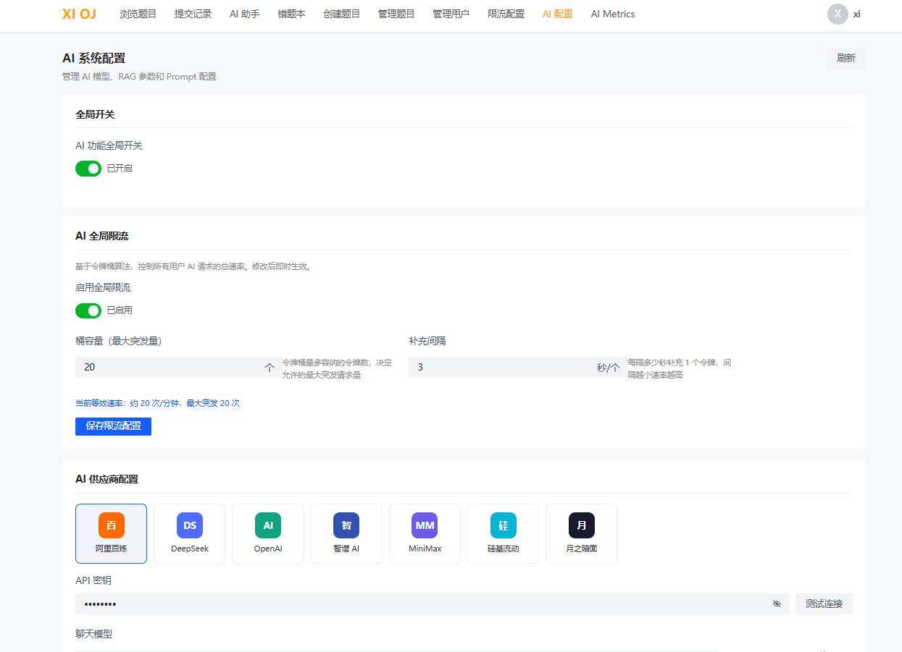
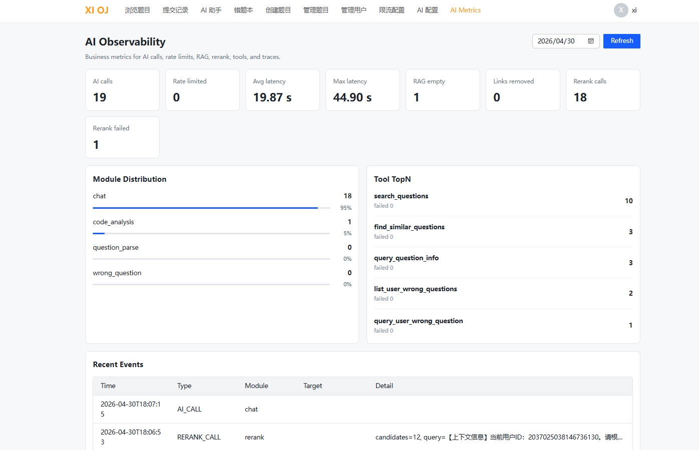

# XI OJ

XI OJ 是一个面向算法训练和在线判题场景的智能 OJ 平台。项目在传统题库、代码提交、判题、用户管理的基础上，重点扩展了 AI 编程助手、AI 代码分析、AI 错题本、RAG 知识库、Agent 工具调用、AI 限流和 AI 可观测性等模块，目标是让平台不只是“判对错”，还可以围绕用户的提交记录、错题记录、题目知识点和平台题库给出可追溯、可复习、可继续训练的学习建议。

项目采用前后端分离架构：后端基于 Spring Boot 3.3.6 + Java 17，前端基于 Vite + Vue 3.6 beta + Arco Design，数据层使用 MySQL、Redis、RabbitMQ、Milvus、Elasticsearch、MinIO 等组件。AI 能力通过 LangChain4j 接入 DashScope / OpenAI 兼容接口，支持多供应商配置、Prompt 动态配置、RAG 检索增强、Rerank 精排和自定义 Agent Loop。管理端还支持 Markdown、PDF、Word 知识文档导入，可把课程讲义、算法资料、图解文档解析成带元数据的知识片段并写入向量库。

## 项目亮点

- 在线判题闭环：题目浏览、Markdown 题面、Monaco 代码编辑器、代码提交、判题结果展示、提交记录和管理端题库维护。
- AI 编程助手：支持多轮会话、SSE 流式输出、上下文题目识别、错题查询、相似题推荐、分层提示和自定义测试。
- 自定义 Agent Loop：在 advanced 模式下使用 ReAct 风格的 Thought / Action / Observation 推理循环，支持最大步数限制、工具失败重试、Agent Trace 记录和灰度切换。
- RAG 知识库增强：使用 Milvus 向量库保存算法知识、平台题目、错题分析和多格式文档内容，结合 Query Rewrite、双 Collection 检索、Rerank 精排和图片引用过滤提升回答质量。
- PDF / Word 知识导入：管理端可上传 `.md`、`.pdf`、`.docx`，PDF/Word 走异步解析任务，自动完成文本分块、标题识别、图片抽取、MinIO 存储、VL 图片描述和 Milvus 向量化入库。
- AI 错题本：自动收集失败提交，生成错误根因、修正思路、复习计划和相似题推荐，支持到期复习、标记复习和弹窗查看分析。
- AI 代码分析：基于用户提交代码和判题上下文，从代码风格、可读性、边界条件、错误风险和学习建议多个维度生成分析。
- 动态限流：基于 Redis + AOP + 注解实现提交限流和 AI 接口限流，规则持久化在 MySQL，可在管理端动态修改并刷新缓存。
- AI 可观测性：记录 AI 调用、限流、RAG 空召回、Rerank、工具调用、失败事件和延迟指标，提供轻量级管理看板。
- 多供应商 AI 配置：管理端可配置阿里百炼、DeepSeek、OpenAI、智谱 AI、MiniMax、硅基流动、月之暗面等兼容供应商。

## 系统截图


### 题目详情与在线编码

题目页左侧展示 Markdown 题面、标签、提交和通过统计，右侧集成 Monaco Editor，提交后展示运行时间、内存消耗和 AI 分析入口。



### AI 代码分析

AI 分析会结合题目、代码语言、用户代码和判题结果，从代码风格、质量可读性、潜在风险、优化方向和相关题目推荐等维度给出结构化反馈。



### AI 编程助手与 RAG 图文知识

AI 助手可从知识库召回算法知识、图解和 OJ 实战提醒。RAG 支持保留与回答直接相关的图片链接，使哈希、回溯、动态规划等抽象知识更直观。



### Agent 推荐练习题

Agent 可以调用题库检索、相似题搜索等工具，根据用户提问推荐同类练习题，并给出难度、标签和知识点说明。



### Agent 错误诊断

Agent 可以结合用户历史错题和提交记录，定位 WA、溢出、边界遗漏等常见错误，并给出可操作的修正建议。



### AI 错题本

错题本会自动收集判题失败的提交，按今日待复习和全部错题展示，支持筛选错误类型、查看分析和标记复习。



### 错题深度分析

错题分析弹窗会围绕根本原因、关键错误行、正确思路、复习建议和同类题迁移展开，适合用于长期复盘。



### 动态限流管理

管理端可维护全局提交、IP 提交、用户提交、同题冷却、AI 接口、AI 全局令牌桶等规则，修改后刷新 Redis 缓存即可生效。



### AI 系统配置

AI 配置页支持全局开关、AI 全局限流、供应商切换、API Key 配置、模型配置、RAG 参数、Prompt 配置和知识文档上传。上传 PDF / Word 后前端会展示异步导入进度，导入完成的知识片段可立即用于 RAG 召回。



### AI Metrics

AI Observability 页面展示 AI 调用量、限流次数、平均延迟、最大延迟、RAG 空召回、Rerank 调用和工具 TopN 等业务指标。



## 技术栈

### 后端

| 技术 / 组件 | 当前版本 / 来源 | 用途 |
| --- | --- | --- |
| Java | 17 | 后端运行环境 |
| Spring Boot | 3.3.6 | Web、AOP、配置、依赖管理 |
| Spring Web | Boot 3.3.6 托管 | REST API、SSE 流式输出 |
| Spring AOP | Boot 3.3.6 托管 | 权限校验、限流拦截、AI 全局开关 |
| MyBatis-Plus | 3.5.11 | ORM、分页、逻辑删除 |
| MyBatis-Plus JSqlParser | 3.5.11 | MyBatis-Plus 分页插件依赖 |
| MySQL Connector/J | Spring Boot 3.3.6 BOM 托管 | MySQL 数据库连接 |
| Redis / Spring Data Redis | Spring Boot 3.3.6 BOM 托管 | Session、限流、RAG 缓存、Query Rewrite 缓存、指标计数 |
| Spring Session Redis | Spring Boot 3.3.6 BOM 托管 | 分布式 Session |
| RabbitMQ / Spring AMQP | Spring Boot 3.3.6 BOM 托管 | 判题消息队列 |
| LangChain4j | 1.13.1 | AI Service、模型调用、RAG 基础设施 |
| LangChain4j Community | 1.13.1-beta23 | DashScope、Milvus 等社区适配 |
| Milvus Embedding Store | LangChain4j BOM 托管 | 向量存储和相似题检索 |
| DashScope / OpenAI Compatible | 配置化 | 聊天模型、流式模型、Embedding、Rerank |
| Fastjson2 | 2.0.40 | JSON 处理 |
| Hutool | 5.8.26 | 工具类、JSON、网络和通用能力 |
| Knife4j | 4.5.0 | OpenAPI 接口文档 |
| MinIO Java SDK | 8.5.14 | 知识库图片对象存储、PDF / Word 图片导入 |
| Apache PDFBox | 3.0.4 | PDF 知识文档文本解析、图片定位和分块 |
| Apache POI | 5.3.0 | Word 知识文档段落解析、标题识别和图片抽取 |
| Lombok | Spring Boot 3.3.6 BOM 托管 | 简化实体和 DTO 代码 |

### 前端

| 技术 / 组件 | 当前版本 | 用途 |
| --- | --- | --- |
| Node.js | `^20.19.0 || >=22.12.0` | 前端运行环境要求 |
| Vite | 8.0.3 | 前端构建和开发服务 |
| Vue | 3.6.0-beta.9 | 页面框架 |
| Vue Router | 5.0.4 | 路由管理 |
| Pinia | 3.0.4 | 状态管理 |
| Arco Design Vue | 2.57.0 | UI 组件库 |
| Axios | 1.14.0 | HTTP 请求 |
| Monaco Editor | 0.55.1 | 在线代码编辑器 |
| @guolao/vue-monaco-editor | 1.6.0 | Vue Monaco 封装 |
| md-editor-v3 | 6.4.1 | Markdown 编辑 / 展示 |
| TypeScript | 6.0.2 | 类型系统 |
| vue-tsc | 3.2.6 | Vue 类型检查 |
| Prettier | 3.8.1 | 前端格式化 |

### 中间件与基础设施

| 组件 | 配置位置 | 当前配置 / 建议版本                                               | 用途 |
| --- | --- |-----------------------------------------------------------| --- |
| MySQL | `src/main/resources/application.yml` | `你的配置`，建议 MySQL 8.x                       | 主业务库、AI 配置、错题、指标、限流规则 |
| Redis | `application.yml` | `你的配置`，database `1`，建议 Redis 6.x / 7.x                    | Session、限流、缓存、计数器 |
| RabbitMQ | `application.yml` | `你的配置`，建议 RabbitMQ 3.12+                   | 判题任务异步队列 |
| Milvus | `application.yml` | `你的配置`，建议 Milvus 2.x                      | RAG 向量库、相似题检索 |
| MinIO | `application.yml` | `你的配置`，bucket `oj-knowledge-images` | 知识库图片存储、导入文档图片访问 |
| Elasticsearch | `application.yml` | `你的配置`，建议 Elasticsearch 8.x | 搜索扩展 |

> MySQL、Redis、RabbitMQ、Milvus、MinIO的服务端版本没有在仓库配置文件中锁死，表格里的版本是推荐部署版本；Java 依赖版本以 `pom.xml` 和 Spring Boot 3.3.6 BOM 为准。

## 功能模块

### 用户与权限

- 用户注册、登录、退出、当前用户查询。
- 普通用户和管理员角色区分。
- `@AuthCheck` 注解 + AOP 权限拦截。
- 管理员可访问题目管理、用户管理、限流配置、AI 配置和 AI Metrics。

### 题库与提交

- 题目列表、题目详情、标签、难度、通过率和提交统计。
- Markdown 题面展示，支持输入格式、输出格式、样例和题解内容。
- Monaco Editor 在线编码，支持 Java 等语言。
- 代码提交、判题状态、运行时间、内存消耗和错误信息展示。
- 提交记录分页查询。

### 判题与消息队列

- `QuestionSubmitController` 接收用户提交。
- `QuestionSubmitServiceImpl` 创建提交记录并触发判题。
- `JudgeService` / `JudgeManager` 调用代码沙箱。
- 支持本地示例沙箱、远程沙箱、第三方沙箱扩展。
- `oj.judge.use-mq=true` 时启用 RabbitMQ 异步判题。
- `RabbitMQConfig` 和 `JudgeMessageConsumer` 负责队列、交换机、消息消费和手动 ACK。

### 提交限流与 AI 限流

- 使用 `@RateLimit` 注解声明接口限流规则。
- `RateLimitInterceptor` 在 AOP 层执行限流检查。
- Redis ZSET 实现滑动窗口，Redis String 实现日限流和同题冷却。
- `rate_limit_rule` 表保存规则，管理端修改后可刷新 Redis 缓存。
- 覆盖规则包括：
  - 全局提交秒级限流。
  - IP 分钟级限流。
  - 用户分钟级限流。
  - 用户每日提交限流。
  - 用户同题提交冷却。
  - AI 用户分钟级、IP 分钟级、模块每日限流。
  - AI 全局令牌桶限流。

### AI 编程助手

- 支持普通 AiServices 模式和 advanced 自定义 Agent Loop 模式。
- 支持多轮会话、会话列表、历史记录分页和清空会话。
- 支持 SSE 流式输出，前端可实时展示 AI 回复。
- 会自动注入当前用户 ID、当前题目 ID 等上下文。
- 回答前可结合 RAG 召回算法知识、题目知识和图片资料。
- 回答后通过 `LinkValidationFilter` 过滤不存在或伪造的题目链接。

### AI Agent 工具

Agent 可调用的核心工具包括：

| 工具名 | 功能 |
| --- | --- |
| `query_question_info` | 按题目 ID 或关键词查询题目信息 |
| `judge_user_code` | 提交用户代码并调用判题 |
| `query_user_wrong_question` | 查询用户某道题的错题记录 |
| `search_questions` | 按关键词、标签、难度搜索题目 |
| `find_similar_questions` | 基于 Milvus 向量检索查找相似题 |
| `list_user_wrong_questions` | 列出当前用户的错题记录 |
| `query_user_submit_history` | 查询用户提交历史 |
| `query_user_mastery` | 按标签分析用户知识点掌握情况 |
| `get_question_hints` | 获取题目分层提示 |
| `run_custom_test` | 用自定义输入测试用户代码 |
| `diagnose_error_pattern` | 诊断用户系统性错误模式 |

advanced Agent Loop 的特色：

- 自己控制推理循环，不完全依赖框架黑盒调度。
- 每一步只允许调用一个工具，观察结果后再进入下一轮推理。
- 最大步数由 `ai.agent.max_steps` 控制，默认 6。
- 工具失败由 `ToolDispatcher` 按配置重试，默认最多重试 2 次。
- 每一步的 thought、toolName、toolInput、toolOutput、durationMs 会写入 Agent Trace。
- 可通过 `ai.agent.mode=simple|advanced` 灰度切换新旧模式。

### RAG 知识库

RAG 链路不是简单的“向量检索 + 拼接 Prompt”，而是面向 OJ 场景做了工程化增强：

```text
用户问题
  -> Query Rewrite
  -> Embedding 向量化
  -> Milvus 双 Collection 检索
  -> metadata 过滤
  -> Rerank 精排
  -> 图片相关性筛选
  -> Prompt / Message 注入
  -> LLM 生成
  -> 链接校验
```

核心设计：

- `oj_knowledge`：保存算法知识、PDF / Word / Markdown 导入内容、代码模板、错题分析知识。
- `oj_question`：保存平台题目的向量，用于相似题推荐和题目检索。
- `QueryRewriter`：把口语化短问题改写成更适合向量检索的 query，并使用 Redis 缓存 120 分钟。
- `RerankService`：调用 DashScope `gte-rerank` 对候选片段重排，提升短 query 和语义相近场景的准确率。
- `RagImageSupport`：优先读取结构化 `image_refs`，结合问题意图筛选真正相关的图片，再注入 Markdown 图片引用。
- `KnowledgeInitializer`：初始化本地知识库 Markdown，也负责把导入文档解析后的 Markdown Block 嵌入并写入 Milvus。
- `KnowledgeImportController` / `KnowledgeImportAsyncService`：提供管理端知识文档导入接口，PDF / Word 使用异步任务和进度轮询。
- `PdfDocumentParser` / `WordDocumentParser`：解析 PDF / Word 知识文档，输出带 `content_type`、`tag`、`title`、`source_type`、`image_refs` 的知识块。

### PDF / Word 知识库导入

知识库导入入口位于管理端 AI 配置页，前端上传控件支持 `.md`、`.markdown`、`.pdf`、`.docx`。Markdown 文件会同步解析并入库；PDF 和 Word 文件因为要做文本结构化、图片处理和向量化，后端会返回 `taskId`，前端通过轮询展示导入进度和当前步骤。

接口链路：

| 接口 | 方法 | 说明 |
| --- | --- | --- |
| `/api/admin/knowledge/import` | `POST` | `multipart/form-data` 上传知识文件，字段名为 `file` |
| `/api/admin/knowledge/import/status/{taskId}` | `GET` | 查询 PDF / Word 异步导入任务状态、进度、当前步骤和结果消息 |

后端处理流程：

```text
上传文件
  -> KnowledgeImportController 校验后缀
  -> Markdown 同步导入 / PDF 与 Word 创建异步 taskId
  -> KnowledgeImportAsyncService 限制最多 2 个导入任务并发
  -> DocumentParser 提取正文、标题、图片和图片上下文
  -> 图片上传 MinIO，生成可访问 URL
  -> VisionModelHolder 为无标题图片补充视觉描述
  -> 生成 Markdown Block 元数据
  -> KnowledgeInitializer.parseAndStore
  -> Embedding + Milvus 入库
  -> 清理 RAG 缓存，新的知识可被 AI 助手召回
```

PDF 导入的特色能力：

- 使用 Apache PDFBox 3.0.4 读取 PDF 正文，按标题模式、段落长度和页内位置做智能分块，避免把整份讲义粗暴塞进一个向量片段。
- 支持抽取 PDF 页面中的图片，过滤过小图片，对过大图片按最大尺寸缩放，并以 `knowledge/<文件名>/...png` 的对象路径上传到 MinIO。
- 会记录图片所在页、附近文本、图注、中心位置等上下文，生成结构化 `image_refs`，RAG 召回时可以把图片和对应知识片段一起带回。
- 如果图片没有明确图注，可调用 VL 视觉语言模型生成简短描述，默认模型配置为 `ai.vl.model_name=qwen-vl-plus`，并发数由 `ai.vl.concurrency` 控制。
- 每个知识块都会带上 `source_type: pdf`，并保留 `content_type`、`tag`、`title` 等必需元数据，方便后续做检索过滤、来源追踪和 Prompt 注入。
- 当前 PDF 解析依赖可提取文本；纯扫描版 PDF 暂未接入 OCR，导入时会提示没有可提取文本。

Word 导入的特色能力：

- 使用 Apache POI 5.3.0 解析 `.docx` 段落、标题样式和正文内容，按章节结构切分知识片段。
- 支持抽取文档内嵌图片，上传到 MinIO 后和文本片段建立关联。
- 与 PDF 导入共用图片描述、`image_refs` 元数据、异步任务进度和 Milvus 入库流程，最终以 `source_type: docx` 标识来源。

### AI 代码分析

- 用户提交通过后可进入 AI 代码分析。
- 分析内容包括代码风格评分、可读性评分、潜在异常、复杂度、边界条件和学习建议。
- 分析结果写入 `ai_code_analysis`，支持历史分析记录。
- 可推荐相似题，帮助用户从一道题迁移到同类题。

### AI 错题本

- 自动收集 WA / TLE / MLE / RE 等失败提交。
- 保存错误代码、错误判题结果、AI 分析、复习计划、相似题和下次复习时间。
- 支持今日待复习、全部错题、错误类型筛选。
- 支持查看分析、重新分析、标记复习。
- Agent 可读取错题本并结合题目信息生成个性化诊断。

### AI 配置与可观测性

AI 配置能力：

- AI 全局开关：关闭后所有 AI 接口可统一熔断。
- AI 供应商配置：支持多个 OpenAI 兼容供应商。
- API Key 加密保存：使用 `AI_ENCRYPT_KEY` 加解密数据库中的密钥。
- 聊天模型、Embedding 模型、Rerank 模型、Prompt、RAG TopK、相似度阈值动态配置。
- 配置变更后通过 Spring 事件重建模型和 Agent，无需重启服务。

AI Metrics 能力：

- 今日 AI 调用次数。
- 今日被限流次数。
- 平均延迟和最大延迟。
- RAG 空召回次数。
- Rerank 调用和失败次数。
- LinkValidationFilter 移除伪造链接次数。
- 模块调用分布。
- Agent 工具调用 TopN。
- 最近 AI 事件列表。

## 目录结构

```text
OJ_project
├── src/main/java/com/XI/xi_oj
│   ├── ai                 # Agent、RAG、AI 模型、工具、可观测性
│   ├── annotation         # AuthCheck、RateLimit 注解
│   ├── aop                # 权限、日志、限流、AI 开关拦截器
│   ├── config             # MyBatis、Redis、RabbitMQ、MinIO、COS 等配置
│   ├── controller         # REST API
│   ├── judge              # 判题服务和代码沙箱
│   ├── mapper             # MyBatis Mapper
│   ├── model              # entity、dto、vo、enum
│   ├── mq                 # 判题消息队列消费者
│   └── service            # 业务服务
├── src/main/resources
│   ├── application.yml    # 默认 dev 配置
│   ├── application-prod.yml
│   ├── application-test.yml
│   ├── knowledge          # 内置算法知识库 Markdown
│   └── mapper             # MyBatis XML
├── frontend/OJ_frontend   # Vue 前端项目
├── sql                    # 数据库初始化和补丁脚本

```

## 本地启动

### 1. 环境准备

建议准备以下环境：

- JDK 17
- Maven 3.8+
- Node.js 20.19+ 或 22.12+
- MySQL 8.x
- Redis 6.x / 7.x
- RabbitMQ 3.12+（启用 MQ 判题时需要）
- Milvus 2.x（启用 RAG 和相似题检索时需要）
- MinIO（启用知识库图片时需要）
- Elasticsearch 8.x（启用 ES 搜索时需要）

### 2. 初始化数据库

创建数据库：

```sql
CREATE DATABASE oj_db DEFAULT CHARACTER SET utf8mb4 COLLATE utf8mb4_unicode_ci;
```

按需要执行 SQL：

```text
sql/oj_db.sql                       # 基础库表
sql/create_table.sql                # 基础表结构补充
sql/question.sql                    # 题目表
sql/question_data.sql               # 题目数据
sql/question_data_2.sql             # 题目数据补充
sql/ai.sql                          # AI 配置、AI 记录、错题本等
sql/rate_limit.sql                  # 限流规则
sql/ai_observability.sql            # AI 可观测性事件表
sql/rag_agent_optimization.sql      # RAG / Agent 相关补丁
sql/ai_vl_model_patch.sql           # PDF / Word 图片描述模型配置
```

如果你已经执行过部分补丁脚本，重复执行可能出现字段或索引已存在的提示，需要按本地数据库状态选择性执行。

### 3. 修改后端配置

默认配置文件：

```text
src/main/resources/application.yml
```

重点检查：

```yaml
server:
  port: 8101
  servlet:
    context-path: /api

spring:
  datasource:
    url: jdbc:mysql://localhost:3306/oj_db?useUnicode=true&characterEncoding=UTF-8&connectionCollation=utf8mb4_unicode_ci
    username: root
    password: 123456
  data:
    redis:
      host: localhost
      port: 6379
      database: 1

milvus:
  host: 192.168.26.128
  port: 19530

minio:
  endpoint: http://192.168.26.128:9000
  bucket: oj-knowledge-images
```

AI API Key 会加密保存在数据库，需要先设置加密密钥环境变量。PowerShell 示例：

```powershell
$env:AI_ENCRYPT_KEY="1234567890123456"
```

`AI_ENCRYPT_KEY` 建议使用固定的 16 位或更长字符串。数据库里已经加密保存的 API Key 必须使用同一个密钥解密，否则模型无法初始化。

### 4. 启动后端

在项目根目录执行：

```powershell
.\mvnw.cmd spring-boot:run
```

后端默认地址：

```text
http://localhost:8101/api
```

Knife4j 接口文档通常可访问：

```text
http://localhost:8101/api/doc.html
```

### 5. 启动前端

```powershell
cd frontend/OJ_frontend
npm install
npm run dev
```

前端请求统一使用 `/api`，`vite.config.ts` 已配置代理：

```ts
server: {
  proxy: {
    '/api': {
      target: 'http://localhost:8101',
      changeOrigin: true,
    },
  },
}
```

启动后访问 Vite 控制台输出的地址，通常是：

```text
http://localhost:5173
```

### 6. 前端构建

```powershell
cd frontend/OJ_frontend
npm run build
```

构建产物输出到：

```text
frontend/OJ_frontend/dist
```

## 常用页面

| 页面 | 路由 | 权限 |
| --- | --- | --- |
| 题目列表 | `/questions` | 登录用户 |
| 题目详情 | `/view/question/:id` | 登录用户 |
| 提交记录 | `/question_submit` | 登录用户 |
| AI 助手 | `/ai/chat` | 登录用户 |
| AI 代码分析 | `/ai/code-analysis` | 登录用户 |
| AI 错题本 | `/ai/wrong-question` | 登录用户 |
| 创建题目 | `/add/question` | 登录用户 |
| 管理题目 | `/manage/question` | 管理员 |
| 管理用户 | `/manage/user` | 管理员 |
| 限流配置 | `/manage/rate-limit` | 管理员 |
| AI 配置 | `/admin/ai-config` | 管理员 |
| AI Metrics | `/admin/ai-observability` | 管理员 |

## 核心配置项

| 配置项 | 说明 | 默认 / 示例 |
| --- | --- | --- |
| `ai.global.enable` | AI 总开关 | `true` |
| `ai.provider` | AI 供应商标识 | 管理端配置 |
| `ai.provider.api_key_encrypted` | 加密后的模型 API Key | 管理端配置 |
| `ai.embedding.api_key_encrypted` | 加密后的 Embedding API Key | 可复用供应商 Key |
| `ai.model.base_url` | OpenAI 兼容接口地址 | `https://dashscope.aliyuncs.com/compatible-mode/v1` |
| `ai.model.name` | 聊天模型 | `qwen-plus` |
| `ai.model.embedding_name` | Embedding 模型 | `text-embedding-v3` |
| `ai.rag.top_k` | RAG 返回条数 | `3` |
| `ai.rag.similarity_threshold` | RAG 相似度阈值 | `0.7` |
| `ai.rerank.enabled` | 是否启用 Rerank | `false` / 管理端开启 |
| `ai.rerank.model_name` | Rerank 模型 | `gte-rerank` |
| `ai.vl.model_name` | PDF / Word 图片描述使用的视觉语言模型 | `qwen-vl-plus` |
| `ai.vl.concurrency` | 图片描述生成并发数，代码中会限制在 1 到 16 | `4` |
| `ai.agent.mode` | Agent 模式 | `simple` 或 `advanced` |
| `ai.agent.max_steps` | Agent 最大推理步数 | `6` |
| `ai.agent.tool_max_retry` | 工具最大重试次数 | `2` |
| `minio.endpoint` | 知识库图片访问地址 | `http://localhost:9000` / 你的 MinIO 地址 |
| `minio.bucket` | PDF / Word 图片上传 bucket | `oj-knowledge-images` |
| `oj.judge.use-mq` | 是否启用 MQ 判题 | `true` |
| `codesandbox.type` | 代码沙箱类型 | `remote` |

## API 模块概览

| Controller | 路径前缀 | 说明 |
| --- | --- | --- |
| `UserController` | `/user` | 用户注册、登录、用户管理 |
| `QuestionController` | `/question` | 题目 CRUD、题目查询 |
| `QuestionSubmitController` | `/question_submit` | 代码提交、提交记录 |
| `QuestionCommentController` | `/question/comment` | 题目评论 |
| `AiChatController` | `/ai` | AI 对话、SSE、历史会话 |
| `AiCodeAnalysisController` | `/ai/code` | AI 代码分析 |
| `AiQuestionParseController` | `/ai/question` | AI 题目解析 |
| `AiWrongQuestionController` | `/ai/wrong-question` | AI 错题本 |
| `AiConfigController` | `/admin/ai` | AI 配置管理 |
| `AiObservabilityController` | `/admin/ai/observability` | AI 指标看板 |
| `RateLimitController` | `/admin/rate-limit` | 限流规则管理 |
| `KnowledgeImportController` | `/admin/knowledge` | Markdown / PDF / Word 知识库导入、异步任务状态查询 |
| `FileController` | `/file` | 文件上传 |


## 开发注意事项

- 当前根目录 `Dockerfile` 使用 `maven:3.8.1-jdk-8-slim`，但项目 `pom.xml` 要求 Java 17；如果要用 Docker 构建，建议改为 JDK 17 镜像。
- `application.yml` 中存在本地开发地址和示例密码，上线前必须替换 MySQL、Redis、RabbitMQ、MinIO、Milvus、AI Key 等敏感配置。
- AI API Key 不建议明文写入配置文件，应通过管理端保存加密值，并保持 `AI_ENCRYPT_KEY` 稳定。
- Milvus 向量库和 Embedding 模型变更后，需要重建知识库和题目向量。
- PDF / Word 导入中的图片会写入 MinIO，部署时需要保证 `minio.endpoint` 对前端和模型问答结果可访问。
- PDF 导入目前处理的是可提取文本 PDF；扫描件需要先 OCR，或后续接入 OCR 解析器。
- Rerank 会增加一次外部模型调用，建议配合 AI Metrics 观察延迟和失败率后再扩大使用范围。
- AI 代码分析、错题分析等接口成本较高，建议保持每日限流和全局令牌桶开启。

